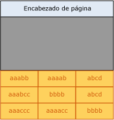
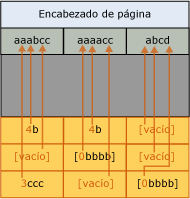
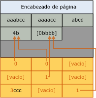

# Implementación de la compresión de página
[!INCLUDE[appliesto-ss-asdb-xxxx-xxx-md](../../includes/appliesto-ss-asdb-xxxx-xxx-md.md)]

  En este tema se resume cómo el [!INCLUDE[ssDE](../../includes/ssde-md.md)] implementa la compresión de página. Este resumen proporciona la información básica para ayudarlo a planear el espacio de almacenamiento que necesita para sus datos.  
  
 La compresión de página es similar para las tablas, las particiones de tabla, los índices y las particiones de índice. La descripción siguiente de la compresión de página para una tabla se aplica a la compresión de página para todos los tipos de objeto. En los ejemplos siguientes se comprimen las cadenas de caracteres, pero la compresión de prefijo y de diccionario aplican los mismos principios a otros tipos de datos.  
  
 El proceso de compresión del nivel hoja de tablas y índices mediante compresión de página consta de tres operaciones, según el siguiente orden:  
  
1.  Compresión de fila  
  
2.  Compresión de prefijo  
  
3.  Compresión de diccionario  

[!INCLUDE[freshInclude](../../includes/paragraph-content/fresh-note-steps-feedback.md)]

 Al usar la compresión de página, las páginas que no están en el nivel hoja de los índices se comprimen usando únicamente la compresión de fila. Para obtener más información acerca de la compresión de fila, vea [Row Compression Implementation](../../relational-databases/data-compression/row-compression-implementation.md).  
  
## Compresión de prefijo  
 Para cada página que se comprime, la compresión de prefijo utiliza los pasos siguientes:  
  
1.  Para cada columna, se identifica un valor que se puede utilizar para reducir el espacio de almacenamiento de los valores de cada columna.  
  
2.  Una fila que representa los valores de prefijo para cada columna se crea y se almacena en la estructura de información de compresión (CI), situada inmediatamente después del encabezado de página.  
  
3.  Los valores de prefijo repetidos en la columna se sustituyen por una referencia al prefijo correspondiente. Si el valor de una fila no coincide exactamente con el valor de prefijo seleccionado, se puede indicar una coincidencia parcial.  
  
 En la siguiente ilustración se muestra un ejemplo de página de una tabla antes de la compresión de prefijo.  
  
   
  
 En la ilustración siguiente se muestra la misma página después de la compresión de prefijo. El prefijo se mueva al encabezado y los valores de columna se cambian a referencias al prefijo.  
  
   
  
 En la primera columna de la primera fila, el valor 4b indica que los primeros cuatro caracteres del prefijo (aaab) están presentes para esa fila, así como el carácter b. De esta forma, el valor resultante será aaabb, que es el valor original.  
  
## Compresión de diccionario  
 Una vez completada la compresión de prefijo, se aplica la compresión de diccionario. La compresión de diccionario busca valores repetidos en cualquier lugar de la página y los almacena en el área de CI. A diferencia de la compresión de prefijo, la compresión de diccionario no está restringida a una columna. La compresión de diccionario puede sustituir a los valores repetidos que se producen en cualquier lugar de una página. En la ilustración siguiente se muestra la misma página después de la compresión de diccionario.  
  
   
  
 Tenga en cuenta que se ha hecho referencia al valor 4b desde distintas columnas de la página.  
  
## Momento en el que se produce la compresión de página  
 Cuando se crea una nueva tabla que tiene compresión de página, no se producirá la compresión. Sin embargo, los metadatos de la tabla indican que es necesario utilizar la compresión de página. A medida que se agregan datos a la primera página de datos, se produce la compresión de fila de los datos. Como la página no está llena, no se obtiene ninguna ventaja de la compresión de página. Cuando la página está llena, la siguiente fila que va a agregarse inicia la operación de compresión de página. La página entera se revisa y cada columna se evalúa para la compresión de prefijo. A continuación, todas las columnas se evalúan para la compresión de diccionario. Si la compresión de página ha creado espacio suficiente en la página para una fila adicional, la fila se agregará y se producirá la compresión de fila y de página de los datos. Si el resultado del espacio obtenido mediante la compresión de página menos el espacio que se requiere para la estructura CI no es significativo, la compresión de página no se utiliza para esa página. Las filas subsiguientes se ajustan a la nueva página o, si no caben, se agrega una nueva página a la tabla. Al igual que la primera página, no se realiza la compresión de página de la nueva página al principio.  
  
 Cuando se convierte para la compresión de página una tabla existente con datos, todas las páginas se volverán a crear y evaluar. La regeneración de todas las páginas hace que se vuelva a generar la tabla, el índice o la partición.  
  
## Consulte también  
 [Comprimir datos](../../relational-databases/data-compression/data-compression.md)   
 [Row Compression Implementation](../../relational-databases/data-compression/row-compression-implementation.md)  
  
  
