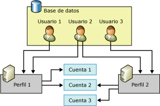

# Objetos de configuración de Correo electrónico de base de datos
[!INCLUDE[appliesto-ss-xxxx-xxxx-xxx-md](../../includes/appliesto-ss-xxxx-xxxx-xxx-md.md)]
  Correo electrónico de base de datos tiene dos objetos de configuración. Los objetos de configuración de base de datos proporcionan una manera de configurar los valores que Correo electrónico de base de datos debe usar al enviar un correo electrónico de la aplicación de base de datos o el Agente [!INCLUDE[ssNoVersion](../../includes/ssnoversion-md.md)] .  
  
-   Cuentas de Correo electrónico de base de datos  
  
-   Perfiles de Correo electrónico de base de datos  
  
  
##   Relación de objetos de configuración de Correo electrónico de base de datos  
 En la siguiente ilustración se muestran dos perfiles, tres cuentas y tres usuarios. El usuario 1 tiene acceso al perfil 1, que usa la cuenta 1 y la cuenta 2. El usuario 3 tiene acceso al perfil 2, que usa la cuenta 2 y la cuenta 3. El usuario 2 tiene acceso al perfil 1 y al perfil 2.  
  
   
  
  
##   Cuenta de Correo electrónico de base de datos  
 Una cuenta del Correo electrónico de base de datos contiene la información que Microsoft [!INCLUDE[ssNoVersion](../../includes/ssnoversion-md.md)] usa para enviar mensajes de correo electrónico a un servidor SMTP. Cada cuenta contiene información para un servidor de correo electrónico.  
  
 Correo electrónico de base de datos permite el uso de tres métodos de autenticación para comunicarse con un servidor SMTP:  
  
-   Autenticación de Windows: el Correo electrónico de base de datos utiliza las mismas credenciales de la cuenta de servicio de Windows [!INCLUDE[ssDEnoversion](../../includes/ssdenoversion-md.md)] para la autenticación en el servidor SMTP.  
  
-   Autenticación básica: el Correo electrónico de base de datos utiliza el nombre de usuario y la contraseña especificados para la autenticación en el servidor SMTP.  
  
-   Autenticación anónima: el servidor SMTP no requiere autenticación.  Correo electrónico de base de datos no utilizará ninguna credencial para la autenticación en el servidor SMTP.  
  
 La información de la cuenta se almacena en la base de datos **msdb** . Cada cuenta contiene la siguiente información:  
  
-   El nombre de la cuenta.  
  
-   La descripción de la cuenta.  
  
-   La dirección de correo electrónico de la cuenta.  
  
-   El nombre para mostrar de la cuenta.  
  
-   La dirección de correo electrónico que se utilizará como información de "Responder a" para la cuenta.  
  
-   El nombre del servidor de correo electrónico.  
  
-   El tipo de servidor de correo electrónico. Para [!INCLUDE[msCoName](../../includes/msconame-md.md)] [!INCLUDE[ssNoVersion](../../includes/ssnoversion-md.md)], siempre es el Protocolo simple de transferencia de correo (SMTP).  
  
-   El número de puerto del servidor de correo electrónico.  
  
-   Una columna de tipo bit que indica si se ha realizado la conexión al servidor de correo SMTP con SSL (Capa de sockets seguros).  
  
-   Una columna de tipo bit que indica si se ha realizado la conexión al servidor SMTP con las credenciales configuradas para el [!INCLUDE[ssDEnoversion](../../includes/ssdenoversion-md.md)].  
  
-   El nombre de usuario que se utiliza para la autenticación en el servidor de correo electrónico, si éste requiere autenticación.  
  
-   La contraseña que se utiliza para la autenticación en el servidor de correo electrónico, si éste requiere autenticación.  
  
 El Asistente para configuración de Correo electrónico de base de datos proporciona una forma adecuada de crear y administrar cuentas. También puede usar los procedimientos almacenados de configuración de **msdb** para crear y administrar cuentas.  
  
  
##   Perfil de Correo electrónico de base de datos  
 Un perfil del Correo electrónico de base de datos es una colección ordenada de cuentas relacionadas del Correo electrónico de base de datos. Las aplicaciones que envían correo electrónico a través de Correo electrónico de base de datos especifican perfiles, en lugar de usar cuentas directamente. Separar la información acerca de los servidores de correo electrónico individuales de los objetos que utiliza la aplicación supone una mejora de flexibilidad y confiabilidad: los perfiles proporcionan conmutación automática por error, de modo que, si un servidor deja de responder, Correo electrónico de base de datos puede enviar automáticamente correo a otro servidor de correo electrónico. Los administradores de bases de datos pueden agregar, quitar o volver a configurar cuentas sin tener que modificar el código de aplicación o los pasos de trabajo.  
  
 Los perfiles también ayudan a los administradores de bases de datos a controlar el acceso al correo electrónico. Para poder enviar Correo electrónico de base de datos, es necesario ser miembro de la función **DatabaseMailUserRole** . Los perfiles proporcionan a los administradores mayor flexibilidad para controlar quién envía correo y qué cuentas se usan.  
  
 Un perfil puede ser público o privado.  
  
 Los**perfiles públicos** están disponibles para todos los miembros del rol de base de datos **DatabaseMailUserRole** de la base de datos **msdb** . Permiten que todos los miembros del rol **DatabaseMailUserRole** envíen correo electrónico usando el perfil.  
  
 Los**perfiles privados** se definen para las entidades de seguridad en la base de datos **msdb** . Solo determinados usuarios de base de datos, roles y miembros del rol fijo de servidor **sysadmin** pueden enviar correo electrónico usando el perfil. De manera predeterminada, un perfil es privado y concede acceso solo a los miembros del rol fijo de servidor **sysadmin** . Para usar un perfil privado, **sysadmin** debe otorgar permiso de usuario al perfil. Además, el permiso EXECUTE en el procedimiento almacenado **sp_send_dbmail** solo se otorga a los miembros de **DatabaseMailUserRole**. Para que un usuario pueda enviar mensajes de correo electrónico, el administrador del sistema debe agregar el usuario al rol de base de datos **DatabaseMailUserRole** .  
  
 Los perfiles mejoran la confiabilidad en los casos en que un servidor de correo electrónico no está disponible o no puede procesar mensajes. Cada cuenta del perfil tiene un número de secuencia. El número de secuencia determina el orden en que el Correo electrónico de base de datos utiliza las cuentas en el perfil. En el caso de un mensaje de correo electrónico nuevo, el Correo electrónico de base de datos utiliza la última cuenta que envió un mensaje correctamente o la cuenta con el número de secuencia más bajo si aún no se ha enviado ningún mensaje. Si la cuenta genera un error, el Correo electrónico de base de datos utiliza la cuenta con el siguiente número de secuencia superior y así sucesivamente hasta que el Correo electrónico de base de datos envía el mensaje correctamente o la cuenta con el número de secuencia superior genera un error. Si la cuenta con el número de secuencia superior genera un error, el Correo electrónico de base de datos pausa los intentos de envío del correo electrónico durante la cantidad de tiempo configurada en el parámetro **AccountRetryDelay** de **sysmail_configure_sp**y, después, inicia el proceso de nuevo intento de envío del correo electrónico comenzando por el número de secuencia más bajo. Use el parámetro **AccountRetryAttempts** de **sysmail_configure_sp**para configurar el número de veces que el proceso de correo electrónico externo intenta enviar el mensaje de correo electrónico con cada cuenta del perfil especificado.  
  
 Si hay más de una cuenta con el mismo número de secuencia, el Correo electrónico de base de datos solo utiliza una de estas cuentas para un mensaje de correo electrónico determinado. En este caso, el Correo electrónico de base de datos no confirma qué cuenta se va a usar para el número de secuencia o que se vaya a usar la misma cuenta de un mensaje a otro.  
  
  
##   Tareas de configuración de Correo electrónico de base de datos  
 En la tabla siguiente se describen las tareas de configuración de Correo electrónico de base de datos.  
  
|Tarea de configuración|Vínculo de tema|  
|------------------------|----------------|  
|Describe cómo crear cuentas de Correo electrónico de base de datos|[Crear una nueva cuenta de Correo electrónico de base de datos](../../relational-databases/database-mail/create-a-database-mail-account.md)|  
|Describe cómo crear perfiles de Correo electrónico de base de datos|[Crear un perfil de Correo electrónico de base de datos](../../relational-databases/database-mail/create-a-database-mail-profile.md)|  
|Describe cómo configurar Correo electrónico de base de datos|[Configuración de Correo electrónico de base de datos](../../relational-databases/database-mail/configure-database-mail.md)|  
|Describe cómo crear un script para la configuración de Correo electrónico de base de datos mediante plantillas||  
  
  
##   Tareas de configuración adicionales de base de datos (procedimientos almacenados del sistema)  
 Los procedimientos almacenados de configuración del Correo electrónico de base de datos se encuentran en la base de datos **msdb** .  
  
 En las siguientes tablas se indican los procedimientos almacenados que se usan para configurar y administrar el Correo electrónico de base de datos.  
  
### Configuración de Correo electrónico de base de datos  
  
|Nombre|Descripción|  
|----------|-----------------|  
|[sysmail_configure_sp (Transact-SQL)](../../relational-databases/system-stored-procedures/sysmail-configure-sp-transact-sql.md)|Cambia los valores de configuración de Correo electrónico de base de datos.|  
|[sysmail_help_configure_sp (Transact-SQL)](../../relational-databases/system-stored-procedures/sysmail-help-configure-sp-transact-sql.md)|Muestra la configuración del Correo electrónico de base de datos.|  
  
### Cuentas y perfiles  
  
|Nombre|Descripción|  
|----------|-----------------|  
|[sysmail_add_profileaccount_sp (Transact-SQL)](../../relational-databases/system-stored-procedures/sysmail-add-profileaccount-sp-transact-sql.md)|Agrega una cuenta de correo a un perfil del Correo electrónico de base de datos.|  
|[sysmail_delete_account_sp (Transact-SQL)](../../relational-databases/system-stored-procedures/sysmail-delete-account-sp-transact-sql.md)|Elimina una cuenta del Correo electrónico de base de datos.|  
|[sysmail_delete_profile_sp (Transact-SQL)](../../relational-databases/system-stored-procedures/sysmail-delete-profile-sp-transact-sql.md)|Elimina un perfil del Correo electrónico de base de datos.|  
|[sysmail_delete_profileaccount_sp (Transact-SQL)](../../relational-databases/system-stored-procedures/sysmail-delete-profileaccount-sp-transact-sql.md)|Quita una cuenta de un perfil del Correo electrónico de base de datos.|  
|[sysmail_help_account_sp (Transact-SQL)](../../relational-databases/system-stored-procedures/sysmail-help-account-sp-transact-sql.md)|Muestra información sobre las cuentas del Correo electrónico de base de datos.|  
|[sysmail_help_profile_sp (Transact-SQL)](../../relational-databases/system-stored-procedures/sysmail-help-profile-sp-transact-sql.md)|Muestra información sobre uno o varios perfiles del Correo electrónico de base de datos.|  
|[sysmail_help_profileaccount_sp (Transact-SQL)](../../relational-databases/system-stored-procedures/sysmail-help-profileaccount-sp-transact-sql.md)|Muestra las cuentas asociadas con uno o varios perfiles del Correo electrónico de base de datos.|  
|[sysmail_update_account_sp (Transact-SQL)](../../relational-databases/system-stored-procedures/sysmail-update-account-sp-transact-sql.md)|Actualiza la información de una cuenta existente del Correo electrónico de base de datos.|  
|[sysmail_update_profile_sp (Transact-SQL)](../../relational-databases/system-stored-procedures/sysmail-update-profile-sp-transact-sql.md)|Cambia la descripción o el nombre de un perfil del Correo electrónico de base de datos.|  
|[sysmail_update_profileaccount_sp (Transact-SQL)](../../relational-databases/system-stored-procedures/sysmail-update-profileaccount-sp-transact-sql.md)|Actualiza el número de secuencia de una cuenta de un perfil del Correo electrónico de base de datos.|  
  
### Seguridad  
  
|Nombre|Descripción|  
|----------|-----------------|  
|[sysmail_add_principalprofile_sp (Transact-SQL)](../../relational-databases/system-stored-procedures/sysmail-add-principalprofile-sp-transact-sql.md)|Concede permiso a una entidad de seguridad de base de datos para utilizar un perfil del Correo electrónico de base de datos.|  
|[sysmail_delete_principalprofile_sp (Transact-SQL)](../../relational-databases/system-stored-procedures/sysmail-delete-principalprofile-sp-transact-sql.md)|Quita el permiso a un usuario de base de datos para utilizar un perfil público o privado del Correo electrónico de base de datos.|  
|[sysmail_help_principalprofile_sp (Transact-SQL)](../../relational-databases/system-stored-procedures/sysmail-help-principalprofile-sp-transact-sql.md)|Muestra información de perfiles del Correo electrónico de base de datos a un usuario determinado de la base de datos.|  
|[sysmail_update_principalprofile_sp (Transact-SQL)](../../relational-databases/system-stored-procedures/sysmail-update-principalprofile-sp-transact-sql.md)|Actualiza la información de permisos para un usuario determinado de la base de datos.|  
  
### Estado del sistema  
  
|Nombre|Descripción|  
|----------|-----------------|  
|[sysmail_start_sp &#40;Transact-SQL&#41;](../../relational-databases/system-stored-procedures/sysmail-start-sp-transact-sql.md)|Inicia el programa externo de Correo electrónico de base de datos y la cola asociada de SQL Service Broker.|  
|[sysmail_stop_sp &#40;Transact-SQL&#41;](../../relational-databases/system-stored-procedures/sysmail-stop-sp-transact-sql.md)|Detiene el programa externo de Correo electrónico de base de datos y la cola asociada de SQL Service Broker.|  
|[sysmail_help_status_sp &#40;Transact-SQL&#41;](../../relational-databases/system-stored-procedures/sysmail-help-status-sp-transact-sql.md)|Indica si se ha iniciado el Correo electrónico de base de datos.|  
  
##   Referencias adicionales  
  
-   [Registro y auditorías del Correo electrónico de base de datos](../../relational-databases/database-mail/database-mail-log-and-audits.md)  
  
  
  
