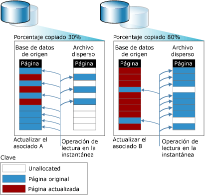

# Instantáneas de base de datos (SQL Server)

 [!INCLUDE [SQL Server](../../includes/applies-to-version/sqlserver.md)]

Una instantánea de base de datos es una vista estática de solo lectura de una base de datos de [!INCLUDE[ssNoVersion](../../includes/ssnoversion-md.md)] denominada *base de datos de origen*. La instantánea de base de datos es coherente en cuanto a las transacciones con la base de datos de origen tal como existía en el momento de la creación de la instantánea. Una instantánea de base de datos siempre reside en la misma instancia de servidor que la base de datos de origen. Aunque las instantáneas de base de datos proporcionan una vista de solo lectura de los datos que se encuentran en el mismo estado que cuando se creó la instantánea, el tamaño del archivo de instantáneas crece a medida que se realizan cambios en la base de datos de origen. Para obtener más información, consulte la sección [Información general de la característica](#FeatureOverview), más adelante.
  
 En una determinada base de datos de origen pueden existir varias instantáneas. Cada instantánea de base de datos se mantiene hasta que el propietario de la base de datos la quita explícitamente.  
  
> [!NOTE]  
>  Las instantáneas de base de datos no están relacionadas con las copias de seguridad de instantánea, el aislamiento de instantáneas de las transacciones ni la replicación de instantáneas.  
  
 **En este tema:**  
  
-   [Información general de la característica](#FeatureOverview)  
  
-   [Ventajas de las instantáneas de base de datos](#Benefits)  
  
-   [Términos y definiciones](#TermsAndDefinitions)  
  
-   [Requisitos previos y limitaciones de las instantáneas de base de datos](#LimitationsRequirements)  
  
-   [Tareas relacionadas](#RelatedTasks)  
  
##   Información general de la característica  
 Las instantáneas de base de datos funcionan en el nivel de página de datos. Antes de modificar por primera vez una página de la base de datos de origen, la página original se copia de la base de datos de origen a la instantánea. La instantánea almacena la página original y conserva los registros de datos en el estado en que se encontraban cuando se creó la instantánea. El mismo proceso se repite para cada página que se modifica por primera vez. Para el usuario, la instantánea de base de datos no parece cambiar nunca, ya que las operaciones de lectura en una instantánea siempre tienen acceso a las páginas de datos originales, con independencia de dónde residan.  
  
 Para almacenar las páginas originales copiadas, la instantánea usa uno o varios *archivos dispersos*. Inicialmente, un archivo disperso es básicamente un archivo vacío que no contiene datos de usuario y al que todavía no se ha asignado espacio en el disco para datos de usuario. A medida que se actualizan páginas en la base de datos de origen, el tamaño del archivo aumenta. En la siguiente ilustración se muestran los efectos de dos patrones de actualización en contraste respecto del tamaño de una instantánea. El patrón de actualización A refleja un entorno en el que solo el 30 por ciento de las páginas originales se actualizan durante la vida de la instantánea. El patrón de actualización B refleja un entorno en el que el 80 por ciento de las páginas originales se actualizan durante la vida de la instantánea.  
  
   
  
##   Ventajas de las instantáneas de base de datos  
  
-   Las instantáneas se pueden usar para crear informes.  
  
     Los clientes pueden consultar una instantánea de base de datos, lo que resulta útil para escribir informes basados en los datos en el momento de la creación de la instantánea.  
  
-   Mantenimiento de los datos históricos para la creación de informes.  
  
     Una instantánea puede extender el acceso de usuario a los datos a partir de un momento determinado. Por ejemplo, se puede crear una instantánea de base de datos al final de un período determinado, como un trimestre financiero, para la creación posterior de informes. A continuación, podrá ejecutar informes de final de período basándose en la instantánea. Si el espacio en disco lo permite, también podrá realizar el mantenimiento de las instantáneas de final de período de forma indefinida, lo que permitirá realizar consultas de los resultados de estos períodos, por ejemplo para investigar el rendimiento de la organización.  
  
-   Utilizar una base de datos reflejada de la cual se está realizando el mantenimiento con fines de disponibilidad para descargar informes.  
  
     La utilización de instantáneas de base de datos con creación de reflejo de la base de datos permite que los datos del servidor reflejado estén disponibles para la realización de informes. Asimismo, la ejecución de consultas en la base de datos reflejada puede liberar recursos en la principal. Para obtener más información, vea [Creación de reflejo e instantáneas de base de datos &#40;SQL Server&#41;](../../database-engine/database-mirroring/database-mirroring-and-database-snapshots-sql-server.md).  
  
-   Protección de datos contra errores administrativos.  
  
-   En el caso de que se produzca un error de usuario en una base de datos de origen, esta se puede revertir al estado en que se encontraba cuando se creó una determinada instantánea de base de datos. La pérdida de datos se limita a las actualizaciones de la base de datos desde la creación de la instantánea.  
  
     Por ejemplo, antes de realizar actualizaciones principales, como una actualización masiva o un cambio de esquema, la creación de una instantánea de base de datos protege los datos. Si comete un error, podrá utilizar la instantánea para la recuperación devolviendo la base de datos al estado en el que estaba cuando se realizó la instantánea. Esta acción suele resultar mucho más rápida para este fin que la restauración a partir de una copia de seguridad, pero después no se puede realizar una puesta al día.  
  
    > [!IMPORTANT]  
    >  La reversión no funciona en bases de datos sin conexión o dañadas. Por lo tanto, para proteger una base de datos es necesario hacer copias de seguridad con regularidad y probar el plan de restauración.  
  
    > [!NOTE]  
    >  Las instantáneas de base de datos dependen de la base de datos de origen. Por lo tanto, el uso de instantáneas de base de datos para volver a un estado anterior no debe constituir un sustituto de la estrategia relativa a las copias de seguridad y restauración. Resulta esencial realizar todas las copias de seguridad programadas. Si tiene que restaurar la base de datos de origen al momento en que creó una instantánea de base de datos, implemente una directiva de copia de seguridad que le habilite para ello.  
  
-   Protección de datos contra errores por parte de los usuarios.  
  
     La creación de instantáneas de base de datos regularmente permite mitigar el impacto de un error importante por parte de un usuario, como la eliminación de una tabla. Para obtener una protección superior, puede crear una serie de instantáneas de base de datos que abarquen suficiente tiempo como para reconocer y responder a la mayoría de los errores cometidos por los usuarios. Por ejemplo, puede mantener entre 6 y 12 instantáneas que abarquen un intervalo de 24 horas, en función de los recursos del disco. A continuación, cada vez que se cree una nueva instantánea, se podrá eliminar la más antigua.  
  
    -   Para recuperarse de un error de usuario, puede devolver la base de datos al estado en el que se encontraba en el momento en el que se realizó la instantánea inmediatamente anterior al error. Esta acción suele resultar mucho más rápida para este fin que la restauración a partir de una copia de seguridad, pero después no se puede realizar una puesta al día.  
  
    -   Es posible que también pueda reconstruir manualmente una tabla eliminada u otros datos perdidos a partir de la información de una instantánea. Por ejemplo, puede realizar una copia masiva de los datos de la instantánea en la base de datos y combinar manualmente los datos en la base de datos.  
  
    > [!NOTE]  
    >  Los motivos para utilizar instantáneas de base de datos determinan cuántas instantáneas simultáneas se necesitan en una base de datos, la frecuencia con la que se debe crear cada nueva instantánea y el tiempo durante el cual se deben conservar.  
  
-   Administrar una base de datos de prueba  
  
     En un entorno de pruebas, cuando se ejecuta un protocolo de pruebas de forma repetida, puede resultar útil que la base de datos contenga datos idénticos al inicio de cada ronda de pruebas. Antes de ejecutar la primera ronda, un programador o evaluador de aplicaciones puede crear una instantánea de base de datos en la base de datos de prueba. Después de cada serie de pruebas, puede devolver la base de datos rápidamente a su estado anterior revirtiendo la instantánea de base de datos.  
  
##   Términos y definiciones  
 database snapshot  
 Una vista estática, coherente y de solo lectura desde el punto de vista transaccional de una base de datos (la base de datos de origen).  
  
 base de datos de origen  
 En el caso de una instantánea de base de datos, la base de datos en la que se creó la instantánea. Las instantáneas de base de datos dependen de la base de datos de origen. Las instantáneas de base de datos deben residir en la misma instancia de servidor que la base de datos. Además, si la base de datos deja de estar disponible por alguna razón, todas sus instantáneas de base de datos también dejan de estar disponibles.  
  
 archivo disperso  
 Archivo que proporciona el sistema de archivos NTFS y que requiere mucho menos espacio en disco del que se necesitaría de otro modo. Los archivos dispersos se usan para almacenar páginas copiadas en una instantánea de base de datos. Cuando se crea por primera vez, un archivo disperso ocupa poco espacio en disco. Mientras los datos se escriben en una instantánea de base de datos, NTFS asigna espacio de disco gradualmente al archivo disperso correspondiente.  
  
##   Requisitos previos y limitaciones de las instantáneas de base de datos  
 **En esta sección:**  
  
-   [Requisitos previos](#Prerequisites)  
  
-   [Limitaciones de la base de datos de origen](#LimitsOnSourceDb)  
  
-   [Limitaciones de las instantáneas de base de datos](#LimitsOnDbSS)  
  
-   [Requisitos de espacio en disco](#DiskSpace)  
  
-   [Instantáneas de base de datos con grupos de archivos sin conexión](#OfflineFGs)  
  
###   Requisitos previos  
 La base de datos de origen, que puede usar cualquier modelo de recuperación, debe cumplir los siguientes requisitos previos:  
  
-   La instancia de servidor debe ejecutarse en una edición de [!INCLUDE[ssNoVersion](../../includes/ssnoversion-md.md)] que admita instantáneas de base de datos. Para obtener más información, vea [Características compatibles con las ediciones de SQL Server 2016](~/sql-server/editions-and-supported-features-for-sql-server-2016.md).  
  
-   La base de datos de origen debe estar en línea, a menos que sea una base de datos reflejada dentro de una sesión de creación de reflejo de la base de datos.  
  
-   Puede crear una instantánea de base de datos en cualquier base de datos primaria o secundaria en un grupo de disponibilidad. El rol de réplica debe ser PRIMARY o SECONDARY y no debe encontrarse en el estado RESOLVING.  
  
     Se recomienda que el estado de sincronización de la base de datos sea SYNCHRONIZING o SYNCHRONIZED cuando se crea una instantánea de base de datos. Sin embargo, las instantáneas de base de datos pueden crearse cuando el estado de sincronización de la base de datos sea NOT SYNCHRONIZING.  
  
     Para más información, consulte [Instantáneas de bases de datos con grupos de disponibilidad AlwaysOn (SQL Server)](../../database-engine/availability-groups/windows/database-snapshots-with-always-on-availability-groups-sql-server.md).  
  
-   Para crear la instantánea de una base de datos en una base de datos reflejada, la base de datos debe hallarse en estado de reflejo SYNCHRONIZED.  
  
-   La base de datos de origen no se puede configurar como una base de datos compartida escalable.  

-   La base de datos de origen no debe contener un grupo de archivos MEMORY_OPTIMIZED_DATA.  Para más información, consulte [Características de SQL Server no admitidas para OLTP en memoria](../../relational-databases/in-memory-oltp/unsupported-sql-server-features-for-in-memory-oltp.md).
  
> [!NOTE]  
>  Todos los modelos de recuperación admiten instantáneas de base de datos.  
  
###   Limitaciones de la base de datos de origen  
 En tanto exista una instantánea de base de datos, existirán las siguientes limitaciones de la base de datos de origen de la instantánea:  
  
-   La base de datos no se puede quitar, separar ni restaurar.  
  
    > [!NOTE]  
    >  La copia de seguridad de la base de datos de origen funciona con normalidad; no resulta afectada por las instantáneas de base de datos.  
  
-   El rendimiento se reduce por el aumento de E/S en la base de datos de origen resultante de una operación de copia por escritura en la instantánea cada vez que se actualiza una página.  
  
-   No se pueden quitar archivos de la base de datos de origen ni de las instantáneas.  
  
###   Limitaciones de las instantáneas de base de datos  
 Las siguientes limitaciones son aplicables a las instantáneas de base de datos:  
  
-   Una instantánea de base de datos debe crearse en la misma instancia de servidor que la base de datos de origen.  
  
-   Las instantáneas de base de datos siempre trabajan en una base de datos completa.  
  
-   Las instantáneas de base de datos dependen de la base de datos de origen y no son almacenamiento redundante. No protegen de los errores de disco u otros tipos de daños. Por lo tanto, el uso de instantáneas de base de datos para volver a un estado anterior no debe constituir un sustituto de la estrategia relativa a las copias de seguridad y restauración. Resulta esencial realizar todas las copias de seguridad programadas. Si tiene que restaurar la base de datos de origen al momento en que creó una instantánea de base de datos, implemente una directiva de copia de seguridad que le habilite para ello.  
  
-   Cuando una página que se está actualizando en la base de datos de origen se inserta en una instantánea, si ésta se queda sin espacio en disco o encuentra algún otro error, la instantánea pasa a ser sospechosa y debe eliminarse.  
  
-   Las instantáneas son de solo lectura. Como son de solo lectura, no se pueden actualizar. Por tanto, las instantáneas de base de datos no serán viables tras una actualización.  
  
-   Las instantáneas de base de datos **model**, **master**y **tempdb** están prohibidas.  
  
-   No se pueden cambiar las especificaciones de los archivos de la instantánea de base de datos.  
  
-   No se pueden quitar archivos de una instantánea de base de datos.  
  
-   No se pueden realizar copias de seguridad de las instantáneas de base de datos ni restaurarlas.  
  
-   No se pueden adjuntar o separar instantáneas de base de datos.  
  
-   No se pueden crear instantáneas de base de datos en particiones con el sistema de archivos FAT32 o RAW. El sistema de archivos NTFS proporciona los archivos dispersos utilizados por las instantáneas de base de datos.  
  
-   La indización de texto completo no se admite en instantáneas de base de datos. Los catálogos de texto completo no se propagan desde la base de datos de origen.  
  
-   Las instantáneas de base de datos heredan las restricciones de seguridad de la base de datos de origen al crear la instantánea. Como las instantáneas son de solo lectura, los permisos heredados no se pueden cambiar y los cambios de permisos realizados en el origen no se reflejarán en las instantáneas existentes.  
  
-   Las instantáneas siempre reflejan el estado de los grupos de archivos al crear la instantánea: los grupos de archivos en línea permanecen en línea y los grupos de archivos sin conexión permanecen sin conexión. Para obtener más información, vea "Instantáneas de base de datos con grupos de archivos sin conexión" más adelante en este tema.  
  
-   Si una base de datos de origen adquiere el estado RECOVERY_PENDING, puede que no sea posible tener acceso a las instantáneas de base de datos. Sin embargo, después de resolver el problema de la base de datos de origen, las instantáneas deberían estar disponibles de nuevo.  
  
-   La reversión no se admite en ningún archivo comprimido NTFS o de solo lectura NTFS en la base de datos.  Los intentos de revertir una base de datos que contiene uno de estos tipos de grupos de archivos generan un error.  
  
-   En una configuración de trasvase de registros, las instantáneas de base de datos solo se pueden crear en la base de datos principal, no en una base de datos secundaria. Si conmuta roles entre la instancia del servidor principal y una instancia del servidor secundario, debe quitar todas las instantáneas de base de datos antes de que pueda configurar la base de datos principal como una base de datos secundaria.  
  
-   Una instantánea de base de datos no se puede configurar como base de datos compartida escalable.  
  
-   Los grupos de archivos FILESTREAM no son compatibles con instantáneas de base de datos. Si hay grupos de archivos FILESTREAM en una base de datos de origen, son marcados como sin conexión en sus instantáneas de base de datos y éstas no pueden ser usadas para revertir la base de datos.  
  
    > [!NOTE]  
    >  Una instrucción SELECT que se ejecuta en una instantánea de base de datos no debe especificar una columna FILESTREAM; de lo contrario, se devolverá el mensaje de error siguiente: `Could not continue scan with NOLOCK due to data movement.`  
  
-   Cuando faltan las estadísticas de una instantánea de solo lectura o son obsoletas, [!INCLUDE[ssDE](../../includes/ssde-md.md)] crea y mantiene estadísticas temporales en tempdb. Para más información, consulte [Estadísticas](../../relational-databases/statistics/statistics.md).  
  
###   Requisitos de espacio en disco  
 Las instantáneas de base de datos ocupan espacio en disco. Si una instantánea de base de datos se queda sin espacio en disco, se marca como sospechosa y debe quitarse. (Sin embargo, la base de datos de origen no se ve afectada; las acciones sobre ella continúan normalmente). No obstante, en comparación con una copia completa de una base de datos, las instantáneas ocupan poco espacio. Una instantánea solo requiere suficiente espacio para las páginas que cambian durante su duración. En general, las instantáneas se conservan durante un tiempo limitado, por lo que el tamaño no es un gran problema.  
  
 Así y todo, cuanto más tiempo se mantenga una instantánea, más probable será que se agote el espacio disponible. El tamaño máximo que puede crecer un archivo disperso es el tamaño del archivo de base de datos de origen correspondiente al crear la instantánea. Si una instantánea de base de datos se queda sin espacio en disco, es necesario eliminarla (quitarla).  
  
> [!NOTE]  
>  Una instantánea de base de datos consume casi los mismos recursos que una base de datos, salvo el espacio de archivo.  
  
###   Instantáneas de base de datos con grupos de archivos sin conexión  
 Los grupos de archivos sin conexión de la base de datos de origen afectan a las instantáneas de base de datos al intentar llevar a cabo una de las siguientes acciones:  
  
-   Crear una instantánea  
  
     Si una base de datos de origen tiene uno o varios grupos de archivos sin conexión, la creación de la instantánea tiene éxito con los grupos de archivos sin conexión. No se crean archivos dispersos para los grupos de archivos sin conexión.  
  
-   Poner sin conexión un grupo de archivos  
  
     Puede poner sin conexión un archivo en la base de datos de origen. Sin embargo, el grupo de archivos permanece en línea en las instantáneas de base de datos si estaba en línea al crear la instantánea. Si los datos consultados han cambiado desde la creación de la instantánea, se podrá tener acceso a la página de datos original en la instantánea. Sin embargo, las consultas que utilicen la instantánea para tener acceso a los datos no modificados del grupo de archivos es probable que den errores de entrada/salida (E/S).  
  
-   Poner en línea un grupo de archivos  
  
     No puede poner en línea un grupo de archivos en una base de datos que tenga instantáneas de base de datos. Si un grupo de archivos está sin conexión en el momento de la creación de la instantánea o se queda sin conexión mientras existe una instantánea de base de datos, el grupo de archivos permanece sin conexión. Esto se debe a que para poder poner un archivo en línea debe restaurarlo, y esto no es posible si existe una instantánea de base de datos en la base de datos.  
  
-   Revertir la base de datos de origen a la instantánea  
  
     La reversión de una base de datos de origen a una instantánea de base de datos requiere que se encuentren en línea todos los grupos de archivos excepto los grupos de archivos que estaban sin conexión al crear la instantánea.  
  
##   Tareas relacionadas  
  
-   [Crear una instantánea de base de datos &#40;Transact-SQL&#41;](../../relational-databases/databases/create-a-database-snapshot-transact-sql.md)  
  
-   [Ver una instantánea de base de datos &#40;SQL Server&#41;](../../relational-databases/databases/view-a-database-snapshot-sql-server.md)  
  
-   [Ver el tamaño del archivo disperso de una instantánea de base de datos &#40;Transact-SQL&#41;](../../relational-databases/databases/view-the-size-of-the-sparse-file-of-a-database-snapshot-transact-sql.md)  
  
-   [Revertir una base de datos a una instantánea de base de datos](../../relational-databases/databases/revert-a-database-to-a-database-snapshot.md)  
  
-   [Eliminar una instantánea de base de datos &#40;Transact-SQL&#41;](../../relational-databases/databases/drop-a-database-snapshot-transact-sql.md)  
  
## Consulte también  
 [Creación de reflejo e instantáneas de base de datos &#40;SQL Server&#41;](../../database-engine/database-mirroring/database-mirroring-and-database-snapshots-sql-server.md)  
  
  

