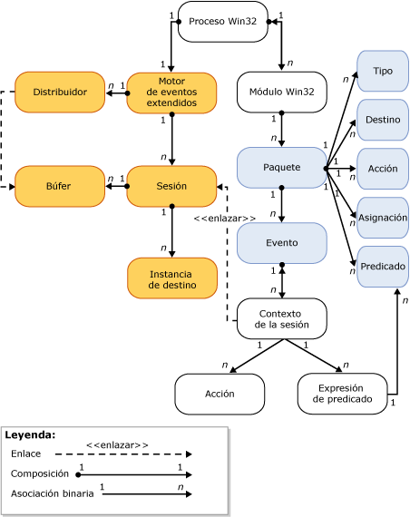

# Motor de SQL Server Extended Events

[!INCLUDE [SQL Server Azure SQL Database](../../includes/applies-to-version/sql-asdb.md)]

  El motor de Extended Events [!INCLUDE[ssNoVersion](../../includes/ssnoversion-md.md)] es una colección de servicios y objetos que:  
  
-   Habilita la definición de eventos.  
  
-   Habilita el procesamiento de los datos de eventos.  
  
-   Administra los objetos y servicios de Extended Events en el sistema.  
  
-   Mantiene una lista de las sesiones de Extended Events y administra el acceso a dicha lista.  
  
 El motor de Extended Events no proporciona eventos o acciones que se van a llevar a cabo cuando se activa un evento. Los procesos que utiliza el motor de Extended Events definen la interacción con el motor. Estos procesos agregan los puntos de evento y proporcionan las acciones que se van a llevar a cabo en respuesta a la activación de eventos.  
  
 La ilustración siguiente muestra una vista simplificada de una sesión de Extended Events. Para más información, consulte [SQL Server Extended Events Sessions](../../relational-databases/extended-events/sql-server-extended-events-sessions.md).  
  
   
  
 Tenga en cuenta lo siguiente:  
  
-   Cada proceso de Windows puede tener uno o más módulos (**proceso Win32**, **módulo Win32**). También se les conoce como módulos *binarios* o *ejecutables*.  
  
-   Cada uno de los módulos de los procesos de Windows puede contener uno o varios paquetes de eventos extendidos (**Paquete**), que contienen uno o más objetos de eventos extendidos (**Tipo**, **Destino**, **Acción**, **Asignación**, **Predicado**y **Evento**).  
  
-   Dentro de un proceso de host solo puede haber una instancia del motor de eventos extendidos (**motor de eventos extendidos**) que:  
  
    -   Administra algunos aspectos de la sesión (por ejemplo, enumerar las sesiones).  
  
    -   Administra el envío (**Distribuidor**). Es similar a un grupo de subprocesos.  
  
    -   Administra los búferes de la memoria (**Búfer**) para los eventos. Cuando se llenan los búferes, los búferes se envían a los destinos.  
  
-   Una vez que se crea una sesión y, opcionalmente, los eventos se enlazan a la sesión (**Contexto de la sesión**):  
  
    -   Las instancias de los destinos (**Instancia de destino**) también pueden crearse y agregarse a la sesión.  
  
    -   Cuando se llenan los búferes, dichos búferes se envían a los destinos.  
  
## Consulte también  
 [Eventos extendidos](../../relational-databases/extended-events/extended-events.md)  
  
  
