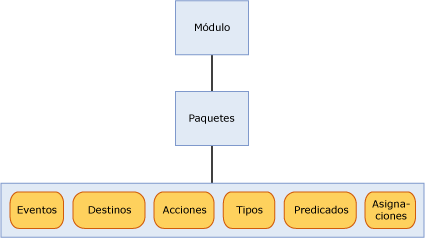

# <a name="sql-server-extended-events-packages"></a>Paquetes de SQL Server Extended Events
[!INCLUDE[appliesto-ss-asdb-xxxx-xxx-md](../../includes/appliesto-ss-asdb-xxxx-xxx-md.md)]

  Un paquete es un contenedor para objetos de eventos extendidos de [!INCLUDE[ssNoVersion](../../includes/ssnoversion-md.md)] . Hay tres tipos de paquetes de eventos extendidos, que son los siguientes:  
  
-   package0: objetos de sistema de Extended Events. Este es el paquete predeterminado.  
  
-   sqlserver: objetos relacionados de [!INCLUDE[ssNoVersion](../../includes/ssnoversion-md.md)] .  
  
-   sqlos: objetos relacionados de [!INCLUDE[ssNoVersion](../../includes/ssnoversion-md.md)] Operating System (SQLOS).  
  
> [!NOTE]  
>  El paquete de SecAudit es utilizado por la Auditoría de [!INCLUDE[ssNoVersion](../../includes/ssnoversion-md.md)] . Ninguno de los objetos del paquete están disponibles con el lenguaje de definición de datos (DDL) de eventos extendidos.  
  
 Los paquetes se identifican por un nombre, un GUID y el módulo binario que contiene el paquete. Para obtener más información, vea [sys.dm_xe_packages &#40;Transact-SQL&#41;](../../relational-databases/system-dynamic-management-views/sys-dm-xe-packages-transact-sql.md).  
  
 Un paquete puede contener cualquiera de los objetos siguientes, o todos ellos, que se describen pormenorizadamente más adelante en este tema:  
  
-   Eventos  
  
-   Destinos  
  
-   Acciones  
  
-   Tipos  
  
-   Predicados  
  
-   Mapas  
  
 Se pueden mezclar objetos de distintos paquetes en una sesión de eventos. Para más información, consulte [SQL Server Extended Events Sessions](../../relational-databases/extended-events/sql-server-extended-events-sessions.md).  
  
## <a name="package-contents"></a>Contenido de los paquetes  
 La ilustración siguiente muestra los objetos que pueden existir en paquetes, que se encuentran en un módulo. Un módulo puede ser un archivo ejecutable o una biblioteca de vínculos dinámicos.  
  
   
  
### <a name="events"></a>Eventos  
 Los eventos son puntos de supervisión de interés en la ruta de ejecución de un programa, como [!INCLUDE[ssNoVersion](../../includes/ssnoversion-md.md)]. La activación de un evento conlleva el hecho de que se ha llegado al punto de interés, así como información de estado del momento en que se activó el evento.  
  
 Los eventos se pueden utilizar únicamente para realizar el seguimiento o para activar acciones. Estas acciones pueden ser sincrónicas o asincrónicas.  
  
> [!NOTE]  
>  Un evento desconoce las acciones que se pueden activar en respuesta a la activación del evento.  
  
 Un conjunto de eventos de un paquete no se puede cambiar una vez que el paquete se registra con Extended Events.  
  
 Todos los eventos tienen un esquema con versiones que define su contenido. Este esquema está formado por columnas de eventos con tipos bien definidos. Un evento de un tipo específico siempre debe proporcionar sus datos en exactamente el mismo orden que se especifica en el esquema. Sin embargo, un destino de evento no tiene que utilizar todos los datos que se proporcionan.  
  
#### <a name="event-categorization"></a>Clasificación de eventos  
 Extended Events utiliza un modelo de clasificación de eventos parecido al Seguimiento de eventos para Windows (ETW). Para la clasificación se utilizan dos propiedades de eventos, canal y palabra clave. La utilización de estas propiedades es compatible con la integración de Extended Events en ETW y sus herramientas.  
  
 **Canal**  
  
 Un canal identifica a los destinatarios de un evento. Estos canales se describen en la siguiente tabla.  
  
|Término|Definición|  
|----------|----------------|  
|Administración|Los eventos de administración se destinan principalmente a usuarios finales, administradores y soporte técnico. Los eventos que se encuentran en los canales de administración indican un problema con una solución bien determinada ante la que un administrador puede emprender una acción. Un ejemplo de un evento de administración es cuando una aplicación no conecta a una impresora. Estos eventos están bien documentados o tienen un mensaje asociado que indica al lector qué hacer para rectificar el problema.|  
|Operativos|Los eventos operativos se utilizan para analizar y diagnosticar un problema o situación concreta. Se pueden utilizar para activar herramientas o tareas basadas en el problema o situación concreta. Un ejemplo de evento operativo se produce cuando una impresora se agrega o quita de un sistema.|  
|Analíticos|Los eventos analíticos se publican en grandes cantidades. Describen el funcionamiento del programa y se utilizan normalmente en investigaciones sobre rendimiento.|  
|Depuración|Únicamente los programadores utilizan los eventos de depuración para diagnosticar un problema y depurarlo.<br /><br /> Los eventos del canal Depurar devuelven datos sobre el estado interno de la implementación. Los esquemas y los datos que devuelven los eventos pueden cambiar o dejar de ser válidos en versiones futuras de SQL Server. Por lo tanto, los eventos del canal Depurar pueden cambiar o quitarse en versiones futuras de SQL Server sin previo aviso.|  
  
 **Palabra clave**  
  
 Una palabra clave es específica de la aplicación y permite llevar a cabo una agrupación más precisa de eventos relacionados, lo que facilita la especificación y recuperación de un evento que se desea utilizar en una sesión. Se puede utilizar la siguiente consulta para obtener información sobre palabras clave:  
  
```  
select map_value Keyword from sys.dm_xe_map_values  
where name = 'keyword_map'  
```  
  
> [!NOTE]  
>  Las palabras clave se asignan estrechamente a la agrupación actual de los eventos de Seguimiento de SQL.  
  
### <a name="targets"></a>Destinos  
 Los destinos son los consumidores de evento. Los destinos procesan los eventos, ya sea de forma sincrónica en el subproceso que activa el evento o de forma asincrónica en un subproceso proporcionado por el sistema. Eventos extendidos proporciona varios destinos que se pueden utilizar según corresponda para dirigir el resultado de los eventos. Para más información, consulte [SQL Server Extended Events Targets](http://msdn.microsoft.com/library/e281684c-40d1-4cf9-a0d4-7ea1ecffa384).  
  
### <a name="actions"></a>Acciones  
 Una acción es una respuesta o serie de respuestas de programación a un evento. Están enlazadas a un evento y cada evento puede tener un conjunto único de acciones.  
  
> [!NOTE]  
>  Las acciones dirigidas a un conjunto concreto de eventos no se pueden enlazar a eventos desconocidos.  
  
 Una acción enlazada a un evento se invoca sincrónicamente en el subproceso que activó el evento. Hay muchos tipos de acciones y tienen gran cantidad de funciones. Las acciones pueden:  
  
-   Capturar un volcado de la pila e inspeccionar los datos.  
  
-   Almacenar información de estado en un contexto local utilizando almacenamiento variable.  
  
-   Agregar datos de eventos.  
  
-   Anexar datos a datos de eventos.  
  
 Algunos ejemplos bien conocidos de acciones son:  
  
-   Volcado de la pila  
  
-   Detección del plan de ejecución (solamente[!INCLUDE[ssNoVersion](../../includes/ssnoversion-md.md)] )  
  
-   [!INCLUDE[tsql](../../includes/tsql-md.md)] recopilación de la pila (solamente[!INCLUDE[ssNoVersion](../../includes/ssnoversion-md.md)] )  
  
-   Cálculo de estadísticas en tiempo de ejecución  
  
-   Recopilación de datos proporcionados por el usuario si se produce una excepción  
  
### <a name="predicates"></a>Predicados  
 Los predicados son un conjunto de reglas lógicas que se utilizan para evaluar los eventos cuando se procesan. Esto permite al usuario de Extended Events capturar selectivamente datos de eventos en función de criterios concretos.  
  
 Los predicados pueden almacenar datos en un contexto local que se puede utilizar para crear predicados que devuelven el valor verdadero cada *n* minutos o cada *n* veces que se activa un evento. Este almacenamiento en el contexto local también se puede utilizar para actualizar dinámicamente el predicado, suprimiendo así activaciones futuras del evento si los eventos contienen datos similares.  
  
 Los predicados tienen la capacidad de recuperar información de contexto, como el Id. de subproceso, así como datos específicos del evento. Los predicados se evalúan como expresiones booleanas completas y admiten un cortocircuito en el primer punto donde se detecta que la expresión completa es falsa.  
  
> [!NOTE]  
>  No se pueden evaluar los predicados con efectos secundarios si se produce un error de comprobación de predicado con anterioridad.  
  
### <a name="types"></a>Tipos  
 Puesto que los datos son una colección de bytes agrupados, la longitud y características de la colección de bytes son necesarias para interpretar los datos. Esta información se encapsula en el objeto Tipo. Los tipos siguientes se proporcionan para los objetos de paquete:  
  
-   event  
  
-   action  
  
-   target  
  
-   pred_source  
  
-   pred_compare  
  
-   Tipo  
  
 Para obtener más información, vea [sys.dm_xe_objects &#40;Transact-SQL&#41;](../../relational-databases/system-dynamic-management-views/sys-dm-xe-objects-transact-sql.md).  
  
### <a name="maps"></a>Mapas  
 Una tabla de asignación asigna un valor interno a una cadena, que permite a un usuario saber qué representa el valor. En lugar de poder obtener solo un valor numérico, un usuario puede obtener una descripción significativa del valor interno. La consulta siguiente muestra cómo obtener valores de asignaciones.  
  
```  
select map_key, map_value from sys.dm_xe_map_values  
where name = 'lock_mode'  
```  
  
 La consulta anterior produce el resultado siguiente:  
  
 `map_key     map_value`  
  
 `---------------------`  
  
 `0           NL`  
  
 `1           SCH_S`  
  
 `2           SCH_M`  
  
 `3           S`  
  
 `4           U`  
  
 `5           X`  
  
 `6           IS`  
  
 `7           IU`  
  
 `8           IX`  
  
 `9           SIU`  
  
 `10          SIX`  
  
 `11          UIX`  
  
 `12          BU`  
  
 `13          RS_S`  
  
 `14          RS_U`  
  
 `15          RI_NL`  
  
 `16          RI_S`  
  
 `17          RI_U`  
  
 `18          RI_X`  
  
 `19          RX_S`  
  
 `20          RX_U`  
  
 `21          RX_X`  
  
 `21          RX_X`  
  
 Utilizando esta tabla como ejemplo, suponga que tiene una columna denominada modo, y su valor es 5. La tabla indica que 5 se asigna a X, lo que quiere decir el tipo de bloqueo es Exclusivo.  
  
## <a name="see-also"></a>Ver también  
 [SQL Server Extended Events Sessions](../../relational-databases/extended-events/sql-server-extended-events-sessions.md)   
 [Motor de SQL Server Extended Events](../../relational-databases/extended-events/sql-server-extended-events-engine.md)   
 [SQL Server Extended Events Targets](http://msdn.microsoft.com/library/e281684c-40d1-4cf9-a0d4-7ea1ecffa384)  
  
  
