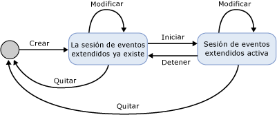
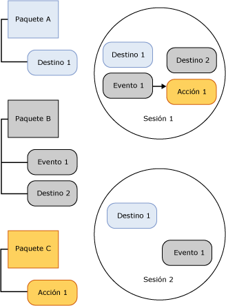

# SQL Server Extended Events Sessions

[!INCLUDE[appliesto-ss-asdb-xxxx-xxx-md](../../includes/appliesto-ss-asdb-xxxx-xxx-md.md)]

  Una sesión de [!INCLUDE[ssNoVersion](../../includes/ssnoversion-md.md)] Extended Events se crea en el proceso de [!INCLUDE[ssNoVersion](../../includes/ssnoversion-md.md)] que hospeda el motor de Extended Events. Los aspectos siguientes de una sesión de Extended Events proporcionan un contexto para entender la infraestructura de Extended Events y el procesamiento general que se produce:  
  
-   Estados de sesión. Los distintos estados en que se encuentra una sesión de Extended Events cuando se ejecutan las instrucciones CREATE EVENT SESSION y ALTER EVENT SESSION.  
  
-   Contenido y características de la sesión. Contenido de una sesión de Extended Events, por ejemplo destinos y eventos, y cómo estos objetos se relacionan en una sesión o entre sesiones.  
  
## Estados de sesión  
 La ilustración siguiente muestra los diversos estados de una sesión de Extended Events.  
  
   
  
 En la figura anterior, observe que el estado de la sesión cambia cuando se emiten los distintos comandos DDL para una sesión de evento. En la tabla siguiente se describen estos cambios de estado.  
  
|Etiqueta de la ilustración|Instrucción DDL|Descripción|  
|------------------------|-------------------|-----------------|  
|Crear|CREATE EVENT SESSION|El proceso de host crea un objeto de sesión que contiene los metadatos proporcionados por CREATE EVENT SESSION. El proceso de host valida la definición de la sesión, valida el nivel del permiso de usuario y almacena los metadatos en la base de datos maestra. En este punto la sesión no está activa.|  
|Alter|ALTER EVENT SESSION, STATE=START|El proceso de host inicia la sesión. El proceso de host lee los metadatos almacenados, valida la definición de la sesión, comprueba el nivel del permiso de usuario y crea la sesión. Se cargan los objetos de sesión, como eventos y destinos, y el control de eventos está activo.|  
|Alter|ALTER EVENT SESSION, STATE=STOP|El proceso de host detiene la sesión activa pero conserva los metadatos.|  
|Drop|DROP EVENT SESSION|Dependiendo de que la sesión esté activa o no, Drop (DROP SESSION) eliminará los metadatos y cerrará la sesión activa, o eliminará los metadatos de la sesión.|  
  
> [!NOTE]  
>  ALTER EVENT SESSION y DROP EVENT SESSION se pueden aplicar a los metadatos, o a una sesión activa y los metadatos.  
  
## Contenido y características de la sesión  
 Las sesiones de Extended Events tienen límites implícitos en cuanto que la configuración de una sesión no cambia la configuración de otra. Sin embargo, estos límites no impiden que un evento o destino se utilice en más de una sesión.  
  
 En la siguiente ilustración se muestra el contenido de la sesión y la relación entre los paquetes y las sesiones.  
  
   
  
 En la ilustración anterior, observe que:  
  
-   La asignación entre los objetos de paquete y las sesiones es de varios a varios, lo que significa que un objeto puede aparecer en varias sesiones, y una sesión puede contener varios objetos.  
  
-   El mismo evento (Event1) o destino (Target1) puede estar habilitado en más de una sesión.  
  
 Las sesiones tienen las características siguientes:  
  
-   Las acciones y predicados se enlazan a los eventos sesión por sesión. Si tiene el evento 1 en la sesión A con la acción 1 y el predicado Z, ello no impedirá en modo alguno tener el evento 1 en la sesión B con la acción 2 y la acción 3 sin predicado.  
  
-   Las directivas están asociadas a las sesiones para administrar el almacenamiento en búfer y el envío, y el seguimiento de causalidad.  
  
 **Almacenamiento en búfer y envío**  
  
 El almacenamiento en búfer hace referencia a cómo se almacenan los datos de eventos mientras se está ejecutando una sesión de eventos.  Las directivas de almacenamiento en búfer especifican cuánta memoria se debe utilizar para los datos de eventos y la directiva de pérdida para los eventos. El envío hace referencia a la cantidad de tiempo que los eventos estarán en los búferes antes de enviarse a los destinos para su procesamiento.  
  
 **Seguimiento de causalidad**  
  
 El seguimiento de causalidad proporciona la capacidad de realizar el seguimiento de trabajo por varias tareas. Cuando el seguimiento de causalidad está habilitado, cada evento que se activa tiene un Id. de actividad único en todo el sistema. El Id. de actividad es la combinación de un valor GUID constante en todos los eventos de una tarea y un número de secuencia que se incrementa cada vez que se activa un evento. Cuando una tarea produce trabajo que se debe realizar en otra, el identificador de actividad del elemento principal se envía a la tarea secundaria. La tarea secundaria genera el identificador de actividad del elemento principal la primera vez que se activa un evento.  
  
 La arquitectura de Extended Events constituye un sistema flexible que permite utilizar diversos objetos conjuntamente para resolver problemas concretos.  
  
## Consulte también  
 [Eventos extendidos](../../relational-databases/extended-events/extended-events.md)  
  
  
