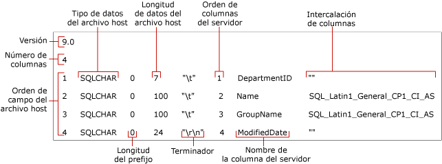

# <a name="non-xml-format-files-sql-server"></a>Archivos de formato no XML [SQL Server]
[!INCLUDE[appliesto-ss-asdb-asdw-pdw-md](../../includes/appliesto-ss-asdb-asdw-pdw-md.md)]
  En [!INCLUDE[ssCurrent](../../includes/sscurrent-md.md)], se admiten dos tipos de archivos de formato para la importación y exportación masivas: *archivos de formato no XML* y *archivos de formato XML*.  
  
 **En este tema:**  
  
-   [Ventajas](#Benefits)  
  
-   [Estructura de los archivos de formato no XML](#Structure)  
  
-   [Ejemplo de archivo de formato no XML](#Examples)  
  
-   [Tareas relacionadas](#RelatedTasks)  
  
##  <a name="Benefits"></a> Ventajas de los archivos de formato no XML  
  
-   Puede crear automáticamente un archivo de formato no XML si especifica la opción **format** en un comando **bcp** .  
  
-   Cuando especifica un archivo de formato existente en un comando **bcp** , el comando usa los valores registrados en el archivo de formato y no pregunta el tipo de almacenamiento de archivo, la longitud de prefijo, la longitud del campo o el terminador de campo.  
  
-   Puede crear un archivo de formato para un tipo de datos determinado, como los datos de caracteres o los datos nativos.  
  
-   Puede crear un archivo de formato no XML que contenga atributos especificados de modo interactivo para cada campo de datos. Para obtener más información, vea [Especificar formatos de datos por razones de compatibilidad mediante bcp &#40;SQL Server&#41;](../../relational-databases/import-export/specify-data-formats-for-compatibility-when-using-bcp-sql-server.md).  
  
> [!NOTE]  
>  Los archivos de formato XML ofrecen varias ventajas sobre los archivos con otro formato. Para obtener más información, vea [XML, archivos de formato &#40;SQL Server&#41;](../../relational-databases/import-export/xml-format-files-sql-server.md).  
  
##  <a name="Structure"></a> Estructura de los archivos de formato no XML  
 Un archivo de formato no XML es un archivo de texto que tiene una estructura específica. El archivo de formato no XML contiene información sobre el tipo de almacenamiento de archivo, la longitud de prefijo, la longitud de campo y el terminador de campo de cada columna de tabla.  
  
 En la ilustración siguiente se muestran los campos de archivo de formato de un archivo de formato no XML de ejemplo.  
  
 
  
 Los campos **Versión** y **Número de columnas** solo aparecen una vez. Los significados se describen en la siguiente tabla.  
  
|Campo del archivo de formato|Description|  
|------------------------|-----------------|  
|Versión|Número de versión de la utilidad **bcp** :<br /><br /> 9.0 = [!INCLUDE[ssVersion2005](../../includes/ssversion2005-md.md)]<br /><br /> 10.0 = [!INCLUDE[ssKatmai](../../includes/sskatmai-md.md)]<br /><br /> 11.0 = [!INCLUDE[ssSQL11](../../includes/sssql11-md.md)]<br /><br /> 12.0 = [!INCLUDE[ssSQL14](../../includes/sssql14-md.md)]<br /><br /> El número de versión solo se reconoce en **bcp**, no en [!INCLUDE[tsql](../../includes/tsql-md.md)].<br /><br /> <br /><br /> Nota: La versión de la utilidad **bcp** (Bcp.exe) que se usa para leer un archivo de formato debe ser la misma, o una versión posterior, que la que se usó para crear el archivo de formato. Por ejemplo, [!INCLUDE[ssSQL11](../../includes/sssql11-md.md)]**bcp** puede leer un formato de archivo de la versión 10.0, generado por [!INCLUDE[ssKatmai](../../includes/sskatmai-md.md)]**bcp**, pero [!INCLUDE[ssKatmai](../../includes/sskatmai-md.md)]**bcp** no puede leer un formato de archivo de la versión 12.0, generado por [!INCLUDE[ssSQL14](../../includes/sssql14-md.md)]**bcp**.|  
|Número de columnas|Número de campos del archivo de datos. Este número debe ser el mismo en todas las filas.|  
  
 Los otros campos del archivo de formato describen los campos de datos que se importarán o exportarán masivamente. Cada campo de datos requiere una fila distinta en el archivo de formato. Cada fila del archivo de formato contiene los valores de los campos del archivo de formato que se describen en la siguiente tabla.  
  
|Campo del archivo de formato|Description|  
|------------------------|-----------------|  
|**Orden de campo del archivo host**|Número que indica la posición de cada campo en el archivo de datos. El primer campo de la fila es 1 y así sucesivamente.|  
|**Tipo de datos del archivo host**|Indica el tipo de datos que se almacena en un campo determinado del archivo de datos. Para archivos de datos ASCII, utilice SQLCHAR; para archivos de datos con formato nativo, utilice tipos de datos predeterminados. Para obtener más información, vea [Especificar el tipo de almacenamiento en archivo mediante bcp &#40;SQL Server&#41;](../../relational-databases/import-export/specify-file-storage-type-by-using-bcp-sql-server.md).|  
|**Longitud del prefijo**|Número de caracteres del prefijo para el campo. Los valores de longitud de prefijo válidos son 0, 1, 2, 4 y 8. Para evitar especificar el prefijo de longitud, establezca esta opción en 0. Se debe especificar el prefijo de longitud si el campo contiene valores de datos NULL. Para obtener más información, vea [Especificar la longitud de prefijo en los archivos de datos mediante bcp &#40;SQL Server&#41;](../../relational-databases/import-export/specify-prefix-length-in-data-files-by-using-bcp-sql-server.md).|  
|**Longitud de datos del archivo host**|Longitud máxima, en bytes, del tipo de datos almacenados en el campo concreto del archivo de datos.<br /><br /> Si está creando un archivo de formato no XML para un archivo de texto delimitado, puede especificar 0 para la longitud de datos del archivo host de cada campo de datos. Cuando se importa un archivo de texto delimitado con una longitud de prefijo de 0 y un terminador, el valor de la longitud de campo se ignora porque el espacio de almacenamiento utilizado por las columnas es igual a la longitud de los datos más el terminador.<br /><br /> Para obtener más información, vea [Especificar la longitud de campo mediante bcp &#40;SQL Server&#41;](../../relational-databases/import-export/specify-field-length-by-using-bcp-sql-server.md).|  
|**Terminador**|Delimitador para separar los campos del archivo de datos. Los terminadores más utilizados son la coma (,), la tabulación (\t) y el final de línea (\r\n). Para obtener más información, vea [Especificar terminadores de campo y de fila &#40;SQL Server&#41;](../../relational-databases/import-export/specify-field-and-row-terminators-sql-server.md).|  
|**Orden de columnas del servidor**|Orden en el que aparecen las columnas en la tabla de [!INCLUDE[ssNoVersion](../../includes/ssnoversion-md.md)] . Por ejemplo, si el cuarto campo del archivo de datos se asigna a la sexta columna de una tabla de [!INCLUDE[ssNoVersion](../../includes/ssnoversion-md.md)] , el orden de las columnas del servidor para el cuarto campo es 6.<br /><br /> Para evitar que una columna de la tabla reciba datos del archivo de datos, establezca el valor 0 para el orden de las columnas del servidor.|  
|**Nombre de la columna del servidor**|Nombre de la columna copiada de la tabla de [!INCLUDE[ssNoVersion](../../includes/ssnoversion-md.md)] . El nombre real del campo no es necesario, pero el campo en el archivo de formato no debe estar en blanco.|  
|**Intercalación de columnas**|La intercalación que se utiliza para almacenar datos de caracteres y Unicode en el archivo de datos.|  
  
> [!NOTE]  
>  Puede modificar un archivo de formato de forma que le permita realizar una importación masiva desde un archivo de datos en el que el número o el orden de los campos difieran del número o el orden de las columnas de la tabla. Para obtener más información, vea la lista [Tareas relacionadas](#RelatedTasks) , más adelante en este tema.  
  
##  <a name="Examples"></a> Ejemplo de archivo de formato no XML  
 En el ejemplo siguiente se muestra un archivo de formato no XML creado anteriormente (`myDepartmentIdentical-f-c.fmt`). Este archivo describe un campo de datos de caracteres para cada columna en la tabla `HumanResources.Department` de la base de datos de ejemplo `AdventureWorks2012` .  
  
 El archivo de formato generado, `myDepartmentIdentical-f-c.fmt`, contiene la siguiente información:  
  
```  
12.0  
4  
1       SQLCHAR       0       7       "\t"     1     DepartmentID     ""  
2       SQLCHAR       0       100     "\t"     2     Name             SQL_Latin1_General_CP1_CI_AS  
3       SQLCHAR       0       100     "\t"     3     GroupName        SQL_Latin1_General_CP1_CI_AS  
4       SQLCHAR       0       24      "\r\n"   4     ModifiedDate     ""  
```  
  
> [!NOTE]  
>  Para ver una ilustración en la que se muestran los campos del archivo de formato en relación con este archivo de formato no XML de ejemplo, vea [Estructura de los archivos de formato no XML](#Structure)anteriormente en este tema.  
  
##  <a name="RelatedTasks"></a> Tareas relacionadas  
  
-   [Crear un archivo de formato &#40;SQL Server&#41;](../../relational-databases/import-export/create-a-format-file-sql-server.md)  
  
-   [Usar un archivo de formato para importar datos en bloque &#40;SQL Server&#41;](../../relational-databases/import-export/use-a-format-file-to-bulk-import-data-sql-server.md)  
  
-   [Usar un archivo de formato para omitir una columna de tabla &#40;SQL Server&#41;](../../relational-databases/import-export/use-a-format-file-to-skip-a-table-column-sql-server.md)  
  
-   [Usar un archivo de formato para omitir un campo de datos &#40;SQL Server&#41;](../../relational-databases/import-export/use-a-format-file-to-skip-a-data-field-sql-server.md)  
  
-   [Usar un archivo de formato para asignar columnas de tabla a campos de un archivo de datos &#40;SQL Server&#41;](../../relational-databases/import-export/use-a-format-file-to-map-table-columns-to-data-file-fields-sql-server.md)  
  
## <a name="see-also"></a>Ver también  
 [bcp (utilidad)](../../tools/bcp-utility.md)   
 [Crear un archivo de formato &#40;SQL Server&#41;](../../relational-databases/import-export/create-a-format-file-sql-server.md)   
 [XML, archivos de formato &#40;SQL Server&#41;](../../relational-databases/import-export/xml-format-files-sql-server.md)   
 [Archivos de formato para importar o exportar datos &#40;SQL Server&#41;](../../relational-databases/import-export/format-files-for-importing-or-exporting-data-sql-server.md)  
  
  
