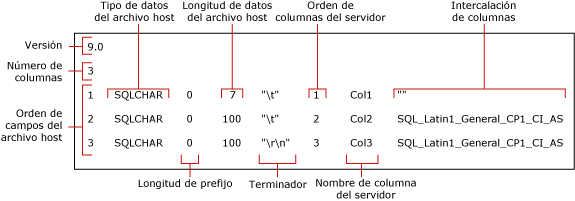

# <a name="use-a-format-file-to-skip-a-table-column-sql-server"></a>Usar un archivo de formato para omitir una columna de tabla  (SQL Server)
[!INCLUDE[appliesto-ss-asdb-asdw-pdw-md](../../includes/appliesto-ss-asdb-asdw-pdw-md.md)]

En este artículo se describe cómo usar un archivo de formato para omitir la importación de una columna de tabla cuando los datos de la columna omitida no existen en el archivo de datos de origen. Un archivo de datos puede contener menos campos que el número de columnas de la tabla de destino; es decir, se puede omitir la importación de una columna, pero solo si se cumple al menos una de las dos condiciones siguientes en la tabla de destino:
-   La columna omitida admite valores NULL.
-   La columna omitida tiene un valor predeterminado.  
  
## <a name="sample-table-and-data-file"></a>Tabla y archivo de datos de ejemplo  
 En los ejemplos de este artículo se espera una tabla denominada `myTestSkipCol` en el esquema **dbo**. Puede crear esta tabla en una base de datos de ejemplo, como *WideWorldImporters* o *AdventureWorks*, o en cualquier otra base de datos. Para crear esta tabla, realice lo siguiente:  
  
```sql
USE WideWorldImporters;  
GO  
CREATE TABLE myTestSkipCol   
   (  
   Col1 smallint,  
   Col2 nvarchar(50) NULL,  
   Col3 nvarchar(50) not NULL  
   );  
GO  
```  
  
Los ejemplos de este artículo también usan un archivo de datos de ejemplo, `myTestSkipCol2.dat`. Este archivo de datos solo contiene dos campos, aunque la tabla de destino tiene tres columnas.

```  
1,DataForColumn3  
1,DataForColumn3  
1,DataForColumn3  
```  
  
## <a name="basic-steps"></a>Pasos básicos

Puede usar un archivo de formato no XML o uno XML para omitir una columna de tabla. En ambos casos, existen dos pasos:

1.   Use la utilidad de línea de comandos **bcp** para crear un archivo de formato predeterminado.

2.   Modifique el archivo de formato predeterminado en un editor de texto.

El archivo de formato modificado debe asignar cada campo existente a su columna correspondiente en la tabla de destino. También debe indicar qué columna o columnas de la tabla se deben omitir. 

Por ejemplo, para importar en bloque datos de `myTestSkipCol2.dat` a la tabla `myTestSkipCol`, el archivo de formato debe asignar el primer campo de datos a `Col1`, omitir `Col2` y asignar el segundo campo a `Col3`.  
 
## <a name="option-1---use-a-non-xml-format-file"></a>Opción 1: Usar un archivo de formato no XML  
  
### <a name="step-1---create-a-default-non-xml-format-file"></a>Paso 1: Crear un archivo de formato no XML predeterminado  
Cree un archivo de formato no XML predeterminado para la tabla de ejemplo `myTestSkipCol` mediante la ejecución del comando **bcp** siguiente en el símbolo del sistema:  
  
```cmd
bcp WideWorldImporters..myTestSkipCol format nul -f myTestSkipCol_Default.fmt -c -T  
```  

> [!IMPORTANT]  
>  Es posible que deba especificar el nombre de la instancia de servidor a la que se va a conectar con el argumento `-S`. También es posible que deba especificar el nombre de usuario y la contraseña con los argumentos `-U` y `-P`. Para obtener más información, consulte [bcp Utility](../../tools/bcp-utility.md).  

En el ejemplo anterior se crea un archivo de formato no XML, `myTestSkipCol_Default.fmt`. Este formato de archivo se denomina *archivo de formato predeterminado* porque es el formulario generado por **bcp**. Un archivo de formato predeterminado describe una correspondencia de uno a uno entre los campos de archivo de datos y las columnas de la tabla.  
  
 En la siguiente captura de pantalla se muestran los valores de estos archivos de formato predeterminados de ejemplo. 
  
   
  
> [!NOTE]  
>  Para obtener más información sobre los campos de archivo de formato, vea [Archivos de formato no XML &#40;SQL Server&#41;](../../relational-databases/import-export/non-xml-format-files-sql-server.md).  
  
### <a name="step-2---modify-a-non-xml-format-file"></a>Paso 2: Modificar un archivo de formato no XML  
Existen dos alternativas para modificar un archivo de formato no XML predeterminado. Cada una de ellas indica que el campo de datos no existe en el archivo de datos y que no se debe insertar ningún dato en la columna correspondiente de la tabla.

Para omitir una columna de tabla, edite el archivo de formato no XML predeterminado y modifíquelo utilizando uno de los siguientes métodos alternativos:  

#### <a name="option-1---remove-the-row"></a>Opción 1: Quitar la fila
El método de preferencia para omitir una columna consta de estos tres pasos:

1.   Primero, elimine cualquier fila de archivo de formato que describa un campo que no esté en el archivo de datos de origen.
2.   A continuación, reduzca el valor "Orden de campo del archivo host" de cada fila de archivo de formato antecedida por una fila eliminada. El objetivo es tener valores "Orden de campo del archivo host" secuenciales, de 1 a *n*, que reflejen la posición real de cada campo de datos del archivo de datos.
3.   Por último, reduzca el valor del campo "Número de columnas" para que se ajuste al número real de campos del archivo de datos.  
  
El ejemplo siguiente se basa en el archivo de formato predeterminado para la tabla `myTestSkipCol`. Este archivo de formato modificado asigna el primer campo de datos a `Col1`, omite `Col2`y asigna el segundo campo de datos a `Col3`. La fila para `Col2` se ha eliminado. El delimitador después del primer campo también se modificó de `\t` a `,`.
  
```  
14.0  
2  
1       SQLCHAR       0       7       ","      1     Col1         ""  
2       SQLCHAR       0       100     "\r\n"   3     Col3         SQL_Latin1_General_CP1_CI_AS  
```  
  
#### <a name="option-2---modify-the-row-definition"></a>Opción 2: Modificar la definición de fila

Como alternativa, para omitir una columna de tabla, puede modificar la definición de la fila de archivo de formato que corresponda a la columna de tabla. En esta fila de formato de archivo los valores "prefix length", "host file data length" y "server column order" deben estar configurados en 0. Además, los campos "terminator" y "column collation" se deben estar establecidos en "" (es decir, en un valor vacío o NULL). El valor "nombre de columna de servidor" requiere una cadena que no esté en blanco, aunque el nombre de columna real no resulta necesario. Los campos de formato restantes requieren los valores predeterminados.  
  
El siguiente ejemplo también se deriva del archivo de formato predeterminado para la tabla `myTestSkipCol` .  
  
```  
14.0  
3  
1       SQLCHAR       0       7       ","      1     Col1         ""  
2       SQLCHAR       0       0       ""       0     Col2         ""  
3       SQLCHAR       0       100     "\r\n"   3     Col3         SQL_Latin1_General_CP1_CI_AS  
```  
  
### <a name="examples-with-a-non-xml-format-file"></a>Ejemplos con un archivo de formato no XML 
Los siguientes ejemplos se basan en la tabla de ejemplo `myTestSkipCol` y el archivo de datos de ejemplo `myTestSkipCol2.dat` que se describieron anteriormente en este artículo.  
  
#### <a name="using-bulk-insert"></a>Usar BULK INSERT  
Este ejemplo funciona usando cualquiera de los archivos de formato no XML modificados, tal y como se ha descrito en la sección anterior. En este ejemplo, el archivo de formato modificado se llama `myTestSkipCol2.fmt`. Para usar `BULK INSERT` a fin de importar en bloque el archivo de datos `myTestSkipCol2.dat`, ejecute el siguiente código en SSMS. Actualice las rutas del sistema de archivos a la ubicación de los archivos de ejemplo del equipo.
  
```sql  
USE WideWorldImporters;  
GO  
BULK INSERT myTestSkipCol   
   FROM 'C:\myTestSkipCol2.dat'   
   WITH (FORMATFILE = 'C:\myTestSkipCol2.fmt');  
GO  
SELECT * FROM myTestSkipCol;  
GO  
```  
  
## <a name="option-2---use-an-xml-format-file"></a>Opción 2: Usar un archivo de formato XML  
  
### <a name="step-1---create-a-default-xml-format-file"></a>Paso 1: Crear un archivo de formato XML predeterminado   

Cree un archivo de formato XML predeterminado para la tabla de ejemplo `myTestSkipCol` mediante la ejecución del comando **bcp** siguiente en el símbolo del sistema:  
  
```cmd
bcp WideWorldImporters..myTestSkipCol format nul -f myTestSkipCol_Default.xml -c -x -T  
```  
  
> [!IMPORTANT]  
>  Es posible que deba especificar el nombre de la instancia de servidor a la que se va a conectar con el argumento `-S`. También es posible que deba especificar el nombre de usuario y la contraseña con los argumentos `-U` y `-P`. Para obtener más información, consulte [bcp Utility](../../tools/bcp-utility.md).  
 
En el ejemplo anterior se crea un archivo de formato XML, `myTestSkipCol_Default.xml`. Este formato de archivo se denomina *archivo de formato predeterminado* porque es el formulario generado por **bcp**. Un archivo de formato predeterminado describe una correspondencia de uno a uno entre los campos de archivo de datos y las columnas de la tabla.  
  
```xml
<?xml version="1.0"?>  
<BCPFORMAT xmlns="http://schemas.microsoft.com/sqlserver/2004/bulkload/format" xmlns:xsi="http://www.w3.org/2001/XMLSchema-instance">  
 <RECORD>  
  <FIELD ID="1" xsi:type="CharTerm" TERMINATOR="\t" MAX_LENGTH="7"/>  
  <FIELD ID="2" xsi:type="CharTerm" TERMINATOR="\t" MAX_LENGTH="100" COLLATION="SQL_Latin1_General_CP1_CI_AS"/>  
  <FIELD ID="3" xsi:type="CharTerm" TERMINATOR="\r\n" MAX_LENGTH="100" COLLATION="SQL_Latin1_General_CP1_CI_AS"/>  
 </RECORD>  
 <ROW>  
  <COLUMN SOURCE="1" NAME="Col1" xsi:type="SQLSMALLINT"/>  
  <COLUMN SOURCE="2" NAME="Col2" xsi:type="SQLNVARCHAR"/>  
  <COLUMN SOURCE="3" NAME="Col3" xsi:type="SQLNVARCHAR"/>  
 </ROW>  
</BCPFORMAT>  
```  
  
> [!NOTE]  
>  Para obtener más información sobre la estructura de los archivos de formato XML, vea [XML, archivos de formato &#40;SQL Server&#41;](../../relational-databases/import-export/xml-format-files-sql-server.md).  

### <a name="step-2---modify-an-xml-format-file"></a>Paso 2: Modificar un archivo de formato XML

Este es el archivo de formato XML modificado, `myTestSkipCol2.xml`, que omite `Col2`. Se han quitado las entradas `FIELD` y `ROW` para `Col2` y se han vuelto a enumerar las entradas. El delimitador después del primer campo también se modificó de `\t` a `,`.

```xml
<?xml version="1.0"?>  
<BCPFORMAT xmlns="http://schemas.microsoft.com/sqlserver/2004/bulkload/format" xmlns:xsi="http://www.w3.org/2001/XMLSchema-instance">  
 <RECORD>  
  <FIELD ID="1" xsi:type="CharTerm" TERMINATOR="," MAX_LENGTH="7"/>  
  <FIELD ID="2" xsi:type="CharTerm" TERMINATOR="\r\n" MAX_LENGTH="100" COLLATION="SQL_Latin1_General_CP1_CI_AS"/>  
 </RECORD>  
 <ROW>  
  <COLUMN SOURCE="1" NAME="Col1" xsi:type="SQLSMALLINT"/>  
  <COLUMN SOURCE="2" NAME="Col3" xsi:type="SQLNVARCHAR"/>  
 </ROW>  
</BCPFORMAT>  
```  
 
### <a name="examples-with-an-xml-format-file"></a>Ejemplos con un archivo de formato XML   
Los siguientes ejemplos se basan en la tabla de ejemplo `myTestSkipCol` y el archivo de datos de ejemplo `myTestSkipCol2.dat` que se describieron anteriormente en este artículo.

Para importar datos de `myTestSkipCol2.dat` a la tabla `myTestSkipCol`, los ejemplos usan el archivo de formato XML modificado, `myTestSkipCol2.xml`.   
  
#### <a name="using-bulk-insert-with-a-view"></a>Usar BULK INSERT con una vista  

Con un archivo de formato XML, no se puede omitir una columna cuando se importa directamente a una tabla mediante un comando **bcp** o una instrucción `BULK INSERT`. Sin embargo, se puede importar en todas las columnas de una tabla, excepto en la última columna. Si se tiene que omitir alguna columna, excepto la última, se debe crear una vista de la tabla de destino que contenga únicamente las columnas incluidas en el archivo de datos. De esta forma, se puede realizar una importación masiva de los datos de ese archivo en la vista.  
  
En el siguiente ejemplo se crea la vista `v_myTestSkipCol` en la tabla `myTestSkipCol`. Esta vista omite la segunda columna de la tabla, `Col2`. Después, en el ejemplo se usa `BULK INSERT` para importar el archivo de datos `myTestSkipCol2.dat` a la vista.  
  
En SSMS, ejecute el código siguiente. Actualice las rutas del sistema de archivos a la ubicación de los archivos de ejemplo del equipo. 
  
```sql  
USE WideWorldImporters;  
GO  

CREATE VIEW v_myTestSkipCol AS  
    SELECT Col1,Col3  
    FROM myTestSkipCol;  
GO  
  
BULK INSERT v_myTestSkipCol  
FROM 'C:\myTestSkipCol2.dat'  
WITH (FORMATFILE='C:\myTestSkipCol2.xml');  
GO  
```  

#### <a name="using-openrowsetbulk"></a>Usar OPENROWSET(BULK...)  

Para usar un archivo de formato XML para omitir una columna de tabla mediante el uso de `OPENROWSET(BULK...)`, debe proporcionar una lista explícita de las columnas en la lista de selección y en la tabla de destino de la siguiente forma:  
  
    ```sql
    INSERT ...<column_list> SELECT <column_list> FROM OPENROWSET(BULK...) 
    ```

En el siguiente ejemplo se utiliza el proveedor de conjuntos de filas BULK `OPENROWSET` y el archivo de formato `myTestSkipCol2.xml` . En el ejemplo se importa masivamente el archivo de datos `myTestSkipCol2.dat` a la tabla `myTestSkipCol` . La instrucción contiene una lista explícita de las columnas en la lista de selección y también en la tabla de destino, según convenga.  
  
En SSMS, ejecute el código siguiente. Actualice las rutas del sistema de archivos a la ubicación de los archivos de ejemplo del equipo.
  
```sql  
USE WideWorldImporters;  
GO  
INSERT INTO myTestSkipCol  
  (Col1,Col3)  
    SELECT Col1,Col3  
      FROM  OPENROWSET(BULK  'C:\myTestSkipCol2.Dat',  
      FORMATFILE='C:\myTestSkipCol2.Xml'    
       ) as t1 ;  
GO  
```

## <a name="see-also"></a>Ver también  
 [bcp Utility](../../tools/bcp-utility.md)   
 [BULK INSERT &#40;Transact-SQL&#41;](../../t-sql/statements/bulk-insert-transact-sql.md)   
 [OPENROWSET &#40;Transact-SQL&#41;](../../t-sql/functions/openrowset-transact-sql.md)   
 [Usar un archivo de formato para omitir un campo de datos &#40;SQL Server&#41;](../../relational-databases/import-export/use-a-format-file-to-skip-a-data-field-sql-server.md)   
 [Usar un archivo de formato para asignar columnas de tabla a campos de un archivo de datos &#40;SQL Server&#41;](../../relational-databases/import-export/use-a-format-file-to-map-table-columns-to-data-file-fields-sql-server.md)   
 [Usar un archivo de formato para importar datos en bloque &#40;SQL Server&#41;](../../relational-databases/import-export/use-a-format-file-to-bulk-import-data-sql-server.md)  
  
  
