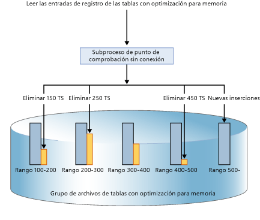
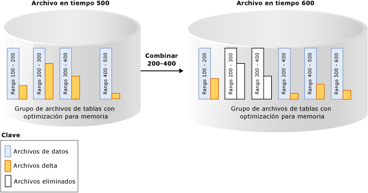

# Durabilidad de las tablas con optimización para memoria
[!INCLUDE[appliesto-ss-xxxx-xxxx-xxx-md](../../includes/appliesto-ss-xxxx-xxxx-xxx-md.md)]

  [!INCLUDE[hek_2](../../includes/hek-2-md.md)] proporciona durabilidad total para las tablas optimizadas para memoria. Cuando una transacción que ha cambiado una tabla optimizada para memoria se confirma, [!INCLUDE[ssNoVersion](../../includes/ssnoversion-md.md)] (como hace para las tablas basadas en disco) garantiza que los cambios son permanentes (sobrevivirán a un reinicio de la base de datos), siempre y cuando el almacenamiento subyacente esté disponible. Hay dos componentes clave de durabilidad: registro de transacciones y conservación de los cambios de los datos en el almacenamiento en disco.  
  
 Para obtener detalles sobre las limitaciones de tamaño de las tablas durables, vea [Estimar los requisitos de memoria para las tablas con optimización para memoria](../../relational-databases/in-memory-oltp/estimate-memory-requirements-for-memory-optimized-tables.md). 
  
## Registro de transacciones  
 Todos los cambios realizados en tablas basadas en disco o en tablas optimizadas para memoria se capturan en una o más entradas del registro de transacciones. Cuando se confirma una transacción, [!INCLUDE[ssNoVersion](../../includes/ssnoversion-md.md)] escribe en el disco las entradas de registro asociadas a la transacción antes de comunicar a la aplicación o a la sesión de usuario que la transacción se ha confirmado. Esto garantiza que los cambios realizados por la transacción sean durables. El registro de transacciones para las tablas optimizadas para memoria está totalmente integrado con el mismo flujo de registro que emplean las tablas basadas en disco. Esta integración permite que las operaciones de copia de seguridad, recuperación y restauración de registros de transacciones existentes sigan funcionando sin necesidad de realizar ningún paso adicional. Pero, puesto que [!INCLUDE[hek_2](../../includes/hek-2-md.md)] puede disparar considerablemente el rendimiento de transacción de la carga de trabajo, el E/S de registro puede convertirse en un cuello de botella de rendimiento. Para dar cabida a este aumento del rendimiento, asegúrese de que el subsistema de E/S de registro puede hacerse cargo del incremento de la carga.  
  
## Archivos delta y de datos  
 Los datos de las tablas optimizadas para memoria se almacenan como filas de datos de forma libre en una estructura de datos del montón en memoria y se vinculan a través de uno o varios índices en memoria. No hay ninguna estructura de página para las filas de datos, como las empleadas para las tablas basadas en disco. Para la persistencia a largo plazo y para permitir el truncamiento del registro de transacciones, las operaciones en las tablas optimizadas para memoria se conservan en un conjunto de archivos delta y de datos. Estos archivos se generan según el registro de transacciones por medio de un proceso asincrónico en segundo plano. Los archivos de datos y delta se encuentran en uno o varios contenedores (con el mismo mecanismo empleado para los datos FILESTREAM). Estos contenedores forman parte de un grupo de archivos optimizados para memoria.  
  
 Los datos se escriben en estos archivos de un modo estrictamente secuencial, lo que reduce la latencia de disco para las unidades de disco. Puede utilizar varios contenedores en discos diferentes para distribuir la actividad de E/S. Los archivos delta y de datos en varios contenedores ubicados en discos distintos aumentarán el rendimiento de la recuperación/restauración de la base de datos cuando se leen los datos de los archivos delta y de datos en disco, en memoria.  
  
 Las transacciones de usuario no tienen acceso directamente a los archivos delta y de datos. Todas las lecturas y escrituras de datos usan estructuras de datos en memoria.  
  
### Archivo de datos.  
 Un archivo de datos contiene filas de una o más tablas optimizadas para memoria que se han insertado mediante varias transacciones como parte de las operaciones INSERT o UPDATE. Por ejemplo, una fila puede ser de una tabla T1 optimizada para memoria y la siguiente puede ser de una tabla T2 optimizada para memoria. Las filas se anexan al archivo de datos en el orden de las transacciones del registro de transacciones, con lo que el acceso a los datos es secuencial. Esto permite un mejor rendimiento de la E/S del orden de magnitud en comparación con la E/S aleatoria.  
  
 Una vez que el archivo de datos está lleno, las filas insertadas por las nuevas transacciones se almacenan en otro archivo de datos. Con el tiempo, las filas de las tablas optimizadas para memoria perdurables se almacenan en uno de varios archivos de datos y cada archivo de datos contiene filas de un intervalo disjunto pero contiguo de transacciones. Por ejemplo, un archivo de datos con una marca de tiempo de confirmación de transacción en el intervalo de (100, 200) tiene todas las filas insertadas por transacciones cuya marca de tiempo de confirmación es mayor que 100 y menor o igual que 200. La marca de tiempo de confirmación es un número de aumento regular asignado a una transacción cuando está lista para confirmarse. Cada transacción tiene una marca de tiempo única de confirmación.  
  
 Cuando se elimina o actualiza una fila, no se quita ni se cambia en su lugar en el archivo de datos sino que las filas eliminadas se registran en otro tipo de archivo: el archivo delta. Se procesan las operaciones de actualización como una tupla de las operaciones de eliminación e inserción para cada fila. Esto elimina la E/S aleatoria en el archivo de datos.  
 
   Tamaño: Cada archivo de datos tiene un tamaño aproximado de 128 MB en los equipos con más de 16 GB de memoria y de 16 MB en los equipos con 16 GB o menos. En [!INCLUDE[ssSQL15](../../includes/sssql15-md.md)] SQL Server puede usar el modo de punto de comprobación grande si considera que el subsistema de almacenamiento es lo suficientemente rápido. En el modo de punto de comprobación grande, los archivos de datos tienen un tamaño de 1 GB. Esto permite una mayor eficacia en el subsistema de almacenamiento para las cargas de trabajo de alto rendimiento.  
   
### El archivo delta  
 Cada archivo de datos está emparejado con un archivo delta que tiene el mismo intervalo de transacciones y hace un seguimiento de las filas eliminadas insertadas por transacciones en el intervalo de transacciones. El archivo de datos y el archivo delta se denominan “par de archivos de punto de comprobación” (CFP), que es la unidad de asignación y desasignación, y también la unidad de las operaciones Merge. Por ejemplo, un archivo delta correspondiente al intervalo de transacciones (100, 200) almacenará las filas eliminadas que insertaron las transacciones del intervalo (100, 200). Como los archivos de datos, se tiene acceso al archivo delta de forma secuencial.  
  
 Cuando se elimina una fila, no se quita del archivo de datos sino se anexa una referencia a la fila al archivo delta asociado al intervalo de transacciones donde se ha insertado esta fila de datos. Puesto que la fila que se va a eliminar ya existe en el archivo de datos, el archivo delta solo almacena la información de referencia `{inserting_tx_id, row_id, deleting_tx_id }` y sigue el orden del registro transaccional de las operaciones de eliminación o actualización de origen.  
  

 Tamaño: cada archivo delta tiene un tamaño aproximado de 16 MB en los equipos con más de 16 GB de memoria y de 1 MB en los equipos con 16 GB o menos. A partir de [!INCLUDE[ssSQL15](../../includes/sssql15-md.md)] SQL Server, puede usar el modo de punto de comprobación grande si considera que el subsistema de almacenamiento es lo suficientemente rápido. En el modo de punto de comprobación grande, los archivos delta tienen un tamaño de 128 MB.  
 
## Rellenar los archivos delta y de datos  
 Los archivos delta y de datos se rellenan según los registros de transacciones generados por las transacciones confirmadas en las tablas optimizadas para memoria y se anexa información sobre las filas insertadas y eliminadas en los archivos de datos y delta correspondientes. A diferencia de las tablas basadas en disco donde las páginas de índice o datos se vacían con E/S aleatoria cuando se realiza el punto de comprobación, la persistencia de la tabla optimizada para memoria es una operación en segundo plano continua. Se obtiene acceso a varios archivos delta porque una transacción puede eliminar o actualizar cualquier fila que fuera insertada por alguna transacción anterior. La información de eliminación siempre se anexa al final del archivo delta. Por ejemplo, una transacción con una marca de tiempo de confirmación de 600 inserta una nueva fila y elimina las filas insertadas por las transacciones con una marca de tiempo de confirmación de 150, 250 y 450, como se muestra en la imagen siguiente. Las cuatro operaciones de E/S de archivo (tres para las filas eliminadas y 1 para las filas recién insertadas) son operaciones de solo anexar para los archivos de datos y delta correspondientes.  
  
   
  
## Acceso a los archivos delta y de datos  
 Se tiene acceso a los pares de archivos delta y de datos cuando ocurre lo siguiente.  
  
 Trabajadores de punto de comprobación sin conexión  
 Este subproceso anexa las inserciones y eliminaciones para las filas de datos optimizadas para memoria a los pares correspondientes de archivos delta y de datos. En [!INCLUDE[ssSQL14](../../includes/sssql14-md.md)] hay un trabajador de punto de comprobación sin conexión; a partir de [!INCLUDE[ssSQL15](../../includes/sssql15-md.md)] , hay varios trabajadores de punto de comprobación.  
  
 Operación de combinación  
 La operación combina uno o varios pares de archivos delta y de datos y crea un nuevo par de archivos delta y de datos.  
  
 Durante la recuperación tras bloqueo  
 Cuando se reinicia [!INCLUDE[ssNoVersion](../../includes/ssnoversion-md.md)] o la base de datos se pone en línea, los datos optimizados para memoria se rellenan con los pares de archivos delta y de datos. El archivo delta actúa como filtro para las filas eliminadas al leer las filas del archivo de datos correspondiente. Dado que cada par de archivos delta y de datos es independiente, estos archivos se cargan en paralelo para reducir el tiempo dedicado a rellenar los datos en la memoria. Una vez que los datos se han cargado en memoria, el motor OLTP en memoria aplica las entradas del registro de transacciones activo aún no cubiertas por los archivos de puntos de comprobación de modo que los datos optimizados para memoria estén completos.  
  
 Durante la operación de restauración  
 Los archivos de puntos de comprobación de OLTP en memoria se crean a partir de la copia de seguridad de la base de datos y, a continuación, se aplican una o más copias de seguridad del registro de transacciones. Al igual que ocurre con la recuperación tras bloqueo, el motor OLTP en memoria carga los datos en memoria en paralelo, para minimizar el impacto en el tiempo de recuperación.  
  
## Combinar los archivos delta y de datos  
 Los datos de las tablas con optimización para memoria se almacenan en uno o varios pares de archivos de datos y delta (también denominados pares de archivos de puntos de comprobación o CFP). Los archivos de datos almacenan las filas insertadas y los archivos delta hacen referencia a las filas eliminadas. Durante la ejecución de una carga de trabajo de OLTP como las operaciones DML de actualización, inserción y eliminación de filas, se crean nuevos CFP para conservar las filas nuevas y la referencia a las filas eliminadas se anexa a los archivos delta.  
  
 Con el tiempo, debido a las operaciones DML, el aumento en el número de archivos delta y de datos supone un mayor uso del espacio en disco y un tiempo de recuperación más prolongado.  
  
 Para evitar estas ineficacias, los archivos delta y de datos cerrados más antiguos se combinan, según una directiva de combinación descrita más adelante, por lo que la matriz de almacenamiento se compacta para representar el mismo conjunto de datos, con un número reducido de archivos.  
  
 La operación de combinación toma como entrada uno o varios pares de archivos de punto de comprobación (CFP) cerrados adyacentes, que son pares de archivos delta y de datos (denominados origen de combinación), según una directiva de combinación definida internamente y genera un CFP resultante (denominado destino de combinación). Las entradas de cada archivo delta de los CFP de origen se utilizan para filtrar las filas del archivo de datos correspondiente para quitar las filas de datos que no son necesarias. Las filas restantes de los CFP de origen se consolidan en un CFP de destino. Una vez completada la combinación, el CFP de destino de combinación resultante reemplaza los CFP de origen (orígenes de combinación). Los CFP de origen de combinación pasan por una fase de transición antes de que se eliminen del almacenamiento.  
  
 En el ejemplo siguiente, el grupo de archivos de tabla optimizada para memoria tiene cuatro pares de archivos delta y de datos en la marca de tiempo 500 que contiene los datos de transacciones anteriores. Por ejemplo, las filas del primer archivo de datos corresponden a las transacciones con marca de tiempo mayor que 100 y menor o igual que 200; de forma alternativa, se representan como (100, 200]. Los archivos de datos segundo y tercero están completos menos de un 50 por ciento tras tener en cuenta las filas marcadas como eliminadas. La operación de combinación combina estos dos CFP y crea un nuevo CFP que contiene las transacciones con marca de tiempo mayor que 200 y menor o igual que 400, que es el intervalo combinado de estos dos CFP. Puede ver otro CFP con intervalo (500, 600] y el archivo delta no vacío para el intervalo de transacción (200, 400] muestra que la operación de combinación se puede realizar de forma simultanea a la actividad transaccional que incluye la eliminación de varias filas de los CFP de origen.  
  
   
  
 Un subproceso en segundo plano evalúa todos los CFP cerrados mediante una directiva de combinación y después inicia una o varias solicitudes para los CFP aptos. Estas solicitudes de combinación se procesan mediante el subproceso de punto de comprobación sin conexión. La evaluación de la directiva de combinación se realiza periódicamente y también cuando se cierra un punto de comprobación.  
  
### [!INCLUDE[ssNoVersion](../../includes/ssnoversion-md.md)] Directiva de combinación  
 [!INCLUDE[ssNoVersion](../../includes/ssnoversion-md.md)] implementa la directiva de combinación siguiente:  
  
-   Se programa una combinación si se pueden consolidar 2 o más CFP consecutivos, después de tener en cuenta las filas eliminadas, de forma que las filas resultantes quepan en 1 CFP con el tamaño de destino. El tamaño de destino de los archivos delta y de datos se corresponde con el tamaño original indicado anteriormente.  
  
-   Un único CFP se puede autocombinar si el archivo de datos supera el doble del tamaño de destino y se eliminan más de la mitad de las filas. Un archivo de datos puede llegar a tener un tamaño superior al de destino si, por ejemplo, una única transacción o varias transacciones simultáneas insertan o actualizan una gran cantidad de datos, lo que obliga a que el archivo de datos crezca más allá de su tamaño de destino, dado que una transacción no puede abarcar varios CFP.  
  
 A continuación se muestran algunos ejemplos que muestran los CFP que se combinarán con la directiva de combinación:  
  
|Archivos de origen CFP adyacentes (% completo)|Selección de mezcla|  
|-------------------------------------------|---------------------|  
|CFP0 (30 %), CFP1 (50 %), CFP2 (50 %), CFP3 (90 %)|(CFP0, CFP1)   CFP2 no se elige porque hará que el archivo de datos resultante sea mayor que el 100 % del tamaño ideal.|  
|CFP0 (30%), CFP1 (20%), CFP2 (50%), CFP3 (10%)|(CFP0, CFP1, CFP2). Los archivos se eligen empezando desde la izquierda.   CFP3 no se elige porque hará que el archivo de datos resultante sea mayor que el 100 % del tamaño ideal.|  
|CFP0 (80%), CFP1 (30%), CFP2 (10%), CFP3 (40%)|(CFP1, CFP2, CFP3). Los archivos se eligen empezando desde la izquierda.   Se omite CFP0 porque si se combina con CFP1, el archivo de datos resultante será mayor que el 100% del tamaño ideal.|  
  
 No todos los CFP con espacio disponible con aptos para la combinación. Por ejemplo, si dos CFP adyacentes están completos al 60%, no optarán por la combinación y cada uno de estos CFP tendrá un almacenamiento del 40% no utilizado. En el peor de los casos, todos los CFP estarán completos al 50%, una utilización del almacenamiento de solo el 50%. Mientras que las filas eliminadas pueden existir en almacenamiento porque los CFP no son aptos para la combinación, es posible que el recolector de elementos no utilizados en memoria haya quitado ya las filas eliminadas. La administración de almacenamiento y de la memoria es independiente de la recolección de elementos no utilizados. El almacenamiento ocupado por los CFP (no todos los CFP se actualizan) puede ser hasta 2 veces mayor que el tamaño de las tablas durables en memoria.  
  
### Ciclo de vida de un CFP  
 Los CFP hacen una transición por varios estados antes de que se puedan desasignar. Es necesario que se produzcan puntos de comprobación de base de datos y copias de seguridad de registros para que los archivos vayan avanzado por cada fase y, en última instancia, se limpien aquellos archivos que ya no sean necesarios. Para obtener una descripción de estas fases, vea [sys.dm_db_xtp_checkpoint_files &#40;Transact-SQL&#41;](../../relational-databases/system-dynamic-management-views/sys-dm-db-xtp-checkpoint-files-transact-sql.md).  
  
 Puede forzar manualmente el punto de comprobación seguido de una copia de seguridad de registros para acelerar la recolección de elementos no utilizados. En escenarios de producción, los puntos de comprobación automáticos y las copias de seguridad de registros realizados como parte de la estrategia de copia de seguridad simplificarán la transición de los CFP por estas fases sin que sea necesaria ninguna intervención manual. El efecto del proceso de recolección de elementos no utilizados es que las bases de datos con tablas optimizadas para memoria pueden tener un tamaño de almacenamiento máximo respecto a su tamaño en memoria. Si no se realizan puntos de comprobación ni copias de seguridad de registros, la superficie en disco de los archivos de punto de comprobación seguirá creciendo.  
  
## Consulte también  
 [Crear y administrar el almacenamiento de objetos optimizados para memoria](../../relational-databases/in-memory-oltp/creating-and-managing-storage-for-memory-optimized-objects.md)  
  
  
