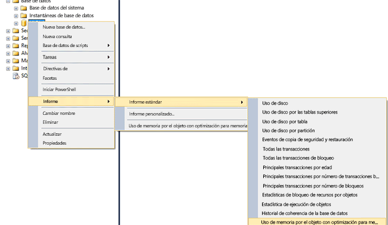
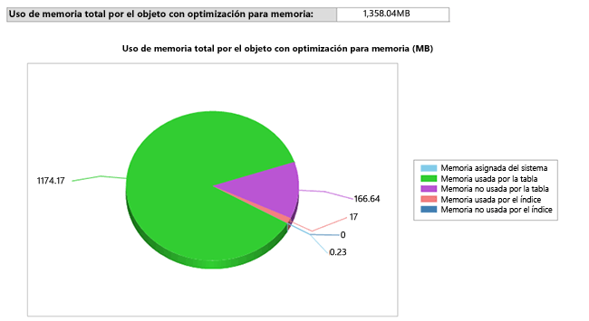

# <a name="monitor-and-troubleshoot-memory-usage"></a>Supervisar y solucionar problemas de uso de memoria
[!INCLUDE [SQL Server Azure SQL Database](../../includes/applies-to-version/sql-asdb.md)]
  [!INCLUDE[hek_1](../../includes/hek-1-md.md)] consume memoria en patrones distintos que las tablas basadas en disco. Puede supervisar la cantidad de memoria asignada y usada por las tablas e índices optimizados para memoria en la base de datos mediante las DMV o los contadores de rendimiento suministrados para la memoria y el subsistema de recolección de elementos no utilizados.  Esto le ofrece visibilidad en los niveles de sistema y de base de datos, y permite evitar problemas debidos al agotamiento de la memoria.  
  
 En este tema se trata la supervisión del uso de memoria de [!INCLUDE[hek_2](../../includes/hek-2-md.md)] .  
  
## <a name="sections-in-this-topic"></a>Secciones de este tema  
  
-   [Crear una base de datos de ejemplo con tablas optimizadas para memoria](../../relational-databases/in-memory-oltp/monitor-and-troubleshoot-memory-usage.md#bkmk_CreateDB)  
  
-   [Supervisar el uso de la memoria](../../relational-databases/in-memory-oltp/monitor-and-troubleshoot-memory-usage.md#bkmk_Monitoring)  
  
    -   [Usar SQL Server Management Studio](../../relational-databases/in-memory-oltp/monitor-and-troubleshoot-memory-usage.md#bkmk_UsingSSMS)  
  
    -   [Usar DMVs](../../relational-databases/in-memory-oltp/monitor-and-troubleshoot-memory-usage.md#bkmk_UsingDMVs)  
  
-   [Administrar la memoria utilizada por los objetos optimizados para memoria](../../relational-databases/in-memory-oltp/monitor-and-troubleshoot-memory-usage.md#bkmk_MemOptObjects)  
  
-   [Solucionar problemas de memoria](../../relational-databases/in-memory-oltp/monitor-and-troubleshoot-memory-usage.md#bkmk_Troubleshooting)  
  
##  <a name="create-a-sample-database-with-memory-optimized-tables"></a><a name="bkmk_CreateDB"></a> Crear una base de datos de ejemplo con tablas optimizadas para memoria  
 Puede omitir esta sección si ya tiene una base de datos con tablas optimizadas para memoria.  
  
 En los pasos siguientes se crea una base de datos con tres tablas optimizadas para memoria que puede usar en el resto de este tema. En el ejemplo, asignamos la base de datos a un grupo de recursos de servidor de modo que pueda controlar cuánta memoria pueden utilizar las tablas optimizadas para memoria.  
  
1.  Inicie [!INCLUDE[ssManStudioFull](../../includes/ssmanstudiofull-md.md)].  
  
2.  Haga clic en **Nueva consulta**.  
  
3.  Pegue este código en la nueva ventana de consulta y ejecute todas las secciones.  

    ```  
    -- create a database to be used  
    CREATE DATABASE IMOLTP_DB  
    GO  
  
    ALTER DATABASE IMOLTP_DB ADD FILEGROUP IMOLTP_DB_xtp_fg CONTAINS MEMORY_OPTIMIZED_DATA  
    ALTER DATABASE IMOLTP_DB ADD FILE( NAME = 'IMOLTP_DB_xtp' , FILENAME = 'C:\Data\IMOLTP_DB_xtp') TO FILEGROUP IMOLTP_DB_xtp_fg;  
    GO  
  
    USE IMOLTP_DB  
    GO  
  
    -- create the resoure pool  
    CREATE RESOURCE POOL PoolIMOLTP WITH (MAX_MEMORY_PERCENT = 60);  
    ALTER RESOURCE GOVERNOR RECONFIGURE;  
    GO  
  
    -- bind the database to a resource pool  
    EXEC sp_xtp_bind_db_resource_pool 'IMOLTP_DB', 'PoolIMOLTP'  
  
    -- you can query the binding using the catalog view as described here  
    SELECT d.database_id  
         , d.name  
         , d.resource_pool_id  
    FROM sys.databases d  
    GO  
  
    -- take database offline/online to finalize the binding to the resource pool  
    USE master  
    GO  
  
    ALTER DATABASE IMOLTP_DB SET OFFLINE  
    GO  
    ALTER DATABASE IMOLTP_DB SET ONLINE  
    GO  
  
    -- create some tables  
    USE IMOLTP_DB  
    GO  
  
    -- create table t1  
    CREATE TABLE dbo.t1 (  
           c1 int NOT NULL CONSTRAINT [pk_t1_c1] PRIMARY KEY NONCLUSTERED  
         , c2 char(40) NOT NULL  
         , c3 char(8000) NOT NULL  
         ) WITH (MEMORY_OPTIMIZED = ON, DURABILITY = SCHEMA_AND_DATA)  
    GO  
  
    -- load t1 150K rows  
    DECLARE @i int = 0  
    BEGIN TRAN  
    WHILE (@i <= 150000)  
       BEGIN  
          INSERT t1 VALUES (@i, 'a', replicate ('b', 8000))  
          SET @i += 1;  
       END  
    Commit  
    GO  
  
    -- Create another table, t2  
    CREATE TABLE dbo.t2 (  
           c1 int NOT NULL CONSTRAINT [pk_t2_c1] PRIMARY KEY NONCLUSTERED  
         , c2 char(40) NOT NULL  
         , c3 char(8000) NOT NULL  
         ) WITH (MEMORY_OPTIMIZED = ON, DURABILITY = SCHEMA_AND_DATA)  
    GO  
  
    -- Create another table, t3   
    CREATE TABLE dbo.t3 (  
           c1 int NOT NULL CONSTRAINT [pk_t3_c1] PRIMARY KEY NONCLUSTERED HASH (c1) WITH (BUCKET_COUNT = 1000000)  
         , c2 char(40) NOT NULL  
         , c3 char(8000) NOT NULL  
         ) WITH (MEMORY_OPTIMIZED = ON, DURABILITY = SCHEMA_AND_DATA)  
    GO  
    ```  
  
##  <a name="monitoring-memory-usage"></a><a name="bkmk_Monitoring"></a> Supervisar el uso de la memoria  
  
###  <a name="using-ssmanstudiofull"></a><a name="bkmk_UsingSSMS"></a> Usando [!INCLUDE[ssManStudioFull](../../includes/ssmanstudiofull-md.md)]  
 [!INCLUDE[ssSQL14](../../includes/sssql14-md.md)] se envía con informes estándar integrados para supervisar la memoria que han usado las tablas en memoria. Puede acceder a estos informes mediante el Explorador de objetos. También puede utilizar el explorador de objetos para supervisar la memoria utilizada por las tablas optimizadas para memoria individuales.  
  
#### <a name="consumption-at-the-database-level"></a>Consumo en el nivel de base de datos  
 Puede supervisar el uso de memoria en el nivel de base de datos como se indica a continuación.  
  
1.  Inicie [!INCLUDE[ssManStudioFull](../../includes/ssmanstudiofull-md.md)] y conéctese a un servidor.  
  
2.  En el Explorador de objetos, haga clic con el botón secundario en la base de datos en la que desee los informes.  
  
3.  En el menú contextual, seleccione **Informes** -> **Standard Informes** -> **Uso de memoria por los objetos con optimización para memoria**.  
  
   
  
 Este informe muestra el uso de memoria de la base de datos que hemos creado antes.  
  
   
  
###  <a name="using-dmvs"></a><a name="bkmk_UsingDMVs"></a> Usar DMVs  
 Hay varias DMV disponibles para supervisar la memoria utilizada por las tablas optimizadas para memoria, los índices, los objetos del sistema y las estructuras de tiempo de ejecución.  
  
#### <a name="memory-consumption-by-memory-optimized-tables-and-indexes"></a>Uso de memoria de las tablas e índices optimizados para memoria  
 Puede encontrar el uso de memoria de todas las tablas de usuario, los índices y los objetos del sistema consultando `sys.dm_db_xtp_table_memory_stats` como se muestra a continuación.  
  
```sql  
SELECT object_name(object_id) AS Name  
     , *  
   FROM sys.dm_db_xtp_table_memory_stats  
```  
  
 **Salida de ejemplo**  
  
```  
Name       object_id   memory_allocated_for_table_kb memory_used_by_table_kb memory_allocated_for_indexes_kb memory_used_by_indexes_kb  
---------- ----------- ----------------------------- ----------------------- ------------------------------- -------------------------  
t3         629577281   0                             0                       128                             0  
t1         565577053   1372928                       1200008                 7872                            1942  
t2         597577167   0                             0                       128                             0  
NULL       -6          0                             0                       2                               2  
NULL       -5          0                             0                       24                              24  
NULL       -4          0                             0                       2                               2  
NULL       -3          0                             0                       2                               2  
NULL       -2          192                           25                      16                              16  
```  
  
 Para obtener más información, vea [sys.dm_db_xtp_table_memory_stats](../../relational-databases/system-dynamic-management-views/sys-dm-db-xtp-table-memory-stats-transact-sql.md).  
  
#### <a name="memory-consumption-by-internal-system-structures"></a>Uso de memoria de las estructuras de sistema internas  
 Los objetos del sistema también usan memoria, por ejemplo, las estructuras transaccionales, los búferes de archivos delta y de datos, las estructuras de recolección de elementos no utilizados, etcétera. Puede encontrar la memoria usada para estos objetos del sistema consultando `sys.dm_xtp_system_memory_consumers` como se muestra aquí.  
  
```sql  
SELECT memory_consumer_desc  
     , allocated_bytes/1024 AS allocated_bytes_kb  
     , used_bytes/1024 AS used_bytes_kb  
     , allocation_count  
   FROM sys.dm_xtp_system_memory_consumers  
```  
  
 **Salida de ejemplo**  
  
```  
memory_consumer_ desc allocated_bytes_kb   used_bytes_kb        allocation_count  
------------------------- -------------------- -------------------- ----------------  
VARHEAP                   0                    0                    0  
VARHEAP                   384                  0                    0  
DBG_GC_OUTSTANDING_T      64                   64                   910  
ACTIVE_TX_MAP_LOOKAS      0                    0                    0  
RECOVERY_TABLE_CACHE      0                    0                    0  
RECENTLY_USED_ROWS_L      192                  192                  261  
RANGE_CURSOR_LOOKSID      0                    0                    0  
HASH_CURSOR_LOOKASID      128                  128                  455  
SAVEPOINT_LOOKASIDE       0                    0                    0  
PARTIAL_INSERT_SET_L      192                  192                  351  
CONSTRAINT_SET_LOOKA      192                  192                  646  
SAVEPOINT_SET_LOOKAS      0                    0                    0  
WRITE_SET_LOOKASIDE       192                  192                  183  
SCAN_SET_LOOKASIDE        64                   64                   31  
READ_SET_LOOKASIDE        0                    0                    0  
TRANSACTION_LOOKASID      448                  448                  156  
PGPOOL:256K               768                  768                  3  
PGPOOL: 64K               0                    0                    0  
PGPOOL:  4K               0                    0                    0  
```  
  
 Para obtener más información, vea [sys.dm_xtp_system_memory_consumers &#40;Transact-SQL&#41;](../../relational-databases/system-dynamic-management-views/sys-dm-xtp-system-memory-consumers-transact-sql.md).  
  
#### <a name="memory-consumption-at-run-time-when-accessing-memory-optimized-tables"></a>Uso de memoria en tiempo de ejecución al obtener acceso a las tablas optimizadas para memoria  
 Puede determinar la memoria utilizada por las estructuras de tiempo de ejecución, como la memoria caché de procedimientos con la consulta siguiente: ejecute esta consulta para obtener la memoria utilizada por las estructuras de tiempo de ejecución como para la caché de procedimientos. Todas las estructuras de tiempo de ejecución se etiquetan con XTP.  
  
```sql  
SELECT memory_object_address  
     , pages_in_bytes  
     , bytes_used  
     , type  
   FROM sys.dm_os_memory_objects WHERE type LIKE '%xtp%'  
```  
  
 **Salida de ejemplo**  
  
```  
memory_object_address pages_ in_bytes bytes_used type  
--------------------- ------------------- ---------- ----  
0x00000001F1EA8040    507904              NULL       MEMOBJ_XTPDB  
0x00000001F1EAA040    68337664            NULL       MEMOBJ_XTPDB  
0x00000001FD67A040    16384               NULL       MEMOBJ_XTPPROCCACHE  
0x00000001FD68C040    16384               NULL       MEMOBJ_XTPPROCPARTITIONEDHEAP  
0x00000001FD284040    16384               NULL       MEMOBJ_XTPPROCPARTITIONEDHEAP  
0x00000001FD302040    16384               NULL       MEMOBJ_XTPPROCPARTITIONEDHEAP  
0x00000001FD382040    16384               NULL       MEMOBJ_XTPPROCPARTITIONEDHEAP  
0x00000001FD402040    16384               NULL       MEMOBJ_XTPPROCPARTITIONEDHEAP  
0x00000001FD482040    16384               NULL       MEMOBJ_XTPPROCPARTITIONEDHEAP  
0x00000001FD502040    16384               NULL       MEMOBJ_XTPPROCPARTITIONEDHEAP  
0x00000001FD67E040    16384               NULL       MEMOBJ_XTPPROCPARTITIONEDHEAP  
0x00000001F813C040    8192                NULL       MEMOBJ_XTPBLOCKALLOC  
0x00000001F813E040    16842752            NULL       MEMOBJ_XTPBLOCKALLOC  
```  
  
 Para obtener más información, vea [sys.dm_os_memory_objects (Transact-SQL)](../../relational-databases/system-dynamic-management-views/sys-dm-os-memory-objects-transact-sql.md).  
  
#### <a name="memory-consumed-by-hek_2-engine-across-the-instance"></a>Memoria usada por el motor de [!INCLUDE[hek_2](../../includes/hek-2-md.md)] en la instancia  
 La memoria asignada al motor de [!INCLUDE[hek_2](../../includes/hek-2-md.md)] y a los objetos optimizados para memoria se administra de la misma forma que cualquier otro consumidor de memoria dentro de una instancia de [!INCLUDE[ssNoVersion](../../includes/ssnoversion-md.md)] . Los distribuidores de tipo MEMORYCLERK_XTP tienen en cuenta toda la memoria asignada al motor de [!INCLUDE[hek_2](../../includes/hek-2-md.md)] . Use la consulta siguiente para encontrar toda la memoria usada por el motor de [!INCLUDE[hek_2](../../includes/hek-2-md.md)] .  
  
```sql  
-- this DMV accounts for all memory used by the hek_2 engine  
SELECT type  
     , name  
     , memory_node_id  
     , pages_kb/1024 AS pages_MB   
   FROM sys.dm_os_memory_clerks WHERE type LIKE '%xtp%'  
```  
  
 En la salida de ejemplo se muestra que la memoria total asignada es un consumo de memoria del sistema de 18 MB y 1358 MB asignados al identificador de base de datos 5. Puesto que esta base de datos está asignada a un grupo de recursos de servidor dedicado, esta memoria cuenta para ese grupo de recursos de servidor.  
  
 **Salida de ejemplo**  
  
```  
type                 name       memory_node_id pages_MB  
-------------------- ---------- -------------- --------------------  
MEMORYCLERK_XTP      Default    0              18  
MEMORYCLERK_XTP      DB_ID_5    0              1358  
MEMORYCLERK_XTP      Default    64             0  
```  
  
 Para obtener más información, vea [sys.dm_os_memory_clerks (Transact-SQL)](../../relational-databases/system-dynamic-management-views/sys-dm-os-memory-clerks-transact-sql.md).  
  
##  <a name="managing-memory-consumed-by-memory-optimized-objects"></a><a name="bkmk_MemOptObjects"></a> Administrar la memoria utilizada por los objetos optimizados para memoria  
 Puede controlar la memoria total que han usado las tablas optimizadas para memoria enlazándola a un grupo de recursos con nombre como se describe en el tema [Enlazar una base de datos con tablas optimizadas para memoria a un grupo de recursos de servidor](../../relational-databases/in-memory-oltp/bind-a-database-with-memory-optimized-tables-to-a-resource-pool.md).  
  
##  <a name="troubleshooting-memory-issues"></a><a name="bkmk_Troubleshooting"></a> Solucionar problemas de memoria  
 La solución de problemas de memoria es un proceso de tres pasos:  
  
1.  Identificar la cantidad de memoria utilizada por los objetos de la base de datos o de la instancia. Puede utilizar un conjunto completo de herramientas de supervisión disponibles para las tablas optimizadas para memoria como se describe anteriormente.  Por ejemplo, las DMV `sys.dm_db_xtp_table_memory_stats` o `sys.dm_os_memory_clerks`.  
  
2.  Determinar en qué medida aumenta el consumo de memoria y cuánto espacio queda. Mediante la supervisión periódica del consumo de memoria, puede saber cuánto aumenta el uso de memoria. Por ejemplo, si ha asignado la base de datos a un grupo de recursos de servidor con nombre, puede supervisar el contador de rendimiento Memoria usada (KB) para ver cómo aumenta el uso de memoria.  
  
3.  Tome medidas para mitigar los posibles problemas de memoria. Para obtener más información, vea [Resolver problemas de memoria insuficiente](../../relational-databases/in-memory-oltp/resolve-out-of-memory-issues.md).  
  
## <a name="see-also"></a>Consulte también  
 [Enlazar una base de datos con tablas con optimización para memoria a un grupo de recursos de servidor](../../relational-databases/in-memory-oltp/bind-a-database-with-memory-optimized-tables-to-a-resource-pool.md)   
 [Cambiar MIN_MEMORY_PERCENT y MAX_MEMORY_PERCENT en un grupo existente](../../relational-databases/in-memory-oltp/bind-a-database-with-memory-optimized-tables-to-a-resource-pool.md#bkmk_ChangeAllocation)  
  
  
