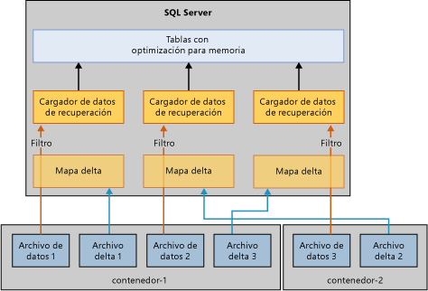

# Restaurar y recuperar tablas con optimización para memoria
[!INCLUDE[tsql-appliesto-ss2016-xxxx-xxxx-xxx_md](../../includes/tsql-appliesto-ss2016-xxxx-xxxx-xxx-md.md)]

  El mecanismo básico para recuperar o restaurar una base de datos con tablas con optimización para memoria es similar al de las bases de datos con solo tablas basadas en disco. Pero a diferencia de las tablas basadas en disco, las tablas con optimización para memoria deben cargarse en memoria antes de que la base de datos esté disponible para el acceso de usuario. Esto agrega un nuevo paso en la recuperación de la base de datos.  
  
 Durante las operaciones de restauración o recuperación, el motor OLTP en memoria lee los archivos delta y de datos para cargarlos en la memoria física. El tiempo de carga está determinado por:  
  
-   Cantidad de datos que se van a cargar.  
  
-   Ancho de banda secuencial de E/S.  
  
-   Grado de paralelismo, determinado por el número de contenedores de archivos y de núcleos del procesador.  
  
-   La cantidad de entradas de registro en la parte activa del registro que tienen que rehacerse.  
  
 Cuando se reinicia [!INCLUDE[ssNoVersion](../../includes/ssnoversion-md.md)] , cada base de datos pasa por una fase de recuperación que consta de las tres fases siguientes:  
  
1.  La fase de análisis. Durante esta fase, se realiza un paso en los registros de transacciones activos para detectar las transacciones confirmadas y no confirmadas. El motor de OLTP en memoria identifica el punto de comprobación que se va a cargar y carga previamente sus entradas de registro de la tabla del sistema. También procesará algunas entradas del registro de asignación de archivos.  
  
2.  La fase de rehacer. Esta fase se ejecuta simultáneamente en tablas basadas en disco y en tablas con optimización para memoria.  
  
     Para las tablas basadas en disco, la base de datos se mueve al punto actual en el tiempo y adquiere los bloqueos obtenidos por las transacciones no confirmadas.  
  
     Para las tablas con optimización para memoria, los datos de los pares de archivos delta y de datos se cargan en memoria y luego se actualizan los datos con el registro de transacciones activo en función del último punto de comprobación durable.  
  
     Cuando las operaciones anteriores en las tablas con optimización para memoria y las basadas en disco se completan, la base de datos está disponible para su acceso.  
  
3.  La fase de deshacer. En esta fase, las transacciones no confirmadas se revierten.  
  
 Cargar en memoria las tablas con optimización para memoria puede afectar el rendimiento del objetivo de tiempo de recuperación (RTO). Para mejorar el tiempo de carga de los datos con optimización para memoria de los archivos delta y de datos, el motor de OLTP en memoria carga los archivos delta y de datos en paralelo como se indica a continuación:  
  
-   Crear un filtro de mapas de delta. Los archivos delta almacenan las referencias a las filas eliminadas. Un subproceso por contenedor lee los archivos delta y crea un filtro de mapas de delta. (Un grupo de archivos de datos con optimización para memoria puede tener uno o varios contenedores).  
  
-   Transmitir los archivos de datos.  Una vez creado el filtro de mapas de delta, se leen los archivos de datos utilizando tantos subprocesos como CPU lógicas haya. Cada subproceso que lee el archivo de datos lee las filas de datos, comprueba el mapa de delta asociado e inserta únicamente la fila en la tabla si esta fila no se ha marcado como eliminada. Esta parte de la recuperación puede estar limitada por la CPU en algunos casos como se indica a continuación.  
  
   
  
 Las tablas con optimización para memoria se pueden cargar normalmente en memoria a la velocidad de E/S pero hay casos que al cargar las filas de datos en memoria será más lento. Los casos específicos son:  
  
-   Un número bajo de depósitos para el índice de hash puede llevar a una colisión excesiva con lo que la inserción de filas de datos será más lenta. Esto produce normalmente un uso de CPU muy elevado en su totalidad, sobre todo al final de la recuperación. Si ha configurado el índice de hash correctamente, no debería afectar el tiempo de recuperación.  
  
-   En tablas de gran tamaño con optimización para memoria y con uno o varios índices no clúster (a diferencia de un índice de hash, cuyo número de depósitos se establece en el momento de la creación), los índices no clúster aumentan dinámicamente, lo que da lugar a un uso elevado de la CPU.  
  
## Vea también  
 [Hacer copia de seguridad, restaurar y recuperar tablas con optimización para memoria](http://msdn.microsoft.com/library/3f083347-0fbb-4b19-a6fb-1818d545e281)  
  
  
