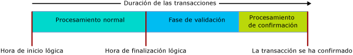

# <a name="transactions-with-memory-optimized-tables"></a>Transactions with Memory-Optimized Tables
[!INCLUDE[tsql-appliesto-ss2016-asdb-xxxx-xxx_md](../../includes/tsql-appliesto-ss2016-asdb-xxxx-xxx-md.md)]

  
En este artículo se describen todos los aspectos de las transacciones específicos de las tablas con optimización para memoria y los procedimientos almacenados compilados de forma nativa.  
  
Los niveles de aislamiento de transacción en SQL Server se aplican de manera diferente en las tablas con optimización para memoria y en las tablas basadas en disco, y los mecanismos subyacentes son diferentes. Entender las diferencias ayuda al programador a diseñar un sistema de alto rendimiento. El objetivo común en todos los casos es garantizar la integridad de las transacciones.  

Para ver condiciones de error específicas de las transacciones en tablas con optimización para memoria, vaya a la sección [Detección de conflictos y lógica de reintento](#confdetretry34ni).
  
Para obtener información general, consulte [SET TRANSACTION ISOLATION LEVEL (Transact-SQL)](../../t-sql/statements/set-transaction-isolation-level-transact-sql.md).  
  
  
<a name="pessvoptim22ni"/>  
  
## <a name="pessimistic-versus-optimistic"></a>Pesimista frente a optimista  
  
Las diferencias funcionales se deben a las diferencias entre un enfoque pesimista y un enfoque optimista de la integridad de las transacciones. Las tablas con optimización para memoria usan el enfoque optimista:  
  
- El enfoque pesimista usa bloqueos para bloquear los conflictos potenciales antes de que se produzcan. Así, un bloqueo tiene lugar cuando la instrucción se ejecuta y se libera cuando la transacción se confirma.  
  
- En cuanto al enfoque optimista, detecta los conflictos a medida que se van produciendo y realiza comprobaciones de validación en el tiempo de confirmación.  
  - El error 1205, un interbloqueo, no puede producirse en una tabla con optimización para memoria.  
  
El enfoque optimista está menos sobrecargado y normalmente es más eficaz, en parte porque los conflictos de transacciones no son comunes en la mayoría de las aplicaciones. La principal diferencia funcional entre los enfoques pesimista y optimista es que, si se produce un conflicto, en el enfoque pesimista hay que esperar, mientras que en el enfoque optimista se genera un error en una de las transacciones de modo que el cliente debe reintentarla. Las diferencias funcionales son mayores cuando el nivel de aislamiento REPEATABLE READ está en vigor, y lo son todavía más para el nivel SERIALIZABLE.  
  
<a name="txninitmodes24ni"/>  
  
## <a name="transaction-initiation-modes"></a>Modos de inicio de transacciones  
  
SQL Server tiene los siguientes modos de inicio de transacciones:  
  
- **Confirmación automática:** el inicio de una sencilla consulta o instrucción DML abre implícitamente una transacción y el final de la instrucción confirma implícitamente la transacción. **Confirmación automática** es el valor predeterminado.  
  - Normalmente, en el modo de confirmación automática, no necesita codificar en la cláusula FROM una sugerencia de tabla sobre el nivel de aislamiento de transacción en la tabla con optimización para memoria.  
  
- **Explícito** : la transacción Transact-SQL contiene el código BEGIN TRANSACTION, junto con una instrucción COMMIT TRANSACTION eventual. Pueden unificarse dos o más instrucciones en la misma transacción.  
  - En el modo explícito, es necesario usar la opción de base de datos MEMORY_OPTIMIZED_ELEVATE_TO_SNAPSHOT o bien codificar en la cláusula FROM una sugerencia de tabla sobre el nivel de aislamiento de transacción en la tabla con optimización para memoria.  
  
- **Implícito** : cuando la instrucción SET IMPLICIT_TRANSACTION ON está en vigor. Quizás IMPLICIT_BEGIN_TRANSACTION habría sido un nombre mejor, ya que todo lo que hace esta opción es realizar implícitamente el equivalente de una instrucción BEGIN TRANSACTION explícita antes de cada instrucción UPDATE si 0 = @@trancount.  Por lo tanto, depende del código T-SQL que se emita finalmente una instrucción COMMIT TRANSACTION explícita.   
  
- **ATOMIC BLOCK**: todas las instrucciones de los bloques ATOMIC siempre se ejecutan como parte de una única transacción. Las acciones del bloque ATOMIC se confirman de forma conjunta en caso de éxito, o bien todas se revierten cuando se produce un error. Cada procedimiento almacenado compilado de forma nativa requiere un bloque ATOMIC.  
  
<a name="codeexamexpmode25ni"/>  
  
### <a name="code-example-with-explicit-mode"></a>Ejemplo de código con el modo explícito  
  
El siguiente script de Transact-SQL interpretado usa:  
  
- Una transacción explícita.
- Una tabla con optimización para memoria, denominada dbo.Order_mo.
- El contexto del nivel de aislamiento de transacción READ COMMITTED.  
  
Por lo tanto, es necesario tener una sugerencia de tabla en la tabla con optimización para memoria. La sugerencia debe ser para SNAPSHOT o para un nivel de aislamiento incluso mayor. En el caso del ejemplo de código, la sugerencia es WITH (SNAPSHOT). Si se quita esta sugerencia, el script sufrirá un error 41368, para el que no sería apropiado un reintento automático:  

#### <a name="error-41368"></a>Error 41368

El acceso a las tablas optimizadas en memoria con el nivel de aislamiento READ COMMITTED se admite solo para las transacciones de confirmación automática. No se admite para las transacciones explícitas o implícitas. Proporcione un nivel de aislamiento admitido para la tabla con optimización para memoria mediante una sugerencia de tabla, como WITH (SNAPSHOT).

```sql
SET TRANSACTION ISOLATION LEVEL READ COMMITTED;  
GO  

BEGIN TRANSACTION;  -- Explicit transaction.  

-- Order_mo  is a memory-optimized table.  
SELECT * FROM  
           dbo.Order_mo  as o  WITH (SNAPSHOT)  -- Table hint.  
      JOIN dbo.Customer  as c  on c.CustomerId = o.CustomerId;  
     
COMMIT TRANSACTION;
```
  
Se puede prescindir de la sugerencia `WITH (SNAPSHOT)` si se usa la opción de base de datos `MEMORY_OPTIMIZED_ELEVATE_TO_SNAPSHOT`. Cuando esta opción se establece en `ON`, el acceso a una tabla con optimización para memoria en un nivel inferior se eleva automáticamente al aislamiento SNAPSHOT.  

```sql
ALTER DATABASE CURRENT
    SET MEMORY_OPTIMIZED_ELEVATE_TO_SNAPSHOT = ON;
```

<a name="rowver28ni"/>  
  
## <a name="row-versioning"></a>Versiones de fila  
  
Las tablas con optimización para memoria usan un sistema de versiones de fila muy sofisticado que hace que el enfoque optimista sea eficaz, incluso en el nivel de aislamiento SERIALIZABLE más estricto. Para obtener más información, consulte [Introducción a las tablas con optimización para memoria](../../relational-databases/in-memory-oltp/introduction-to-memory-optimized-tables.md).  
  
Las tablas basadas en disco tienen indirectamente un sistema básico de versiones de fila cuando el nivel de aislamiento READ_COMMITTED_SNAPSHOT o SNAPSHOT está en vigor. Este sistema se basa en tempdb, mientras que las estructuras de datos optimizados para memoria tienen integradas las versiones de fila para lograr la máxima eficiencia.  
  
<a name="confdegreeiso30ni"/>  
  
## <a name="isolation-levels"></a>Niveles de aislamiento 
  
En la tabla siguiente se muestran los posibles niveles de aislamiento de transacción, ordenados de menor a mayor aislamiento. Para obtener más información sobre los conflictos que se pueden producir y la lógica de reintento para abordarlos, vea [Detección de conflictos y lógica de reintento](#confdetretry34ni). 
  
| Nivel de aislamiento | Descripción |   
| :-- | :-- |   
| READ UNCOMMITTED | No disponible: no se puede tener acceso a las tablas con optimización para memoria con un aislamiento READ UNCOMMITTED. Sí se puede tener acceso a estas tablas en el aislamiento SNAPSHOT cuando el nivel de sesión TRANSACTION ISOLATION LEVEL está establecido en READ UNCOMMITTED, cuando se usa la sugerencia de tabla WITH (SNAPSHOT) o cuando la opción de base de datos MEMORY_OPTIMIZED_ELEVATE_TO_SNAPSHOT está establecida en ON. | 
| READ COMMITTED | Solo se admite para tablas con optimización para memoria cuando el modo de confirmación automática está en vigor. Sí se puede tener acceso a estas tablas en el aislamiento SNAPSHOT cuando el nivel de sesión TRANSACTION ISOLATION LEVEL está establecido en READ COMMITTED, cuando se usa la sugerencia de tabla WITH (SNAPSHOT) o cuando la opción de base de datos MEMORY_OPTIMIZED_ELEVATE_TO_SNAPSHOT está establecida en ON.<br/><br/>Si la opción de base de datos READ_COMMITTED_SNAPSHOT está establecida en ON, no se podrá acceder a una tabla optimizada para memoria y a una tabla basada en disco en el aislamiento READ COMMITTED en la misma instrucción. |  
| SNAPSHOT | Se admite para las tablas con optimización para memoria. <br/><br/> Internamente, SNAPSHOT es el nivel de aislamiento de transacción menos exigente para las tablas con optimización para memoria. <br/><br/> SNAPSHOT usa menos recursos de sistema que REPEATABLE READ o SERIALIZABLE. |  
| REPEATABLE READ | Se admite para las tablas con optimización para memoria. La garantía que reporta el aislamiento REPEATABLE READ consiste en que, en el tiempo de confirmación, ninguna transacción simultánea ha actualizado ninguna fila leída por esta transacción. <br/><br/> Debido al modelo optimista, no se impide a las transacciones simultáneas actualizar las filas leídas por esta transacción. En su lugar, esta transacción valida en el tiempo de confirmación si el aislamiento REPEATABLE READ no se ha infringido. Si se ha infringido, esta transacción se revierte y hay que reintentarla. | 
| SERIALIZABLE | Se admite para las tablas con optimización para memoria. <br/><br/> Se denomina *Serializable* porque el aislamiento es tan estricto que se trata prácticamente de transacciones ejecutándose en serie, más que de forma simultánea. | 


<a name="txnphaslife32ni"/>  
  
## <a name="transaction-phases-and-lifetime"></a>Duración y fases de la transacción  
  
Cuando está implicada una tabla optimizada para memoria, la duración de una transacción progresa a través de las fases, tal como se muestra en la siguiente imagen:
  
  
  
A continuación se muestran las descripciones de las fases.  
  
#### <a name="regular-processing-phase-1-of-3"></a>Procesamiento normal: fase 1 (de 3)  
  
- Esta fase se compone de la ejecución de todas las consultas y las instrucciones DML en la consulta.  
- Durante esta fase, las instrucciones consultan la versión de las tablas con optimización para memoria en el momento de inicio lógico de la transacción.  
  
#### <a name="validation-phase-2-of-3"></a>Validación: fase 2 (de 3)  
  
- La fase de validación arranca con la asignación de la hora de finalización, esto es, marcando la transacción como completa lógicamente. Tras la finalización de este paso, todos los cambios de la transacción quedan visibles para las demás transacciones, que crearán una dependencia de esta transacción. Las transacciones dependientes no se pueden confirmar hasta no haber confirmado correctamente esta transacción. Además, las transacciones que conservan estas dependencias no pueden devolver conjuntos de resultados al cliente para procurar que el cliente solamente vea los datos confirmados correctamente en la base de datos.  
- Esta fase incluye la validación de lectura repetible y la validación serializable. En la primera, comprueba si alguna de las filas leídas por la transacción se ha actualizado desde la última vez que se comprobó, mientras que, en el caso de la segunda, comprueba si alguna de las filas se ha insertado en un rango de datos analizado por esta transacción. Según la tabla de [Niveles de aislamiento y conflictos](#confdegreeiso30ni), la validación de lectura repetible y la validación serializable pueden ocurrir cuando se usa el aislamiento SNAPSHOT para validar la coherencia de las restricciones de clave única y externa.  
  
#### <a name="commit-processing-phase-3-of-3"></a>Procesamiento de confirmación: fase 3 (de 3)  
  
- Durante la fase de confirmación, los cambios en las tablas durables se escriben en el registro y el registro se escribe en disco. Después, el control se devuelve al cliente.  
- Una vez completado el proceso de confirmación, se notificará a todas las transacciones dependientes que pueden confirmarse.  
  
Como siempre, debe intentar mantener las unidades de trabajo transaccionales en un nivel tan mínimo y breve como sea válido para las necesidades de los datos.  
  
<a name="confdetretry34ni"/>  
  
## <a name="conflict-detection-and-retry-logic"></a>Detección de conflictos y lógica de reintento 

Hay dos tipos de condiciones de error relacionadas con una transacción que hacen que esta genere un error y se revierta. En la mayoría de los casos, cuando este error se produce hay que reintentar la transacción, al igual que cuando se produce un interbloqueo.
- Conflictos entre transacciones simultáneas. Se trata de conflictos de actualización y errores de validación y pueden deberse a infracciones de nivel de aislamiento o de restricción de la transacción.
- Errores de dependencia. Estos errores se deben a que las transacciones de las que se depende no se pueden confirmar o a que el número de dependencias ha aumentado de forma desmesurada.

A continuación, se indican las condiciones de error que pueden provocar errores en las transacciones cuando acceden a tablas optimizadas para memoria.

| Código de error | Descripción | Causa |
| :-- | :-- | :-- |
| **41302** | Ha intentado actualizar una fila que se ha actualizado en una transacción diferente desde el inicio de la transacción actual. | Esta condición de error se produce si dos transacciones simultáneas intentan actualizar o eliminar la misma fila al mismo tiempo. Una de las dos transacciones recibe este mensaje de error y será necesario reintentarla. <br/><br/>  | 
| **41305**| Error de validación de lectura repetible La lectura de una fila de una tabla con optimización para memoria por parte de esta transacción se ha actualizado por otra transacción que se ha confirmado antes que esta transacción. | Este error puede producirse al usar los aislamientos REPEATABLE READ o SERIALIZABLE y, también, si las acciones de una transacción simultánea suponen una infracción de una restricción FOREIGN KEY. <br/><br/>Esa infracción simultánea de restricciones de clave externa es muy poco habitual y normalmente es indicativa de un problema con la lógica de aplicación o con la entrada de datos. Pero el error también puede producirse si no hay ningún índice en las columnas relacionadas con la restricción FOREIGN KEY. Por lo tanto, lo más conveniente es crear siempre un índice de las columnas de clave externa en una tabla con optimización para memoria. <br/><br/> Para ver consideraciones más exhaustivas sobre los errores de validación provocados por las infracciones de clave externas, vea [este blog](https://blogs.msdn.microsoft.com/sqlcat/2016/03/24/considerations-around-validation-errors-41305-and-41325-on-memory-optimized-tables-with-foreign-keys/) elaborado por el equipo de asesoramiento al cliente de SQL Server. |  
| **41325** | Error de validación serializable. Se ha insertado una fila nueva en un rango que la transacción actual ha examinado anteriormente. Esto se llama una fila fantasma. | Este error puede producirse al usar el aislamiento SERIALIZABLE y, también, si las acciones de una transacción simultánea suponen una infracción de una restricción PRIMARY KEY, UNIQUE o FOREIGN KEY. <br/><br/> Esa infracción de restricción simultánea es muy poco habitual y normalmente es indicativa de un problema con la lógica de aplicación o con la entrada de datos. Pero, de forma similar a los errores de validación de lectura repetible, este error también se puede producir si existe una restricción FOREIGN KEY sin ningún índice en las columnas implicadas. |  
| **41301** | Error de dependencia: existe una dependencia con otra transacción que no se ha podido confirmar posteriormente. | Esta transacción (Tx1) ha creado una dependencia con otra transacción (Tx2) leyendo los datos escritos por dicha transacción Tx2 mientras esta se encontraba en su fase de procesamiento de confirmación o de validación. En consecuencia, Tx2 no se pudo confirmar posteriormente. Las causas más comunes para que Tx2 no se pueda confirmar son errores de validación de lectura repetible (41305) y serializables (41325). Una menos habitual son los errores de E/S de registro. |
| **41839** | La transacción supera el número máximo de dependencias de confirmación. | Existe un límite en cuanto al número de transacciones de las que una transacción determinada (Tx1) puede depender. Se trata de las dependencias salientes. De igual modo, existe un límite en cuanto al número de transacciones que pueden depender de una transacción determinada (Tx1). Se trata de las dependencias entrantes. El límite en ambos casos es 8. <br/><br/> El caso más común de este error tiene lugar cuando existe un gran número de transacciones de lectura que están teniendo acceso a los datos escritos por una sola transacción de escritura. La probabilidad de que se produzca esta situación aumenta si las transacciones de lectura examinan los mismos datos de forma extensiva y, por tanto, el procesamiento de validación o de confirmación de la transacción de escritura tarda mucho tiempo en completarse. Así, por ejemplo, cuando la transacción de escritura realiza exploraciones grandes en el aislamiento SERIALIZABLE (se prolonga la fase de validación) o cuando el registro de transacciones se coloca en un dispositivo de E/S de registro lento (se prolonga el procesamiento de confirmación). Si las transacciones de lectura están examinando grandes cantidades de datos cuando se espera que solo tengan acceso a unas pocas filas, podría ser un indicio de que falta un índice. De forma similar, si la transacción de escritura usa el aislamiento SERIALIZABLE y examina grandes cantidades de datos cuando se espera que solo tenga acceso a unas pocas filas, esto también podría denotar una falta de índice. <br/><br/> El límite del número de dependencias de confirmación se puede incrementar con la marca de seguimiento **9926**. Use esta marca de seguimiento única y exclusivamente si esta condición de error se sigue produciendo después de confirmar que no falta ningún índice, ya que podrían enmascarar estos problemas en las situaciones anteriores. Otro aspecto con el que hay que tener cuidado es que los gráficos de dependencias complejos (donde cada transacción tiene un gran número de dependencias tanto entrantes como salientes y las transacciones individuales poseen muchos niveles de dependencias) pueden reducir la eficacia del sistema.  |
 
  
### <a name="retry-logic"></a>Lógica de reintento 

Cuando una transacción da error debido a alguna de las condiciones mencionadas anteriormente, hay que reintentarla.
  
La lógica de reintento se puede implementar en el lado tanto cliente como servidor. La recomendación general es implementar la lógica de reintento en el lado cliente, ya que es más eficaz y permite trabajar con los conjuntos de resultados devueltos por la transacción antes de que el error se produzca.  
  
<a name="retrytsqlcodeexam35ni"/>  
  
#### <a name="retry-t-sql-code-example"></a>Ejemplo de reintento con código T-SQL  
  
La lógica de reintento del lado servidor con T-SQL solo debe usarse para las transacciones que no devuelven conjuntos de resultados al cliente. En caso contrario, los reintentos pueden generar más conjuntos de resultados de los que se prevé que se devuelvan al cliente.  
  
El siguiente script de T-SQL interpretado muestra qué lógica de reintento puede verse para los errores asociados con los conflictos de transacción que implican tablas con optimización para memoria.

```sql
-- Retry logic, in Transact-SQL.
DROP PROCEDURE If Exists usp_update_salesorder_dates;
GO

CREATE PROCEDURE usp_update_salesorder_dates
AS
BEGIN
    DECLARE @retry INT = 10;

    WHILE (@retry > 0)
    BEGIN
        BEGIN TRY
            BEGIN TRANSACTION;

            UPDATE dbo.SalesOrder_mo WITH (SNAPSHOT)
                set OrderDate = GetUtcDate()
                where CustomerId = 42;

            UPDATE dbo.SalesOrder_mo WITH (SNAPSHOT)
                set OrderDate = GetUtcDate()
                where CustomerId = 43;

            COMMIT TRANSACTION;

            SET @retry = 0;  -- //Stops the loop.
        END TRY

        BEGIN CATCH
            SET @retry -= 1;

            IF (@retry > 0 AND
                ERROR_NUMBER() in (41302, 41305, 41325, 41301, 41839, 1205)
                )
            BEGIN
                IF XACT_STATE() = -1
                    ROLLBACK TRANSACTION;

                WAITFOR DELAY '00:00:00.001';
            END
            ELSE
            BEGIN
                PRINT 'Suffered an error for which Retry is inappropriate.';
                THROW;
            END
        END CATCH

    END -- //While loop
END;
GO

--  EXECUTE usp_update_salesorder_dates;
```


<a name="crossconttxn38ni"/>  
  
## <a name="cross-container-transaction"></a>Transacción entre contenedores  
  
  
Una transacción se denomina una transacción entre contenedores si:  
  
- Tiene acceso a una tabla con optimización para memoria de Transact-SQL interpretado; o  
- Ejecuta un procedimiento nativo cuando una transacción ya está abierta (XACT_STATE() = 1).  
  
El término "entre contenedores" obedece al hecho de que la transacción se ejecuta en los dos contenedores de administración de transacciones, uno relativos a las tablas basadas en disco y otro a las tablas con optimización para memoria.  
  
Dentro de una única transacción entre contenedores se pueden usar distintos niveles de aislamiento para tener acceso a las tablas basadas en disco y con optimización para memoria. Esta diferencia se expresa a través de sugerencias de tabla explícitas como WITH (SERIALIZABLE) o con la opción de base de datos MEMORY_OPTIMIZED_ELEVATE_TO_SNAPSHOT, que eleva implícitamente el nivel de aislamiento de las tablas con optimización para memoria a SNAPSHOT si TRANSACTION ISOLATION LEVEL está configurado como READ COMMITTED o READ UNCOMMITTED.  
  
En el siguiente ejemplo de código de Transact-SQL:  
  
- Se tiene acceso a la tabla basada en disco Table_D1 en el nivel de aislamiento READ COMMITTED.  
- Se tiene acceso a la tabla con optimización para memoria Table_MO7 en el nivel de aislamiento SERIALIZABLE. Table_MO6 no tiene un nivel de aislamiento asociado específico, ya que las inserciones son siempre coherentes y se ejecutan en esencia en el aislamiento SERIALIZABLE.  


```sql
-- Different isolation levels for
-- disk-based tables versus memory-optimized tables,
-- within one explicit transaction.

SET TRANSACTION ISOLATION LEVEL READ COMMITTED;
go

BEGIN TRANSACTION;

    -- Table_D1 is a traditional disk-based table, accessed using READ COMMITTED isolation.

    SELECT * FROM Table_D1;


    -- Table_MO6 and Table_MO7 are memory-optimized tables.
    -- Table_MO7 is accessed using SERIALIZABLE isolation,
    --   while Table_MO6 does not have a specific isolation level.

    INSERT Table_MO6
        SELECT * FROM Table_MO7 WITH (SERIALIZABLE);

COMMIT TRANSACTION;
go
```


<a name="limitations40ni"/>  
  
## <a name="limitations"></a>Limitaciones  
  
  
- Las transacciones entre bases de datos no se admiten para las tablas con optimización para memoria. Si una transacción tiene acceso a una tabla con optimización para memoria, la transacción no puede tener acceso a cualquier otra base de datos, excepto para:  
  - Bases de datos tempdb.  
  - Acceso de solo lectura desde la base de datos maestra.  
  
- No se admiten transacciones distribuidas: cuando se usa BEGIN DISTRIBUTED TRANSACTION, la transacción no puede tener acceso a una tabla con optimización para memoria.  
  
  
<a name="natcompstorprocs42ni"/>  
  
## <a name="natively-compiled-stored-procedures"></a>Procedimientos almacenados compilados de forma nativa  
  
- En un procedimiento nativo, el bloque ATOMIC debe declarar el nivel de aislamiento de transacción para el bloque completo, como:  
  - `... BEGIN ATOMIC WITH (TRANSACTION ISOLATION LEVEL = SNAPSHOT, ...) ...`  
  
- No están permitidas las instrucciones de control de transacciones explícitas dentro del cuerpo de un procedimiento nativo. Las instrucciones BEGIN TRANSACTION y ROLLBACK TRANSACTION, entre otras, no están permitidas.  
  
- Para obtener más información sobre el control de transacciones con bloques ATOMIC, vea [Bloques atomic](atomic-blocks-in-native-procedures.md).  
  
<a name="othertxnlinks44ni"/>  
  
## <a name="other-transaction-links"></a>Otros vínculos de transacción  
  
- [SET IMPLICIT_TRANSACTIONS](../../t-sql/statements/set-implicit-transactions-transact-sql.md)  
  
- [sp_getapplock (Transact-SQL)](../../relational-databases/system-stored-procedures/sp-getapplock-transact-sql.md)  
  
- [Niveles de aislamiento basado en versiones de fila del motor de base de datos](http://msdn.microsoft.com/library/ms177404.aspx)  
  
- [Controlar la durabilidad de las transacciones](../../relational-databases/logs/control-transaction-durability.md)   

