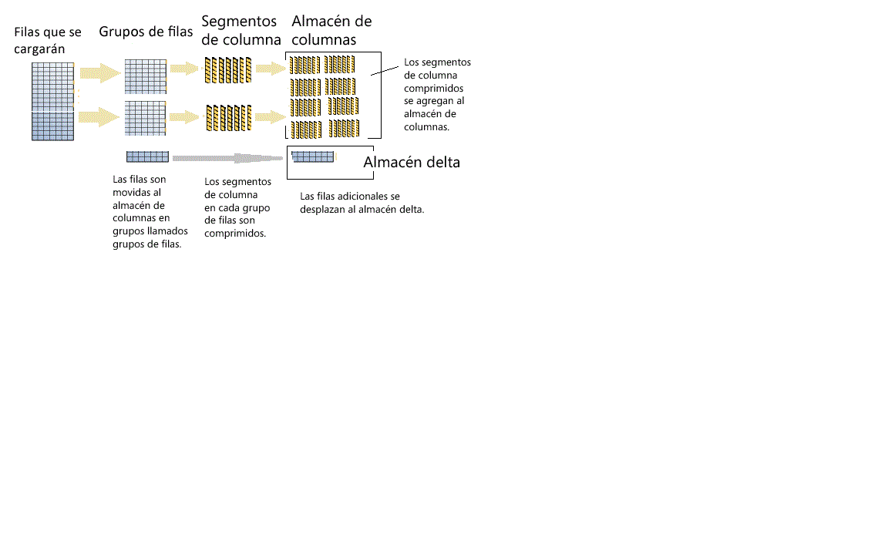

# <a name="columnstore-indexes---data-loading-guidance"></a>Índices de almacén de columnas: Guía de carga de datos
[!INCLUDE[appliesto-ss-asdb-asdw-pdw-md](../../includes/appliesto-ss-asdb-asdw-pdw-md.md)]

En este artículo se describen las opciones y las recomendaciones para cargar datos en un índice de almacén de columnas mediante los métodos de inserción gradual y carga masiva SQL estándar. La carga de datos en un índice de almacén de columnas es una parte esencial de cualquier proceso de almacenamiento de datos, ya que mueve la información al índice que se está preparando para el análisis.
  
 ¿Es la primera vez que utiliza índices de almacén de columnas? Vea [Introducción a los índices de almacén de columnas](../../relational-databases/indexes/columnstore-indexes-overview.md) y [Arquitectura de los índices de almacén de columnas](../../relational-databases/sql-server-index-design-guide.md#columnstore_index).
  
## <a name="what-is-bulk-loading"></a>¿Qué es la carga masiva?
Con "*carga masiva*" nos referimos a la forma en que se agregan grandes cantidades de filas a un almacén de datos. Se trata de la forma más eficaz para mover datos a un índice de almacén de columnas, ya que funciona en lotes de filas. La carga masiva llena los grupos de filas hasta su capacidad máxima y los comprime directamente en el almacén de columnas. Solo las filas al final de una carga que no cumplan los requisitos mínimos de 102 400 filas por grupo de filas pasan al almacén delta.  

Para realizar una carga masiva, puede usar la [utilidad bcp](../../tools/bcp-utility.md), [Integration Services](../../integration-services/sql-server-integration-services.md) o seleccionar las filas de una tabla de almacenamiento provisional.

  
  
 Tal y como se recomienda en el diagrama, una carga masiva:  
  
* No ordena los datos previamente. Los datos se insertan en grupos de filas en el orden en que se reciben.
* Si el tamaño de lote es mayor o igual que 102400, las filas estarán directamente en el grupo de filas comprimido. Se recomienda elegir un tamaño de lote mayor o igual que 102 400 para que la importación en bloque se realice de forma eficaz, ya que puede evitar que se muevan las filas de datos a un grupo de filas delta antes de que las filas se terminen moviendo a grupos de filas comprimidos mediante el motor de tupla (TM), un subproceso en segundo plano.
* Si el tamaño del lote o el de las filas restantes es menor que 102 400, las filas se cargarán en grupos de filas delta.

> [!NOTE]
> En una tabla de almacén de filas con datos de índices de almacén de columnas no agrupados, [!INCLUDE[ssNoVersion](../../includes/ssnoversion-md.md)] siempre inserta los datos en la tabla base. Nunca se insertan directamente en el índice de almacén de columnas.  

La carga masiva tiene estas optimizaciones de rendimiento integradas:
-   **Cargas en paralelo**: puede hacer varias cargas masivas simultáneas (bcp o inserción masiva) y que cada una cargue un archivo de datos independiente. A diferencia de las cargas masivas del almacén de filas en [!INCLUDE[ssNoVersion](../../includes/ssnoversion-md.md)], no hay que especificar `TABLOCK`, ya que cada subproceso de importación en bloque cargará los datos solamente en grupos de filas independientes (grupos de filas delta o comprimidos) aplicando un bloqueo exclusivo. Al usar `TABLOCK`, se forzará un bloqueo exclusivo en la tabla y no podrá importar los datos en paralelo.  
-   **Registro mínimo:** una carga masiva usa un registro mínimo en los datos que pasan directamente a los grupos de filas comprimidos. Los datos que van a un grupo de filas delta se registran por completo, incluidos los tamaños de lote con menos de 102 400 filas. Sin embargo, el objetivo de la carga masiva es omitir la mayoría de los grupos de filas delta.  
-   **Optimización de bloqueo:** cuando se cargan datos en un grupo de filas comprimido, se obtiene el bloqueo X en el grupo de filas. Sin embargo, cuando la carga masiva se realiza en el grupo de filas delta, se obtiene un bloqueo X en el grupo de filas, pero [!INCLUDE[ssNoVersion](../../includes/ssnoversion-md.md)] continúa bloqueando los bloqueos de página y extensión, ya que el bloqueo de grupos de filas X no forma parte de la jerarquía de bloqueo.  
  
Si tiene un índice no agrupado de árbol B en un índice de almacén de columnas, no habrá ninguna optimización de registro ni de bloqueo para el propio índice. Sin embargo, las optimizaciones del índice agrupado de almacén de columnas seguirán estando disponibles, tal como se ha descrito anteriormente.  
  
## <a name="plan-bulk-load-sizes-to-minimize-delta-rowgroups"></a>Planeación de los tamaños de carga masiva para minimizar los grupos de filas delta
Los índices de almacén de columnas funcionan mejor cuando la mayoría de las filas se comprimen en el almacén de columnas y no se ubican en grupos de filas delta. Se recomienda cambiar el tamaño de las cargas para que las filas pasen directamente al almacén de columnas y omitan lo máximo posible el almacén delta.

En estos escenarios siguientes se describe cuándo las filas cargadas pasan directamente al almacén de columnas o cuándo van al almacén delta. En este ejemplo, cada grupo de filas puede tener de 102.400 a 1.048.576 filas. En la práctica, el tamaño máximo de un grupo de filas puede ser inferior a 1 048 576 filas cuando hay presión de memoria.  
  
|Filas que se cargarán de forma masiva|Filas agregadas al grupo de filas comprimido|Filas agregadas al grupo de filas delta|  
|-----------------------|-------------------------------------------|--------------------------------------|  
|102,000|0|102,000|  
|145,000|145,000<br /><br /> Tamaño del grupo de filas: 145.000|0|  
|1,048,577|1,048,576<br /><br /> Tamaño del grupo de filas: 1.048.576|1|  
|2,252,152|2,252,152<br /><br /> Tamaños de los grupos de filas: 1.048.576, 1.048.576, 155.000|0|  
  
 En el ejemplo siguiente se muestran los resultados de cargar 1 048 577 filas en una tabla. Los resultados muestran un grupo de filas COMPRESSED en el almacén de columnas (como segmentos de columna comprimidos) y una fila en el almacén delta.  
  
```sql  
SELECT object_id, index_id, partition_number, row_group_id, delta_store_hobt_id, 
  state state_desc, total_rows, deleted_rows, size_in_bytes   
FROM sys.dm_db_column_store_row_group_physical_stats  
```  
  
   
  
## <a name="use-a-staging-table-to-improve-performance"></a>Uso de una tabla de almacenamiento provisional para mejorar el rendimiento
Si está cargando datos solo para colocarlos en etapa antes de ejecutar más transformaciones, será mucho más rápido cargar la tabla en una tabla del montón que cargar los datos en una tabla agrupada de almacén de columnas. Además, si carga los datos en una [tabla temporal][Temporary], el proceso también será mucho más rápido que cargar una tabla en un almacenamiento permanente.  

 Un patrón común de carga de datos consiste en cargar los datos en una tabla de almacenamiento provisional, realizar alguna transformación y, después, cargarlos en la tabla de destino con el siguiente comando:  
  
```sql  
INSERT INTO <columnstore index>  
SELECT <list of columns> FROM <Staging Table>  
```  
  
 Este comando carga los datos en el índice de almacén de columnas de una forma similar a bcp o la tarea de inserción masiva, solo que en un único lote. Si el número de filas de la tabla de almacenamiento provisional es menor que 102400, las filas se cargarán en un grupo de filas delta; en caso contrario, se cargarán directamente en un grupo de filas comprimido. Antes existía una limitación importante: esta operación `INSERT` era de un solo subproceso. Para cargar los datos en paralelo, podía crear varias tablas de almacenamiento provisional o ejecutar `INSERT`/`SELECT` con intervalos no superpuestos de filas desde la tabla de almacenamiento provisional. Esta limitación desaparece en [!INCLUDE[ssSQL15](../../includes/sssql15-md.md)]. El siguiente comando carga los datos en paralelo de la tabla de almacenamiento provisional, pero tendrá que especificar `TABLOCK`.  
  
```sql  
INSERT INTO <columnstore index> WITH (TABLOCK) 
SELECT <list of columns> FROM <Staging Table>  
```  
  
 Las siguientes optimizaciones están disponibles cuando se cargan datos en índices de almacén de columnas agrupados desde tablas de almacenamiento provisional:
-   **Optimización del registro:** se registra mínimamente cuando los datos se cargan en el grupo de filas comprimido. No existe ningún registro mínimo cuando se cargan datos en el grupo de filas delta.  
-   **Optimización de bloqueo:** cuando se cargan datos en un grupo de filas comprimido, se obtiene el bloqueo X en el grupo de filas. Sin embargo, con el grupo de filas delta, se obtiene un bloqueo X en el grupo de filas, pero [!INCLUDE[ssNoVersion](../../includes/ssnoversion-md.md)] continúa bloqueando los bloqueos de página y extensión, ya que el bloqueo de grupos de filas X no forma parte de la jerarquía de bloqueo.  
  
 Si tiene uno o varios índices no agrupados, no habrá ninguna optimización de registro o bloqueo para el propio índice; sin embargo, las optimizaciones en el índice de almacén de columnas agrupado siguen estando disponibles, tal y como se describió anteriormente.  
  
## <a name="what-is-trickle-insert"></a>¿Qué es la inserción gradual?

Con "*inserción gradual*" nos referimos a la forma de mover filas individuales al índice de almacén de columnas. Esta característica usa la instrucción [INSERT INTO](../../t-sql/statements/insert-transact-sql.md). Gracias a la inserción gradual, todas las filas pasan al almacén delta. Es útil para un número reducido de filas, pero no es práctico para cargas de gran tamaño.
  
```sql  
INSERT INTO <table-name> VALUES (<set of values>)  
```  
  
 > [!NOTE]
 > Los subprocesos simultáneos que usan INSERT INTO para insertar valores en un índice de almacén de columnas agrupado pueden insertar filas en el mismo grupo de filas de almacén delta.  
  
 Una vez que el grupo de filas contiene 1 048 576 filas, el grupo de filas delta se marca como cerrado, pero sigue estando disponible para las consultas y las operaciones de actualización o eliminación. No obstante, las filas recién insertadas se pasan a un grupo de filas de almacén delta existente o recién creado. Hay un subproceso en segundo plano, el *motor de tupla (TM)* , que comprime los grupos de filas delta cerrados cada 5 minutos aproximadamente. Puede invocar expresamente el siguiente comando para comprimir el grupo de filas delta cerrado.  
  
```sql  
ALTER INDEX <index-name> on <table-name> REORGANIZE  
```  
  
 Si desea forzar el cierre o la compresión de un grupo de filas delta, ejecute el siguiente comando. Se recomienda ejecutar este comando si ha terminado de cargar las filas y no espera insertar nuevas filas. Al cerrar y comprimir expresamente el grupo de filas delta, puede ahorrar más espacio de almacenamiento y mejorar el rendimiento de las consultas de análisis. Sugerimos invocar este comando si no espera insertar nuevas filas.  
  
```sql  
ALTER INDEX <index-name> on <table-name> REORGANIZE with (COMPRESS_ALL_ROW_GROUPS = ON)  
```  
  
## <a name="how-loading-into-a-partitioned-table-works"></a>Funcionamiento de la carga en una tabla con particiones  
 Para los datos con particiones, [!INCLUDE[ssNoVersion](../../includes/ssnoversion-md.md)] primero asigna cada fila a una partición y después realiza operaciones del almacén de columnas con los datos de la partición. Cada partición tiene sus propios grupos de filas y, al menos, un grupo de filas delta.  
  
 ## <a name="next-steps"></a>Pasos siguientes
 Para obtener más información sobre la carga, consulte esta [entrada de blog](http://blogs.msdn.com/b/sqlcat/archive/2015/03/11/data-loading-performance-considerations-on-tables-with-clustered-columnstore-index.aspx).  
