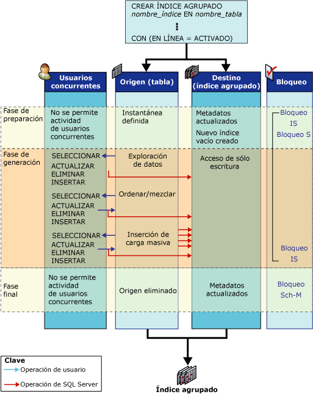

# Cómo funcionan las operaciones de índice en línea
[!INCLUDE[tsql-appliesto-ss2016-asdb-xxxx-xxx_md](../../includes/tsql-appliesto-ss2016-asdb-xxxx-xxx-md.md)]

  En este tema se definen las estructuras que existen durante una operación de índice en línea y se muestran las actividades asociadas a ellas.  
  
## Estructuras de índice en línea  
 Para que se puedan llevar a cabo actividades de usuario simultáneas durante una operación de lenguaje de definición de datos (DDL) de índice, se usan las siguientes estructuras en la operación de índice en línea: índices preexistentes y de origen, destino y, para volver a compilar un montón o quitar un índice en línea clúster, un índice de asignación temporal.  
  
-   **Origen e índices preexistentes**  
  
     El origen es la tabla original o los datos del índice clúster. Los índices preexistentes son los índices no clúster asociados con la estructura de origen. Por ejemplo, si la operación de índice en línea regenera un índice clúster que dispone de cuatro índices no clúster asociados, el origen es el índice clúster existente y los índices preexistentes son los índices no clúster.  
  
     Los índices preexistentes están disponibles para que los usuarios simultáneos realicen operaciones de selección, inserción, actualización y eliminación. Entre dichas operaciones se incluyen las inserciones masivas (que se admiten pero no se recomiendan) y las actualizaciones implícitas realizadas mediante desencadenadores y restricciones de integridad referencial. Los índices preexistentes están disponibles para las consultas y las búsquedas. Esto significa que se pueden seleccionar en el optimizador de consultas y, si es necesario, se pueden especificar en sugerencias de índice.  
  
-   **Destino**  
  
     Los destinos son el nuevo índice (o montón) o un conjunto de nuevos índices que se crean o se regeneran. Durante la operación de índice, [!INCLUDE[ssDEnoversion](../../includes/ssdenoversion-md.md)] aplica al destino las operaciones de inserción, actualización y eliminación de los usuarios efectuadas en el origen. Por ejemplo, si la operación del índice en línea regenera un índice clúster, el destino es el índice clúster regenerado; [!INCLUDE[ssDE](../../includes/ssde-md.md)] no regenera los índices no clúster cuando se regenera un índice clúster.  
  
     Cuando se procesan instrucciones SELECT, no se realizan búsquedas en el índice de destino hasta que se confirma la operación de índice. Internamente, el índice está marcado como de solo escritura.  
  
-   **Índice de asignación temporal**  
  
     Las operaciones de índice en línea que crean, quitan o regeneran un índice clúster también precisan un índice de asignación temporal. Las transacciones simultáneas utilizan este índice temporal para determinar qué registros se deben eliminar en los nuevos índices que se regeneran cuando se actualizan o eliminan filas de la tabla subyacente. Este índice no clúster se crea en el mismo paso que el nuevo índice clúster (o montón) y no requiere una operación de ordenación separada. Las transacciones simultáneas también mantienen el índice de asignación temporal en sus operaciones de inserción, actualización y eliminación.  
  
## Actividades del índice en línea  
 Durante una operación de índice en línea sencilla, como la creación de un índice clúster en una tabla no indizada (montón), el origen y el destino pasan por tres fases: preparación, generación y final.  
  
 En la ilustración siguiente se muestra el proceso para crear un índice clúster inicial en línea. El objeto de origen (el montón) no dispone de otros índices. Se muestran las actividades de las estructuras de origen y destino en cada fase; también se muestran las operaciones de usuario simultáneas de selección, inserción, actualización y eliminación. Las fases de preparación, generación y final se indican con los modos de bloqueo empleados en cada una de ellas.  
  
   
  
## Actividades de la estructura de origen  
 En la tabla siguiente se muestran las actividades relacionadas con las estructuras de origen durante cada fase de la operación de índice y la estrategia de bloqueo correspondiente.  
  
|Fase|Actividad de origen|Bloqueos de origen|  
|-----------|---------------------|------------------|  
|Preparación   Fase muy breve|Preparación de los metadatos del sistema para crear la nueva estructura de índice vacía.   Se define una instantánea de base de datos. Es decir, se utilizan las versiones de fila para proporcionar coherencia de lectura en la transacción.   Las operaciones de usuario simultáneas de escritura se bloquean durante un período muy breve.   No se admiten las operaciones DDL simultáneas, excepto la creación de varios índices no clúster.|S (Compartido) en la tabla*   IS (Intención compartida)   INDEX_BUILD_INTERNAL_RESOURCE\*\*|  
|Compilar   Fase principal|Los datos se recorren, ordenan, combinan e insertan en el destino en operaciones de carga masiva.   Las operaciones de usuario simultáneas de selección, inserción, actualización y eliminación se aplican a los índices preexistentes y a los nuevos índices que se generan.|IS   INDEX_BUILD_INTERNAL_RESOURCE**|  
|Final   Fase muy breve|Antes de iniciar esta fase deben completarse todas las transacciones de actualización no confirmadas. Según el bloqueo aplicado, se bloquean brevemente las nuevas transacciones de lectura y escritura de usuario hasta que finaliza esta fase.   Se actualizan los metadatos del sistema para reemplazar el origen con el destino.   Si es preciso, el origen se quita. Por ejemplo, después de regenerar o quitar un índice clúster.|INDEX_BUILD_INTERNAL_RESOURCE**   S en la tabla si se crea un índice no agrupado.\*   SCH-M (Modificación del esquema) si se quita alguna estructura de origen (índice o tabla).\*|  
  
 \* La operación de índice esperará a que se completen las transacciones de actualización no confirmadas antes de aplicar un bloqueo S o SCH-M a la tabla.  
  
 ** El bloqueo de recurso INDEX_BUILD_INTERNAL_RESOURCE impide la ejecución de operaciones de lenguaje de definición de datos (DDL) simultáneas en las estructuras preexistentes y de origen mientras la operación de índice está en proceso. Por ejemplo, este bloqueo impide la regeneración simultánea de dos índices en la misma tabla. Este bloqueo de recurso está asociado con el bloqueo Sch-M; sin embargo, no impide las instrucciones de manipulación de datos.  
  
 En la tabla anterior se muestra un solo bloqueo compartido (S) adquirido en la fase de generación de una operación de índice en línea que únicamente utiliza un índice. Cuando se generan o se vuelven a generar índices clúster y no clúster en una sola operación de índice en línea (por ejemplo, durante la creación del índice clúster inicial en una tabla que contiene uno o varios índices no clúster) se aplican dos bloqueos S a corto plazo durante la fase de generación, seguidos de bloqueos de intención compartida (IS) a largo plazo. En primer lugar, se aplica un bloqueo S para la creación del índice clúster; cuando esta operación finaliza, se aplica un segundo bloqueo S breve para crear los índices no clúster. Después de crear los índices no clúster, el bloqueo S se reduce a un bloqueo IS hasta la fase final de la operación de índice en línea.  
  
### Actividades de la estructura de destino  
 En la tabla siguiente se muestran las actividades relacionadas con la estructura de destino durante cada fase de la operación de índice y la estrategia de bloqueo correspondiente.  
  
|Fase|Actividad de destino|Bloqueos de destino|  
|-----------|---------------------|------------------|  
|Preparación|Se crea un nuevo índice y se define como de solo escritura.|IS|  
|Compilar|Se insertan datos del origen.   Se aplican las modificaciones de usuario (inserciones, actualizaciones, eliminaciones) aplicadas al origen.   Esta actividad resulta transparente para el usuario.|IS|  
|Final|Se actualizan los metadatos de índice.   El índice se establece en un estado de lectura/escritura.|S   o bien   SCH-M|  
  
 Las instrucciones SELECT del usuario no tienen acceso al destino hasta que finaliza la operación de índice.  
  
 Una vez finalizadas las fases de preparación y final, los planes de consulta y actualización almacenados en la memoria caché del procedimiento dejan de ser válidos. Las consultas posteriores utilizarán el nuevo índice.  
  
 La duración de un cursor declarado en una tabla implicada en una operación de índice en línea está limitada por las fases de dicho índice. Los cursores de actualización dejan de ser válidos en cada fase. Los cursores de solo lectura dejan de ser válidos después de la fase final.  
  
## Contenido relacionado  
 [Realizar operaciones de índice en línea](../../relational-databases/indexes/perform-index-operations-online.md)  
  
 [Directrices para operaciones de índices en línea](../../relational-databases/indexes/guidelines-for-online-index-operations.md)  
  
  

