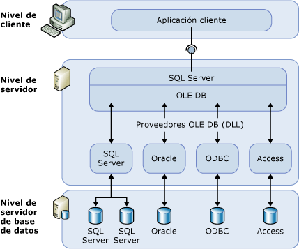

# Servidores vinculados (motor de base de datos)

[!INCLUDE [SQL Server SQL MI](../../includes/applies-to-version/sql-asdbmi.md)]

  Los servidores vinculados permiten que [!INCLUDE[ssDEnoversion](../../includes/ssdenoversion-md.md)] y [!INCLUDE[ssSDSMIfull](../../includes/sssdsmifull-md.md)] lean datos de los orígenes de datos remotos y ejecuten comandos en los servidores de bases de datos remotos (por ejemplo, orígenes de datos OLE DB) fuera de la instancia de [!INCLUDE[ssNoVersion](../../includes/ssnoversion-md.md)]. Los servidores vinculados normalmente se configuran para habilitar [!INCLUDE[ssDE](../../includes/ssde-md.md)] a fin de ejecutar una instrucción [!INCLUDE[tsql](../../includes/tsql-md.md)] que incluye las tablas de otra instancia de [!INCLUDE[ssNoVersion](../../includes/ssnoversion-md.md)]u otro producto de base de datos como Oracle. Muchos tipos de orígenes de datos OLE DB pueden configurarse como servidores vinculados, incluidos [!INCLUDE[msCoName](../../includes/msconame-md.md)] Access, Excel y Azure CosmosDB.

> [!NOTE]
> Los servidores vinculados están disponibles en [!INCLUDE[ssDEnoversion](../../includes/ssdenoversion-md.md)] y [!INCLUDE[ssSDSMIfull](../../includes/sssdsmifull-md.md)]. No están habilitados en los grupos elásticos y la base de datos única de [!INCLUDE[ssSDSfull](../../includes/sssdsfull-md.md)]. Hay algunas [restricciones en Instancia administrada que se pueden encontrar aquí](https://docs.microsoft.com/azure/sql-database/sql-database-managed-instance-transact-sql-information#linked-servers). 

## ¿Cuándo usar servidores vinculados?

  Los servidores vinculados le permiten implementar bases de datos distribuidas que pueden capturar y actualizar datos en otras bases de datos. Son una buena solución en los escenarios donde hay que implementar particionamiento de base de datos sin necesidad de crear un código de aplicación personalizado ni cargarlo directamente desde los orígenes de datos remotos. Los servidores vinculados ofrecen las siguientes ventajas:  
  
-   Capacidad de obtener acceso a datos fuera de [!INCLUDE[ssNoVersion](../../includes/ssnoversion-md.md)].  
  
-   Capacidad de ejecutar consultas distribuidas, actualizaciones, comandos y transacciones en orígenes de datos heterogéneos en toda la organización.  
  
-   Capacidad de tratar diferentes orígenes de datos de manera similar.  
  
Puede configurar un servidor vinculado con [!INCLUDE[ssManStudioFull](../../includes/ssmanstudiofull-md.md)] o con la instrucción [sp_addlinkedserver &#40;Transact-SQL&#41;](../../relational-databases/system-stored-procedures/sp-addlinkedserver-transact-sql.md) . Los proveedores OLE DB varían en gran medida en el tipo y el número de parámetros necesarios. Por ejemplo, algunos proveedores requieren que proporcione un contexto de seguridad para la conexión con [sp_addlinkedsrvlogin &#40;Transact-SQL&#41;](../../relational-databases/system-stored-procedures/sp-addlinkedsrvlogin-transact-sql.md). Algunos proveedores OLE DB que permiten [!INCLUDE[ssNoVersion](../../includes/ssnoversion-md.md)] actualizar datos en el origen de OLE DB. Otros solo proporcionan acceso a datos de solo lectura. Para obtener información acerca de cada proveedor OLE DB, consulte la documentación para dicho proveedor OLE DB.  
  
## Componentes de servidores vinculados  
 Una definición de servidor vinculado especifica los siguientes objetos:  
  
-   Un proveedor OLE DB  
  
-   Un origen de datos OLE DB  
  
Un *proveedor OLE DB* es una biblioteca DLL que administra un origen de datos específico e interactúa con él. Un *origen de datos OLE DB* identifica la base datos específica a la que se puede tener acceso mediante OLE DB. Aunque los orígenes de datos en los que se realizan consultas a través de definiciones de servidores vinculados son bases de datos normales, existen proveedores OLE DB para una amplia variedad de archivos y formatos de archivo. Se trata de archivos de texto, datos de hojas de cálculo y los resultados de búsquedas de contenido de texto completo.  
  
A partir de [!INCLUDE[sql-server-2019](../../includes/sssqlv15-md.md)], [Microsoft OLE DB Driver for SQL Server (MSOLEDBSQL)](../../connect/oledb/oledb-driver-for-sql-server.md) (PROGID: MSOLEDBSQL) es el proveedor OLE DB predeterminado. En versiones anteriores, el [proveedor OLE DB SQL Server Native Client (SQLNCLI)](../../relational-databases/native-client/sql-server-native-client.md) (PROGID: SQLNCLI11) era el proveedor OLE DB predeterminado.
  
> [!NOTE]  
> [!INCLUDE[ssNoVersion](../../includes/ssnoversion-md.md)] están diseñadas para ser usadas con cualquier proveedor OLE DB que implemente las interfaces OLE DB requeridas. Pero [!INCLUDE[ssNoVersion](../../includes/ssnoversion-md.md)] se ha probado con el proveedor OLE DB predeterminado.  
  
## Detalles de servidores vinculados  
 En la siguiente ilustración se muestran los conceptos básicos de una configuración con servidores vinculados.  
  
   
  
Normalmente, los servidores vinculados se utilizan para tratar consultas distribuidas. Cuando una aplicación cliente ejecuta una consulta distribuida mediante un servidor vinculado, [!INCLUDE[ssNoVersion](../../includes/ssnoversion-md.md)] analiza el comando y envía solicitudes a OLE DB. La solicitud de conjuntos de filas se puede realizar como una consulta al proveedor o abriendo una tabla base del proveedor.  

> [!NOTE]
> Para que un origen de datos devuelva información mediante un servidor vinculado, el proveedor OLE DB (DLL) para ese origen de datos debe encontrarse en el mismo servidor que la instancia de [!INCLUDE[ssNoVersion](../../includes/ssnoversion-md.md)].  
 
> [!IMPORTANT]
> Cuando se utiliza un proveedor OLE DB, la cuenta con la que se ejecuta el servicio de [!INCLUDE[ssNoVersion](../../includes/ssnoversion-md.md)] debe tener permisos de lectura y ejecución para el directorio y todos los subdirectorios en los que esté instalado el proveedor. Esto incluye los proveedores publicados por Microsoft y cualquier proveedor externo.

> [!NOTE]
> Los servidores vinculados admiten la autenticación de paso a través de Active Directory cuando se usa la delegación completa. A partir de [!INCLUDE[ssSQL17](../../includes/sssql17-md.md)] CU17, también se admite la autenticación de paso a través con delegación restringida, pero no la [delegación restringida basada en recursos](https://docs.microsoft.com/windows-server/security/kerberos/kerberos-constrained-delegation-overview).

## Administrar proveedores  
Existe un conjunto de opciones para controlar cómo [!INCLUDE[ssNoVersion](../../includes/ssnoversion-md.md)] carga y utiliza proveedores OLE DB que se hayan especificado en el registro.  
  
## Administrar definiciones de servidores vinculados  
Cuando configure un servidor vinculado, registre la información de la conexión y del origen de datos con [!INCLUDE[ssNoVersion](../../includes/ssnoversion-md.md)]. Una vez realizado el registro, se puede hacer referencia a ese origen de datos con un único nombre lógico.  
  
Puede utilizar procedimientos almacenados y vistas de catálogo para administrar definiciones de servidores vinculados:  
  
-   Cree una definición de servidor vinculado mediante la ejecución de **sp_addlinkedserver**.  
  
-   Vea información acerca de los servidores vinculados definidos en una instancia específica de [!INCLUDE[ssNoVersion](../../includes/ssnoversion-md.md)] ejecutando una consulta en las vistas de catálogo del sistema **sys.servers** .  
  
-   Elimine una definición de servidor vinculado mediante la ejecución de **sp_dropserver**. También puede utilizar este procedimiento almacenado para quitar servidores remotos.  
  
También puede definir servidores vinculados mediante [!INCLUDE[ssManStudioFull](../../includes/ssmanstudiofull-md.md)]. En el Explorador de objetos, haga clic con el botón derecho en **Objetos de servidor**, seleccione **Nuevo**y, después, **Servidor vinculado**. Puede eliminar una definición de servidor vinculado al hacer clic con el botón derecho en el nombre del servidor vinculado y seleccionar **Eliminar**.  
  
 Cuando ejecute una consulta distribuida en un servidor vinculado, incluya el nombre de cuatro partes completo de una tabla para cada origen de datos en el que desee realizar la consulta. Este nombre de cuatro partes debe tener el formato _linked\_server\_name.catalog_ **.** _schema_ **.** _object\_name_.  
  
> [!NOTE]  
> Es posible definir servidores vinculados que señalen al servidor donde se han definido, es decir, que operen como bucle invertido. Los servidores en bucle invertido resultan muy útiles cuando se prueba una aplicación que utiliza consultas distribuidas en una red con un único servidor. Los servidores vinculados en bucle invertido están previstos para la realización de pruebas y no se admiten para muchas operaciones, como las transacciones distribuidas.  
  
## Related Tasks  
 [Creación de servidores vinculados &#40;Motor de base de datos de SQL Server&#41;](../../relational-databases/linked-servers/create-linked-servers-sql-server-database-engine.md)    
 [sp_addlinkedserver &#40;Transact-SQL&#41;](../../relational-databases/system-stored-procedures/sp-addlinkedserver-transact-sql.md)    
 [sp_addlinkedsrvlogin &#40;Transact-SQL&#41;](../../relational-databases/system-stored-procedures/sp-addlinkedsrvlogin-transact-sql.md)    
 [sp_dropserver &#40;Transact-SQL&#41;](../../relational-databases/system-stored-procedures/sp-dropserver-transact-sql.md)    
  
## Contenido relacionado  
 [sys.servers &#40;Transact-SQL&#41;](../../relational-databases/system-catalog-views/sys-servers-transact-sql.md)    
 [sp_linkedservers &#40;Transact-SQL&#41;](../../relational-databases/system-stored-procedures/sp-linkedservers-transact-sql.md)  

