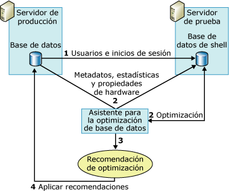

# <a name="reduce-the-production-server-tuning-load"></a>Reducir la carga de optimización del servidor de producción
[!INCLUDE[appliesto-ss-asdb-xxxx-xxx-md](../../includes/appliesto-ss-asdb-xxxx-xxx-md.md)] [!INCLUDE[ssDE](../../includes/ssde-md.md)] El Asistente para la optimización se basa en el optimizador de consultas para analizar una carga de trabajo y realizar recomendaciones de optimización. La realización de este análisis en el servidor de producción le agrega carga y puede perjudicar su rendimiento durante la sesión de optimización. Puede reducir el efecto en la carga del servidor durante una sesión de optimización utilizando un servidor de pruebas además del servidor de producción.  
  
## <a name="how-database-engine-tuning-advisor-uses-a-test-server"></a>Cómo utiliza el Asistente para la optimización de motor de base de datos un servidor de prueba  
 El modo tradicional de utilizar un servidor de prueba consiste en copiar todos los datos del servidor de producción al servidor de prueba, optimizar el servidor de prueba y luego implementar la recomendación en el servidor de producción. Este proceso elimina el impacto negativo de rendimiento que sufriría el servidor de producción, pero no es la solución idónea. Por ejemplo, cuando sea necesario copiar grandes volúmenes de datos del servidor de producción al de prueba, el consumo de tiempo y recursos se dispara. Además, el hardware del servidor de prueba no suele ser tan eficaz como el hardware implementado en los servidores de producción. El proceso de optimización se basa en el optimizador de consultas y las recomendaciones que éste genera se basan en parte del hardware subyacente. Si el hardware del servidor de pruebas no es idéntico al del servidor de producción, disminuirá la calidad de las recomendaciones que efectúe el Asistente para la optimización de [!INCLUDE[ssDE](../../includes/ssde-md.md)] .  
  
 Para evitar estos problemas, el Asistente para la optimización de [!INCLUDE[ssDE](../../includes/ssde-md.md)] lleva a cabo la optimización de una base de datos en un servidor de producción procediendo a la descarga de gran parte de la carga de optimización en el servidor de prueba. Esto lo realiza gracias a la información de configuración del hardware del servidor de producción y sin tener que copiar los datos de dicho servidor al de prueba. [!INCLUDE[ssDE](../../includes/ssde-md.md)] no copia datos reales del servidor de producción al servidor de prueba. Solo copia los metadatos y las estadísticas que necesita.  
  
 Los siguientes pasos describen el proceso de optimización de una base de datos en un servidor de prueba:  
  
1.  Asegúrese de que el usuario que desea utilizar el servidor de prueba existe en ambos servidores.  
  
     Antes de empezar, compruebe que el usuario que quiere utilizar el servidor de prueba para optimizar una base de datos del servidor de producción existe en ambos servidores. Para ello deberá crear el usuario y su inicio de sesión correspondiente en el servidor de prueba. Si es miembro del rol fijo de servidor **sysadmin** de ambos equipos no es necesario que lleve a cabo este paso.  
  
2.  Optimice la carga de trabajo en el servidor de prueba.  
  
     Para optimizar la carga de trabajo en un servidor de prueba se necesita un archivo de entrada XML que debe ejecutarse con la utilidad de la línea de comandos **dta** . En el archivo de entrada XML, especifique el nombre del servidor de prueba mediante el subelemento **TestServer** además de especificar los valores del resto de los subelementos en el elemento principal **TuningOptions** .  
  
     Durante el proceso de optimización, el Asistente para la optimización de motor de base de datos crea una base de datos de shell en el servidor de prueba. Para crear y optimizar esta base de datos, el Asistente para la optimización de motor de base de datos efectúa llamadas al servidor de producción para poder llevar a cabo los pasos que se indican a continuación:  
  
    1.  [!INCLUDE[ssDE](../../includes/ssde-md.md)] importa los metadatos de la base de datos de producción en la base de datos de shell del servidor de pruebas. Los metadatos incluyen tablas vacías, índices, vistas, procedimientos almacenados, desencadenadores, etc. Este paso permite ejecutar las consultas de carga de trabajo en la base de datos de shell del servidor de prueba.  
  
    2.  [!INCLUDE[ssDE](../../includes/ssde-md.md)] importa las estadísticas del servidor de producción para que el optimizador de consultas pueda optimizar con precisión las consultas en el servidor de prueba.  
  
    3.  [!INCLUDE[ssDE](../../includes/ssde-md.md)] importa los parámetros de hardware y especifica el número de procesadores y memoria disponible del servidor de producción a fin de suministrar al optimizador de consultas la información que requiere para generar un plan de consulta.  
  
3.  Una vez que el Asistente para la optimización de [!INCLUDE[ssDE](../../includes/ssde-md.md)] ha terminado de ajustar la base de datos de shell del servidor de pruebas, genera una recomendación de optimización.  
  
4.  Aplique la recomendación recibida del servidor de prueba en el servidor de producción.  
  
 La siguiente ilustración representa el escenario de los servidores de prueba y producción:  
  
   
  
> [!NOTE]  
>  La característica de optimización del servidor de prueba no se admite en la interfaz gráfica de usuario (GUI) del Asistente para la optimización de [!INCLUDE[ssDE](../../includes/ssde-md.md)] .  
  
## <a name="example"></a>Ejemplo  
 Asegúrese primero de que el usuario que desea realizar la optimización existe tanto en el servidor de prueba como en el de producción.  
  
 Después de copiar la información del usuario al servidor de pruebas, puede definir la sesión de optimización del mismo en el archivo de entrada XML del Asistente para la optimización de [!INCLUDE[ssDE](../../includes/ssde-md.md)] . El siguiente archivo de entrada XML de ejemplo muestra cómo especificar un servidor de pruebas para optimizar una base de datos con el Asistente para la optimización de [!INCLUDE[ssDE](../../includes/ssde-md.md)] .  
  
 En este ejemplo se optimiza la base de datos `MyDatabaseName` en `MyServerName`. Como carga de trabajo se utiliza un script [!INCLUDE[tsql](../../includes/tsql-md.md)] , `MyWorkloadScript.sql`. Esta carga de trabajo contiene eventos que se ejecutarán en `MyDatabaseName`. La mayoría de las llamadas del optimizador de consultas a esta base de datos, llamadas que forman parte del proceso de optimización, se gestionan desde la base de datos de shell en el servidor `MyTestServerName`. La base de datos de shell se compone de metadatos y estadísticas. Al aplicar el proceso se descarga al servidor de prueba el impacto en el rendimiento que causa la optimización. Cuando el Asistente para la optimización de [!INCLUDE[ssDE](../../includes/ssde-md.md)] genera la recomendación de optimización con este archivo de entrada XML, éste debería considerar únicamente los índices (`<FeatureSet>IDX</FeatureSet>`), pero no las particiones y tampoco precisa mantener ninguna de las estructuras de diseño físicas existentes en `MyDatabaseName`.  
  
```  
<?xml version="1.0" encoding="utf-16" ?>  
<DTAXML xmlns:xsi="http://www.w3.org/2001/XMLSchema-instance" xmlns="http://schemas.microsoft.com/sqlserver/2004/07/dta">  
  <DTAInput>  
    <Server>  
      <Name>MyServerName</Name>  
      <Database>  
        <Name>MyDatabaseName</Name>  
      </Database>  
    </Server>  
    <Workload>  
      <File>MyWorkloadScript.sql</File>  
    </Workload>  
    <TuningOptions>  
      <TestServer>MyTestServerName</TestServer>  
      <FeatureSet>IDX</FeatureSet>  
      <Partitioning>NONE</Partitioning>  
      <KeepExisting>NONE</KeepExisting>  
    </TuningOptions>  
  </DTAInput>  
</DTAXML>  
```  
  
## <a name="see-also"></a>Ver también  
 [Consideraciones acerca del uso de servidores de prueba](../../relational-databases/performance/considerations-for-using-test-servers.md)   
 [Referencia del archivo de entrada XML &#40;Asistente para la optimización de motor de base de datos&#41;](../../tools/dta/xml-input-file-reference-database-engine-tuning-advisor.md)  
  
  
