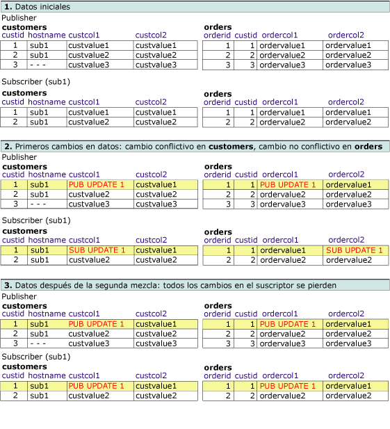
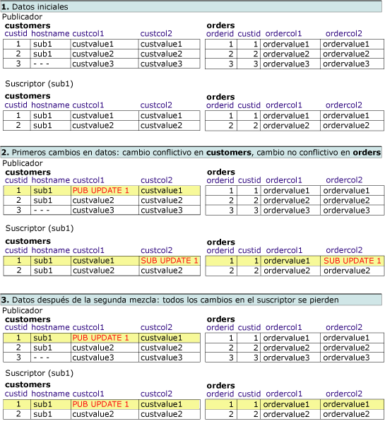
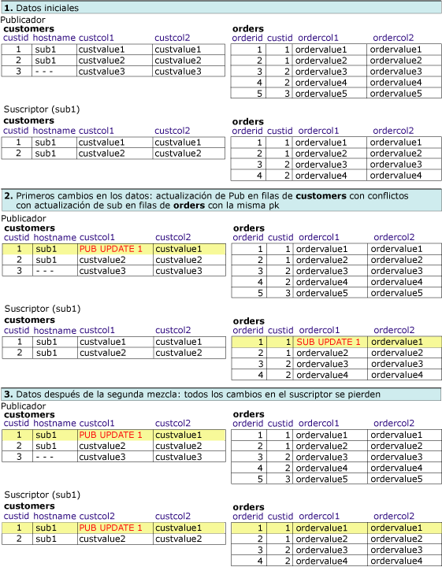

# Conflictos de replicación de mezcla avanzada: resolver en un registro lógico
[!INCLUDE[appliesto-ss-xxxx-xxxx-xxx-md](../../../includes/appliesto-ss-xxxx-xxxx-xxx-md.md)]
  En este tema se tratan las diferentes combinaciones de opciones de detección y resolución de conflictos posibles al utilizar registros lógicos. Los conflictos en la replicación de mezcla se producen cuando más de un nodo cambia los mismos datos o, al replicar cambios, la replicación de mezcla encuentra determinados tipos de errores, por ejemplo una infracción de restricción. Para obtener más información acerca de la detección y resolución de conflictos, vea [Advanced Merge Replication Conflict Detection and Resolution](../../../relational-databases/replication/merge/advanced-merge-replication-conflict-detection-and-resolution.md).  
  
 Para especificar el seguimiento de conflictos y el nivel de resolución para un artículo, vea [Specify the Conflict Tracking and Resolution Level for Merge Articles](../../../relational-databases/replication/publish/specify-the-conflict-tracking-and-resolution-level-for-merge-articles.md).  
  
## Detección de conflictos  
 Dos propiedades de artículo determinan la manera en que se detectan conflictos para los registros lógicos: **column_tracking** y **logical_record_level_conflict_detection**. [!INCLUDE[ssVersion2005](../../../includes/ssversion2005-md.md)] y las versiones posteriores también admiten la detección de nivel de registro lógico.  
  
 La propiedad del artículo **logical_record_level_conflict_detection** se puede establecer en TRUE o FALSE. El valor solamente se debe establecer para el artículo primario de nivel superior y se omitirá en los artículos secundarios. Si el valor es FALSE, la replicación de mezcla detecta conflictos como en las versiones anteriores de [!INCLUDE[ssNoVersion](../../../includes/ssnoversion-md.md)], basados únicamente en el valor de la propiedad **column_tracking** del artículo. Si el valor es TRUE, la replicación de mezcla omitirá la propiedad **column_tracking** del artículo y detectará un conflicto si se realizan cambios en cualquier lugar del registro lógico. Por ejemplo, considere este escenario:  
  
   
  
 Un conflicto se detecta si dos usuarios cambian cualquier valor del registro lógico Customer2 en las tablas **Customers**, **Orders**u **OrderItems** . Este ejemplo conlleva cambios realizados mediante una instrucción UPDATE, pero el conflicto también se puede detectar mediante los cambios realizados con las instrucciones INSERT o DELETE.  
  
## Resolución de conflictos  
 De manera predeterminada, la replicación de mezcla utiliza la lógica basada en prioridad para solucionar conflictos. Si se realiza un cambio conflictivo en dos bases de datos de suscriptor, gana el cambio para el suscriptor con la prioridad de suscripción más alta. O bien, si la prioridad es la misma, gana el primer cambio que llegue al publicador. Con la detección en el nivel de fila y de columna, toda la fila ganadora sobrescribe siempre la fila perdedora.  
  
 La propiedad del artículo **logical_record_level_conflict_resolution** se puede establecer en TRUE o FALSE. El valor solamente se debe establecer para el artículo primario de nivel superior y se omitirá en los artículos secundarios. Si el valor es TRUE, todo el registro lógico ganador sobrescribe el registro lógico perdedor. Si es FALSE, las filas ganadoras individuales pueden proceder de diferentes suscriptores o publicadores. Por ejemplo, el suscriptor A puede ganar un conflicto en una fila de la tabla **Orders** , y el suscriptor B puede ganar en una fila relacionada de la tabla **OrderItems** . El resultado es un registro lógico con la fila **Orders** del suscriptor A y la fila **OrderItems** del suscriptor B.  
  
## Configurar la interacción de detección y resolución de conflictos  
 La aparición de conflictos depende de la configuración de la interacción de detección y resolución de conflictos. En los siguientes ejemplos se supone que se ha utilizado la resolución de conflictos basada en prioridad. Al utilizar registros lógicos, las posibilidades son:  
  
-   Detección en el nivel de fila o columna, resolución en el nivel de fila  
  
-   Detección en el nivel de columna, resolución de registro lógico  
  
-   Detección en el nivel de fila, resolución de registro lógico  
  
-   Detección en el nivel de registro lógico, resolución de registro lógico  
  
### Detección en el nivel de fila o columna, resolución en el nivel de fila  
 En este ejemplo, la publicación se ha configurado de la siguiente manera:  
  
-   **column_tracking** es TRUE o FALSE  
  
-   **logical_record_level_conflict_detection** es FALSE  
  
-   **logical_record_level_conflict_resolution** es FALSE  
  
 En este caso, la detección se produce en el nivel de fila o columna, y la resolución tiene lugar en el nivel de fila. Esta configuración se utiliza para aprovechar que todos los cambios de un registro lógico se repliquen como una unidad, pero sin detección ni resolución de conflictos en el nivel de registro lógico.  
  
### Detección en el nivel de columna, resolución de registro lógico  
 En este ejemplo, la publicación se ha configurado de la siguiente manera:  
  
-   **column_tracking** es TRUE  
  
-   **logical_record_level_conflict_detection** es FALSE  
  
-   **logical_record_level_conflict_resolution** es TRUE  
  
 Un publicador y un suscriptor empiezan con el mismo conjunto de datos y se define un registro lógico entre las tablas **orders** y **customers** . El publicador cambia la columna **custcol1** en la tabla **customers** y la columna **ordercol1** en la tabla **orders** . El suscriptor cambia **custcol1** en la misma fila de la tabla **customers** y la columna **ordercol2** en la misma fila de la tabla **orders** . Los cambios en la misma columna de la tabla **customer** dan como resultado un conflicto, pero los cambios de la tabla **orders** no están en conflicto.  
  
 Debido a que los conflictos se resuelven en el nivel de registro lógico, los cambios ganadores realizados en el publicador sustituyen a los cambios realizados en las tablas del suscriptor durante el proceso de replicación.  
  
   
  
### Detección en el nivel de fila, resolución de registro lógico  
 En este ejemplo, la publicación se ha configurado de la siguiente manera:  
  
-   **column_tracking** es FALSE  
  
-   **logical_record_level_conflict_detection** es FALSE  
  
-   **logical_record_level_conflict_resolution** es TRUE  
  
 Un publicador y un suscriptor empiezan con el mismo conjunto de datos. El publicador cambia la columna **custcol1** en la tabla **customers** . El suscriptor cambia la columna **custcol2** en la tabla **customers** y la columna **ordercol2** en la tabla **orders** . Los cambios en la misma fila de la tabla **customers** dan como resultado un conflicto, pero los cambios de suscriptor la tabla **orders** no están en conflicto.  
  
 Debido a que los conflictos se resuelven en el nivel de registro lógico, durante la sincronización los cambios ganadores realizados en el publicador reemplazan los cambios realizados en las tablas del suscriptor.  
  
   
  
### Detección en el nivel de registro lógico, resolución de registro lógico  
 En este ejemplo, la publicación se ha configurado de la siguiente manera:  
  
-   **logical_record_level_conflict_detection** es TRUE  
  
-   **logical_record_level_conflict_resolution** es TRUE  
  
 Un publicador y un suscriptor empiezan con el mismo conjunto de datos. El publicador cambia la columna **custcol1** en la tabla **customers** . El suscriptor cambia la columna **ordercol1** en la tabla **orders** . No hay cambios en la misma fila o columna, pero como los cambios se han realizado en el mismo registro lógico para **custid**=1, los cambios se detectan como un conflicto de nivel de registro lógico.  
  
 Puesto que los conflictos también se resuelven en el nivel de registro lógico, durante la sincronización los cambios ganadores realizados en el publicador reemplazan los cambios realizados en las tablas del suscriptor.  
  
   
  
## Ver también  
 [Agrupar cambios en filas relacionadas con registros lógicos](../../../relational-databases/replication/merge/group-changes-to-related-rows-with-logical-records.md)  
  
  
