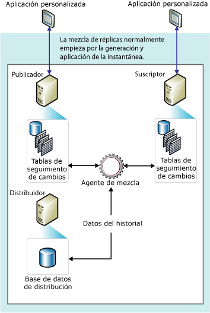

# Replicación de mezcla
[!INCLUDE [SQL Server](../../../includes/applies-to-version/sqlserver.md)]
  La replicación de mezcla, como la replicación transaccional, normalmente se inicia con una instantánea de los objetos y datos de una base de datos de publicaciones. Los cambios de datos y las modificaciones de esquema posteriores que se lleven a cabo en el publicador y en los suscriptores se controlan mediante desencadenadores. El suscriptor se sincroniza con el publicador cuando están conectados a la red e intercambian todas las filas que han cambiado entre el publicador y el suscriptor desde la última vez que se produjo la sincronización.  
  
 La replicación de mezcla se suele utilizar en entornos de servidor a cliente. La replicación de mezcla es adecuada en las siguientes situaciones:  
  
-   Varios suscriptores actualizan los mismos datos en diferentes ocasiones y propagan los cambios al publicador y a otros suscriptores.  
  
-   Los suscriptores necesitan recibir datos, realizar cambios sin conexión y sincronizar más adelante los cambios con el publicador y otros suscriptores.  
  
-   Cada suscriptor requiere una partición de datos diferente.  
  
-   Se pueden producir conflictos y, cuando ocurren, debe poder detectarlos y resolverlos.  
  
-   La aplicación requiere el cambio de datos neto en lugar de acceso a los estados intermedios de los datos. Por ejemplo, si una fila cambia cinco veces en el suscriptor antes de que éste se sincronice con el publicador, la fila cambiará solo una vez en el publicador para reflejar el cambio de datos neto (es decir, el quinto valor).  
  
 La replicación de mezcla permite que diferentes sitios funcionen de forma autónoma y, después, mezclen las actualizaciones en un solo resultado uniforme. Puesto que las actualizaciones tienen lugar en más de un nodo, los mismos datos pueden haber sido actualizados por el publicador y por más de un suscriptor. Por lo tanto, se pueden producir conflictos al mezclar las actualizaciones y la replicación de mezcla proporciona varias maneras de controlar los conflictos.  
  
 El Agente de instantáneas y el Agente de mezcla de [!INCLUDE[ssNoVersion](../../../includes/ssnoversion-md.md)] implementan la replicación de mezcla. Si la publicación no se filtra o utiliza filtros estáticos, el Agente de instantáneas crea una sola instantánea. Si la publicación utiliza filtros con parámetros, el Agente de instantáneas crea una instantánea para cada partición de datos. El Agente de mezcla aplica las instantáneas iniciales a los suscriptores. También combina los cambios incrementales de los datos que tienen lugar en el publicador o en los suscriptores después de la creación de la instantánea inicial y detecta y resuelve los conflictos según las reglas que configure.  
  
 Para realizar un seguimiento de los cambios, la replicación de mezcla (y la replicación transaccional con suscripciones de actualización en cola) deben poder identificar de forma única cada fila de todas las tablas publicadas. Para conseguirlo, l.La replicación de mezcla agrega la columna **rowguid** a todas las tablas, a menos que la tabla ya tenga una columna del tipo de datos **uniqueidentifier** con la propiedad **ROWGUIDCOL** definida (en cuyo caso se usa dicha columna). Si la tabla se quita de la publicación, la columna **rowguid** se elimina; si se ha utilizado una columna existente para realizar el seguimiento, la columna no se quita. Un filtro no debe incluir la columna **rowguidcol** que usa la replicación para identificar filas. La función **newid()** se proporciona como valor predeterminado para la columna de **rowguid** ; no obstante, los clientes pueden proporcionar un GUID para cada fila si es necesario. Sin embargo, no proporcione el valor 00000000-0000-0000-0000-000000000000.  
  
 En el siguiente diagrama se muestran los componentes que se utilizan en la replicación de mezcla.  
  
   
  
  
