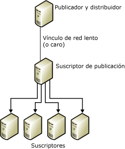
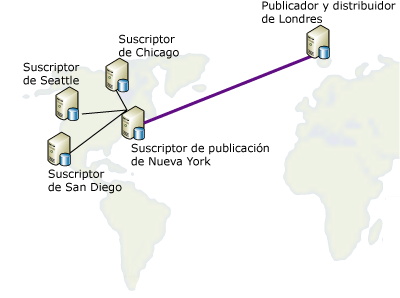

# Volver a publicar datos
[!INCLUDE[appliesto-ss-xxxx-xxxx-xxx-md](../../includes/appliesto-ss-xxxx-xxxx-xxx-md.md)]
  En un modelo de republicación, el publicador envía datos a un suscriptor y éste, a su vez, vuelve a publicar los datos en cualquier número de suscriptores. Esto es útil cuando un publicador tiene que enviar datos a suscriptores a través de un vínculo de comunicaciones lento o costoso. Si hay varios suscriptores en el otro extremo del vínculo, el uso de un republicador desplaza la mayor parte de la carga de distribución a ese extremo del vínculo.  
  
 Para republicar datos, lleve a cabo los siguientes pasos:  
  
1.  Cree una publicación en el publicador.  
  
2.  Cree una suscripción a la publicación para el suscriptor de republicación.  
  
3.  Inicialice la suscripción. La suscripción se debe inicializar antes de crear la publicación en el suscriptor de republicación; de lo contrario, se producirá un error de replicación.  
  
4.  Cree una publicación en la base de datos de suscripciones para el suscriptor de republicación.  
  
5.  Cree suscripciones a la publicación en el suscriptor de republicación para los demás suscriptores.  
  
6.  Inicialice las suscripciones.  

[!INCLUDE[freshInclude](../../includes/paragraph-content/fresh-note-steps-feedback.md)]

> [!NOTE]  
>  Si utiliza la replicación de mezcla en una topología de republicación, todos los suscriptores de republicación deberán utilizar las suscripciones del servidor. Para obtener más información sobre los tipos de suscripción, vea [Subscribe to Publications](../../relational-databases/replication/subscribe-to-publications.md) (Suscribirse a publicaciones).  
  
 En la siguiente ilustración, tanto el publicador como el republicador actúan como sus propios distribuidores locales. Si estuvieran configurados para utilizar un distribuidor remoto, cada distribuidor tendría que estar en el mismo lado del vínculo de comunicaciones lento o costoso que su publicador. Los publicadores tienen que estar conectados con sus distribuidores remotos mediante vínculos de comunicaciones confiables y de alta velocidad.  
  
   
  
 Cualquier servidor puede funcionar como publicador y suscriptor. Por ejemplo, observe el siguiente diagrama en el que la publicación de una tabla que existe en Londres se tiene que distribuir a cuatro ciudades diferentes de los Estados Unidos: Chicago, Nueva York, San Diego y Seattle. El servidor de Nueva York es el elegido para que se suscriba a la tabla publicada de Londres, porque el sitio de Nueva York cumple estas condiciones:  
  
-   El vínculo de red de retorno a Londres es relativamente confiable.  
  
-   Los costos de comunicación entre Londres y Nueva York son aceptables.  
  
-   Hay buenas líneas de comunicación de red desde Nueva York a todos los demás sitios suscriptores de Estados Unidos.  
  
       
  
 La replicación es compatible con los casos de republicación que se muestran en la tabla siguiente.  
  
|publicador|Suscriptor de publicación|Suscriptor|  
|---------------|---------------------------|----------------|  
|Publicación transaccional|Suscripción transaccional/publicación transaccional|Suscripción transaccional|  
|Publicación transaccional|Suscripción transaccional/publicación de mezcla*|Suscripción de mezcla|  
|Publicación de combinación|Suscripción de mezcla/publicación de combinación|Suscripción de mezcla|  
|Publicación de combinación|Suscripción de mezcla/publicación transaccional|Suscripción transaccional|  
  
 \*Debe establecer la propiedad **@published_in_tran_pub** en la publicación de mezcla. De forma predeterminada, la replicación transaccional espera que las tablas del suscriptor se traten como de solo lectura. Si la replicación de mezcla realiza cambios en los datos de una tabla de una suscripción transaccional, la convergencia de los datos puede no producirse. Para evitar este riesgo, se recomienda que cada tabla de este tipo se especifique como solo para descarga en la publicación de combinación. Esto evita que un suscriptor de mezcla cargue cambios de datos en la tabla. Para obtener más información, vea [Optimize Merge Replication Performance with Download-Only Articles](../../relational-databases/replication/merge/optimize-merge-replication-performance-with-download-only-articles.md) (Optimizar el rendimiento de la replicación de mezcla con artículos de solo descarga).  
  
## Consulte también  
 [Configurar distribución](../../relational-databases/replication/configure-distribution.md)   
 [Publicar datos y objetos de base de datos](../../relational-databases/replication/publish/publish-data-and-database-objects.md)   
 [Subscribe to Publications](../../relational-databases/replication/subscribe-to-publications.md)   
 [Initialize a Subscription](../../relational-databases/replication/initialize-a-subscription.md)  (Inicializar una suscripción)  
 [Sincronizar datos](../../relational-databases/replication/synchronize-data.md)  
  
  
