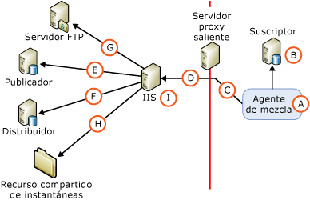

# Arquitectura de seguridad para la sincronización web
[!INCLUDE [SQL Server](../../../includes/applies-to-version/sqlserver.md)]
  [!INCLUDE[msCoName](../../../includes/msconame-md.md)] [!INCLUDE[ssNoVersion](../../../includes/ssnoversion-md.md)] permite un control preciso sobre la configuración de la seguridad de la sincronización web. En este tema se proporciona una lista exhaustiva de todos los componentes que pueden incluirse en una configuración de la sincronización web e información acerca de las conexiones entre los componentes. [!INCLUDE[ssNoteWinAuthentication](../../../includes/ssnotewinauthentication-md.md)]  
  
 En la siguiente ilustración se muestran todas las conexiones posibles, aunque es posible que no todas las conexiones sean necesarias en una determinada topología. Por ejemplo, una conexión a un servidor FTP solamente es necesaria si la instantánea se entrega mediante FTP.  
  
   
  
 En las siguientes tablas se describen los componentes y las conexiones que se muestran en la ilustración.  
  
## A. Usuario de Windows con el que se ejecuta el Agente de mezcla  
 Durante la sincronización, el Agente de mezcla (A) se inicia en el suscriptor. El Agente de mezcla puede iniciarse desde un paso de trabajo del Agente [!INCLUDE[ssNoVersion](../../../includes/ssnoversion-md.md)] o desde una aplicación personalizada independiente. Si el Agente de mezcla se inicia desde un paso de trabajo del Agente [!INCLUDE[ssNoVersion](../../../includes/ssnoversion-md.md)] , el Agente de mezcla se ejecuta en el contexto del usuario de Windows que especifique. Si no especifica ningún usuario de Windows, el Agente de mezcla se ejecuta en el contexto de la cuenta de servicio de Windows para el Agente [!INCLUDE[ssNoVersion](../../../includes/ssnoversion-md.md)] .  
  
|Tipo de cuenta|Dónde se especifica la cuenta|  
|---------------------|------------------------------------|  
|Usuario de Windows|[!INCLUDE[tsql](../../../includes/tsql-md.md)]: los parámetros `@job_login` y `@job_password` de [sp_addmergepullsubscription_agent](../../../relational-databases/system-stored-procedures/sp-addmergepullsubscription-agent-transact-sql.md).   RMO (Replication Management Objects): las propiedades <xref:Microsoft.SqlServer.Replication.IProcessSecurityContext.Login%2A> y <xref:Microsoft.SqlServer.Replication.IProcessSecurityContext.Password%2A> para <xref:Microsoft.SqlServer.Replication.PullSubscription.SynchronizationAgentProcessSecurity%2A>.|  
|Cuenta de servicio de Windows para el Agente [!INCLUDE[ssNoVersion](../../../includes/ssnoversion-md.md)]|[!INCLUDE[ssNoVersion](../../../includes/ssnoversion-md.md)] Administrador de configuración|  
|Aplicación independiente|El Agente de mezcla se ejecuta en el contexto del usuario de Windows que ejecuta la aplicación.|  
  
## B. Conexión al suscriptor  
 El Agente de mezcla se conecta al suscriptor mediante la autenticación de Windows o la autenticación de [!INCLUDE[ssNoVersion](../../../includes/ssnoversion-md.md)] . El usuario de Windows o el inicio de sesión de [!INCLUDE[ssNoVersion](../../../includes/ssnoversion-md.md)] que especifique debe asociarse a un usuario de base de datos que sea miembro del rol fijo de base de datos **dbowner** en la base de datos de suscripciones.  
  
> [!NOTE]  
>  La autenticación de Windows se usa siempre que el Agente de mezcla se inicia desde un trabajo del Agente [!INCLUDE[ssNoVersion](../../../includes/ssnoversion-md.md)] . La autenticación de Windows también se usa cuando el Agente de mezcla se inicia mediante programación, a menos que se especifique explícitamente la autenticación de [!INCLUDE[ssNoVersion](../../../includes/ssnoversion-md.md)] .  
  
|Tipo de autenticación|Dónde se especifica la autenticación|  
|----------------------------|-------------------------------------------|  
|- Autenticación de Windows.|El Agente de mezcla realiza conexiones en el contexto del usuario de Windows que se especifica para el Agente de mezcla (A).|  
|La autenticación de[!INCLUDE[ssNoVersion](../../../includes/ssnoversion-md.md)] se usa solo si se especifica lo siguiente:   -   RMO: un valor de <xref:Microsoft.SqlServer.Replication.SecurityMode.Standard> para <xref:Microsoft.SqlServer.Replication.MergeSynchronizationAgent.SubscriberSecurityMode%2A>. - Línea de comandos del Agente de mezcla: el valor **0** para **SubscriberSecurityMode**.|RMO: <xref:Microsoft.SqlServer.Replication.MergeSynchronizationAgent.SubscriberLogin%2A> y <xref:Microsoft.SqlServer.Replication.MergeSynchronizationAgent.SubscriberPassword%2A>.   Línea de comandos del Agente de mezcla: **-SubscriberLogin** y **-SubscriberLogin**.|  
  
## C. Conexión a un servidor proxy saliente  
 Especifique un usuario de Windows para esta conexión solo si hay un servidor proxy saliente que restringe el acceso a la red interna del suscriptor.  
  
|Tipo de autenticación|Dónde se especifica la autenticación|  
|----------------------------|-------------------------------------------|  
|Autenticación de Windows|RMO: <xref:Microsoft.SqlServer.Replication.MergeSynchronizationAgent.InternetProxyLogin%2A> e <xref:Microsoft.SqlServer.Replication.MergeSynchronizationAgent.InternetProxyPassword%2A> con <xref:Microsoft.SqlServer.Replication.MergeSynchronizationAgent.InternetProxyServer%2A>.   Línea de comandos del Agente de mezcla: **-InternetProxyLogin** e **-InternetProxyPassword** con **-InternetProxyServer**.|  
  
## D. Conexión a IIS  
 Después de conectarse al suscriptor y extraer los cambios de la base de datos de suscripciones, el Agente de mezcla realiza una solicitud HTTPS a [!INCLUDE[msCoName](../../../includes/msconame-md.md)] Internet Information Services (IIS) y carga los cambios en los datos como un mensaje XML. El Agente de mezcla debe tener permisos de inicio de sesión para IIS.  
  
|Tipo de autenticación|Dónde se especifica la autenticación|  
|----------------------------|-------------------------------------------|  
|La autenticación básica se usa si se especifica uno de los siguientes:   -   [!INCLUDE[tsql](../../../includes/tsql-md.md)]: un valor de **0** para el parámetro `@internet_security_mode` de [sp_addmergepullsubscription_agent](../../../relational-databases/system-stored-procedures/sp-addmergepullsubscription-agent-transact-sql.md). -   RMO: un valor de <xref:Microsoft.SqlServer.Replication.SecurityMode.Standard> para <xref:Microsoft.SqlServer.Replication.MergeSynchronizationAgent.InternetSecurityMode%2A>. - Línea de comandos del Agente de mezcla: el valor **0** para **-InternetSecurityMode**.|[!INCLUDE[tsql](../../../includes/tsql-md.md)]: los parámetros `@internet_login` y `@internet_password` de [sp_addmergepullsubscription_agent](../../../relational-databases/system-stored-procedures/sp-addmergepullsubscription-agent-transact-sql.md).   RMO: <xref:Microsoft.SqlServer.Replication.MergeSynchronizationAgent.InternetLogin%2A> y <xref:Microsoft.SqlServer.Replication.MergeSynchronizationAgent.InternetPassword%2A>.   Línea de comandos del Agente de mezcla: **-InternetLogin** e **-InternetPassword**.|  
|La autenticación integrada1 se usa si se especifica uno de los siguientes:   -   [!INCLUDE[tsql](../../../includes/tsql-md.md)]: un valor de **1** para el parámetro `@internet_security_mode` de [sp_addmergepullsubscription_agent](../../../relational-databases/system-stored-procedures/sp-addmergepullsubscription-agent-transact-sql.md). -   RMO: un valor de <xref:Microsoft.SqlServer.Replication.SecurityMode.Integrated> para <xref:Microsoft.SqlServer.Replication.MergeSynchronizationAgent.InternetSecurityMode%2A>. - Línea de comandos del Agente de mezcla: el valor **1** para **-InternetSecurityMode**.|El Agente de mezcla realiza conexiones en el contexto del usuario de Windows que se especifica para el Agente de mezcla (A).|  
  
 1 La autenticación integrada solo puede usarse si todos los equipos están en el mismo dominio o están en varios dominios que tienen relaciones de confianza entre sí.  
  
> [!NOTE]  
>  La delegación es necesaria si se usa la autenticación integrada. Se recomienda usar la autenticación básica y TLS para las conexiones del suscriptor a IIS.  
  
## E. Conexión al publicador  
 Los componentes del Reconciliador de replicación de mezcla y de la Escucha de replicación de [!INCLUDE[ssNoVersion](../../../includes/ssnoversion-md.md)] se hospedan en el equipo en el que se ejecuta IIS. Estos componentes realizan las siguientes acciones:  
  
-   Recogen la solicitud HTTPS descrita en la sección "D. Conexión a IIS".  
  
-   Realizan una conexión SQL a la base de datos de publicaciones y aplican los cambios cargados en dicha base de datos.  
  
-   Extraen los cambios descargados y devuelven una respuesta HTTPS al Agente de mezcla.  
  
 El Reconciliador de replicación de mezcla se conecta al publicador mediante la autenticación de Windows o la autenticación de [!INCLUDE[ssNoVersion](../../../includes/ssnoversion-md.md)] . El usuario de Windows o el inicio de sesión de [!INCLUDE[ssNoVersion](../../../includes/ssnoversion-md.md)] que especifique debe cumplir lo siguiente:  
  
-   Estar en la lista de acceso a la publicación (PAL). Para obtener más información, vea [Proteger el publicador](../../../relational-databases/replication/security/secure-the-publisher.md).  
  
-   Estar asociado a un usuario en la base de datos de publicaciones.  
  
|Tipo de autenticación|Dónde se especifica la autenticación|  
|----------------------------|-------------------------------------------|  
|La autenticación de Windows se utiliza si se especifica uno de los siguientes:   -   [!INCLUDE[tsql](../../../includes/tsql-md.md)]: un valor de **1** para el parámetro `@publisher_security_mode` de [sp_addmergepullsubscription_agent](../../../relational-databases/system-stored-procedures/sp-addmergepullsubscription-agent-transact-sql.md). -   RMO: un valor de <xref:Microsoft.SqlServer.Replication.SecurityMode.Integrated> para <xref:Microsoft.SqlServer.Replication.MergeSynchronizationAgent.PublisherSecurityMode%2A>. - Línea de comandos del Agente de mezcla: el valor **1** para **-PublisherSecurityMode**.|El Agente de mezcla realiza conexiones al publicador en el contexto del usuario de Windows que se especifica para la conexión a IIS (D). Si el publicador e IIS están en distintos equipos y se utiliza la autenticación integrada para la conexión (D), debe habilitar la delegación Kerberos en el equipo en el que se ejecuta IIS. Para obtener más información, consulte la documentación de Windows.|  
|La autenticación de[!INCLUDE[ssNoVersion](../../../includes/ssnoversion-md.md)] se utiliza si se especifica uno de los siguientes:   -   [!INCLUDE[tsql](../../../includes/tsql-md.md)]: un valor de **0** para el parámetro `@publisher_security_mode` de [sp_addmergepullsubscription_agent](../../../relational-databases/system-stored-procedures/sp-addmergepullsubscription-agent-transact-sql.md). -   RMO: un valor de <xref:Microsoft.SqlServer.Replication.SecurityMode.Standard> para <xref:Microsoft.SqlServer.Replication.MergeSynchronizationAgent.PublisherSecurityMode%2A>. - Línea de comandos del Agente de mezcla: el valor **0** para **-PublisherSecurityMode**.|[!INCLUDE[tsql](../../../includes/tsql-md.md)]: los parámetros `@publisher_login` y `@publisher_password` de [sp_addmergepullsubscription_agent](../../../relational-databases/system-stored-procedures/sp-addmergepullsubscription-agent-transact-sql.md).   RMO: <xref:Microsoft.SqlServer.Replication.MergeSynchronizationAgent.PublisherLogin%2A> y <xref:Microsoft.SqlServer.Replication.MergeSynchronizationAgent.PublisherPassword%2A>.   Línea de comandos del Agente de mezcla: **-PublisherLogin** y **-PublisherPassword**.|  
  
## F. Conexión al distribuidor  
 El Reconciliador de replicación de mezcla hospedado en el equipo en el que se ejecuta IIS también realiza conexiones al distribuidor. El Reconciliador de replicación de mezcla se conecta al distribuidor mediante la autenticación de Windows o la autenticación de [!INCLUDE[ssNoVersion](../../../includes/ssnoversion-md.md)] . El usuario de Windows o el inicio de sesión de [!INCLUDE[ssNoVersion](../../../includes/ssnoversion-md.md)] que especifique debe cumplir lo siguiente:  
  
-   Estar en la lista de acceso de la publicación (PAL). Para obtener más información, vea [Proteger el publicador](../../../relational-databases/replication/security/secure-the-publisher.md).  
  
-   Estar asociado a un usuario de base de datos en la base de datos de distribución. El usuario puede ser el usuario **Guest** .  
  
 Normalmente, el recurso compartido de instantáneas está en el distribuidor. Para obtener más información sobre los recursos compartidos de instantáneas, vea la sección "H. Acceso al recurso compartido de instantáneas" más adelante en este tema.  
  
|- Tipo de autenticación|Dónde se especifica la autenticación|  
|-------------------------------|-------------------------------------------|  
|La autenticación de Windows se utiliza si se especifica uno de los siguientes:   -   [!INCLUDE[tsql](../../../includes/tsql-md.md)]: un valor de **1** para el parámetro `@distributor_security_mode` de [sp_addmergepullsubscription_agent](../../../relational-databases/system-stored-procedures/sp-addmergepullsubscription-agent-transact-sql.md). -   RMO: un valor de <xref:Microsoft.SqlServer.Replication.SecurityMode.Integrated> para <xref:Microsoft.SqlServer.Replication.MergeSynchronizationAgent.DistributorSecurityMode%2A>. - Línea de comandos del Agente de mezcla: el valor **1** para **-DistributorSecurityMode**.|El Agente de mezcla realiza conexiones al distribuidor en el contexto del usuario de Windows que se especifica para la conexión a IIS (D). Si el distribuidor e IIS están en distintos equipos y se utiliza la autenticación integrada para la conexión (D), debe habilitar la delegación Kerberos en el equipo en el que se ejecuta IIS. Para obtener más información, consulte la documentación de Windows.|  
|La autenticación de[!INCLUDE[ssNoVersion](../../../includes/ssnoversion-md.md)] se utiliza si se especifica uno de los siguientes:   -   [!INCLUDE[tsql](../../../includes/tsql-md.md)]: un valor de **0** para el parámetro `@distributor_security_mode` de [sp_addmergepullsubscription_agent](../../../relational-databases/system-stored-procedures/sp-addmergepullsubscription-agent-transact-sql.md). -   RMO: un valor de <xref:Microsoft.SqlServer.Replication.SecurityMode.Standard> para <xref:Microsoft.SqlServer.Replication.MergeSynchronizationAgent.DistributorSecurityMode%2A>. - Línea de comandos del Agente de mezcla: el valor **0** para **-DistributorSecurityMode**.|[!INCLUDE[tsql](../../../includes/tsql-md.md)]: los parámetros `@distributor_login` y `@distributor_password` de [sp_addmergepullsubscription_agent](../../../relational-databases/system-stored-procedures/sp-addmergepullsubscription-agent-transact-sql.md).   RMO: <xref:Microsoft.SqlServer.Replication.MergeSynchronizationAgent.DistributorLogin%2A> y <xref:Microsoft.SqlServer.Replication.MergeSynchronizationAgent.DistributorPassword%2A>   Línea de comandos del Agente de mezcla: **-DistributorLogin** y **-DistributorPassword**.|  
  
## G. Conexión a un servidor FTP  
 Especifique un usuario de Windows para esta conexión solo si va a descargar archivos de instantáneas desde un servidor FTP, en lugar de desde una ubicación UNC, al equipo en el que se ejecuta IIS antes de aplicar la instantánea al suscriptor. Para obtener más información, vea [Transferir instantáneas mediante FTP](../../../relational-databases/replication//publish/deliver-a-snapshot-through-ftp.md).  
  
|Tipo de autenticación|Dónde se especifica la autenticación|  
|----------------------------|-------------------------------------------|  
|Autenticación de Windows|[!INCLUDE[tsql](../../../includes/tsql-md.md)]: los parámetros `@ftp_login` y `@ftp_password` de [sp_addmergepublication](../../../relational-databases/system-stored-procedures/sp-addmergepublication-transact-sql.md).   RMO: <xref:Microsoft.SqlServer.Replication.Publication.FtpLogin%2A> y <xref:Microsoft.SqlServer.Replication.Publication.FtpPassword%2A>.|  
  
## H. Acceso al recurso compartido de instantáneas  
 El Reconciliador de replicación de mezcla tiene acceso al recurso compartido de instantáneas que se hospeda en el equipo en el que se ejecuta IIS.  
  
|Tipo de autenticación|Dónde se especifica la autenticación|  
|----------------------------|-------------------------------------------|  
|Autenticación de Windows|El Agente de mezcla obtiene acceso al recurso compartido de instantáneas en el contexto del usuario de Windows que se especifica para la conexión a IIS (D). Si el recurso compartido de instantáneas e IIS están en distintos equipos y se utiliza la autenticación integrada para la conexión (D), debe habilitar la delegación Kerberos en el equipo en el que se ejecuta IIS. Para obtener más información, consulte la documentación de Windows.|  
  
## I. Cuenta del grupo de aplicaciones para IIS  
 Esta cuenta se utiliza para iniciar el proceso W3wp.exe en el equipo en el que se ejecuta IIS para [!INCLUDE[winxpsvr](../../../includes/winxpsvr-md.md)] o el proceso Dllhost.exe en [!INCLUDE[win2kfamily](../../../includes/win2kfamily-md.md)]. Estos procesos hospedan aplicaciones en el equipo en el que se ejecuta IIS, como el Reconciliador de replicación de mezcla y la Escucha de replicación de [!INCLUDE[ssNoVersion](../../../includes/ssnoversion-md.md)] . Esta cuenta debe tener permisos de lectura y ejecución en las siguientes DLL de replicación en el equipo en el que se ejecuta IIS:  
  
-   Replisapi  
  
-   Replrec  
  
-   Replprov  
  
-   Msgprox  
  
-   Xmlsub  
  
 La cuenta también debe formar parte del grupo IIS_WPG. Para más información, vea la sección "Establecer los permisos para la Escucha de replicación de [!INCLUDE[ssNoVersion](../../../includes/ssnoversion-md.md)]" en [Configurar IIS para la sincronización web](../configure-iis-7-for-web-synchronization.md).  
  
|Tipo de cuenta|Dónde se especifica la cuenta|  
|---------------------|------------------------------------|  
|Cualquier usuario de Windows que tenga los permisos necesarios.|Administrador de Internet Information Services (IIS) |  
  
## Consulte también  
 [Configurar sincronización web](../../../relational-databases/replication/configure-web-synchronization.md)   
 [Replication Merge Agent](../../../relational-databases/replication/agents/replication-merge-agent.md)  
  
