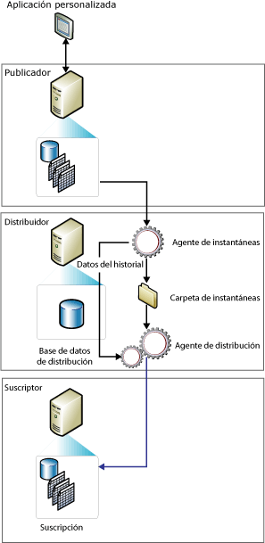

# Replicación de instantáneas
[!INCLUDE[appliesto-ss-asdbmi-xxxx-xxx-md](../../includes/appliesto-ss-asdbmi-xxxx-xxx-md.md)]
  La replicación de instantáneas distribuye los datos exactamente como aparecen en un momento específico en el tiempo y no supervisa las actualizaciones de los datos. Cuando se produce la sincronización, se genera la instantánea completa y se envía a los suscriptores.  
  
> [!NOTE]  
>  La replicación de instantáneas se puede utilizar por sí sola, pero el proceso de instantáneas (que crea una copia de todos los objetos y datos especificados por una publicación) se utiliza habitualmente para proporcionar el conjunto inicial de datos y objetos de base de datos para las publicaciones transaccionales y de combinación.  
  
 El uso independiente de la replicación de instantáneas es más apropiado cuando se cumple una o más de las siguientes condiciones:  
  
-   Los datos no cambian con frecuencia.  
  
-   Es aceptable disponer de copias de datos desfasados respecto al publicador durante un período de tiempo.  
  
-   se duplican pequeñas cantidades de datos.  
  
-   Hay un gran volumen de cambios en un corto período de tiempo.  
  
 La replicación de instantáneas es más apropiada cuando los cambios de datos son importantes, pero poco frecuentes. Por ejemplo, si una organización de ventas mantiene una lista de precios de productos y todos los precios se actualizan al mismo tiempo una o dos veces al año, es recomendable replicar la instantánea completa de los datos una vez que han cambiado. Para determinados tipos de datos pueden ser adecuadas también instantáneas más frecuentes. Por ejemplo, si una tabla relativamente pequeña se actualiza en el publicador durante el día pero es aceptable cierta latencia, los cambios se pueden entregar por la noche como una instantánea.  
  
 La replicación de instantáneas tiene una carga continua más reducida en el publicador que la replicación transaccional, ya que no se realiza ningún seguimiento de los cambios incrementales. No obstante, si el conjunto de datos que se está replicando es muy grande, será necesaria una cantidad importante de recursos para generar y aplicar la instantánea. Tenga en cuenta el tamaño del conjunto de datos entero y la frecuencia de los cambios en los datos al evaluar si utiliza o no la replicación de instantáneas.  
  
 **En este tema**  
  
 [Cómo funciona la replicación de instantáneas](#HowWorks)  
  
 [Agente de instantáneas](#SnapshotAgent)  
  
 [Agente de distribución y Agente de mezcla](#DistAgent)  
  
##   Cómo funciona la replicación de instantáneas  
 De forma predeterminada, los tres tipos de replicación utilizan una instantánea para inicializar suscriptores. El Agente de instantáneas de [!INCLUDE[ssNoVersion](../../includes/ssnoversion-md.md)] siempre genera los archivos de instantáneas, pero el agente que entrega los archivos varía según el tipo de replicación que se utilice. La replicación de instantáneas y la replicación transaccional utilizan el Agente de distribución para entregar los archivos, mientras que la replicación de mezcla utiliza el Agente de mezcla de [!INCLUDE[ssNoVersion](../../includes/ssnoversion-md.md)] . El Agente de instantáneas se ejecuta en el distribuidor. El Agente de distribución y el Agente de mezcla se ejecutan en el distribuidor para las suscripciones de inserción o en los suscriptores para las suscripciones de extracción.  
  
 Las instantáneas se pueden generar y aplicar inmediatamente tras la creación de la suscripción o de acuerdo con una programación establecida en el momento de crear la publicación. El Agente de instantáneas prepara archivos de instantáneas que contienen el esquema y los datos de las tablas y objetos de base de datos publicados, almacena los archivos en la carpeta de instantáneas del publicador y registra la información de seguimiento en la base de datos de distribución del distribuidor. Al configurar un distribuidor se especifica la carpeta de instantáneas predeterminada, pero puede especificar una ubicación alternativa para una publicación en lugar de, o además de, la predeterminada.  
  
 Además del proceso de instantáneas estándar descrito en este tema, se utiliza un proceso de dos partes para las publicaciones de combinación con filtros con parámetros.  
  
 En la ilustración siguiente se muestran los componentes principales de la replicación de instantáneas.  
  
   
  
##   Agente de instantáneas  
 Para la replicación de mezcla se genera una instantánea cada vez que se ejecuta el Agente de instantáneas. Para la replicación transaccional, la generación de instantáneas depende de la configuración de la propiedad de publicación **immediate_sync**. Si la propiedad se define como TRUE (la opción predeterminada cuando se utiliza el Asistente para nueva publicación), se genera una instantánea cada vez que se ejecuta el Agente de instantáneas, y puede aplicarse a un suscriptor en cualquier momento. Si la propiedad se define como FALSE (la opción predeterminada cuando se utiliza **sp_addpublication**), la instantánea se genera solo si se ha agregado una nueva suscripción desde la última ejecución del Agente de instantáneas; los suscriptores deberán esperar a que el Agente de instantáneas finalice para poder sincronizarse.  
  
 El Agente de instantáneas ejecuta los pasos siguientes:  
  
1.  Establece una conexión del distribuidor al publicador y, a continuación, si fuera necesario, adopta bloqueos en las tablas publicadas:  
  
    -   Para las publicaciones de combinación, el Agente de instantáneas no adopta ningún bloqueo.  
  
    -   Para las publicaciones transaccionales, el Agente de instantáneas adopta bloqueos de manera predeterminada únicamente durante la fase inicial de la generación de instantáneas.  
  
    -   Para las publicaciones de instantáneas, adopta bloqueos durante todo el proceso de generación de instantáneas.  
  
2.  Escribe una copia del esquema de la tabla para cada artículo en un archivo .sch. Si se publican otros objetos de base de datos, como índices, restricciones, procedimientos almacenados, vistas, funciones definidas por el usuario, etc., se generan archivos de script adicionales.  
  
3.  Copia los datos de la tabla publicada en el publicador y escribe los datos en la carpeta de instantáneas. La instantánea se genera como un conjunto de archivos de programa de copia masiva (BCP).  
  
4.  En las publicaciones de instantáneas y transaccionales, el Agente de instantáneas anexa filas a las tablas **MSrepl_commands** y **MSrepl_transactions** de la base de datos de distribución. Las entradas de la tabla **MSrepl_commands** son comandos que indican la ubicación de los archivos .sch y .bcp, de cualquier otro archivo de instantáneas y de las referencias a cualquier script anterior o posterior a la instantánea. Las entradas de la tabla **MSrepl_transactions** son comandos importantes para sincronizar el suscriptor.  
  
     En las publicaciones de combinación, el Agente de instantáneas realiza pasos adicionales.  
  
5.  Libera los bloqueos de las tablas publicadas.  
  
 Durante la generación de instantáneas, no es posible realizar cambios en el esquema de las tablas publicadas. Después de generar los archivos de instantáneas, podrá verlos en la carpeta de instantáneas mediante el Explorador de Windows.  
  
##   Agente de distribución y Agente de mezcla  
 En las publicaciones de instantáneas, cada vez que el Agente de distribución se ejecuta para la publicación, mueve una nueva instantánea a cada suscriptor que aún no se ha sincronizado, se ha marcado para volver a inicializarse o incluye nuevos artículos.  
  
 En la replicación de instantáneas y transaccional, el Agente de distribución realiza los siguientes pasos:  
  
1.  Establece una conexión con el distribuidor.  
  
2.  Examina las tablas **MSrepl_commands** y **MSrepl_transactions** de la base de datos de distribución del distribuidor. El agente lee la ubicación de los archivos de instantáneas de la primera tabla y los comandos de sincronización del suscriptor de ambas tablas.  
  
3.  Aplica el esquema y los comandos a la base de datos de suscripciones.  
  
 En una publicación de replicación de mezcla sin filtrar, el Agente de mezcla realiza los siguientes pasos:  
  
1.  Establece una conexión con el publicador.  
  
2.  Examina la tabla **sysmergeschemachange** del publicador y determina si existe una nueva instantánea que deba aplicarse a éste.  
  
3.  Si hay una nueva instantánea disponible, el Agente de mezcla aplica los archivos de instantáneas de la ubicación especificada en **sysmergeschemachange**a la base de datos de suscripciones.  
  
  
