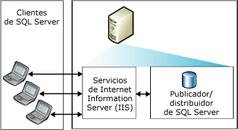
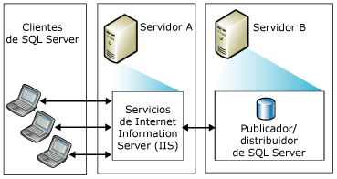
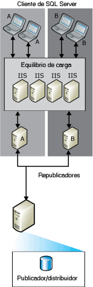

# Topologies for Web Synchronization
 [!INCLUDE [SQL Server](../../includes/applies-to-version/sqlserver.md)]
  Puede elegir entre una serie de topologías de replicación de sincronización web de [!INCLUDE[msCoName](../../includes/msconame-md.md)] [!INCLUDE[ssNoVersion](../../includes/ssnoversion-md.md)]. Entre las maneras habituales de configurar una sincronización web se incluyen:  
  
-   Servidor único  
  
-   Dos servidores  
  
-   Varios sistemas con [!INCLUDE[msCoName](../../includes/msconame-md.md)] Internet Information Services (IIS) y republicación de [!INCLUDE[ssNoVersion](../../includes/ssnoversion-md.md)]  
  
 Para más información sobre cómo configurar la sincronización web, vea [Configurar la sincronización web](../../relational-databases/replication/configure-web-synchronization.md).  
  
## Servidor único  
 En la topología más sencilla, IIS, el publicador de [!INCLUDE[ssNoVersion](../../includes/ssnoversion-md.md)] y el distribuidor de [!INCLUDE[ssNoVersion](../../includes/ssnoversion-md.md)] residen en un único servidor. Los suscriptores se sincronizan conectándose a IIS en el publicador. El publicador puede estar situado detrás de un firewall.  
  
> [!NOTE]  
>  Esta configuración se recomienda solo para intranet. En el resto de las situaciones, se recomienda que el servidor IIS y el distribuidor o publicador de [!INCLUDE[ssNoVersion](../../includes/ssnoversion-md.md)] estén en equipos independientes.  
  
   
  
## Dos servidores  
 Se puede colocar IIS en un servidor y configurar el publicador y el distribuidor de [!INCLUDE[ssNoVersion](../../includes/ssnoversion-md.md)] en otro distinto. El servidor en el que se ejecuta IIS puede aislarse de Internet mediante un firewall. Los suscriptores se sincronizan conectándose a IIS.  
  
   
  
## Varios sistemas IIS y republicación de SQL Server  
 Si dispone de un gran número de suscriptores que se sincronizan al mismo tiempo, puede dividir el trabajo entre varios equipos que ejecuten IIS.  
  
   
  
 Si necesita mayor equilibrio de carga en el equipo en el que se ejecuta [!INCLUDE[ssNoVersion](../../includes/ssnoversion-md.md)], puede crear una jerarquía de republicación en varios equipos. El publicador de más alto nivel publica datos en los suscriptores, que a su vez los vuelven a publicar, con lo que se equilibra la carga de las solicitudes de los suscriptores.  
  
> [!NOTE]  
>  Los suscriptores solo pueden sincronizarse con un publicador específico. Por ejemplo, un suscriptor a un republicador A no puede sincronizarse con el republicador B si A no está disponible.  
  
   
  
## Consulte también  
 [Configurar sincronización web](../../relational-databases/replication/configure-web-synchronization.md)   
 [Sincronización web para la replicación de mezcla](../../relational-databases/replication/web-synchronization-for-merge-replication.md)  
  
  
