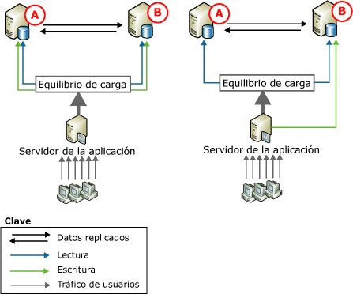
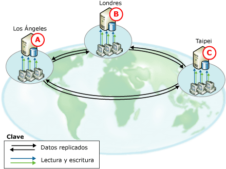
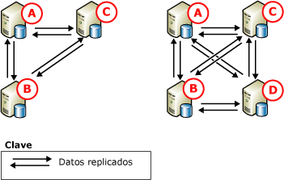

# Replicaci&#243;n transaccional punto a punto
[!INCLUDE[tsql-appliesto-ss2008-xxxx-xxxx-xxx_md](../../../includes/tsql-appliesto-ss2008-xxxx-xxxx-xxx-md.md)]

  Replicación punto a punto proporciona una solución de alta disponibilidad y escalado manteniendo copias de datos entre varias instancias de servidor, también se denomina *nodos*. Generada en la base de replicación transaccional, la replicación punto a punto propaga transaccionalmente los cambios coherentes en tiempo casi real. Esto permite a las aplicaciones que requieran una escalada de las operaciones de lectura distribuir las lecturas de los clientes en varios nodos. Dado que los datos se mantienen en los nodos en tiempo casi real, la replicación punto a punto proporciona redundancia de datos, lo que aumenta la disponibilidad de los mismos.  
  
 Imagine una aplicación web. Ésta se puede beneficiar de la replicación punto a punto de las maneras siguientes:  
  
-   Las consultas del catálogo y otras lecturas se expanden por varios nodos. Esto permite que el rendimiento permanezca coherente conforme aumentan las lecturas.  
  
-   Si se produce un error en uno de los nodos del sistema, un nivel de aplicación puede redirigir las escrituras para dicho nodo a otro. Así se mantiene la disponibilidad.  
  
-   Si un nodo requiere el mantenimiento o el sistema completo requiere una actualización, cada nodo se puede tomar sin conexión y agregar de nuevo al sistema sin que se vea afectada la disponibilidad de la aplicación.  
  
 Aunque la replicación punto a punto habilita la escalada de las operaciones de lectura, el rendimiento de escritura para la topología es similar para un nodo único. Esto se debe a que en última instancia todas las inserciones, actualizaciones y eliminaciones se propagan a todos los nodos. La replicación reconoce cuándo se ha aplicado un cambio a un nodo determinado y evita cambios cíclicos en los nodos más de una vez. Se recomienda encarecidamente que las operaciones de escritura para cada fila se realicen en un solo nodo, por las razones siguientes:  
  
-   Si una fila se modifica en más de un nodo, puede producirse un conflicto o incluso la pérdida de una actualización cuando la fila se propaga a otros nodos.  
  
-   Siempre hay alguna latencia implicada cuando se replican los cambios. Para las aplicaciones que requieren que se vea el cambio más reciente inmediatamente, el equilibrio de carga dinámico de la aplicación en varios nodos puede ser problemático.  
  
 La replicación punto a punto incluye la opción de habilitar la detección de conflictos en una topología punto a punto. Esta opción ayuda a evitar problemas que se producen por conflictos no detectados, como comportamientos incoherentes de las aplicaciones y actualizaciones perdidas. Habilitando esta opción, de forma predeterminada, un cambio conflictivo se trata como un error crítico que produce el error del Agente de distribución. En caso de un conflicto, la topología permanece en un estado incoherente hasta que se resuelve el conflicto manualmente y los datos se hacen coherentes en toda la topología. Para obtener más información, consulte [la detección de conflictos de replicación punto a punto](../../../relational-databases/replication/transactional/conflict-detection-in-peer-to-peer-replication.md).  
  
> [!NOTE]  
>  Para evitar la posible incoherencia de datos, asegúrese de evitar los conflictos en una topología punto a punto, incluso con la detección de conflictos habilitada. Para asegurarse de que las operaciones de escritura para una fila determinada se realizan en un solo nodo, las aplicaciones que tienen acceso y cambian datos deben particionar las operaciones de inserción, actualización y eliminación. Este particionamiento asegura que las modificaciones a una fila determinada que se originan en un nodo están sincronizadas con todos los demás nodos en la topología antes de que se modifique la fila por un nodo diferente. Si una aplicación requiere funcionalidades sofisticadas de detección y resolución de conflictos, use la replicación de mezcla. Para obtener más información, consulte [la replicación de mezcla](../../../relational-databases/replication/merge/merge-replication.md) y [detectar y resolver conflictos de replicación de mezcla](../../../relational-databases/replication/merge/detect-and-resolve-merge-replication-conflicts.md).  
  
## Topologías punto a punto  
 En los siguientes escenarios se ilustran los usos típicos de la replicación punto a punto.  
  
### Topología en la que participan dos bases de datos  
   
  
 En las ilustraciones anteriores se muestran dos bases de datos participantes, con tráfico de usuario dirigido a las bases de datos a través de un servidor de aplicaciones. Esta configuración se puede usar en varias aplicaciones, desde sitios web hasta aplicaciones de grupos de trabajo, y proporciona las siguientes ventajas:  
  
-   Rendimiento de lectura mejorado, porque las lecturas se reparten en dos servidores.  
  
-   Alta disponibilidad si se requiere mantenimiento o en caso de error en un nodo.  
  
 En ambas ilustraciones, la actividad de lectura tiene equilibrio de carga entre las bases de datos participantes, pero las actualizaciones se controlan de forma diferente:  
  
-   En la izquierda, las actualizaciones se particionan entre los dos servidores. Si la base de datos contiene un catálogo de productos, podría, por ejemplo, hacer que una aplicación personalizada dirija las actualizaciones al nodo **A** para los nombres de productos que empiecen con la letra A hasta la M y que dirija las actualizaciones al nodo **B** para los nombres de productos que empiecen con la letra N hasta la Z. Más tarde, las actualizaciones se replican en el otro nodo.  
  
-   A la derecha, todas las actualizaciones se dirigen al nodo **B**. A partir de ahí, las actualizaciones se replican al nodo **A**. Si **B** está sin conexión (por ejemplo, para mantenimiento), el servidor de aplicaciones puede dirigir todas las actividades a **A**. Cuando **B** es en línea, las actualizaciones pueden pasar a él y el servidor de aplicaciones puede mover todas las actualizaciones a **B** o seguir dirigiéndolas a **A**.  
  
 La replicación punto a punto puede admitir este método, pero el ejemplo de actualización centralizada de la derecha también se utiliza frecuentemente con la replicación transaccional estándar.  
  
### Topología en la que participan tres o más bases de datos  
   
  
 En la ilustración anterior se muestran tres bases de datos participantes que proporcionan datos para una organización de soporte de software internacional, con oficinas en Los Ángeles, Londres y Taipei. Los ingenieros de soporte de cada oficina reciben llamadas de clientes e incluyen y actualizan la información de las llamadas de los clientes. Las zonas horarias de las tres oficinas tienen una diferencia de ocho horas, por lo que no se superponen en la jornada laboral. Cuando la oficina de Taipei cierra, se abre la oficina de Londres. Si hay una llamada en curso cuando se cierra una oficina, la llamada se transfiere a un representante de la siguiente oficina abierta.  
  
 Cada ubicación tiene una base de datos y un servidor de aplicaciones, que los ingenieros de soporte utilizan para incluir y actualizar la información de las llamadas de los clientes. La topología se particiona por tiempo. Por consiguiente, las actualizaciones solo se producen en el nodo que está abierto; a continuación, las actualizaciones pasan al resto de bases de datos participantes. Esta topología proporciona las siguientes ventajas:  
  
-   Independencia sin aislamiento: cada oficina puede insertar, actualizar o eliminar datos de forma independiente, pero también puede compartir los datos porque se replican en el resto de bases de datos participantes.  
  
-   Alta disponibilidad en caso de error o para permitir el mantenimiento en una o más de las bases de datos participantes.  
  
       
  
 La ilustración anterior muestra la adición de un nodo a la topología de tres nodos. Se podría agregar un nodo en este escenario por las razones siguientes:  
  
-   Porque se abre otra oficina.  
  
-   Para proporcionar mayor disponibilidad para admitir el mantenimiento o aumentar la tolerancia a errores si se produce un error de disco u otro error principal.  
  
 Observe que en ambas topologías de tres y cuatro nodos, todas las bases de datos publican y se suscriben a todas las demás bases de datos. Esto proporciona la máxima disponibilidad en caso de necesidades de mantenimiento o error de uno o más nodos. Al agregar nodos, se deben equilibrar las necesidades de disponibilidad y escalabilidad respecto al rendimiento y la complejidad de implementación y administración.  
  
## Configurar la replicación punto a punto  
 La configuración de una topología de replicación punto a punto es muy similar a la configuración de una serie de suscripciones y publicaciones transaccionales estándar. En los pasos descritos en los temas siguientes se muestra la configuración de un sistema de tres nodos, similar a la configuración mostrada a la izquierda en la ilustración anterior que muestra topología punto a punto.  
  
## Consideraciones para utilizar la replicación punto a punto  
 Esta sección proporciona información e instrucciones para tener en cuenta al usar la replicación punto a punto.  
  
### Consideraciones generales  
  
-   Replicación punto a punto solo está disponible en las versiones Enterprise de [!INCLUDE[ssNoVersion](../../../includes/ssnoversion-md.md)].  
  
-   Todas las bases de datos que participan en la replicación punto a punto deberían contener datos y esquema idénticos:  
  
    -   Los nombres de objeto, esquema de objeto y nombres de publicación deberían ser idénticos.  
  
    -   Las publicaciones deben permitir la replicación de los cambios de esquema. (Esta es una configuración de **1** para la propiedad de publicación **replicate_ddl**, que es la configuración predeterminada.) Para obtener más información, consulte [hacer cambios de esquema en bases de datos de publicación](../../../relational-databases/replication/publish/make-schema-changes-on-publication-databases.md).  
  
    -   No se admite el filtrado de filas y columnas.  
  
-   Se recomienda que cada nodo use su propia base de datos de distribución. Esto elimina la posibilidad de tener un punto de error único.  
  
-   Las tablas y otros objetos no se pueden incluir en varias publicaciones punto a punto de una única base de datos de publicación.  
  
-   Debe habilitarse una publicación para la replicación punto a punto antes de crear las suscripciones.  
  
-   Las suscripciones se deben inicializar con una copia de seguridad o con la opción **'Solo compatibilidad con replicación'** . Para obtener más información, consulte [inicializar una suscripción transaccional sin una instantánea](../../../relational-databases/replication/initialize-a-transactional-subscription-without-a-snapshot.md).  
  
-   No se recomienda el uso de columnas de identidad. Cuando se utilizan identidades, se deben administrar manualmente los intervalos asignados a las tablas en cada base de datos participante. Para obtener más información, vea la sección "Asignar intervalos para Manual administración intervalos de identidad" en [replicar las columnas de identidad](../../../relational-databases/replication/publish/replicate-identity-columns.md).  
  
### Restricciones de características  
 La replicación punto a punto admite las características principales de replicación transaccional pero no admite las opciones siguientes:  
  
-   Inicialización y reinicialización con una instantánea.  
  
-   Filtros de filas y columnas.  
  
-   Columnas de marca de tiempo.  
  
-   Suscriptores y publicadores que no son de [!INCLUDE[ssNoVersion](../../../includes/ssnoversion-md.md)].  
  
-   Suscripciones de actualización inmediata y de actualización en cola.  
  
-   Suscripciones anónimas.  
  
-   Suscripciones parciales.  
  
-   Suscripciones adjuntables y suscripciones transformables (Ambas opciones han quedado desusadas en [!INCLUDE[ssVersion2005](../../../includes/ssversion2005-md.md)]).  
  
-   Agentes de distribución compartidos.  
  
-   El parámetro de agente de distribución **- SubscriptionStreams** y el parámetro de agente de lector del registro **- MaxCmdsInTran**.  
  
-   Las propiedades del artículo **@destination_owner** y **@destination_table**.

-   Replicación transaccional punto a punto no admite la creación de una suscripción transaccional unidireccional para una publicación punto a punto   
  
 Las siguientes propiedades requieren consideraciones especiales:  
  
-   La propiedad de publicación **@allow_initialize_from_backup** requiere un valor de **true**.  
  
-   La propiedad de artículo **@replicate_ddl** requiere un valor de **true**; **@identityrangemanagementoption** requiere un valor de **manual**; y **@status** requiere que la opción **24** se establece.  
  
-   El valor de las propiedades del artículo **@ins_cmd**, **@del_cmd**, y **@upd_cmd** no puede establecerse en **SQL**.  
  
-   La propiedad de suscripción **@sync_type** requiere un valor de **Ninguno** o **automática**.  
  
### Consideraciones de mantenimiento  
 Las acciones siguientes requieren que el sistema esté inactivo. Esto significa que hay que detener la actividad de las tablas publicadas en todos los nodos y asegurarse de que cada nodo haya recibido todos los cambios de los demás nodos.  
  
||Solo sistemas SQL Server 2005 del mismo nivel o una mezcla de sistemas SQL Server 2005 del mismo nivel con sistemas SQL Server 2008 y superiores del mismo nivel|Solo sistemas SQL Server 2005 del mismo nivel o una mezcla de sistemas SQL Server 2005 del mismo nivel con sistemas SQL Server 2008 y superiores del mismo nivel|Sistemas SQL2008 y versiones posteriores del mismo nivel|Sistemas SQL2008 y versiones posteriores del mismo nivel|  
|-|------------------------------------------------------------------------------------------------------|------------------------------------------------------------------------------------------------------|------------------------------|------------------------------|  
|Agregar un nodo a la topología|2 nodos en una topología completa: no es necesario aplicar inactividad. Utilice `sync_type = 'initialize with backup'`.|Más de 2 nodos: es necesario aplicar inactividad.|`sync_type = 'replication support only'`: es necesario aplicar inactividad.|`sync_type = 'initialize with backup'` y `'initialize from lsn'`: no es necesario aplicar inactividad.|  
  
 Los cambios de esquema de la topología (agregar o quitar un artículo) requieren la aplicación de inactividad. Para obtener más información, consulte [administrar una topología punto a punto &#40; Programación de replicación Transact-SQL &#41;](../../../relational-databases/replication/administration/administer-a-peer-to-peer-topology-replication-transact-sql-programming.md).  
  
 Quitar un nodo de la topología no requiere nunca la aplicación de inactividad.  
  
 Cambiar las propiedades de artículo mediante  [sp_changearticle](../../../relational-databases/system-stored-procedures/sp-changearticle-transact-sql.md) nunca es necesario poner en modo inactivo. Cambios permitidos (para P2P) son el `description`, `ins_cmd`, `upd_cmd`, y `del_cmd` Propiedades.  
  
 Los cambios de esquema de artículo (agregar o quitar columnas) no requieren la aplicación de inactividad.  
  
-   Agregar un artículo: para agregar un artículo a una configuración existente, es necesario poner el sistema en modo de inactividad, ejecutar la instrucción CREATE TABLE y cargar los datos iniciales en cada nodo de la topología, además de agregar el nuevo artículo en cada nodo de la topología.  
  
-   Quitar un artículo: si deseamos un estado coherente en todos los nodos, necesitamos poner la topología en modo inactivo.  
  
 Para obtener más información, consulte [Detener una topología de replicación &#40; Programación de replicación Transact-SQL &#41;](../../../relational-databases/replication/administration/quiesce-a-replication-topology-replication-transact-sql-programming.md) y [administrar una topología punto a punto &#40; Programación de replicación Transact-SQL &#41;](../../../relational-databases/replication/administration/administer-a-peer-to-peer-topology-replication-transact-sql-programming.md).  
  
-   Si agrega un nuevo nodo a una topología punto a punto, debe restaurar solo desde las copias de seguridad que se crearon después de agrega el nuevo nodo.  
  
-   No puede reinicializar las suscripciones en una topología punto a punto. Si tiene que asegurarse de que un nodo tiene una copia nueva de los datos, restaure una copia de seguridad en el nodo.  
  
## Vea también  
 [Administrar una topología punto a punto &#40; Programación de replicación Transact-SQL &#41;](../../../relational-databases/replication/administration/administer-a-peer-to-peer-topology-replication-transact-sql-programming.md)   
 [Estrategias para hacer copias de seguridad y restaurar replicación de instantáneas o replicación transaccional](../../../relational-databases/replication/administration/strategies-for-backing-up-and-restoring-snapshot-and-transactional-replication.md)   
 [Tipos de publicaciones para la replicación transaccional](../../../relational-databases/replication/transactional/publication-types-for-transactional-replication.md)  
  
  