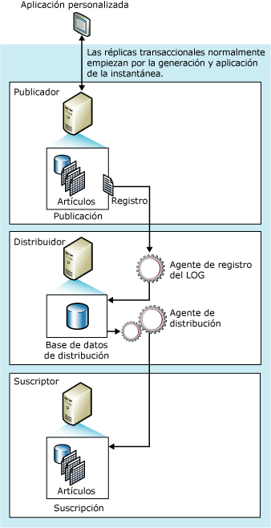

# replicación transaccional
[!INCLUDE[appliesto-ss-xxxx-xxxx-xxx-md](../../../includes/appliesto-ss-xxxx-xxxx-xxx-md.md)]
  Normalmente, la replicación transaccional se inicia con una instantánea de los datos y los objetos de la base de datos de publicaciones. En cuanto se obtiene la instantánea inicial, los posteriores cambios de datos y modificaciones del esquema realizados en el publicador habitualmente se entregan en el suscriptor cuando se producen (casi en tiempo real). Los cambios de datos se aplican al suscriptor en el mismo orden y dentro de los mismos límites de la transacción que cuando se produjeron en el publicador. Por tanto, en una publicación, se garantiza la coherencia transaccional.  
  
 La replicación transaccional se utiliza normalmente en entornos entre servidores y es la adecuada en los siguientes casos:  
  
-   Se desea que se propaguen cambios incrementales a los suscriptores en el momento en que ocurren.  
  
-   La aplicación requiere una latencia baja entre el momento en que se realizan los cambios en el publicador y el momento en que llegan los cambios al suscriptor.  
  
-   La aplicación necesita acceso a los estados intermedios de los datos. Por ejemplo, si una fila cambia cinco veces, la replicación transaccional permite que una aplicación responda a cada cambio (por ejemplo, la activación de un desencadenador) y no solo al cambio de datos neto en la fila.  
  
-   El publicador tiene un volumen elevado de actividad de inserción, actualización y eliminación.  
  
-   El publicador o el suscriptor es una base de datos que no es de[!INCLUDE[ssNoVersion](../../../includes/ssnoversion-md.md)] , como Oracle.  
  
 De forma predeterminada, los suscriptores de publicaciones transaccionales deben tratarse como de solo lectura, porque los cambios no se propagan de vuelta al publicador. Sin embargo, la replicación transaccional ofrece opciones que permiten realizar actualizaciones en el suscriptor  
  
##   Cómo funciona la replicación transaccional  
 La replicación transaccional se implementa con el Agente de instantáneas, el Agente de registro del LOG y el Agente de distribución de [!INCLUDE[ssNoVersion](../../../includes/ssnoversion-md.md)] . El Agente de instantáneas prepara archivos de instantáneas que contienen esquemas y datos de las tablas y objetos de base de datos publicados, almacena los archivos en la carpeta de instantáneas y registra los trabajos de sincronización en la base de datos de distribución del distribuidor.  
  
 El Agente de registro del LOG supervisa el registro de transacciones de cada base de datos configurada para la replicación transaccional y copia las transacciones marcadas para ser replicadas desde el registro de transacciones a la base de datos de distribución, que actúa como una cola de almacenamiento y reenvío confiable. El Agente de distribución copia los archivos de instantáneas iniciales de la carpeta de instantáneas y las transacciones almacenadas en las tablas de la base de datos de distribución a los suscriptores.  
  
 Los cambios incrementales realizados en el publicador se transfieren a los suscriptores de acuerdo con la programación del Agente de distribución, que se puede ejecutar continuamente para que la latencia sea mínima o a intervalos programados. Puesto que los datos deben cambiarse en el publicador (cuando se utiliza la replicación transaccional sin las opciones de actualización inmediata ni de actualización en cola), se evita que se produzcan conflictos de actualización. Al final, todos los suscriptores disponen de los mismos valores que el publicador. Si se utilizan las opciones de actualización inmediata o de actualización en cola con la replicación transaccional, las actualizaciones pueden realizarse en el suscriptor y, con la actualización en cola, pueden producirse conflictos.  
  
 En la siguiente ilustración se muestran los principales componentes de la replicación transaccional.  
  
   
  
##   Conjunto de datos inicial  
 Antes de que un suscriptor de replicación transaccional pueda recibir los cambios incrementales desde un publicador, debe contener tablas con el mismo esquema y los mismos datos que las tablas del publicador. El conjunto de datos inicial es normalmente una instantánea que se crea con el Agente de instantáneas y se distribuye y aplica a través del Agente de distribución. También se puede suministrar el conjunto de datos inicial mediante una copia de seguridad u otro medio, como [!INCLUDE[ssNoVersion](../../../includes/ssnoversion-md.md)] Integration Services.  
  
 Cuando se distribuyen y se aplican instantáneas a los suscriptores, solo se ven afectados los suscriptores que estén esperando instantáneas iniciales. Otros suscriptores de esa publicación (aquellos que ya se han inicializado) no se ven afectados.  
  
## Procesamiento simultáneo de instantáneas  
 La replicación de instantáneas coloca bloqueos compartidos en todas las tablas publicadas como parte de la replicación mientras dure la generación de instantáneas. Así se puede evitar que se realicen actualizaciones en las tablas de publicación. El procesamiento simultáneo de instantáneas, que es el valor predeterminado con la replicación transaccional, no mantiene los bloqueos compartidos durante la generación completa de la instantánea, lo que permite a los usuarios continuar el trabajo sin interrupción mientras la replicación crea los archivos de instantáneas iniciales.  
  
##   Agente de instantáneas  
 Los procedimientos por los que el Agente de instantáneas implementa la instantánea inicial en la replicación transaccional son los mismos que se utilizan en la replicación de instantáneas (excepto en lo indicado anteriormente acerca del procesamiento simultáneo de instantáneas).  
  
 Después de generarse los archivos de instantáneas, podrá verlos en la carpeta de instantáneas mediante el Explorador de [!INCLUDE[msCoName](../../../includes/msconame-md.md)] Windows.  
  
##   Modificar datos y el Agente de registro del LOG  
 El Agente de registro del LOG se ejecuta en el distribuidor. Normalmente se ejecuta de forma continua, pero también puede hacerlo siguiendo una programación establecida. Al ejecutarse, el Agente de registro del LOG lee primero el registro de transacciones de la publicación (el mismo registro de la base de datos que se utiliza para el seguimiento de las transacciones y la recuperación durante las operaciones normales del motor de base de datos de [!INCLUDE[ssNoVersion](../../../includes/ssnoversion-md.md)] ) e identifica las instrucciones INSERT, UPDATE y DELETE, u otras modificaciones efectuadas en los datos de las transacciones que se hayan marcado para ser replicadas. A continuación, el agente copia por lotes dichas transacciones a la base de datos de distribución del distribuidor. El Agente de registro del LOG utiliza el procedimiento almacenado interno **sp_replcmds** para obtener el siguiente conjunto de comandos marcados para replicación desde el registro. La base de datos de distribución se convierte así en una cola de almacenamiento y reenvío desde la que se envían los cambios a los suscriptores. A la base de datos de distribución solo se envían las transacciones confirmadas.  
  
 El lote completo de transacciones se confirma después de que se ha escrito correctamente en la base de datos de distribución. A continuación de la confirmación de cada lote de comandos en el distribuidor, el Agente de registro del LOG llama a **sp_repldone** para marcar hasta dónde se ha llegado en la replicación. Por último, el agente marca las filas del registro de transacciones que están listas para ser purgadas. Las filas que están en espera de ser replicadas no se purgan.  
  
 Los comandos de transacción se almacenan en la base de datos de distribución hasta que se propagan a todos los suscriptores o hasta que se ha alcanzado el período máximo de retención de distribución. Los suscriptores recibirán las transacciones en el mismo orden en que fueron aplicadas en el publicador.  
  
##   Agente de distribución  
 El Agente de distribución se ejecuta en el distribuidor para las suscripciones de inserción y en el suscriptor para las suscripciones de extracción. El Agente mueve las transacciones desde la base de datos de distribución al suscriptor. Si se ha marcado una suscripción para validarla, el Agente de distribución comprueba también si los datos en el publicador y en el suscriptor coinciden.  

## Tipos de publicación 
La replicación transaccional ofrece cuatro tipos de publicaciones:  
  
|Tipo de publicación|Descripción|  
|----------------------|-----------------|  
|Publicación transaccional estándar|Apropiada para topologías en las que todos los datos del suscriptor son de solo lectura (la replicación transaccional no exige que esto se cumpla en el suscriptor).   Las publicaciones transaccionales estándar se crean de manera predeterminada cuando se usa Transact-SQL o Replication Management Objects (RMO). Cuando se utiliza el Asistente para nueva publicación, se crean seleccionando **Publicación transaccional** en la página **Tipo de publicación** .   Para obtener más información sobre la creación de publicaciones, vea [Publish Data and Database Objects (Publicar datos y objetos de base de datos)](../../../relational-databases/replication/publish/publish-data-and-database-objects.md).|  
|Publicación transaccional con suscripciones actualizables|Las características de este tipo de publicación son:   -Cada ubicación tiene datos idénticos, con un publicador y un suscriptor.   -Es posible actualizar las filas en el suscriptor  -Esta topología es más apropiada para los entornos de servidor que necesitan una gran disponibilidad y escalabilidad de lectura.  Para más información, vea [Suscripciones actualizables](../../../relational-databases/replication/transactional/updatable-subscriptions-for-transactional-replication.md).|  
|Topología punto a punto|Las características de este tipo de publicación son:  - Cada ubicación tiene datos idénticos y funciona como publicador y como suscriptor.  - Una misma fila solo se puede cambiar en una ubicación a la vez.  - Admite la [detección de conflictos](../../../relational-databases/replication/transactional/peer-to-peer-conflict-detection-in-peer-to-peer-replication.md)   - Esta topología es más apropiada para los entornos de servidor que necesitan una gran disponibilidad y escalabilidad de lectura.  Para obtener más información, consulte [Peer-to-Peer Transactional Replication](../../../relational-databases/replication/transactional/peer-to-peer-transactional-replication.md).|  
|Replicación transaccional bidireccional|Las características de este tipo de publicación son: La replicación bidireccional es similar a la replicación punto a punto, pero no proporciona resolución de conflictos. Además, la replicación bidireccional se limita a dos servidores.    Para más información, vea [Replicación transaccional bidireccional](../../../relational-databases/replication/transactional/bidirectional-transactional-replication.md). |  
  
  
