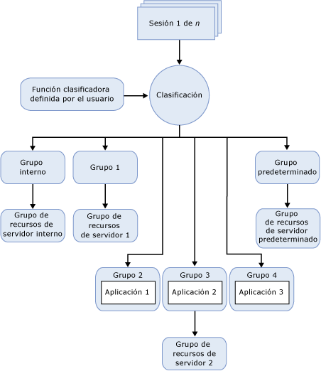

# regulador de recursos
[!INCLUDE[appliesto-ss-asdbmi-xxxx-xxx-md](../../includes/appliesto-ss-asdbmi-xxxx-xxx-md.md)]
  El regulador de recursos de [!INCLUDE[ssNoVersion](../../includes/ssnoversion-md.md)] es una característica que puede usarse para administrar la carga de trabajo y el consumo de recursos del sistema de [!INCLUDE[ssNoVersion](../../includes/ssnoversion-md.md)]. El regulador de recursos permite especificar los límites en cuanto a la cantidad de CPU, E/S física y memoria que pueden usar las solicitudes entrantes procedentes de las aplicaciones.  
  
## Ventajas del regulador de recursos  
 El regulador de recursos que permite administrar las cargas de trabajo y los recursos de [!INCLUDE[ssNoVersion](../../includes/ssnoversion-md.md)] mediante la especificación de los límites del consumo de recursos por solicitudes entrantes. En el contexto del Regulador de recursos, la carga de trabajo es un conjunto de consultas o solicitudes de dimensiones similares que pueden (y deberían) tratarse como una entidad única. No se trata de un requisito, pero cuanto más uniforme es el modelo del uso de recursos de una carga de trabajo, mayores son las ventajas que pueden obtenerse del Regulador de recursos. Los límites sobre los recursos pueden reconfigurarse en tiempo real con un impacto mínimo sobre las cargas de trabajo que se están ejecutando.  
  
 En un entorno donde varias cargas de trabajo distintas están presentes en el mismo servidor, el Regulador de recursos permite diferenciar estas cargas de trabajo y asignar los recursos compartidos a medida que se soliciten, en función de los límites que se especifiquen. Estos recursos son CPU, E/S física y memoria.  
  
 El uso del regulador de recursos permite:  
  
-   Proporcionar aislamiento de recursos y multiempresa cuando una sola instancia de SQL Server suministra servicios a cargas de trabajo de varios clientes. Es decir, puede repartir los recursos disponibles en un servidor entre las cargas de trabajo y minimizar los problemas que pueden aparecer cuando las cargas de trabajo compiten por los recursos.  
  
-   Proporcionar un rendimiento predecible y cumplir los contratos de nivel de servicio para los distintos inquilinos de carga de trabajo en un entorno multiusuario y con varias cargas de trabajo.  
  
-   Aislar y limitar las consultas descontroladas o regular los recursos de E/S para operaciones como DBCC CHECKDB que pueden saturar el subsistema de E/S y afectar negativamente a las otras cargas de trabajo.  
  
-   Agregar un seguimiento detallado de recursos para los reembolsos por uso de recursos y proporcionar una facturación predecible a los clientes de los recursos de servidor.  
  
## Restricciones del Regulador de recursos  
 Esta versión del Regulador de recursos tiene las restricciones siguientes:  
  
-   La administración de recursos se limita a [!INCLUDE[ssDEnoversion](../../includes/ssdenoversion-md.md)]. L Regulador de recursos no se puede utilizar para [!INCLUDE[ssASnoversion](../../includes/ssasnoversion-md.md)], [!INCLUDE[ssISnoversion](../../includes/ssisnoversion-md.md)]y [!INCLUDE[ssRSnoversion](../../includes/ssrsnoversion-md.md)].  
  
-   No hay ninguna supervisión o administración de las cargas de trabajo entre las instancias de SQL Server.  
  
-   El Regulador de recursos puede administrar las cargas de trabajo de OLTP pero estos tipos de consultas, que son normalmente muy cortas en duración, no siempre ocupan la CPU el tiempo suficiente como para aplicar los controles de ancho de banda. Este hecho puede sesgar las estadísticas obtenidas para el porcentaje de uso de la CPU.  
  
-   La capacidad de regular la E/S física solo se aplica a las operaciones de usuario y no a las tareas del sistema. Las tareas del sistema incluyen operaciones de escritura en el registro de transacciones y operaciones diferidas de E/S de escritura. El regulador de recursos se aplica principalmente a las operaciones de lectura de usuario porque la mayoría de las operaciones de escritura suelen ser realizadas por tareas del sistema.  
  
-   No puede establecer umbrales de E/S en el grupo de recursos de servidor interno.  
  
## Conceptos de recursos  
 Los tres conceptos siguientes son fundamentales para comprender y usar el regulador de recursos:  
  
-   **Grupos de recursos de servidor.** Un grupo de recursos de servidor representa los recursos físicos del servidor. Puede pensar en un grupo como en una instancia virtual de [!INCLUDE[ssNoVersion](../../includes/ssnoversion-md.md)] dentro de una instancia de [!INCLUDE[ssNoVersion](../../includes/ssnoversion-md.md)] . Cuando se instala [!INCLUDE[ssNoVersion](../../includes/ssnoversion-md.md)] , se crean dos grupos de recursos de servidor (interno y predeterminado). El regulador de recursos también admite grupos de recursos de servidor definidos por el usuario. Para más información, consulte [Resource Governor Resource Pool](../../relational-databases/resource-governor/resource-governor-resource-pool.md).  
  
-   **Grupos de carga de trabajo.** Un grupo de cargas de trabajo actúa como un contenedor de las solicitudes de sesión que tienen criterios de clasificación similares. Una carga de trabajo permite la supervisión agregada de las sesiones y define directivas para estas. Cada grupo de cargas de trabajo pertenece a un grupo de recursos de servidor. Cuando se instala [!INCLUDE[ssNoVersion](../../includes/ssnoversion-md.md)] , se crean dos grupos de cargas de trabajo (interno y predeterminado) y se asignan a sus grupos de recursos de servidor correspondientes. El regulador de recursos también admite grupos de cargas de trabajo definidos por el usuario. Para obtener más información, consulte [Resource Governor Workload Group](../../relational-databases/resource-governor/resource-governor-workload-group.md).  
  
-   **Clasificación.** El proceso de clasificación asigna las sesiones de entrada a cada grupo de cargas de trabajo según las características de la sesión. Puede adaptar la lógica de clasificación escribiendo una función definida por el usuario, denominada función clasificadora. El regulador de recursos también admite una función clasificadora definida por el usuario para implementar las reglas de la clasificación. Para más información, consulte [Resource Governor Classifier Function](../../relational-databases/resource-governor/resource-governor-classifier-function.md).  
  
> [!NOTE]  
>  El regulador de recursos no impone ningún control sobre las conexiones de administrador dedicadas (DAC). No hay ninguna necesidad de clasificar las consultas de DAC, las cuales se ejecutan en el grupo de cargas de trabajo y en el grupo de recursos de servidor internos.  
  
 En el contexto del regulador de recursos, puede tratar los conceptos anteriores como componentes. La ilustración siguiente muestra estos componentes y su relación entre sí, tal y como existen en el entorno del motor de base de datos. Desde el punto de vista del procesamiento, el flujo simplificado es como sigue:  
  
-   Existe una conexión entrante para una sesión (sesión 1 de *n*).  
  
-   La sesión está clasificada (Clasificación).  
  
-   La carga de trabajo de la sesión se enruta a un grupo de cargas de trabajo, por ejemplo, al Grupo 4.  
  
-   El grupo de cargas de trabajo utiliza el grupo de recursos de servidor al que está asociado, por ejemplo, el Grupo 2.  
  
-   El grupo de recursos de servidor proporciona y limita los recursos requeridos por la aplicación, por ejemplo, la Aplicación 3.  
  
   
  
## Tareas del regulador de recursos  
  
|Descripción de la tarea|Tema|  
|----------------------|-----------|  
|Describe cómo habilitar el regulador de recursos.|[Habilitar el regulador de recursos](../../relational-databases/resource-governor/enable-resource-governor.md)|  
|Describe cómo deshabilitar el regulador de recursos.|[Deshabilitar el regulador de recursos](../../relational-databases/resource-governor/disable-resource-governor.md)|  
|Describe cómo crear, modificar y quitar un grupo de recursos de servidor.|[Grupo de recursos de servidor del regulador de recursos](../../relational-databases/resource-governor/resource-governor-resource-pool.md)|  
|Describe cómo crear, modificar, mover y quitar un grupo de carga de trabajo.|[Grupos de cargas de trabajo del regulador de recursos](../../relational-databases/resource-governor/resource-governor-workload-group.md)|  
|Describe cómo crear y probar una función clasificadora definida por el usuario.|[Función clasificadora del regulador de recursos](../../relational-databases/resource-governor/resource-governor-classifier-function.md)|  
|Describe cómo configurar el regulador de recursos mediante una plantilla.|[Configurar el regulador de recursos utilizando una plantilla](../../relational-databases/resource-governor/configure-resource-governor-using-a-template.md)|  
|Describe cómo ver las propiedades del regulador de recursos.|[Ver las propiedades del regulador de recursos](../../relational-databases/resource-governor/view-resource-governor-properties.md)|  
  
## Consulte también  
 [Instancias del motor de base de datos &#40;SQL Server&#41;](../../database-engine/configure-windows/database-engine-instances-sql-server.md)  
  
  
