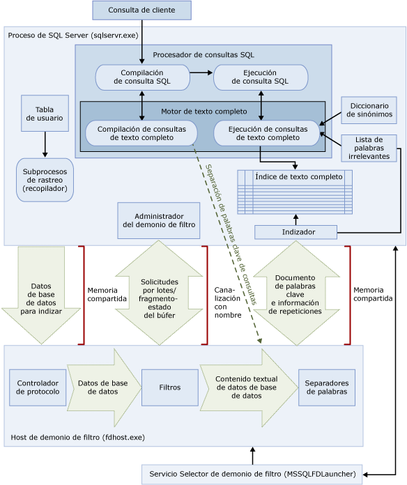

# <a name="full-text-search"></a>Búsqueda de texto completo
[!INCLUDE[appliesto-ss-asdb-xxxx-xxx-md](../../includes/appliesto-ss-asdb-xxxx-xxx-md.md)]

La búsqueda de texto completo en [!INCLUDE[ssNoVersion](../../includes/ssnoversion-md.md)] y [!INCLUDE[ssSDSFull](../../includes/sssdsfull-md.md)] permite a los usuarios y aplicaciones ejecutar consultas de texto completo en datos basados en caracteres en las tablas de [!INCLUDE[ssNoVersion](../../includes/ssnoversion-md.md)] .
  
## <a name="basic-tasks"></a>Tareas básicas
En este tema se proporciona información general sobre la búsqueda de texto completo y se describe su arquitectura y sus componentes. Si prefiere comenzar inmediatamente, estas son las tareas básicas.
-   [Introducción a la búsqueda de texto completo](../../relational-databases/search/get-started-with-full-text-search.md)
-   [Crear y administrar catálogos de texto completo](../../relational-databases/search/create-and-manage-full-text-catalogs.md)
-   [Crear y administrar índices de texto completo](../../relational-databases/search/create-and-manage-full-text-indexes.md)
-   [Rellenar índices de texto completo](../../relational-databases/search/populate-full-text-indexes.md)
-   [Consultar con búsqueda de texto completo](../../relational-databases/search/query-with-full-text-search.md)

> [!NOTE]
> Full-Text Search is an optional component of the [!INCLUDE[ssNoVersion](../../includes/ssnoversion-md.md)] . Si no ha seleccionado la búsqueda de texto completo al instalar SQL Server, ejecute de nuevo el programa de instalación de SQL Server para agregarla.

## <a name="overview"></a>Información general
Los índices de texto completo incluyen una o varias columnas basadas en caracteres en una tabla. Estas columnas pueden tener cualquier de los siguientes tipos de datos: **char**, **varchar**, **nchar**, **nvarchar**, **text**, **ntext**, **image**, **xml** o **varbinary(max)** y **FILESTREAM**. Cada índice de texto completo indiza una o varias columnas de la tabla base y cada columna puede usar un idioma concreto.  
  
 Las consultas de texto completo realizan las búsquedas lingüísticas en los datos de texto de los índices de texto completo sobre palabras y frases basándose en las reglas de un idioma determinado, como inglés o japonés. Las consultas de texto completo pueden contener palabras y frases sencillas, o formas diversas de una palabra o frase. Una consulta de texto completo devuelve todos los documentos que contienen por lo menos una coincidencia (también se conoce como *acierto*). Se produce una coincidencia cuando un documento de destino contiene todas las condiciones especificadas en la consulta de texto completo y cumple cualquier otra condición de búsqueda, como la distancia entre los términos que coinciden.    
  
##  <a name="queries"></a> Consultas de búsqueda de texto completo  
 Una vez agregadas las columnas a un índice de texto completo, los usuarios y aplicaciones pueden ejecutar las consultas de texto completo en el texto de las columnas. Estas consultas pueden buscar cualquiera de lo siguiente:  
  
-   Una o varias palabras o frases específicas (*término simple*)  
  
-   Una palabra o frase cuyas palabras empiezan por un texto determinado (*término de prefijo*)  
  
-   Formas con inflexión de una palabra determinada (*término de generación*)  
  
-   Una palabra o frase que esté cerca de otra palabra o frase (*término de proximidad*)  
  
-   Formas sinónimas de una palabra determinada (*diccionario de sinónimos*)  
  
-   Palabras o frases que usan valores ponderados (*término ponderado*)  
  
 Las consultas de texto completo no distinguen entre mayúsculas y minúsculas. Por ejemplo, la búsqueda de "Aluminio" o "aluminio" devuelve los mismos resultados.  
  
 Las consultas de texto completo usan un pequeño conjunto de predicados [!INCLUDE[tsql](../../includes/tsql-md.md)] (CONTAINS y FREETEXT) y funciones  (CONTAINSTABLE y FREETEXTTABLE). Sin embargo, los objetivos de la búsqueda en un escenario empresarial determinado influyen en la estructura de las consultas de texto completo. Por ejemplo:  
  
-   e-business: búsqueda de un producto en un sitio web:  
  
    ```  
    SELECT product_id   
    FROM products   
    WHERE CONTAINS(product_description, "Snap Happy 100EZ" OR FORMSOF(THESAURUS,'Snap Happy') OR '100EZ')   
    AND product_cost < 200 ;  
    ```  
  
-   Escenario de contratación de empleados: búsqueda de candidatos para un puesto de trabajo que tengan experiencia en [!INCLUDE[ssNoVersion](../../includes/ssnoversion-md.md)]:  
  
    ```  
    SELECT candidate_name,SSN   
    FROM candidates   
    WHERE CONTAINS(candidate_resume,"SQL Server") AND candidate_division =DBA;  
    ```  
  
 Para obtener más información, vea [Consultar con búsqueda de texto completo](../../relational-databases/search/query-with-full-text-search.md).  
  
##  <a name="like"></a> Comparar las consultas de búsqueda de texto completo en el predicado LIKE
 A diferencia de la búsqueda de texto completo, el predicado [LIKE](../../t-sql/language-elements/like-transact-sql.md) de [!INCLUDE[tsql](../../includes/tsql-md.md)] funciona solamente en patrones de caracteres. Además, no es posible utilizar el predicado de LIKE para consultar datos binarios con formato. Por otro lado, una consulta LIKE contra una cantidad grande de datos de texto no estructurados es mucho más lenta que una consulta de texto completo equivalente contra los mismos datos. Una consulta LIKE realizada en millones de filas de datos de texto puede tardar minutos en devolver resultados, mientras que una consulta de texto completo en los mismos datos puede tardar únicamente segundos, en función del número de filas que se devuelvan.  
  
##  <a name="architecture"></a> Arquitectura de la búsqueda de texto completo
 La arquitectura de búsqueda de texto completo consta de los procesos siguientes:  
  
-   Proceso de [!INCLUDE[ssNoVersion](../../includes/ssnoversion-md.md)] (sqlserver.exe).  
  
-   Proceso de host de demonio de filtro (fdhost.exe).  
  
     Por razones de seguridad, los filtros se cargan mediante procesos independientes denominados hosts de demonio de filtro. El servicio iniciador de FDHOST (MSSQLFDLauncher) crea los procesos de fdhost.exe, que se ejecutan con las credenciales de seguridad de la cuenta de servicio del iniciador de FDHOST. Por consiguiente, el servicio iniciador de FDHOST debe estar en ejecución para que la indización de texto completo y la consulta de texto completo funcionen. Para obtener más información sobre cómo configurar la cuenta de servicio para este servicio, vea [Establecer la cuenta del servicio para el selector del demonio de filtro completo](../../relational-databases/search/set-the-service-account-for-the-full-text-filter-daemon-launcher.md).  
  
 Estos dos procesos contienen los componentes de la arquitectura de búsqueda de texto completo. Estos componentes y sus relaciones se resumen en la ilustración siguiente. Los componentes se describen después de la ilustración.  
  
   

###  <a name="sqlprocess"></a> Proceso de SQL Server  
 El proceso de [!INCLUDE[ssNoVersion](../../includes/ssnoversion-md.md)] usa los componentes siguientes para la búsqueda de texto completo:  
  
-   **Tablas de usuario.** Esta tablas contienen los datos cuyo texto completo se indizará.  
  
-   **Recopilador de texto completo.** El recopilador de texto completo trabaja con los subprocesos de rastreo de texto completo (rellenado). Es responsable de programar y dirigir el rellenado de índices de texto completo, y también de supervisar los catálogos de texto completo.  
  
-   **Archivos de sinónimos.** Estos archivos contienen sinónimos de los términos de búsqueda. Para obtener más información, vea [Configurar y administrar archivos de sinónimos para búsquedas de texto completo](../../relational-databases/search/configure-and-manage-thesaurus-files-for-full-text-search.md).  
  
-   **Objetos de listas de palabras irrelevantes.** Los objetos de listas de palabras irrelevantes contienen una lista de palabras comunes que no son útiles para la búsqueda. Para obtener más información, vea [Configurar y administrar palabras irrelevantes y listas de palabras irrelevantes para la búsqueda de texto completo](../../relational-databases/search/configure-and-manage-stopwords-and-stoplists-for-full-text-search.md).  
  
-   **[!INCLUDE[ssNoVersion](../../includes/ssnoversion-md.md)] procesador de consultas.** El procesador de consultas compila y ejecuta consultas SQL. Si una consulta SQL incluye una consulta de búsqueda de texto completo, la consulta se envía al motor de texto completo, durante la compilación y durante la ejecución. El resultado de la consulta se hace coincidir con el índice de texto completo.  
  
-   **Motor de búsqueda de texto completo.** El motor de texto completo de [!INCLUDE[ssNoVersion](../../includes/ssnoversion-md.md)] se integra ahora totalmente con el procesador de consultas. El motor de texto completo compila y ejecuta consultas de texto completo. Como parte de la ejecución de consultas, el motor de texto completo puede recibir entradas del diccionario de sinónimos y de la lista de palabras irrelevantes.  

    >[!NOTE]  
    >  En [!INCLUDE[ssKatmai](../../includes/sskatmai-md.md)] y versiones posteriores, el motor de texto completo reside en el proceso de [!INCLUDE[ssNoVersion](../../includes/ssnoversion-md.md)] , en lugar de en un servicio independiente. Al integrar el motor de texto completo en el motor de base de datos, se mejoró la capacidad de administración de texto completo, la optimización de consultas mixtas y el rendimiento total.  
 
-   **Escritor de índices (indizador).** El escritor de índices genera la estructura que se utiliza para almacenar los tokens indizados.  
  
-   **Administrador del demonio de filtro.** El administrador del demonio de filtro es responsable de supervisar el estado del host de demonio de filtro del motor de texto completo.  
  
###  <a name="fdhostprocess"></a> Filter Daemon Host process  
 El host de demonio de filtro es un proceso iniciado por el motor de texto completo. Ejecuta los componentes de búsqueda de texto completo siguientes, que son responsables de obtener acceso a los datos de las tablas, filtrarlos y separar las palabras de esos datos, así como de separar las palabras y lematizar la entrada de la consulta.  
  
 Los componentes del proceso de host de demonio de filtro son los siguientes:  
  
-   **Controlador de protocolo.** Este componente extrae los datos de la memoria para su posterior procesamiento y tiene acceso a los datos de una tabla de usuario de una base de datos especificada. Una de sus responsabilidades es recopilar los datos de las columnas con indización de texto completo y pasarlos al host de demonio de filtro, que aplicará el filtrado y la separación de palabras cuando sea necesario.  
  
-   **Filtros.** Algunos tipos de datos requieren un filtrado para que los datos de un documento puedan indexarse con texto completo, incluso los datos de las columnas **varbinary**, **varbinary(max)**, **image**o **xml** columns. El filtro utilizado para un documento determinado depende de su tipo de documento. Por ejemplo, se utilizan filtros diferentes para los documentos de Microsoft Word (.doc), de Microsoft Excel (.xls) y XML (.xml). A continuación, el filtro extrae fragmentos de texto del documento, mientras quita el formato incrustado y conserva el texto y, potencialmente, la información sobre la posición del mismo. El resultado es un flujo de información de texto. Para obtener más información, vea [Configurar y administrar filtros para búsquedas](../../relational-databases/search/configure-and-manage-filters-for-search.md).  
  
-   **Separadores de palabras y lematizadores.** Un separador de palabras es un componente específico del idioma que busca los límites de palabras según las reglas léxicas de un idioma determinado (*separación de palabras*). Cada separador de palabras está asociado a un componente de lematizador específico del idioma que conjuga los verbos y realiza las expansiones flexionales. Al realizar la indización, el host de demonio de filtro utiliza un separador de palabras y un lematizador para realizar el análisis lingüístico de los datos de texto de una columna de la tabla determinada. El lenguaje asociado a una columna de la tabla en el índice de texto completo determina qué separador de palabras y lematizador se utilizan para indizar la columna. Para obtener más información, vea [Configurar y administrar separadores de palabras y lematizadores para la búsqueda](../../relational-databases/search/configure-and-manage-word-breakers-and-stemmers-for-search.md).  
  
##  <a name="processing"></a> Proceso de búsqueda de texto completo  
 La búsqueda de texto completo se realiza gracias al motor de texto completo. El motor de texto completo desempeña dos roles: la indización y las consultas.  
  
###  <a name="indexing"></a> Proceso de indización de texto completo  
 Cuando se inicia un rellenado de texto completo (también conocido como rastreo), el motor de texto completo inserta lotes grandes de datos en la memoria y lo notifica al host de demonio de filtro. El host filtra y establece separaciones de palabras en los datos, y convierte los datos convertidos en las listas de palabras invertidas. A continuación, la búsqueda de texto completo extrae los datos convertidos de las listas de palabras, procesa los datos para quitar las palabras irrelevantes y conserva las listas de palabras para un lote en uno o varios índices invertidos.  
  
 Al indexar datos almacenados en una columna **varbinary(max)** o **image** , el filtro, que implementa la interfaz **IFilter** , extrae texto basándose en el formato de archivo especificado para los datos (por ejemplo, [!INCLUDE[msCoName](../../includes/msconame-md.md)] Word). En algunos casos, los componentes de filtro requieren que los datos de tipo **varbinary(max)** o **image** se escriban en la carpeta de filtro de datos, en lugar de insertarse en la memoria.  
  
 Como parte del procesamiento, los datos de texto recopilados se pasan a través de un separador de palabras para dividir el texto en tokens o palabras clave individuales. El idioma que se usa para la tokenización se especifica en el nivel de columna o bien se identifica en los datos **varbinary(max)**, **image**o **xml** por medio del componente de filtro.  
  
 Puede llevarse a cabo un procesamiento adicional para quitar las palabras irrelevantes y normalizar los tokens antes de que se almacenen en el índice de texto completo o en un fragmento de índice.  
  
 Cuando se completa un rellenado, se desencadena un proceso de combinación final que combina los fragmentos de índice en un solo índice de texto completo maestro. Esto permite mejorar el rendimiento de las consultas, ya que únicamente es necesario realizar consultas en el índice maestro, en lugar de hacerlo en varios fragmentos de índice, y se pueden utilizar mejores estadísticas de puntuación para obtener la clasificación por relevancia.  
  
###  <a name="querying"></a> Proceso de consultas de texto completo  
 El procesador de consultas pasa las partes de texto completo de una consulta al Motor de búsqueda de texto completo para procesarlas. El motor de búsqueda de texto completo realiza la separación de palabras y, opcionalmente, expansiones del diccionario de sinónimos, lematización y procesamiento de las palabras irrelevantes. A continuación, las partes de texto completo de la consulta se representan en forma de operadores de SQL, principalmente como funciones con valores de tabla de transmisión por secuencias (STVF). Durante la ejecución de la consulta, las STVF tienen acceso al índice invertido para recuperar los resultados correctos. Los resultados se devuelven en este punto al cliente o se siguen procesando antes de devolverse al cliente.  

## <a name="full-text-index-architecture"></a>Arquitectura de los índices de texto completo
  El motor de búsqueda de texto completo utiliza la información de los índices de texto completo para compilar las consultas de texto completo que pueden buscar rápidamente en una tabla palabras o combinaciones de palabras determinadas. Un índice de texto completo almacena información sobre las palabras relevantes y su ubicación en una o varias columnas de la tabla de una base de datos. Un índice de texto completo es un tipo especial de índice funcional basado en token que el motor de texto completo genera y mantiene para [!INCLUDE[ssNoVersion](../../includes/ssnoversion-md.md)]. El proceso de creación de un índice de texto completo difiere de la creación de otros tipos de índice. En lugar de crear una estructura de árbol B basada en un valor almacenado en una fila determinada, el motor de texto completo genera una estructura de índice invertida, apilada y comprimida que se basa en tokens individuales del texto que se indiza.  El tamaño de un índice de texto completo solo está limitado por los recursos de memoria disponibles del equipo en el que se ejecuta la instancia de [!INCLUDE[ssNoVersion](../../includes/ssnoversion-md.md)] .  
  
 A partir de [!INCLUDE[ssKatmai](../../includes/sskatmai-md.md)], los índices de texto completo se integran con el motor de base de datos, en lugar de residir en el sistema de archivos como en versiones anteriores de [!INCLUDE[ssNoVersion](../../includes/ssnoversion-md.md)]. Para una base de datos nueva, el catálogo de texto completo es ahora un objeto virtual que no pertenece a ningún grupo de archivos; es simplemente un concepto lógico que hace referencia al grupo de índices de texto completo. Debe tener en cuenta que, durante la actualización de una base de datos de [!INCLUDE[ssVersion2005](../../includes/ssversion2005-md.md)] , para cualquier catálogo de texto completo que contenga archivos de datos, se crea un nuevo grupo de archivos. Para obtener más información, vea [Actualizar la búsqueda de texto completo](../../relational-databases/search/upgrade-full-text-search.md).  
  
Solo se permite un índice de texto completo por cada tabla. Para crear un índice de texto completo en una tabla, ésta debe tener una única columna que no contenga valores NULL. Puede crear un índice de texto completo en columnas de tipo **char**, **varchar**, **nchar**, **nvarchar**, **text**, **ntext**, **image**, **xml**, **varbinary**y **varbinary(max)** , que se pueden indexar para efectuar una búsqueda de texto completo. Si se crea un índice de texto completo en una columna cuyo tipo de datos es  **varbinary**, **varbinary(max)**, **image**o **xml** , deberá especificar una columna de tipo. Una *columna de tipo* es una columna de tabla en la que se almacena la extensión de archivo (.doc, .pdf, .xls, etc.) del documento en cada fila.  

###  <a name="structure"></a> Estructura de los índices de texto completo  
 Para comprender el funcionamiento del motor de texto completo, es necesario entender la estructura de un índice de texto completo. En este tema se utiliza el extracto siguiente de la tabla **Document** de [!INCLUDE[ssSampleDBCoShort](../../includes/sssampledbcoshort-md.md)] como tabla de ejemplo. Este extracto muestra solo dos columnas, **DocumentID** y **Title** , y tres filas de la tabla.  
  
 En este ejemplo se presupone que se ha creado un índice de texto completo en la columna **Title** .  
  
|DocumentID|Title|  
|----------------|-----------|  
|1|Crank Arm and Tire Maintenance|  
|2|Front Reflector Bracket and Reflector Assembly 3|  
|3|Front Reflector Bracket Installation|  
  
 Por ejemplo, en la tabla siguiente, en la que se muestra el fragmento 1, aparece el contenido del índice de texto completo creado en la columna **Title** de la tabla **Document** . Los índices de texto completo contienen más información que la que se presenta en esta tabla. La tabla es una representación lógica de un índice de texto completo y se proporciona solo como demostración. Las filas están almacenadas en un formato comprimido para optimizar el uso del disco.  
  
 Observe que los datos se han invertido en comparación con los documentos originales. La inversión se produce porque las palabras clave se asignan a los identificadores del documento. Por esta razón, se suele hacer referencia a un índice de texto completo como índice invertido.  
  
 Observe también que la palabra clave "y" se ha quitado del índice de texto completo. Se hace esto porque "y" es una palabra irrelevante y quitar las palabras irrelevantes de un índice de texto completo puede conllevar un ahorro sustancial en el espacio en disco y mejorar por tanto el rendimiento de las consultas. Para obtener más información sobre las palabras irrelevantes, vea [Configurar y administrar palabras irrelevantes y listas de palabras irrelevantes para la búsqueda de texto completo](../../relational-databases/search/configure-and-manage-stopwords-and-stoplists-for-full-text-search.md).  
  
 **Fragmento 1**  
  
|Palabra clave|ColId|DocId|Repetición|  
|-------------|-----------|-----------|----------------|  
|Crank|1|1|1|  
|Arm|1|1|2|  
|Tire|1|1|4|  
|Mantenimiento|1|1|5|  
|Front|1|2|1|  
|Front|1|3|1|  
|Reflector|1|2|2|  
|Reflector|1|2|5|  
|Reflector|1|3|2|  
|Bracket|1|2|3|  
|Bracket|1|3|3|  
|Ensamblado|1|2|6|  
|3|1|2|7|  
|Installation|1|3|4|  
  
 La columna **Keyword** contiene una representación de un solo token extraído durante la indización. Los separadores de palabras determinan en qué consiste un token.  
  
 La columna **ColId** contiene un valor correspondiente a una determinada tabla y columna indexada de texto completo.  
  
 La columna **DocId** contiene valores de un entero de ocho bytes que se asigna a un determinado valor de clave de texto completo en una tabla indexada de texto completo. Esta asignación es necesaria cuando la clave de texto completo no es de un tipo de datos enteros. En casos como este, las asignaciones entre los valores de clave de texto completo y los valores de **DocId** se mantienen en una tabla independiente denominada tabla de asignación de DocId. Para consultar estas asignaciones, use el procedimiento almacenado del sistema [sp_fulltext_keymappings](../../relational-databases/system-stored-procedures/sp-fulltext-keymappings-transact-sql.md) . Para satisfacer una condición de búsqueda, los valores de DocId de la tabla anterior tienen que combinarse con la tabla de asignaciones de DocId para recuperar las filas de la tabla base que se consulta. Si el valor de la clave de texto completo de la tabla base es de un tipo entero, el valor actúa directamente como DocId y no se necesita ninguna asignación. Por consiguiente, utilizar valores de clave de texto completo enteros puede ayudar a optimizar las consultas de texto completo.  
  
 La columna **Occurrence** contiene un valor entero. Para cada valor de DocId hay una lista de valores de repetición correspondientes a las posiciones relativas de una palabra clave determinada en DocId. Los valores de repetición son útiles para determinar las coincidencias de frases o de proximidad, por ejemplo, frases que tienen valores de repetición adyacentes. También son útiles para calcular las puntuaciones de importancia; por ejemplo, el número de repeticiones de una palabra clave en una columna DocId se puede utilizar para determinar la puntuación.   
  
###  <a name="fragments"></a> Fragmentos de índices de texto completo  
 El índice de texto completo lógico normalmente se divide entre varias tablas internas. Cada tabla interna se conoce como un fragmento del índice de texto completo. Algunos de estos fragmentos podrían contener datos más recientes que otros. Por ejemplo, si un usuario actualiza la fila siguiente cuyo DocId es 3 y la tabla se somete automáticamente a seguimiento de los cambios, se crea un fragmento nuevo.  
  
|DocumentID|Title|  
|----------------|-----------|  
|3|Rear Reflector|  
  
 En el ejemplo siguiente, que muestra el fragmento 2, el fragmento contiene los datos más recientes sobre el DocId 3 comparados con el fragmento 1. Por consiguiente, cuando el usuario consulta "Rear Reflector", se usan los datos del fragmento 2 correspondientes a DocId 3. Cada fragmento se marca con una marca de tiempo de creación que se puede consultar usando la vista de catálogo [sys.fulltext_index_fragments](../../relational-databases/system-catalog-views/sys-fulltext-index-fragments-transact-sql.md) .  
  
 **Fragmento 2**  
  
|Palabra clave|ColId|DocId|Occ|  
|-------------|-----------|-----------|---------|  
|Rear|1|3|1|  
|Reflector|1|3|2|  
  
 Como se puede ver en el fragmento 2, las consultas de texto completo tienen que consultar cada fragmento internamente y descartar las entradas más antiguas. Por consiguiente, demasiados fragmentos del índice de texto completo pueden conducir a una degradación sustancial del rendimiento de las consultas. Para reducir el número de fragmentos, reorganice el catálogo de texto completo mediante la opción REORGANIZE de la instrucción [ALTER FULLTEXT CATALOG](../../t-sql/statements/alter-fulltext-catalog-transact-sql.md)[!INCLUDE[tsql](../../includes/tsql-md.md)] . Esta instrucción lleva a cabo una *combinación maestra*, que combina todos los fragmentos en un único fragmento mayor y quita todas las entradas obsoletas del índice de texto completo.  
  
 Después de la reorganización, el índice del ejemplo contendría las filas siguientes:  
  
|Palabra clave|ColId|DocId|Occ|  
|-------------|-----------|-----------|---------|  
|Crank|1|1|1|  
|Arm|1|1|2|  
|Tire|1|1|4|  
|Mantenimiento|1|1|5|  
|Front|1|2|1|  
|Rear|1|3|1|  
|Reflector|1|2|2|  
|Reflector|1|2|5|  
|Reflector|1|3|2|  
|Bracket|1|2|3|  
|Ensamblado|1|2|6|  
|3|1|2|7|  

### <a name="differences-between-full-text-indexes-and-regular-sql-server-indexes"></a>Diferencias entre los índices de texto completo y los índices normales de SQL Server:  
  
|Índices de texto completo|Índices normales de SQL Server|  
|------------------------|--------------------------------|  
|Solo se permite un índice de texto completo por cada tabla.|Se permiten varios índices normales por cada tabla.|  
|La adición de datos a los índices de texto completo, operación que recibe el nombre de *rellenado*, puede solicitarse mediante una programación o una solicitud específica, o bien realizarse automáticamente al agregar nuevos datos.|Se actualizan automáticamente cuando se insertan, actualizan o eliminan los datos en los que están basados.|  
|Se agrupan en la misma base de datos en uno o más catálogos de texto completo.|No se agrupan.|  

##  <a name="components"></a> Compatibilidad con idiomas y componentes lingüísticos de la búsqueda de texto completo
 La búsqueda de texto completo admite casi 50 idiomas distintos, como inglés, español, chino, japonés, árabe, bengalí e hindi. Para obtener una lista completa de los idiomas de texto completo compatibles, vea [sys.fulltext_languages &#40;Transact-SQL&#41;](../../relational-databases/system-catalog-views/sys-fulltext-languages-transact-sql.md). Cada una de las columnas incluidas en el índice de texto completo está asociada a un identificador de configuración regional (LCID) de Microsoft Windows que se corresponde con un idioma compatible con la búsqueda de texto completo. Por ejemplo, el LCID 1033 corresponde al inglés de Estados Unido y el LCID 2057 corresponde al inglés de Reino Unido. Para cada idioma de texto completo compatible, [!INCLUDE[ssNoVersion](../../includes/ssnoversion-md.md)] proporciona componentes lingüísticos que permiten indizar y consultar los datos de texto completo almacenados en ese idioma.  
  
 Entre los componentes específicos del idioma se incluyen los siguientes:  
  
-   **Separadores de palabras y lematizadores.** Un separador de palabras busca los límites de palabra en función de las reglas léxicas de un idioma concreto (*separación de palabras*). Cada separador de palabras está asociado a un lematizador que conjuga los verbos para dicho idioma. Para obtener más información, vea [Configurar y administrar separadores de palabras y lematizadores para la búsqueda](../../relational-databases/search/configure-and-manage-word-breakers-and-stemmers-for-search.md).  
  
-   **Listas de palabras irrelevantes.** Se proporciona una lista de palabras irrelevantes del sistema que contiene un conjunto básico de palabras irrelevantes (denominadas también palabras vacías). Una *palabra irrelevante* es una palabra que no aporta nada a la búsqueda y que se omite en las consultas de texto completo. Por ejemplo, en la configuración regional en inglés, las palabras como "a", "and", "is" y "the" se consideran palabras irrelevantes. Normalmente, tendrá que configurar uno o varios archivos de diccionario de sinónimos y listas de palabras irrelevantes. Para obtener más información, vea [Configurar y administrar palabras irrelevantes y listas de palabras irrelevantes para la búsqueda de texto completo](../../relational-databases/search/configure-and-manage-stopwords-and-stoplists-for-full-text-search.md).  
  
-   **Archivos de sinónimos.** [!INCLUDE[ssNoVersion](../../includes/ssnoversion-md.md)] instala también un archivo de diccionario de sinónimos para cada idioma de texto completo, además de un archivo de diccionario de sinónimos global. Los archivos de diccionario de sinónimos instalados son básicamente archivos vacíos, pero puede modificarlos para definir los sinónimos de un determinado idioma o escenario empresarial. Al desarrollar un diccionario de sinónimos personalizado para los datos de texto completo, puede ampliar de forma eficaz el ámbito de las consultas de texto completo en esos datos. Para obtener más información, vea [Configurar y administrar archivos de sinónimos para búsquedas de texto completo](../../relational-databases/search/configure-and-manage-thesaurus-files-for-full-text-search.md).  
  
-   **Filtros (iFilters).**  La indexación de un documento en una columna de tipo de datos **varbinary(max)**, **image**o **xml** requiere un filtro que realice el procesamiento adicional. El filtro debe ser específico del tipo de documento (.doc, .pdf, .xls, .xml, etc.). Para obtener más información, vea [Configurar y administrar filtros para búsquedas](../../relational-databases/search/configure-and-manage-filters-for-search.md).  
  
 Los separadores de palabras (y lematizadores) y los filtros se ejecutan en el proceso de host de demonio de filtro (fdhost.exe).  

[!INCLUDE[tsql-appliesto-ss2008-asdb-xxxx-xxx_md](../../includes/tsql-appliesto-ss2008-asdb-xxxx-xxx-md.md)]

