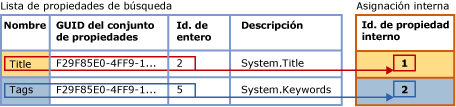
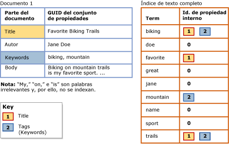

# <a name="search-document-properties-with-search-property-lists"></a>Buscar propiedades de documento con listas de propiedades de búsqueda
[!INCLUDE[appliesto-ss-asdb-xxxx-xxx-md](../../includes/appliesto-ss-asdb-xxxx-xxx-md.md)] Anteriormente, el contenido de las propiedades de documento no podía distinguirse del contenido del cuerpo del documento. Esta limitación restringía las consultas de texto completo a búsquedas genéricas en documentos enteros. En cambio, ahora puede configurar un índice de texto completo para efectuar búsquedas referentes a determinadas propiedades, como Author y Title, en los tipos de documento admitidos en una columna **varbinary**, **varbinary(max)** (incluido **FILESTREAM**) o una columna de datos binarios de **imagen** . Esta forma de búsqueda se denomina *búsqueda de propiedades*.  
  
 El [filtro](../../relational-databases/search/configure-and-manage-filters-for-search.md) asociado (IFilter) determina si la búsqueda de propiedades es posible en un tipo de documento específico. En algunos tipos de documento, el IFilter asociado extrae algunas o todas las propiedades definidas para ese tipo de documento, así como el contenido del cuerpo del documento. Puede configurar un índice de texto completo para que admita la búsqueda de propiedades solo en aquellas propiedades extraídas por un IFilter durante la indización de texto completo. Entre los IFilters que extraen muchas propiedades de documento se encuentran los IFilters para tipos de documento de Microsoft Office (como .docx, .xlsx y .pptx). Por otra parte, el IFilter XML no emite propiedades.  
  
##  <a name="How_FTS_Works_with_search_properties"></a> Funcionamiento de la búsqueda de texto completo con las propiedades de búsqueda  
  
### <a name="internal-property-ids"></a>Identificadores de propiedades internos  
 El Motor de búsqueda de texto completo asigna a cada propiedad registrada un identificador de propiedad interno, que identifica de manera inequívoca la propiedad en esa lista de búsqueda determinada y que es específico de esa lista de propiedades de búsqueda. Por consiguiente, si una propiedad se agrega a varias listas de propiedades de búsqueda, es probable que su identificador de propiedad interno difiera entre las diferentes listas.  
  
 Cuando una propiedad se registra en una lista de búsqueda, el Motor de búsqueda de texto completo asigna arbitrariamente a la propiedad un *identificador de propiedad interno* . El identificador de propiedad interno es un entero que identifica de manera inequívoca la propiedad de esa lista de propiedades de búsqueda.  
  
 En la ilustración siguiente se muestra una vista lógica de una lista de propiedades de búsqueda en la que se especifican dos propiedades, Title y Keywords. El nombre de la lista de propiedades de Keywords es "Tags". Estas propiedades pertenecen al mismo conjunto de propiedades, cuyo GUID es F29F85E0-4FF9-1068-AB91-08002B27B3D9. Los identificadores enteros de propiedades son 2 para Title y 5 para Tags (Keywords). El Motor de búsqueda de texto completo asigna arbitrariamente cada propiedad a un identificador de propiedad interno que es único para la lista de propiedades de búsqueda. El identificador de propiedad interno de la propiedad Title es 1, mientras que el identificador de propiedad interno de la propiedad Tags es 2.  
  
   
  
 Es probable que el identificador de propiedad interno sea diferente al identificador entero de la propiedad. Si una propiedad determinada se registra para varias listas de propiedades de búsqueda, se puede asignar un identificador de propiedad interno diferente para cada lista de propiedades de búsqueda. Por ejemplo, el identificador de propiedad interno podría ser 4 en una lista de propiedades de búsqueda, 1 en otra, 3 en otra, etc. Por el contrario, el identificador entero de propiedad es intrínseco a la propiedad y será siempre el mismo dondequiera que se use la propiedad.  
  
### <a name="indexing-of-registered-properties"></a>Indización de propiedades registradas  
 Una vez que el índice de texto completo se asocia con una lista de propiedades de búsqueda, el índice debe volver a llenarse para incluir los términos de búsqueda específicos de la propiedad. Durante la indización de texto completo, el contenido de todas las propiedades se almacena en el índice de texto completo junto con otro contenido. Sin embargo, al indizar un término de búsqueda encontrado en una propiedad registrada, el indizador de texto completo almacena también junto con el término el identificador de propiedad interno correspondiente. Por el contrario, si una propiedad no está registrada, se almacena en el índice de texto completo como si formara parte del cuerpo del documento y tiene el valor cero para el identificador de propiedad interno.  
  
 En la ilustración siguiente se muestra una vista lógica de cómo aparecen los términos de búsqueda en un índice de texto completo que está asociado con la lista de propiedades de búsqueda mostrada en la ilustración anterior. Un documento de muestra, Documento 1, contiene tres propiedades, Title, Author y Keyword, así como el cuerpo del documento. En el caso de las propiedades Title y Keywords, que se han especificado en la lista de propiedades de búsqueda, los términos de búsqueda se asocian con sus identificadores de propiedad internos correspondientes en el índice de texto completo. Por el contrario, el contenido de la propiedad Author se indiza como si formara parte del cuerpo del documento. Esto significa que al registrar una propiedad, se incrementa en cierta medida el tamaño del índice de texto completo en función del volumen de contenido almacenado en la propiedad.  
  
   
  
 Los términos de búsqueda de la propiedad Title, "Favorite," "Biking," y "Trails", se asocian con el identificador de propiedad interno asignado a Title para este índice, 1. Los términos de búsqueda de la propiedad Keywords, "biking" y "mountain", se asocian con el identificador de propiedad interno asignado a Tags para este índice, 2. En el caso de los términos de búsqueda de la propiedad Author, "Jane" y "Doe", y los términos de búsqueda del cuerpo del documento, el identificador de propiedad interno es 0. Tenga en cuenta que el término "biking" tiene lugar en la propiedad Title, en la propiedad Keywords (Tags) y en el cuerpo del documento. Si se realizara una búsqueda de propiedades con el término "biking" en la propiedad Title o Keywords (Tags), en los resultados se devolvería este documento. Una consulta de texto completo genérica con el término "biking", devolvería también este documento, exactamente igual que si el índice no estuviera configurado para la búsqueda de propiedades. Una búsqueda de propiedades con el término "biking" en la propiedad Author no devolvería este documento.  
  
 Las consultas de texto completo referentes a propiedades usan los identificadores de propiedad internos registrados en la lista actual de propiedades de búsqueda del índice de texto completo.  
  
##  <a name="impact"></a> Impacto de habilitar la búsqueda de propiedades  
 Al configurar un índice de texto completo para que admita la búsqueda de una o varias propiedades, se incrementa en cierta medida el tamaño del índice en función del número de propiedades que se especifiquen en la lista de propiedades de búsqueda y del contenido de cada propiedad.  
  
 En los corpus de prueba habituales de los documentos de Microsoft Word, Excel y PowerPoint, configuramos un índice de texto completo para que incluyera las propiedades de búsqueda típicas. Al indizar estas propiedades, aumentó el tamaño del índice de texto completo en un 5 por ciento aproximadamente. Prevemos que este incremento de tamaño aproximado será generalizado en la mayoría de los corpus de documentos. Sin embargo, el incremento del tamaño dependerá en última instancia del volumen de los datos de propiedades de un determinado corpus de documentos respecto al volumen de la generalidad de los datos.  
  
##  <a name="creating"></a> Crear una lista de propiedades de búsqueda y habilitar la búsqueda de propiedades  
  
###  <a name="creating_sub"></a> Crear una lista de propiedades de búsqueda  
 **Para crear una lista de propiedades de búsqueda con Transact-SQL**  
  
 Use la instrucción [CREATE SEARCH PROPERTY LIST &#40;Transact-SQL&#41;](../../t-sql/statements/create-search-property-list-transact-sql.md) e indique al menos un nombre en la lista.  
  
##### <a name="to-create-a-search-property-list-in-management-studio"></a>Para crear una lista de propiedades de búsqueda en Management Studio  
  
1.  En el Explorador de objetos, expanda el servidor.  
  
2.  Expanda **Bases de datos**y, a continuación, expanda la base de datos en la que desea crear la lista de propiedades de búsqueda.  
  
3.  Expanda **Almacenamiento**y haga clic con el botón derecho en **Listas de propiedades de búsqueda**.  
  
4.  Seleccione **Nueva lista de propiedades de búsqueda**.  
  
5.  Especifique el nombre de la lista de propiedades.  
  
6.  Opcionalmente, especifique a otra persona como propietario de la lista de propiedades.  
  
7.  Seleccione una de las siguientes opciones:  
  
    -   **Crear una lista de propiedades de búsqueda vacía**  
  
    -   **Crear a partir de una lista de propiedades de búsqueda existente**  
  
     Para más información, consulte [New Search Property List](http://msdn.microsoft.com/library/ffca78e9-8608-4b15-bd38-b2d78da4247a).  
  
8.  [!INCLUDE[clickOK](../../includes/clickok-md.md)]  
  
###  <a name="adding"></a> Agregar propiedades a una lista de propiedades de búsqueda  
 La búsqueda de propiedades necesita la creación de una *lista de propiedades de búsqueda* y la especificación de una o varias propiedades cuya búsqueda desea poder realizar. Cuando agrega una propiedad a una lista de propiedades de búsqueda, la propiedad se registra en esa lista concreta. Para agregar una propiedad a una lista de propiedades de búsqueda, necesitará los valores siguientes:  
  
-   GUID del conjunto de propiedades  
  
     Cada propiedad de búsqueda pertenece a un único conjunto de propiedades que contiene un grupo de propiedades relacionadas. Cada conjunto de propiedades se identifica mediante un identificador único global (GUID).  
  
-   Identificador entero de propiedad  
  
     Cada propiedad de búsqueda posee un identificador que es único dentro del conjunto de propiedades. Tenga en cuenta que para una propiedad determinada, el identificador puede ser un entero o una cadena; sin embargo, la búsqueda de texto completo admite exclusivamente identificadores enteros.  
  
-   Nombre de la propiedad  
  
     Este es el nombre que los usuarios especificarán en las consultas de texto completo para buscar la propiedad. El nombre de una propiedad puede contener espacios internos. La longitud máxima es de 256 caracteres.  
  
     El nombre de la propiedad puede ser cualquiera de los siguientes valores:  
  
    -   El nombre canónico de Windows de la propiedad, como **System.Author** o **System.Contact.HomeAddress**.  
  
    -   Un nombre descriptivo que resulte fácil de recordar a los usuarios. Algunas propiedades están asociadas con un nombre descriptivo conocido, como "Autor" o "Dirección particular", pero se puede especificar el nombre que resulte más apropiado para lo usuarios.  
  
    > [!NOTE]  
    >  La combinación que conforman el GUID del conjunto de propiedades y el identificador de propiedad debe ser única en una lista de propiedades de búsqueda determinada. Esto significa que no se puede agregar la misma propiedad más de una vez con nombres o descripciones diferentes.  
  
-   Descripción de la propiedad (opcional)  
  
     Al agregar una propiedad de búsqueda a una lista de propiedades de búsqueda, puede proporcionar una descripción opcional. Por ejemplo, es posible que desee proporcionar información de una propiedad que no pueda extraerse fácilmente a partir de su nombre o describir el conjunto de propiedades de dicha propiedad.  
  
 **Para obtener los valores de una lista de propiedades de búsqueda**  
  
 Consulte [Find Property Set GUIDs and Property Integer IDs for Search Properties](../../relational-databases/search/find-property-set-guids-and-property-integer-ids-for-search-properties.md).  
  
 **Para agregar una propiedad a una lista de propiedades de búsqueda con Transact-SQL**  
  
 Use la instrucción [ALTER SEARCH PROPERTY LIST &#40;Transact-SQL&#41;](../../t-sql/statements/alter-search-property-list-transact-sql.md) con los valores obtenidos mediante uno de los métodos descritos en el tema [Buscar GUID del conjunto de propiedades e identificadores de enteros de propiedad para las propiedades de búsqueda](../../relational-databases/search/find-property-set-guids-and-property-integer-ids-for-search-properties.md).  
  
 En el ejemplo siguiente se muestra el uso de estos valores cuando se agrega una propiedad a una lista de propiedades de búsqueda:  
  
```  
ALTER SEARCH PROPERTY LIST DocumentTablePropertyList  
   ADD 'Title'  
   WITH ( PROPERTY_SET_GUID = 'F29F85E0-4FF9-1068-AB91-08002B27B3D9', PROPERTY_INT_ID = 2,   
      PROPERTY_DESCRIPTION = 'System.Title - Title of the item.' );  
```  
  
 **Para agregar una propiedad a una lista de propiedades de búsqueda en Management Studio**  
  
 Use el cuadro de diálogo **Propiedades de lista de propiedades de búsqueda** para agregar y quitar propiedades de búsqueda. Puede encontrar **Listas de propiedades de búsqueda** en el Explorador de objetos, en el nodo **Almacenamiento** de la base de datos asociada.  
  
###  <a name="associating"></a> Asociar una lista de propiedades de búsqueda a un índice de texto completo  
 Para que un índice de texto completo sea compatible con la búsqueda de las propiedades registradas en una lista de propiedades de búsqueda, debe asociar la lista de propiedades de búsqueda con el índice y volver a llenar dicho índice. Al llenar de nuevo el índice de texto completo, se crean entradas de índice específicas de la propiedad para los términos de búsqueda de cada una de las propiedades registradas.  
  
 Siempre y cuando el índice de texto completo permanezca asociado a esta lista de propiedades de búsqueda, la consulta de texto completo podrá usar la opción PROPERTY del predicado CONTAINS para buscar en propiedades que estén registradas en esa lista de propiedades de búsqueda.  
  
 Si cambia la lista de propiedades de búsqueda asociada al índice de texto completo, se debe volver a generar el índice para que este tenga un estado coherente. El índice se trunca inmediatamente y está vacío hasta que se ejecuta el rellenado completo. Para obtener más información sobre cuándo las modificaciones realizadas en la lista de propiedades de búsqueda provocan una nueva generación del índice, vea "Notas" en [ALTER FULLTEXT INDEX &#40;Transact-SQL&#41;](../../t-sql/statements/alter-fulltext-index-transact-sql.md).  
  
 **Para asociar una lista de propiedades de búsqueda a un índice de texto completo con Transact-SQL**  
  
 Use la instrucción [ALTER FULLTEXT INDEX &#40;Transact-SQL&#41;](../../t-sql/statements/alter-fulltext-index-transact-sql.md) con la cláusula `SET SEARCH PROPERTY LIST = <property_list_name>`.  
  
 **Para asociar una lista de propiedades de búsqueda a un índice de texto completo con Management Studio**  
  
 Especifique un valor para **Lista de propiedades de búsqueda** en la página **General** del cuadro de diálogo **Propiedades del índice de texto completo** .  
  
##  <a name="Ov_CONTAINS_using_PROPERTY"></a> Consultar propiedades de búsqueda con CONTAINS  
 La sintaxis básica de [CONTAINS](../../t-sql/queries/contains-transact-sql.md) para una consulta de texto completo referente a propiedades es la siguiente:  
  
```tsql  
SELECT column_name FROM table_name  
  WHERE CONTAINS ( PROPERTY ( column_name, 'property_name' ), '<contains_search_condition>' )  
```  
  
 Por ejemplo, la siguiente consulta busca una propiedad indizada, `Title`, en la columna `Document` de la tabla `Production.Document` de la base de datos `AdventureWorks` . La consulta solo devuelve documentos cuya propiedad `Title` contiene la cadena `Maintenance` o `Repair`  
  
```  
USE AdventureWorks  
GO  
SELECT Document FROM Production.Document  
  WHERE CONTAINS ( PROPERTY ( Document, 'Title' ), 'Maintenance OR Repair')  
GO  
```  
  
 En este ejemplo se supone que el IFilter para el documento extrae su propiedad Title, que la propiedad Title se agrega a la lista de propiedades de búsqueda y que la lista de propiedades de búsqueda está asociada al índice de texto completo.  
  
##  <a name="managing"></a> Administrar listas de propiedades de búsqueda  
  
###  <a name="viewing"></a> Ver y cambiar una lista de propiedades de búsqueda  
 **Para cambiar una lista de propiedades de búsqueda con Transact-SQL**  
  
 Use la instrucción [ALTER SEARCH PROPERTY LIST &#40;Transact-SQL&#41;](../../t-sql/statements/alter-search-property-list-transact-sql.md) para agregar o quitar propiedades de búsqueda.  
  
##### <a name="to-view-and-change-a-search-property-list-in-management-studio"></a>Para ver y cambiar las listas de propiedades de búsqueda en Management Studio  
  
1.  En el Explorador de objetos, expanda el servidor.  
  
2.  Expanda **Bases de datos**y, a continuación, expanda la base de datos.  
  
3.  Expanda **Almacenamiento**.  
  
4.  Expanda **Listas de propiedades de búsqueda** para que se muestren las listas de propiedades de búsqueda.  
  
5.  Haga clic con el botón derecho en la lista de propiedades y seleccione **Propiedades**.  
  
6.  En el cuadro de diálogo **Editor de lista de propiedades de búsqueda** , utilice la cuadrícula de Propiedades para agregar o quitar propiedades de búsqueda:  
  
    1.  Para quitar una propiedad de documento, haga clic en el encabezado de fila a la izquierda de la propiedad y presione SUPR.  
  
    2.  Para agregar una propiedad de documento, haga clic en la fila vacía en la parte inferior de la lista, a la derecha del símbolo **\***y escriba los valores para la nueva propiedad.  
  
         Para obtener información sobre estos valores, vea [Editor de lista de propiedades de búsqueda](http://msdn.microsoft.com/library/0f3ced6e-0dfd-49fc-b175-82378c3d668e). Para obtener información sobre cómo obtener estos valores para las propiedades definidas por Microsoft, vea [Buscar GUID del conjunto de propiedades e identificadores de enteros de propiedad para las propiedades de búsqueda](../../relational-databases/search/find-property-set-guids-and-property-integer-ids-for-search-properties.md). Para obtener información sobre propiedades definidas por un fabricante de software independiente (ISV), vea la documentación de ese fabricante.  
  
7.  [!INCLUDE[clickOK](../../includes/clickok-md.md)]  
  
###  <a name="deleting"></a> Eliminar una lista de propiedades de búsqueda  
 No se puede quitar una lista de propiedades de una base de datos mientras la lista está asociada a un índice de texto completo.  
  
 **Para eliminar una lista de propiedades de búsqueda con Transact-SQL**  
  
 Use la instrucción [DROP SEARCH PROPERTY LIST &#40;Transact-SQL&#41;](../../t-sql/statements/drop-search-property-list-transact-sql.md).  
  
##### <a name="to-delete-a-search-property-list-in-management-studio"></a>Para eliminar una lista de propiedades de búsqueda en Management Studio  
  
1.  En el Explorador de objetos, expanda el servidor.  
  
2.  Expanda **Bases de datos**y, a continuación, expanda la base de datos.  
  
3.  Expanda **Almacenamiento**y, a continuación, expanda el nodo **Listas de propiedades de búsqueda** .  
  
4.  Haga clic con el botón derecho en la lista de propiedades que quiera eliminar y haga clic en **Eliminar**.  
  
5.  [!INCLUDE[clickOK](../../includes/clickok-md.md)]  
  
## <a name="see-also"></a>Vea también  
 [Find Property Set GUIDs and Property Integer IDs for Search Properties](../../relational-databases/search/find-property-set-guids-and-property-integer-ids-for-search-properties.md)   
 [Configurar y administrar filtros para búsquedas](../../relational-databases/search/configure-and-manage-filters-for-search.md)  
  
  
