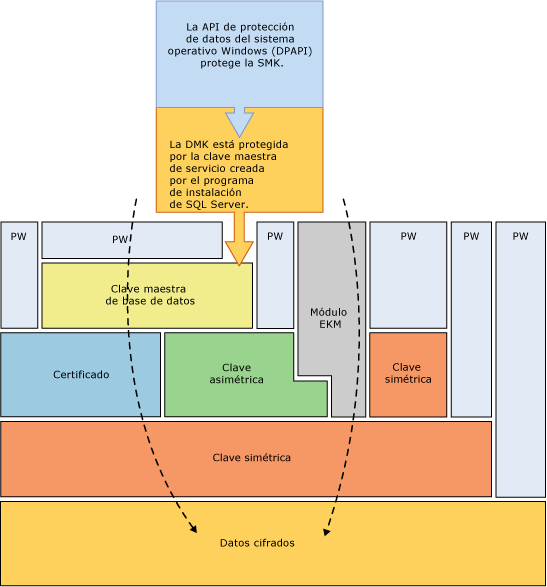
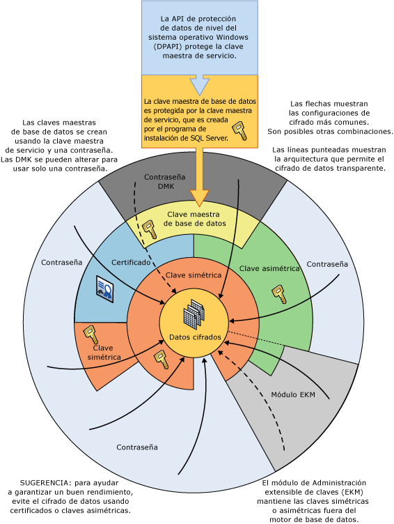

# Jerarquía de cifrado
[!INCLUDE[appliesto-ss-asdb-xxxx-xxx-md](../../../includes/appliesto-ss-asdb-xxxx-xxx-md.md)]
  [!INCLUDE[ssNoVersion](../../../includes/ssnoversion-md.md)] cifra los datos con una infraestructura de cifrado jerárquico y administración de claves. Cada capa cifra la capa inferior utilizando una combinación de certificados, claves asimétricas y claves simétricas. Las claves asimétricas y las claves simétricas pueden estar almacenadas fuera de [!INCLUDE[ssNoVersion](../../../includes/ssnoversion-md.md)] en un módulo de Administración extensible de claves (EKM).  
  
 La siguiente ilustración muestra que cada nivel de la jerarquía de cifrado cifra el nivel que tiene por debajo y muestra las configuraciones de cifrado más comunes. El acceso al principio de la jerarquía se suele proteger mediante una contraseña.  
  
   
  
 Tenga presente los conceptos siguientes:  
  
-   Para obtener el máximo rendimiento, cifre los datos utilizando claves simétricas en lugar de certificados o claves asimétricas.  
  
-   Las claves maestras de base de datos se protegen mediante la clave maestra de servicio. El programa de instalación de [!INCLUDE[ssNoVersion](../../../includes/ssnoversion-md.md)] crea la clave maestra de servicio, que se cifra con la API de protección de datos de Windows (DPAPI).  
  
-   Hay otras jerarquías de cifrado que apilan niveles adicionales.  
  
-   El módulo de Administración extensible de claves (EKM) mantiene las claves simétricas o asimétricas fuera de SQL Server.  
  
-   El Cifrado de datos transparente (TDE) debe utilizar una clave simétrica denominada clave de cifrado de base de datos que se protege bien mediante un certificado protegido por la clave maestra de base de datos de la base de datos maestra o bien mediante una clave asimétrica almacenada en una EKM.  
  
-   La clave maestra de servicio y todas las claves maestras de base de datos son claves simétricas.  
  
 La ilustración siguiente muestra la misma información de una manera alternativa.  
  
   
  
 Este diagrama muestra los conceptos adicionales siguientes:  
  
-   En esta ilustración, las flechas indican las jerarquías de cifrado comunes.  
  
-   Las claves simétricas y asimétricas de EKM pueden proteger el acceso a las claves simétricas y asimétricas almacenadas en [!INCLUDE[ssNoVersion](../../../includes/ssnoversion-md.md)]. La línea de puntos asociada a la EKM indica que las claves de la EKM podrían reemplazar a las claves simétricas y asimétricas que se almacenan en [!INCLUDE[ssNoVersion](../../../includes/ssnoversion-md.md)].  
  
## Mecanismos de cifrado  
 [!INCLUDE[ssNoVersion](../../../includes/ssnoversion-md.md)] ofrece los mecanismos siguientes para el cifrado:  
  
-   [!INCLUDE[tsql](../../../includes/tsql-md.md)] funciones  
  
-   Claves asimétricas  
  
-   Claves simétricas  
  
-   Certificados  
  
-   Cifrado de datos transparente  
  
### Funciones de Transact-SQL  
 Los elementos individuales se pueden cifrar a medida que se insertan o actualizan utilizando las funciones de [!INCLUDE[tsql](../../../includes/tsql-md.md)] . Para obtener más información, vea [ENCRYPTBYPASSPHRASE &#40;Transact-SQL&#41;](../../../t-sql/functions/encryptbypassphrase-transact-sql.md) y [DECRYPTBYPASSPHRASE &#40;Transact-SQL&#41;](../../../t-sql/functions/decryptbypassphrase-transact-sql.md).  
  
### Certificados  
 Un certificado de clave pública, normalmente denominado solo certificado, es una instrucción firmada digitalmente que enlaza el valor de una clave pública con la identidad de la persona, dispositivo o servicio que tiene la clave privada correspondiente. Las entidades certificadoras son las encargadas de emitir y firmar los certificados. La entidad que recibe un certificado de una CA es el sujeto de ese certificado. Por lo general, los certificados contienen la siguiente información.  
  
-   La clave pública del sujeto.  
  
-   La información que identifica al sujeto, como el nombre y la dirección de correo electrónico.  
  
-   El periodo de validez. Es decir, el periodo de tiempo durante el que el certificado se considera válido.  
  
     Un certificado solo es válido durante el periodo de tiempo que se especifica en el mismo; todos los certificados contienen una fecha **Válido desde** y otra **Válido hasta** . Estas fechas establecen los límites del periodo de validez. Cuando el periodo de validez de un certificado ha transcurrido, es necesario que el sujeto del certificado expirado solicite uno nuevo.  
  
-   Información de identificador del emisor.  
  
-   La firma digital del emisor.  
  
     Esta firma da fe de la validez de las obligaciones entre la clave pública y la información de identificador del sujeto. (El proceso de firmar digitalmente la información conlleva transformar la información, así como cierta información privada que conserva el remitente, en una etiqueta denominada firma.)  
  
 Una de las principales ventajas de los certificados es que liberan a los hosts de la necesidad de establecer contraseñas para sujetos individuales. En su lugar, el host simplemente establece la confianza en un emisor de certificados, que a continuación puede firmar un número ilimitado de certificados.  
  
 Cuando un host, por ejemplo, un servidor web seguro, designa a un emisor como entidad emisora raíz de confianza, el host implícitamente confía en las directivas que el emisor ha utilizado para establecer las obligaciones de los certificados que emite. En efecto, el host confía en que el emisor ha comprobado la identidad del sujeto del certificado. Un host designa a un emisor como entidad emisora raíz de confianza presentando el certificado autofirmado del emisor, que contiene la clave pública de éste, en el almacén de certificados de la entidad de certificación raíz de confianza del equipo host. Las entidades de certificación intermedias o subordinadas solo son de confianza si tienen una ruta válida de certificación procedente de una entidad de certificación raíz.  
  
 El emisor puede revocar un certificado antes de que expire. La revocación cancela las obligaciones que una clave pública tiene con una identidad que se exprese en el certificado. Cada emisor mantiene una lista de revocación de certificados que los programas pueden utilizar cuando estén comprobando la validez de un certificado determinado.  
  
 Los certificados autofirmados que se crean con [!INCLUDE[ssNoVersion](../../../includes/ssnoversion-md.md)] cumplen el estándar X.509 y son compatibles con los campos de X.509 v1.  
  
### Claves asimétricas  
 Una clave asimétrica se compone de una clave privada y su correspondiente clave pública. Cada clave puede descifrar los datos que cifra la otra. El cifrado y descifrado asimétricos consumen una cantidad de recursos relativamente elevada, pero proporcionan un nivel de seguridad superior al del cifrado simétrico. Una clave asimétrica se puede utilizar para cifrar una clave simétrica para almacenar en una base de datos.  
  
### Claves simétricas  
 Una clave simétrica es una clave que se utiliza para el cifrado y el descifrado. El cifrado y el descifrado con una clave simétrica son más rápidos y adecuados para usarlos de forma rutinaria con datos confidenciales de una base de datos.  
  
### Cifrado de datos transparente  
 El Cifrado de datos transparente (TDE) es un caso especial de cifrado que usa una clave simétrica. TDE cifra una base de datos completa utilizando la clave simétrica denominada clave de cifrado de base de datos. Otras claves o certificados que se protegen bien mediante la clave maestra de base de datos o bien mediante una clave asimétrica almacenadas en un módulo EKM protegen la clave de cifrado de base de datos. Para obtener más información, vea [Cifrado de datos transparente &#40;TDE&#41;](../../../relational-databases/security/encryption/transparent-data-encryption.md).  
  
## Contenido relacionado  
 [Proteger SQL Server](../../../relational-databases/security/securing-sql-server.md)  
  
 [Funciones de seguridad &#40;Transact-SQL&#41;](../../../t-sql/functions/security-functions-transact-sql.md)  
  
## Consulte también  
 [Jerarquía de permisos &#40;motor de base de datos&#41;](../../../relational-databases/security/permissions-hierarchy-database-engine.md)   
 [Elementos protegibles](../../../relational-databases/security/securables.md)  
  
  
