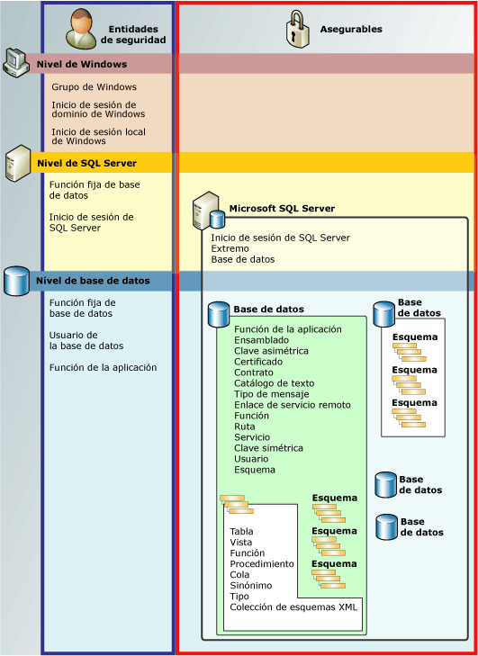

# Jerarquía de permisos (motor de base de datos)
[!INCLUDE[appliesto-ss-asdb-asdw-pdw-md](../../includes/appliesto-ss-asdb-asdw-pdw-md.md)]

  El [!INCLUDE[ssDE](../../includes/ssde-md.md)] administra un conjunto jerárquico de entidades que se pueden proteger mediante permisos. Estas entidades se conocen como *elementos protegibles*. Los protegibles más prominentes son los servidores y las bases de datos, pero los permisos discretos se pueden establecer en un nivel mucho más específico. [!INCLUDE[ssNoVersion](../../includes/ssnoversion-md.md)] regula las acciones de las entidades de seguridad en los elementos protegibles comprobando que se les ha concedido los permisos adecuados.  
  
 En la ilustración siguiente se muestran las relaciones entre las jerarquías de permisos del [!INCLUDE[ssDE](../../includes/ssde-md.md)] .  
  
 El sistema de permisos funciona igual en todas las versiones de [!INCLUDE[ssNoVersion](../../includes/ssnoversion-md.md)], [!INCLUDE[ssSDS](../../includes/sssds-md.md)], [!INCLUDE[ssDW](../../includes/ssdw-md.md)], [!INCLUDE[ssAPS](../../includes/ssaps-md.md)], sin embargo, algunas características no están disponibles en todas las versiones. Por ejemplo, el permiso de nivel de servidor no se puede configurar en productos de Azure.  
  
   
  
## Gráfico de los permisos de SQL Server  
 Para obtener un gráfico con tamaño cartel de todos los permisos del [!INCLUDE[ssDE](../../includes/ssde-md.md)] en formato PDF, vea [http://go.microsoft.com/fwlink/?LinkId=229142](http://go.microsoft.com/fwlink/?LinkId=229142).  
  
## Trabajar con permisos  
 Los permisos se pueden manipular con las conocidas consultas GRANT, DENY y REVOKE de [!INCLUDE[tsql](../../includes/tsql-md.md)] . La información sobre los permisos está visible en las vistas de catálogo [sys.server_permissions](../../relational-databases/system-catalog-views/sys-server-permissions-transact-sql.md) y [sys.database_permissions](../../relational-databases/system-catalog-views/sys-database-permissions-transact-sql.md) . También hay información sobre la compatibilidad con permisos para consultas mediante el uso de las funciones integradas.  
  
 Para más información acerca de cómo diseñar un sistema de permisos, consulte [Getting Started with Database Engine Permissions](../../relational-databases/security/authentication-access/getting-started-with-database-engine-permissions.md).  
  
## Vea también  
 [Proteger SQL Server](../../relational-databases/security/securing-sql-server.md)   
 [Permisos &#40;motor de base de datos&#41;](../../relational-databases/security/permissions-database-engine.md)   
 [Securables](../../relational-databases/security/securables.md)   
 [Entidades de seguridad &#40;motor de base de datos&#41;](../../relational-databases/security/authentication-access/principals-database-engine.md)   
 [GRANT &#40;Transact-SQL&#41;](../../t-sql/statements/grant-transact-sql.md)   
 [REVOKE &#40;Transact-SQL&#41;](../../t-sql/statements/revoke-transact-sql.md)   
 [DENY &#40;Transact-SQL&#41;](../../t-sql/statements/deny-transact-sql.md)   
 [HAS_PERMS_BY_NAME &#40;Transact-SQL&#41;](../../t-sql/functions/has-perms-by-name-transact-sql.md)   
 [sys.fn_builtin_permissions &#40;Transact-SQL&#41;](../../relational-databases/system-functions/sys-fn-builtin-permissions-transact-sql.md)   
 [sys.server_permissions &#40;Transact-SQL&#41;](../../relational-databases/system-catalog-views/sys-server-permissions-transact-sql.md)   
 [sys.database_permissions &#40;Transact-SQL&#41;](../../relational-databases/system-catalog-views/sys-database-permissions-transact-sql.md)  
  
  
