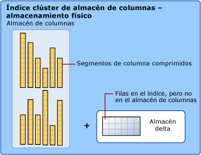
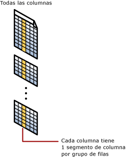

# <a name="sql-server-index-architecture-and-design-guide"></a>Guía de diseño y de arquitectura de índices de SQL Server
[!INCLUDE[appliesto-ss-asdb-asdw-pdw-md](../includes/appliesto-ss-asdb-asdw-pdw-md.md)]

Los índices mal diseñados y la falta de índices constituyen las principales fuentes de atascos en aplicaciones de base de datos. El diseño eficaz de los índices tiene gran importancia para conseguir un buen rendimiento de una base de datos y una aplicación. Esta guía de diseño de índices de [!INCLUDE[ssNoVersion](../includes/ssnoversion-md.md)] contiene información sobre la arquitectura de índices y prácticas recomendadas que le ayudarán a diseñar índices eficaces que resuelvan las necesidades de la aplicación.  
    
En esta guía se da por supuesto que el lector tiene información general sobre los tipos de índice disponibles en [!INCLUDE[ssNoVersion](../includes/ssnoversion-md.md)]. Para obtener una descripción general de los tipos de índice, vea [Tipos de índice](../relational-databases/indexes/indexes.md).  

En esta guía se tratan los siguientes tipos de índices:

-   Clúster
-   No agrupado
-   Único
-   Filtrado
-   columnstore
-   Hash
-   Índice no agrupado optimizado para memoria

Para obtener información sobre los índices XML, vea [Índices XML en la sección Información general](../relational-databases/xml/xml-indexes-sql-server.md).

Para obtener información sobre los índices espaciales, vea [Información general sobre los índices espaciales](../relational-databases/spatial/spatial-indexes-overview.md).

Para obtener más información sobre los índices de texto completo, vea [Rellenar índices de texto completo](../relational-databases/search/populate-full-text-indexes.md).
  
##  <a name="Basics"></a> Conceptos básicos del diseño de índices  
 Un índice es una estructura en disco o en memoria asociada con una tabla o vista que acelera la recuperación de filas de la tabla o vista. Un índice contiene claves generadas a partir de una o varias columnas de la tabla o la vista. En el caso de los índices en disco, dichas claves están almacenadas en una estructura (árbol B) que permite que SQL Server busque de forma rápida y eficiente la fila o las filas asociadas a los valores de cada clave.  

 Los índices almacenan los datos organizados de forma lógica como una tabla con filas y columnas, y físicamente almacenados en un formato de datos por fila llamado *almacén de filas* <sup>1</sup>, o bien en un formato de datos por columna llamado *[almacén de columnas](#columnstore_index)*.  
    
 La selección de los índices apropiados para una base de datos y su carga de trabajo es una compleja operación que busca el equilibrio entre la velocidad de la consulta y el costo de actualización. Los índices estrechos, o con pocas columnas en la clave de índice, necesitan menos espacio en el disco y son menos susceptibles de provocar sobrecargas debido a su mantenimiento. Por otra parte, la ventaja de los índices anchos es que cubren más consultas. Puede que tenga que experimentar con distintos diseños antes de encontrar el índice más eficaz. Es posible agregar, modificar y quitar índices sin que esto afecte al esquema de la base de datos o al diseño de la aplicación. Por lo tanto, no debe dudar en experimentar con índices diferentes.  
  
 El optimizador de consultas de [!INCLUDE[ssNoVersion](../includes/ssnoversion-md.md)] elige de forma confiable el índice más eficaz en la mayoría de los casos. La estrategia general de diseño de índices debe proporcionar una buena selección de índices al optimizador de consultas y confiar en que tomará la decisión correcta. Así se reduce el tiempo de análisis y se obtiene un buen rendimiento en diversas situaciones. Para saber qué índices utiliza el optimizador de consultas para determinada consulta, en [!INCLUDE[ssManStudioFull](../includes/ssmanstudiofull-md.md)], en el menú **Consulta** , seleccione **Incluir plan de ejecución real**.  
  
 No equipare siempre la utilización de índices con un buen rendimiento ni el buen rendimiento al uso eficaz del índice. Si la utilización de un índice contribuyera siempre a producir el mejor rendimiento, el trabajo del optimizador de consultas sería muy sencillo. En realidad, una elección incorrecta de índice puede provocar un rendimiento bajo. Por tanto, la tarea del optimizador de consultas consiste en seleccionar un índice o una combinación de índices solo si mejora el rendimiento, y evitar la recuperación indizada cuando afecte al mismo.  

 <sup>1</sup> Los almacenes de filas han sido la forma tradicional de almacenar los datos de una tabla relacional. En [!INCLUDE[ssNoVersion](../includes/ssnoversion-md.md)], "almacén de filas" hace referencia a la tabla en la que el formato de almacenamiento de datos subyacente es un montón, un árbol B ([índice agrupado](#Clustered)) o una tabla optimizada para memoria.

### <a name="index-design-tasks"></a>Tareas del diseño de índices  
 Las siguientes tareas componen la estrategia recomendada para el diseño de índices:  
  
1.  Comprender las características de la propia base de datos. 
    * Por ejemplo, si es una base de datos de procesamiento de transacciones en línea (OLTP) con modificaciones de datos frecuentes que deben tener un alto rendimiento. A partir de [!INCLUDE[ssSQL14](../includes/sssql14-md.md)], las tablas y los índices optimizados para memoria son especialmente adecuados en este escenario, ya que proporcionan un diseño sin bloqueos temporales. Para obtener más información, en esta guía podrá ver [Índices de tablas optimizadas para memoria](../relational-databases/in-memory-oltp/indexes-for-memory-optimized-tables.md), [Nonclustered Index for Memory-Optimized Tables Design Guidelines](#inmem_nonclustered_index) (Guía de diseño de índices no agrupados para tablas optimizadas para memoria) y [Hash Index for Memory-Optimized Tables Design Guidelines](#hash_index) (Guía de diseño de índices de hash para tablas optimizadas para memoria).
    * O bien, el ejemplo de una base de datos de sistema de ayuda a la toma de decisiones (DSS) o almacenamiento de datos (OLAP) que debe procesar con rapidez conjuntos de datos muy grandes. A partir de [!INCLUDE[ssSQL11](../includes/sssql11-md.md)], los índices de almacén de columnas son especialmente adecuados para los conjuntos de datos de almacenamiento de datos comunes. Los índices de almacén de columnas pueden transformar la experiencia de almacenamiento de datos de los usuarios, ya que permite un rendimiento más rápido en las consultas habituales de almacenamiento de datos, como el filtrado, la agregación, la agrupación y la combinación en estrella de consultas. Para obtener más información, vea [Introducción a los índices de almacén de columnas](../relational-databases/indexes/columnstore-indexes-overview.md) o [Directrices para diseñar índices de almacén de columnas](#columnstore_index) en esta guía.  

2.  Comprender las características de las consultas utilizadas con frecuencia. Por ejemplo, saber que una consulta utilizada con frecuencia une dos o más tablas facilitará la determinación del mejor tipo de índices que se puede utilizar.  
  
3.  Comprender las características de las columnas utilizadas en las consultas. Por ejemplo, un índice es idóneo para columnas que tienen un tipo de datos entero y además son columnas con valores NULL o no NULL. En el caso de columnas que tengan subconjuntos de datos bien definidos, puede usar un índice filtrado en [!INCLUDE[ssKatmai](../includes/sskatmai-md.md)] y en versiones posteriores. Para obtener más información, vea [Directrices generales para diseñar índices filtrados](#Filtered) en esta guía.  
  
4.  Determinar qué opciones de índice podrían mejorar el rendimiento al crear o mantener el índice. Por ejemplo, la creación de un índice agrupado en una tabla grande se beneficiaría de la opción de índice `ONLINE`. La opción ONLINE permite que la actividad simultánea en los datos subyacentes continúe mientras el índice se crea o regenera. Para obtener más información, consulte [Establecer opciones de índice](../relational-databases/indexes/set-index-options.md).  
  
5.  Determinar la ubicación de almacenamiento óptima para el índice. Un índice no clúster se puede almacenar en el mismo grupo de archivos que la tabla subyacente o en un grupo distinto. La ubicación de almacenamiento de índices puede mejorar el rendimiento de las consultas aumentando el rendimiento de las operaciones de E/S en disco. Por ejemplo, el almacenamiento de un índice no clúster en un grupo de archivos que se encuentra en un disco distinto que el del grupo de archivos de la tabla puede mejorar el rendimiento, ya que se pueden leer varios discos al mismo tiempo.  
     O bien, los índices clúster y no clúster pueden utilizar un esquema de particiones en varios grupos de archivos. Las particiones facilitan la administración de índices y tablas grandes al permitir el acceso y la administración de subconjuntos de datos rápidamente y con eficacia, mientras se mantiene la integridad de la colección global. Para obtener más información, consulte [Partitioned Tables and Indexes](../relational-databases/partitions/partitioned-tables-and-indexes.md). Al considerar la posibilidad de utilizar particiones, determine si el índice debe alinearse; es decir, si las particiones se crean esencialmente del mismo modo que la tabla o de forma independiente.   

##  <a name="General_Design"></a> Directrices generales para diseñar índices  
 Los administradores de bases de datos más experimentados pueden diseñar un buen conjunto de índices, pero esta tarea es muy compleja, consume mucho tiempo y está sujeta a errores, incluso con cargas de trabajo y bases de datos con un grado de complejidad no excesivo. La comprensión de las características de la base de datos, las consultas y las columnas de datos facilita el diseño de los índices.  
  
### <a name="database-considerations"></a>Consideraciones acerca de la base de datos  
 Cuando diseñe un índice, tenga en cuenta las siguientes directrices acerca de la base de datos:  
  
-   Si se usa un gran número de índices en una tabla, el rendimiento de las instrucciones `INSERT`, `UPDATE`, `DELETE` y `MERGE` se verá afectado, ya que todos los índices deben ajustarse adecuadamente a medida que cambian los datos de la tabla. Por ejemplo, si una columna se usa en varios índices y ejecuta una instrucción `UPDATE` que modifica datos de esa columna, se deben actualizar todos los índices que contengan esa columna, así como la columna de la tabla base subyacente (índice de montón o agrupado).  
  
    -   Evite crear demasiados índices en tablas que se actualizan con mucha frecuencia y mantenga los índices estrechos, es decir, defínalos con el menor número de columnas posible.  
  
    -   Utilice un número mayor de índices para mejorar el rendimiento de consultas en tablas con pocas necesidades de actualización, pero con grandes volúmenes de datos. Un gran número de índices contribuye a mejorar el rendimiento de las consultas que no modifican datos, como las instrucciones SELECT, ya que el optimizador de consultas dispone de más índices entre los que elegir para determinar el método de acceso más rápido.  
  
-   La indización de tablas pequeñas puede no ser una solución óptima, porque puede provocar que el optimizador de consultas tarde más tiempo en realizar la búsqueda de los datos a través del índice que en realizar un simple recorrido de la tabla. De este modo, es posible que los índices de tablas pequeñas no se utilicen nunca; sin embargo, sigue siendo necesario su mantenimiento a medida que cambian los datos de la tabla.  
  
-   Los índices en vistas pueden mejorar de forma significativa el rendimiento si la vista contiene agregaciones, combinaciones de tabla o una mezcla de agregaciones y combinaciones. No es necesario hacer referencia de forma explícita a la vista en la consulta para que el optimizador de consultas la utilice.  
  
-   Utilice el Asistente para la optimización de motor de base de datos para analizar las bases de datos y crear recomendaciones de índices. Para obtener más información, vea [Database Engine Tuning Advisor](../relational-databases/performance/database-engine-tuning-advisor.md).  
  
### <a name="query-considerations"></a>Consideraciones sobre consultas  
 Cuando diseñe un índice, tenga en cuenta las siguientes directrices acerca de las consultas:  
  
-   Cree índices no clúster en las columnas que se usan con frecuencia en predicados y condiciones de combinación de las consultas. Estas son las columnas SARGable<sup>1</sup>. Sin embargo, debe evitar agregar columnas innecesarias. Si agrega demasiadas columnas de índice, puede reducir el espacio en disco y el rendimiento del mantenimiento del índice.  
  
-   La utilización de índices puede mejorar el rendimiento de las consultas, ya que los datos necesarios para satisfacer las necesidades de la consulta existen en el propio índice. Es decir, solo se requieren las páginas de índice, y no las páginas de datos de la tabla o el índice clúster, para recuperar los datos solicitados; por lo tanto, se reduce la E/S de disco global. Por ejemplo, una consulta de las columnas **a** y **b** en una tabla que tiene un índice compuesto creado en las columnas **a**, **b**y **c** puede recuperar los datos especificados del índice.  

    > [!IMPORTANT]
    > Los índices de cobertura son la designación para un [índice no agrupado](#nonclustered-index-architecture) que resuelve uno o varios resultados de consulta similares directamente sin acceso a su tabla base y sin incurrir en búsquedas.
    > Esos índices tienen todas las columnas no [SARGable](#sargable) necesarias en su nivel hoja. Esto significa que el índice cubre todas las columnas que devuelve la cláusula SELECT y todos los argumentos WHERE y JOIN.
    > Posiblemente, hay mucho menos E/S para ejecutar la consulta, si el índice es lo suficientemente restringido en comparación con las filas y las columnas de la tabla misma, lo que significa que es un subconjunto real del total de columnas. Considere los índices de cobertura cuando seleccione una pequeña porción de una tabla de gran tamaño y donde esa porción pequeña esté definida mediante un predicado fijo, como [columnas dispersas](../relational-databases/tables/use-sparse-columns.md) que solo contienen unos pocos valores no NULL, por ejemplo.
    
-   Escriba consultas que inserten o modifiquen tantas filas como sea posible en una sola instrucción, en lugar de utilizar varias consultas para actualizar las mismas filas. Al utilizar solo una instrucción, se puede aprovechar el mantenimiento de índices optimizados.  
  
-   Analice el tipo de la consulta y cómo se utilizan las columnas en ella. Por ejemplo, una columna utilizada en una consulta de coincidencia exacta sería una buena candidata para un índice no clúster o clúster.

<a name="sargable"></a><sup>1</sup> El término SARGable en las bases de datos relacionales se refiere a un predicado **S**earch **ARG**ument-**able** que puede usar un índice para acelerar la ejecución de la consulta.
  
### <a name="column-considerations"></a>Consideraciones sobre columnas  
 Cuando diseñe un índice, tenga en cuenta las siguientes directrices acerca de las columnas:  
  
-   Utilice una longitud corta en la clave de los índices clúster. Los índices clúster también mejoran si se crean en columnas únicas o que no admitan valores NULL.  
  
-   Las columnas de los tipos de datos **ntext**, **text**, **image**, **varchar(max)**, **nvarchar(max)** y **varbinary(max)** no pueden especificarse como columnas de clave de índice. En cambio, los tipos de datos **varchar(max)**, **nvarchar(max)**, **varbinary(max)** y **xml** pueden participar en un índice no agrupado como columnas de índice sin clave. Para obtener más información, vea la sección ['Índice con columnas incluidas](#Included_Columns)' en esta guía.  
  
-   El tipo de datos **xml** solo puede ser una columna de clave en un índice XML. Para obtener más información, consulte [Índices XML &#40;SQL Server&#41;](../relational-databases/xml/xml-indexes-sql-server.md). SQL Server 2012 SP1 presenta un nuevo tipo de índice XML denominado índice XML selectivo. Este nuevo índice puede mejorar el rendimiento de las consultas en datos almacenados como XML en SQL Server, lo que permitirá indizar mucho más rápidamente grandes cargas de trabajo de datos XML y mejorar la escalabilidad reduciendo los costos de almacenamiento del propio índice. Para obtener más información, consulte [Índices XML selectivos &#40;SXI&#41;](../relational-databases/xml/selective-xml-indexes-sxi.md).  
  
-   Examine la unicidad de las columnas. Un índice único en lugar de un índice no único con la misma combinación de columnas proporciona información adicional al optimizador de consultas y, por tanto, resulta más útil. Para obtener más información, vea [Directrices para diseñar índices únicos](#Unique) en esta guía.  
  
-   Examine la distribución de los datos en la columna. A menudo, se crean consultas cuya ejecución es muy larga al indizar una columna con pocos valores únicos, o bien al realizar una combinación en dicha columna. Se trata de un problema fundamental con los datos y la consulta, y normalmente no se puede resolver sin identificar esta situación. Por ejemplo, una agenda telefónica ordenada por apellidos no localizará rápidamente a una persona si todas las personas de la ciudad se llaman Smith o Jones. Para obtener más información acerca de la distribución de datos, vea [Statistics](../relational-databases/statistics/statistics.md).  
  
-   Considere la posibilidad de usar índices filtrados en columnas que tengan subconjuntos bien definidos, por ejemplo columnas dispersas, columnas con una mayoría de valores NULL, columnas con categorías de valores y columnas con intervalos de valores diferenciados. Un índice filtrado bien diseñado puede mejorar el rendimiento de las consultas, así como reducir los costos de almacenamiento y de mantenimiento de los índices.  
  
-   Tenga en cuenta el orden de las columnas si el índice va a contener varias columnas. La columna que se usa en la cláusula WHERE en una condición de búsqueda igual a (=), mayor que (>), menor que (<) o BETWEEN, o que participa en una combinación, debe situarse en primer lugar. Las demás columnas deben ordenarse basándose en su nivel de diferenciación, es decir, de más distintas a menos distintas.  
  
     Por ejemplo, si el índice se define como `LastName`, `FirstName` , resultará útil si el criterio de búsqueda es `WHERE LastName = 'Smith'` o `WHERE LastName = Smith AND FirstName LIKE 'J%'`. Sin embargo, el optimizador de consultas no utilizará el índice en una consulta que solo busque `FirstName (WHERE FirstName = 'Jane')`.  
  
-   Tenga en cuenta la indización de columnas calculadas. Para obtener más información, vea [Indexes on Computed Columns](../relational-databases/indexes/indexes-on-computed-columns.md).  
  
### <a name="index-characteristics"></a>Características de los índices  
 Después de determinar que un índice resulta adecuado para una consulta, puede seleccionar el tipo de índice que mejor se ajusta a la situación. Entre las características de los índices se incluyen:  
  
-   Índices agrupados y no agrupados  
-   Índices exclusivos y no exclusivos  
-   Índices de una sola columna y de varias columnas  
-   Orden ascendente o descendente en las columnas del índice  
-   Índices de tabla completa y filtrados en índices no clúster  
-   Almacén de columnas y almacén de filas
-   Índice de hash e índice no agrupado para tablas optimizadas para memoria
  
También puede personalizar las características iniciales de almacenamiento del índice para optimizar su rendimiento o mantenimiento; por ejemplo, puede establecer una opción como FILLFACTOR. Además, puede determinar la ubicación de almacenamiento del índice si utiliza grupos de archivos o esquemas de partición y mejorar así el rendimiento.  
  
###  <a name="Index_placement"></a> Colocación de índices en grupos de archivos o esquemas de particiones  
 Al desarrollar la estrategia de diseño del índice, debe tener en cuenta la ubicación de los índices en los grupos de archivos asociados con la base de datos. La selección cuidadosa del grupo de archivos o del esquema de partición puede mejorar el rendimiento de la consulta.  
  
 De forma predeterminada, los índices se almacenan en el mismo grupo de archivos que la tabla base en la que se crea el índice. Un índice clúster sin particiones y la tabla base siempre residen en el mismo grupo de archivos. Sin embargo, puede hacer lo siguiente:  
  
-   Crear índices no clúster en un grupo de archivos diferente del grupo de archivos de la tabla base o el índice clúster.  
-   Crear particiones de índices clúster y no clúster repartidos en varios grupos de archivos.  
-   Mover una tabla de un grupo de archivos a otro quitando el índice clúster y especificando un nuevo grupo de archivos o un esquema de partición en la cláusula MOVE TO de la instrucción DROP INDEX o utilizando la instrucción CREATE INDEX con la cláusula DROP_EXISTING.  
  
Si se crea el índice no clúster en otro grupo de archivos, es posible mejorar el rendimiento si los grupos de archivos utilizan distintas unidades físicas con sus propios controladores. De ese modo, la información de índice y los datos pueden leerse en paralelo mediante varios cabezales de disco. Por ejemplo, si la misma consulta emplea `Table_A` del grupo de archivos `f1` e `Index_A` del grupo de archivos `f2` , se puede mejorar el rendimiento porque ambos grupos de archivos se están usando sin contención. Sin embargo, si la consulta examina `Table_A` pero no se hace referencia a `Index_A` , solo se usará el grupo de archivos `f1` . Esto no produce ninguna mejora de rendimiento.  
  
Como no se puede predecir qué tipo de acceso tendrá lugar ni cuándo, la mejor decisión consiste en repartir las tablas e índices en todos los grupos de archivos. De este modo se garantiza el acceso a todos los discos, ya que todos los datos e índices están repartidos por igual entre todos los discos independientemente de la forma de acceso a los datos. También se trata de un método más sencillo para los administradores de sistemas.  
  
#### <a name="partitions-across-multiple-filegroups"></a>Particiones entre varios grupos de archivos  
 También puede considerar la opción de crear particiones de clúster y no clúster en varios grupos de archivos. Los índices con particiones se dividen horizontalmente o por filas, basándose en una función de partición. La función de partición define cómo se asigna cada fila a un conjunto de particiones en los valores de ciertas columnas, denominadas columnas de partición. Un esquema de partición especifica la asignación de las particiones a un conjunto de grupos de archivos.  
  
 La creación de particiones de un índice puede proporcionar las siguientes ventajas:  
  
-   Proporcionar sistemas escalables que hacen que los índices grandes sean más fáciles de administrar. Los sistemas OLTP, por ejemplo, pueden implementar aplicaciones orientadas a particiones que gestionan índices grandes.  
  
-   Realizar consultas de forma más rápida y eficiente. Cuando las consultas tienen acceso a varias particiones de un índice, el optimizador de consultas puede procesar particiones individuales simultáneamente y excluir particiones que no están afectadas por la consulta.  
  
Para obtener más información, consulte [Partitioned Tables and Indexes](../relational-databases/partitions/partitioned-tables-and-indexes.md).  
  
###  <a name="Sort_Order"></a> Directrices para diseñar el criterio de ordenación de los índices  
 Al definir índices, debe tenerse en cuenta si los datos de la columna de clave de índice se almacenan en orden ascendente o descendente. El orden ascendente es el predeterminado y mantiene la compatibilidad con las versiones anteriores de [!INCLUDE[ssNoVersion](../includes/ssnoversion-md.md)]. La sintaxis de las instrucciones CREATE INDEX, CREATE TABLE y ALTER TABLE admite las palabras clave ASC (ascendente) y DESC (descendente) en columnas individuales de índices y restricciones.  
  
 La especificación del orden en que se almacenan los valores de clave en un índice es de utilidad cuando las consultas que hacen referencia a la tabla tienen cláusulas ORDER BY que especifican distintas direcciones para las columnas de clave del índice. En estos casos, el índice puede eliminar la necesidad de un operador SORT en el plan de consultas, lo que aumenta la eficacia de la consulta. Por ejemplo, los compradores del departamento de compras de [!INCLUDE[ssSampleDBCoFull](../includes/sssampledbcofull-md.md)] tienen que evaluar la calidad de los productos que compran a los proveedores. Los compradores están especialmente interesados en buscar productos enviados por estos proveedores con una tasa alta de rechazos. Como se muestra en la siguiente consulta, para recuperar los datos que cumplen estos criterios es necesario organizar la columna `RejectedQty` de la tabla `Purchasing.PurchaseOrderDetail` en orden descendente (de mayor a menor) y la columna `ProductID` en orden ascendente (de menor a mayor).  
  
```sql  
SELECT RejectedQty, ((RejectedQty/OrderQty)*100) AS RejectionRate,  
    ProductID, DueDate  
FROM Purchasing.PurchaseOrderDetail  
ORDER BY RejectedQty DESC, ProductID ASC;  
```  
  
 El siguiente plan de ejecución para esta consulta muestra que el optimizador de consultas utilizó un operador SORT para devolver el conjunto de resultados en el orden especificado mediante la cláusula ORDER BY.  
  
 
  
 Si se crea un índice con columnas de clave que coincidan con las de la cláusula ORDER BY de la consulta, se puede eliminar el operador SORT del plan de consultas y éste resulta más eficaz.  
  
```sql  
CREATE NONCLUSTERED INDEX IX_PurchaseOrderDetail_RejectedQty  
ON Purchasing.PurchaseOrderDetail  
    (RejectedQty DESC, ProductID ASC, DueDate, OrderQty);  
```  
  
 Cuando se ejecuta de nuevo la consulta, el plan de consultas siguiente muestra que se ha eliminado el operador SORT y se utiliza el índice no clúster que se acaba de crear.  
  
 
  
 [!INCLUDE[ssDE](../includes/ssde-md.md)] puede moverse con la misma eficacia en cualquier dirección. Un índice definido como `(RejectedQty DESC, ProductID ASC)` se puede seguir utilizando para una consulta en la que se invierte la dirección de ordenación de las columnas en la cláusula ORDER BY. Por ejemplo, una consulta con la cláusula ORDER BY `ORDER BY RejectedQty ASC, ProductID DESC` puede utilizar el índice.  
  
 Solo se pueden especificar criterios de ordenación para columnas de clave. La vista de catálogo [sys.index_columns](../relational-databases/system-catalog-views/sys-index-columns-transact-sql.md) y la función INDEXKEY_PROPERTY informan de si una columna de índice está almacenada en orden ascendente o descendente.  

## <a name="metadata"></a>Metadatos  
Use estas vistas de metadatos para ver los atributos de los índices. Puede obtener más información sobre la arquitectura en algunas de estas vistas.

> [!NOTE]
> En el caso de los índices de almacén de columnas, todas las columnas se almacenan en los metadatos como columnas incluidas. El índice de almacén de columnas no tiene columnas de clave.  

||| 
|-|-|
|[sys.indexes &#40;Transact-SQL&#41;](../relational-databases/system-catalog-views/sys-indexes-transact-sql.md)|[sys.index_columns &#40;Transact-SQL&#41;](../relational-databases/system-catalog-views/sys-index-columns-transact-sql.md)|  
|[sys.partitions &#40;Transact-SQL&#41;](../relational-databases/system-catalog-views/sys-partitions-transact-sql.md)|[sys.internal_partitions &#40;Transact-SQL&#41;](../relational-databases/system-catalog-views/sys-internal-partitions-transact-sql.md)|
[sys.dm_db_index_operational_stats &#40;Transact-SQL&#41;](../relational-databases/system-dynamic-management-views/sys-dm-db-index-operational-stats-transact-sql.md)|[sys.dm_db_index_physical_stats &#40;Transact-SQL&#41;](../relational-databases/system-dynamic-management-views/sys-dm-db-index-physical-stats-transact-sql.md)|  
|[sys.column_store_segments &#40;Transact-SQL&#41;](../relational-databases/system-catalog-views/sys-column-store-segments-transact-sql.md)|[sys.column_store_dictionaries &#40;Transact-SQL&#41;](../relational-databases/system-catalog-views/sys-column-store-dictionaries-transact-sql.md)|  
|[sys.column_store_row_groups &#40;Transact-SQL&#41;](../relational-databases/system-catalog-views/sys-column-store-row-groups-transact-sql.md)|[sys.dm_db_column_store_row_group_operational_stats &#40;Transact-SQL&#41;](../relational-databases/system-dynamic-management-views/sys-dm-db-column-store-row-group-operational-stats-transact-sql.md)|
|[sys.dm_db_column_store_row_group_physical_stats &#40;Transact-SQL&#41;](../relational-databases/system-dynamic-management-views/sys-dm-db-column-store-row-group-physical-stats-transact-sql.md)|[sys.dm_column_store_object_pool &#40;Transact-SQL&#41;](../relational-databases/system-dynamic-management-views/sys-dm-column-store-object-pool-transact-sql.md)|  
|[sys.dm_db_column_store_row_group_operational_stats &#40;Transact-SQL&#41;](../relational-databases/system-dynamic-management-views/sys-dm-db-column-store-row-group-operational-stats-transact-sql.md)|[sys.dm_db_xtp_hash_index_stats &#40;Transact-SQL&#41;](../relational-databases/system-dynamic-management-views/sys-dm-db-xtp-hash-index-stats-transact-sql.md)| 
|[sys.dm_db_xtp_index_stats &#40;Transact-SQL&#41;](../relational-databases/system-dynamic-management-views/sys-dm-db-xtp-index-stats-transact-sql.md)|[sys.dm_db_xtp_object_stats &#40;Transact-SQL&#41;](../relational-databases/system-dynamic-management-views/sys-dm-db-xtp-object-stats-transact-sql.md)|
|[sys.dm_db_xtp_nonclustered_index_stats &#40;Transact-SQL&#41;](../relational-databases/system-dynamic-management-views/sys-dm-db-xtp-nonclustered-index-stats-transact-sql.md)|[sys.dm_db_xtp_table_memory_stats &#40;Transact-SQL&#41;](../relational-databases/system-dynamic-management-views/sys-dm-db-xtp-table-memory-stats-transact-sql.md)|
|[sys.hash_indexes &#40;Transact-SQL&#41;](../relational-databases/system-catalog-views/sys-hash-indexes-transact-sql.md)|[sys.memory_optimized_tables_internal_attributes &#40;Transact-SQL&#41;](../relational-databases/system-catalog-views/sys-memory-optimized-tables-internal-attributes-transact-sql.md)|  

##  <a name="Clustered"></a> Directrices para diseñar índices clúster  
 Los índices clúster ordenan y almacenan las filas de los datos de la tabla de acuerdo con los valores de la clave del índice. Solo puede haber un índice clúster por cada tabla, porque las filas de datos solo pueden estar ordenadas de una forma. Salvo excepciones, todas las tablas deben incluir un índice clúster definido en las columnas que presenten las siguientes características:  
  
-   Se pueden utilizar en consultas frecuentes.  
  
-   Proporcionan un alto grado de unicidad.  
  
    > [!NOTE]  
    > Cuando crea una restricción PRIMARY KEY, se crea automáticamente un índice único en las columnas. De forma predeterminada, este índice es clúster; sin embargo, puede especificar un índice no clúster cuando crea la restricción.  
  
-   Se pueden utilizar en consultas por rango.  
  
Si el índice agrupado no se crea con la propiedad `UNIQUE`, el [!INCLUDE[ssDE](../includes/ssde-md.md)] agrega automáticamente a la tabla una columna de valor de unicidad de 4 bytes. Cuando es necesario, el [!INCLUDE[ssDE](../includes/ssde-md.md)] agrega automáticamente un valor de unicidad a una fila para hacer que cada clave sea única. Esta columna y sus valores se utilizan de forma interna; los usuarios no pueden verlos ni tener acceso a ellos.  
  
### <a name="clustered-index-architecture"></a>Arquitectura de los índices clúster  
 En [!INCLUDE[ssNoVersion](../includes/ssnoversion-md.md)], los índices se organizan como árboles B. Las páginas de un árbol b de índice se llaman nodos del índice. El nodo superior del árbol b se llama nodo raíz. Los nodos inferiores del índice se denominan nodos hoja. Los niveles del índice entre el nodo raíz y los nodos hoja se conocen en conjunto como niveles intermedios. En un índice clúster, los nodos hoja contienen las páginas de datos de la tabla subyacente. El nodo raíz y los nodos intermedios incluyen páginas de índice que contienen filas de índice. Cada fila de índice contiene un valor clave y un puntero a una página de nivel intermedio en el árbol b, o bien a una fila de datos del nivel hoja del índice. Las páginas de cada nivel del índice se vinculan en una lista con vínculos dobles.  
  
 Los índices clúster tienen una fila en [sys.partitions](../relational-databases/system-catalog-views/sys-partitions-transact-sql.md), con **index_id** = 1 para cada partición usada por el índice. De forma predeterminada, un índice clúster tiene una sola partición. Cuando un índice clúster tiene múltiples particiones, cada partición tiene una estructura de árbol b que contiene los datos de esa partición específica. Por ejemplo, si un índice clúster tiene cuatro particiones, hay cuatro estructuras de árbol b, una en cada partición.  
  
 En función de los tipos de datos del índice clúster, cada estructura de índice clúster tendrá una o más unidades de asignación en las que almacenar y administrar los datos de una partición específica. Como mínimo, cada índice clúster tendrá una unidad de asignación IN_ROW_DATA por partición. El índice agrupado también tendrá una unidad de asignación *LOB_DATA* por partición si contiene columnas de objetos grandes (LOB). También tendrá una unidad de asignación *ROW_OVERFLOW_DATA* por partición si contiene columnas de longitud variable que superen el límite de tamaño de fila de 8060 bytes.  
  
 Las páginas de la cadena de datos y las filas que contienen se ordenan según el valor de la clave de índice clúster. Todas las inserciones se hacen en el punto en el que el valor de clave de la fila insertada quede dentro de la secuencia de orden entre las filas existentes.  
  
 En esta ilustración se muestra la estructura de un índice clúster en una sola partición.  
 
   
  
### <a name="query-considerations"></a>Consideraciones sobre consultas  
 Antes de crear índices clúster, debe conocer cómo se tiene acceso a los datos. Considere que utiliza un índice clúster en consultas que realizan lo siguiente:  
  
-   Devuelven un intervalo de valores mediante el uso de operadores como `BETWEEN`, >, >=, < y <=.  
  
     Cuando la fila se encuentra con el primer valor mediante el índice clúster, se garantiza que las filas con los valores indizados posteriores son físicamente adyacentes. Por ejemplo, si una consulta recupera registros entre un intervalo de números de pedidos de ventas, un índice clúster en la columna `SalesOrderNumber` puede encontrar rápidamente la fila que contiene el número de pedido de ventas inicial y, a continuación, recuperar todas las filas sucesivas de la tabla hasta llegar al último número de pedido de ventas.  
  
-   Devuelven grandes conjuntos de resultados.  
  
-   Usan cláusulas `JOIN`; por lo general, son columnas de clave externa.  
  
-   Usan cláusulas `ORDER BY` o `GROUP BY`.  
  
     Un índice en las columnas especificadas en la cláusula ORDER BY o GROUP BY puede eliminar la necesidad de que [!INCLUDE[ssDE](../includes/ssde-md.md)] ordene los datos, puesto que las filas ya están ordenadas. De ese modo, el rendimiento de las consultas aumenta.  
  
### <a name="column-considerations"></a>Consideraciones sobre columnas  
 Por regla genera, debe definir la clave de índice clúster con el menor número de columnas posible. Considere columnas que cuentan con uno o varios de los siguientes atributos:  
  
-   Son únicas o contienen muchos valores distintos  
  
    Por ejemplo, un Id. de empleado identifica de forma exclusiva a los empleados. Un índice agrupado o una restricción [PRIMARY KEY](../relational-databases/tables/create-primary-keys.md) en la columna `EmployeeID` aumentaría el rendimiento de las consultas que buscan información de empleado según el número de identificador del empleado. También se podría crear un índice clúster en las columnas `LastName`, `FirstName`y `MiddleName` , ya que los registros de empleados se suelen agrupar y consultar de esta forma, y la combinación de estas columnas seguiría proporcionando un alto grado de diferencia. 

    > [!TIP]
    > Si no se especifica de otra forma, al crear una restricción [PRIMARY KEY](../relational-databases/tables/create-primary-keys.md), [!INCLUDE[ssNoVersion](../includes/ssnoversion-md.md)] crea un [índice agrupado](#clustered_index) para admitir esa restricción.
    > Aunque se puede usar *[uniqueidentifier](../t-sql/data-types/uniqueidentifier-transact-sql.md)* para aplicar la unicidad como PRIMARY KEY, no es una clave de agrupación eficaz.
    > Si usa *uniqueidentifier* como PRIMARY KEY, se recomienda crearlo como un índice no agrupado y usar otra columna, como `IDENTITY`, para crear el índice agrupado.   
  
-   Se tiene acceso a ellas de forma secuencial  
  
    Por ejemplo, un identificador de producto identifica de forma exclusiva los productos de la tabla `Production.Product` en la base de datos [!INCLUDE[ssSampleDBobject](../includes/sssampledbobject-md.md)] . Un índice clúster en `WHERE ProductID BETWEEN 980 and 999`mejoraría las consultas en las que se especifica una búsqueda secuencial, como `ProductID`. Esto se debe a que las filas se almacenan de forma ordenada en esta columna de clave.  
  
-   Definido como `IDENTITY`.  
  
-   Se utilizan con frecuencia para ordenar los datos recuperados de una tabla  
  
    Puede resultar conveniente agrupar, es decir, ordenar físicamente la tabla de dicha columna para evitar una operación de ordenación cada vez que se consulta la columna.  
  
 Los índices clúster no son adecuados para los siguientes atributos:  
  
-   Columnas sometidas a cambios frecuentes  
  
    Esto provoca que se mueva toda la fila, ya que [!INCLUDE[ssDE](../includes/ssde-md.md)] debe mantener los valores de los datos de la fila ordenados físicamente. Esta consideración es importante en sistemas de procesamiento de transacciones de gran volumen en los que los datos tienden a ser volátiles.  
  
-   Claves amplias  
  
    Las claves amplias se componen de varias columnas o varias columnas de gran tamaño. Los valores clave del índice clúster se utilizan en todos los índices no clúster como claves de búsqueda. Los índices no clúster definidos en la misma tabla serán bastante más grandes, ya que sus entradas contienen la clave de agrupación en clústeres y las columnas de clave definidas para dicho índice no clúster.  
  
##  <a name="Nonclustered"></a> Directrices para diseñar índices no clúster  
 Un índice no clúster contiene los valores de clave del índice y localizadores de fila que apuntan a la ubicación de almacenamiento de los datos de tabla. Se pueden crear varios índices no clúster en una tabla o una vista indizada. Por lo general, se deben diseñar índices no clúster para mejorar el rendimiento de consultas utilizadas con frecuencia no cubiertas por el índice clúster.  
  
 Al igual que cuando se utiliza un índice de un libro, el optimizador de consultas busca valores de datos en el índice no clúster para encontrar la ubicación del valor de datos en la tabla y, a continuación, recupera los datos directamente de esa ubicación. Este sistema convierte a los índices no clúster en la opción más apropiada para las consultas de coincidencia exacta, dado que el índice contiene entradas que describen la ubicación exacta en la tabla de los valores de datos que se buscan en las consultas. Por ejemplo, para consultar la tabla `HumanResources. Employee` con el fin de ver todos los subordinados de un jefe determinado, el optimizador de consultas podría usar el índice no clúster `IX_Employee_ManagerID`, que tiene `ManagerID` como columna de clave. El optimizador de consultas puede buscar rápidamente todas las entradas del índice que coinciden con el `ManagerID`especificado. Cada entrada de índice apunta a la página y fila exactas de la tabla, o índice clúster, en que se pueden encontrar los datos correspondientes. Una vez que el optimizador de consultas busca todas las entradas del índice, puede ir directamente a la página y fila exactas para recuperar los datos.  
  
### <a name="nonclustered-index-architecture"></a>Arquitectura de los índices no clúster  
 Los índices no clúster tienen la misma estructura de árbol b que los índices clúster, excepto por las siguientes diferencias importantes:  
  
-   Las filas de datos de la tabla subyacente no están ordenadas ni almacenadas basándose en sus claves no agrupadas.  
  
-   El nivel hoja de un índice no agrupado está compuesto por páginas de índices, en lugar de páginas de datos.  
  
Los localizadores de filas de las filas de índices no clúster pueden ser un puntero a la fila o una clave de índice clúster para una fila, tal como se describe a continuación:  
  
-   Si la tabla es un montón, lo que significa que no tiene ningún índice clúster, el localizador de fila es un puntero a la fila. El puntero se genera a partir del identificador (Id.) de archivo, el número de página y el número de la fila dentro de la página. El puntero completo se conoce como Id. de fila (RID).  
  
-   Si la tabla tiene un índice clúster o si el índice está en una vista indizada, el localizador de fila es la clave del índice clúster para la fila.  
  
Los índices no agrupados tienen una fila en [sys.partitions](../relational-databases/system-catalog-views/sys-partitions-transact-sql.md), con **index_id** > 1 para cada partición usada por el índice. De forma predeterminada, un índice no clúster tiene una sola partición. Cuando un índice no clúster tiene varias particiones, cada una tiene una estructura de árbol b que contiene las filas de índice de esa partición específica. Por ejemplo, si un índice no clúster tiene cuatro particiones, habrá cuatro estructuras de árbol b, una en cada partición.  
  
En función de los tipos de datos del índice no clúster, cada estructura de índice no clúster tendrá una o más unidades de asignación en las que almacenar y administrar los datos de una partición específica. Como mínimo, cada índice no agrupado tendrá una unidad de asignación *IN_ROW_DATA* por partición encargada de almacenar las páginas de árbol B del índice. El índice no agrupado también tendrá una unidad de asignación *LOB_DATA* por partición si contiene columnas de objetos grandes (LOB). Además, tendrá una unidad de asignación *ROW_OVERFLOW_DATA* por partición si contiene columnas de longitud variable que superen el límite de tamaño de fila de 8060 bytes.  
  
En la siguiente ilustración se muestra la estructura de un índice no clúster en una sola partición.  

  
  
### <a name="database-considerations"></a>Consideraciones acerca de la base de datos  
 Tenga en cuenta las características de la base de datos al diseñar índices no clúster.  
  
-   Las bases de datos o tablas que exigen pocos requisitos para la actualización, pero suelen contener un gran volumen de datos, se pueden beneficiar de muchos índices no clúster para mejorar el optimizador de consultas. Considere la creación de índices filtrados para subconjuntos bien definidos de datos con el fin de mejorar el rendimiento de las consultas, reducir los costos de almacenamiento del índice y reducir los costos de mantenimiento del índice en comparación con índices no clúster de la tabla completa.  
  
     Las aplicaciones y bases de datos del sistema de ayuda para la toma de decisiones que contienen principalmente datos de solo lectura se pueden beneficiar de muchos índices no clúster. El optimizador de consultas tiene más índices entre los que elegir para determinar el método de acceso más rápido. Además, las características que exigen pocos requisitos para la actualización de la base de datos se traducen en que el mantenimiento de los índices no reducirá el rendimiento.  
  
-   Las aplicaciones y bases de datos de procesamiento de transacciones en línea (OLTP) que contienen tablas deben evitar el exceso de índices. Además, los índices deben ser estrechos, es decir, con la menor cantidad de columnas posible.  
  
     Si se utiliza un gran número de índices en una tabla, el rendimiento de las instrucciones INSERT, UPDATE, DELETE y MERGE se verá afectado, ya que todos los índices deben ajustarse adecuadamente a medida que cambian los datos de la tabla.  
  
### <a name="query-considerations"></a>Consideraciones sobre consultas  
 Antes de crear índices no clúster, debe conocer cómo se tiene acceso a los datos. Considere la posibilidad de utilizar un índice no clúster para consultas que cuentan con los siguientes atributos:  
  
-   Usan cláusulas `JOIN` o `GROUP BY`.  
  
     Crean varios índices no clúster para las columnas que intervienen en operaciones de combinación y de agrupación, y un índice clúster para las columnas de clave externa.  
  
-   No devuelven conjuntos de resultados de gran tamaño.  
  
     Cree índices filtrados para atender consultas que devuelven un subconjunto bien definido de filas en una tabla grande. 
     
     > [!TIP] 
     > Por lo general, la cláusula WHERE de la instrucción CREATE INDEX coincide con la cláusula WHERE de una consulta que se cubre.  

-   Contienen columnas que suelen incluirse en las condiciones de búsqueda de una consulta, como la cláusula WHERE, que devuelven coincidencias exactas.  

    > [!TIP]
    > Cuando agregue índices nuevos, considere la relación costo-beneficio. Quizás sea preferible consolidar las necesidades de consultas adicionales en un índice existente. Por ejemplo, considere agregar una o dos columnas de nivel hoja adicionales a un índice existente, si permite la cobertura de varias consultas críticas en lugar de tener exactamente un índice de cobertura por cada consulta crítica.
    
### <a name="column-considerations"></a>Consideraciones sobre columnas  
 Tenga en cuenta las columnas que tengan uno o varios de estos atributos:  
  
-   Cubren la consulta.  
  
     Se obtienen mejoras de rendimiento cuando el índice contiene todas las columnas de la consulta. El optimizador de consultas puede buscar todos los valores de columna del índice; no se tiene acceso a los datos de tabla o de índice clúster, lo que se traduce en menos operaciones de E/S de disco. Utilice un índice con [columnas incluidas](#Included_Columns) para agregar columnas de cobertura en lugar de crear una clave de índice ancho.  
  
     Si la tabla tiene un índice clúster, las columnas definidas en él se anexan automáticamente al final de cada índice no clúster de la tabla. Esto puede producir una consulta cubierta sin especificar las columnas de índice clúster en la definición del índice no clúster. Por ejemplo, si una tabla tiene un índice clúster en la columna `C`, un índice no clúster en las columnas `B` y `A` tendrá como columnas de valores de clave las columnas `B`, `A`y `C`.  
      
-   Gran número de valores distintos, como combinaciones de nombres y apellidos, si se utiliza un índice clúster para otras columnas.  
  
     Si hay muy pocos valores distintos, como solo 1 y 0, la mayoría de las consultas no utilizarán el índice, ya que una exploración de la tabla suele ser más eficaz. Para este tipo de datos, considere la creación de un índice filtrado en un valor distintivo que solo se da en un número pequeño de filas. Por ejemplo, si la mayoría de los valores es 0, el optimizador de consultas puede utilizar un índice filtrado para las filas de datos que contienen 1.  
  
####  <a name="Included_Columns"></a> Usar columnas incluidas para ampliar índices no clúster  
 Puede ampliar la funcionalidad de índices no clúster agregando columnas sin clave en el nivel hoja del índice no clúster. Al incluir columnas sin clave, puede crear índices no clúster que abarcan más consultas. Esto se debe a que las columnas sin clave tienen las siguientes ventajas:  
  
-   Pueden ser tipos de datos que no están permitidos como columnas de clave de índice.  
  
-   El [!INCLUDE[ssDE](../includes/ssde-md.md)] no las tiene en cuenta cuando calcula el número de columnas de clave de índice o el tamaño de clave de índice.  
  
 Un índice con columnas sin clave incluidas puede mejorar significativamente el rendimiento de una consulta cuando todas las columnas de la consulta se incluyen como columnas de clave o columnas sin clave. Las mejoras en el rendimiento se consiguen porque el optimizador de consultas puede localizar todos los valores de las columnas del índice, sin tener acceso a los datos de la tabla o del índice clúster, lo que da como resultado menos operaciones de E/S de disco.  
  
> [!NOTE]  
> Cuando un índice contiene todas las columnas a las que hace referencia la consulta, normalmente se dice que abarca la consulta.  
  
 Las columnas de clave se almacenan en todos los niveles del índice, mientras que las columnas sin clave solo se almacenan en el nivel hoja.  
  
##### <a name="using-included-columns-to-avoid-size-limits"></a>Usar columnas incluidas para evitar límites de tamaño  
 Puede incluir columnas sin clave en un índice no clúster para evitar que supere las limitaciones actuales de tamaño del índice de un máximo de 16 columnas de clave y un tamaño máximo de las claves de índice de 900 bytes. El [!INCLUDE[ssDE](../includes/ssde-md.md)] no tiene en cuenta las columnas sin clave al calcular el número de columnas de clave de índice o el tamaño de clave de índice.   
 Por ejemplo, suponga que desea indizar las siguientes columnas de la tabla `Document` :  
 *  `Title nvarchar(50)`  
 *  `Revision nchar(5)`  
 *  `FileName nvarchar(400)`  
  
 Puesto que los tipos de datos **nchar** y **nvarchar** necesitan 2 bytes para cada carácter, un índice que contenga estas tres columnas superaría la limitación de tamaño de 900 bytes en 10 bytes (455 * 2). Al utilizar la cláusula `INCLUDE` de la instrucción `CREATE INDEX` , la clave de índice se puede definir como (`Title, Revision`) y `FileName` como columna sin clave. De esta forma, el tamaño de las claves de índice sería de 110 bytes (55 \* 2) y el índice seguiría conteniendo todas las columnas necesarias. La siguiente instrucción crea ese índice.  
  
```sql  
CREATE INDEX IX_Document_Title   
ON Production.Document (Title, Revision)   
INCLUDE (FileName);   
```  
  
##### <a name="index-with-included-columns-guidelines"></a>Directrices del índice con columnas incluidas  
Cuando diseñe índices no clúster con columnas incluidas tenga en cuenta las siguientes directrices:  
  
-   Las columnas sin clave se definen en la cláusula INCLUDE de la instrucción CREATE INDEX.  
  
-   Las columnas sin clave solo se pueden definir en índices no clúster en tablas o vistas indizadas.  
  
-   Se admiten todos los tipos de datos, a excepción de **text**, **ntext**e **image**.  
  
-   Las columnas calculadas que son deterministas, y precisas o imprecisas, pueden ser columnas incluidas. Para obtener más información, vea [Indexes on Computed Columns](../relational-databases/indexes/indexes-on-computed-columns.md).  
  
-   Al igual que con las columnas de clave, las columnas calculadas derivadas de los tipos de datos **image**, **ntext**y **text** pueden ser columnas sin clave (incluidas) siempre que se permita el tipo de datos de la columna calculada como columna de índice sin clave.  
  
-   Los nombres de columna no se pueden especificar en la lista INCLUDE y en la lista de columnas de clave.  
  
-   Los nombres de columna no se pueden repetir en la lista INCLUDE.  

##### <a name="column-size-guidelines"></a>Directrices del tamaño de columnas  
  
-   Es necesario definir como mínimo una columna de clave. El número máximo de columnas sin clave es de 1023 columnas. Éste es el número máximo de columnas de la tabla menos 1.  
  
-   Las columnas de clave de índice, excluyendo las sin clave, deben seguir las restricciones de tamaño de índice existentes de 16 columnas de clave como máximo y un tamaño de las claves de índice total de 900 bytes.  
  
-   El tamaño total de todas las columnas sin clave solo está limitado por el tamaño de las columnas especificadas en la cláusula INCLUDE; por ejemplo, las columnas **varchar(max)** están limitadas a 2 GB.  
  
##### <a name="column-modification-guidelines"></a>Directrices para modificar columnas  
 Cuando se modifica una columna de tabla que se ha definido como una columna incluida, se aplican las siguientes restricciones:  
  
-   Las columnas sin clave no se pueden quitar de la tabla, a menos que antes se quite el índice.  
  
-   Las columnas sin clave no se pueden cambiar, excepto para hacer lo siguiente:  
  
    -   Cambiar la nulabilidad de NOT NULL a NULL.  
  
    -   Aumentar la longitud de las columnas **varchar**, **nvarchar**o **varbinary** .  
  
        > [!NOTE]  
        >  También se aplican restricciones de modificación a las columnas de clave de índice.  
  
##### <a name="design-recommendations"></a>Recomendaciones de diseño  
 Rediseñe índices no clúster con un tamaño de las claves de índice grande para que solo las columnas utilizadas para búsquedas sean columnas de clave. Haga que todas las demás columnas que abarcan la consulta sean columnas sin clave incluidas. De esta forma, tendrá todas las columnas necesarias para abarcar la consulta pero la clave de índice en sí será pequeña y eficaz.  
  
 Por ejemplo, suponga que desea diseñar un índice para abarcar la siguiente consulta.  
  
```sql  
SELECT AddressLine1, AddressLine2, City, StateProvinceID, PostalCode  
FROM Person.Address  
WHERE PostalCode BETWEEN N'98000' and N'99999';  
```  
  
 Para abarcar la consulta, cada columna debe definirse en el índice. Aunque puede definir todas las columnas como columnas de clave, el tamaño de clave debe ser de 334 bytes. Como la única columna que se usa de verdad como criterio de búsqueda es la columna `PostalCode` , que tiene una longitud de 30 bytes, un mejor diseño del índice definiría `PostalCode` como columna de clave e incluiría todas las demás columnas como columnas sin clave.  
  
 La siguiente instrucción crea un índice con columnas incluidas para abarcar la consulta.  
  
```sql  
CREATE INDEX IX_Address_PostalCode  
ON Person.Address (PostalCode)  
INCLUDE (AddressLine1, AddressLine2, City, StateProvinceID);  
```  
  
##### <a name="performance-considerations"></a>Consideraciones de rendimiento  
 Evite agregar columnas que no sean necesarias. El hecho de agregar demasiadas columnas de índice, con o sin clave, puede tener las siguientes consecuencias en el rendimiento:  
  
-   Cabrán menos filas de índice en una página. Esto puede crear incrementos de E/S y una reducción de la eficacia de la caché.  
  
-   Se necesitará más espacio en disco para almacenar el índice. En concreto, al agregar los tipos de datos **varchar(max)**, **nvarchar(max)**, **varbinary(max)** o **xml** como columnas de índice sin clave, se pueden aumentar significativamente los requisitos de espacio en disco. Esto se debe a que los valores de columnas se copian en el nivel hoja del índice. Por lo tanto, residen en el índice y en la tabla base.  
  
-   Puede que el mantenimiento del índice haga aumentar el tiempo necesario para realizar operaciones de modificación, inserción, actualización o eliminación en la tabla subyacente o la vista indizada.  
  
 Debe determinar si la mejora del rendimiento de las consultas compensa el efecto en el rendimiento durante la modificación de datos y en los requisitos de espacio en disco adicionales.  
  
##  <a name="Unique"></a> Directrices para diseñar índices únicos  
 Un índice único garantiza que la clave de índice no contiene valores duplicados y, por tanto, cada fila de la tabla es en cierta forma única. Resulta conveniente especificar un índice único solo si los propios datos se caracterizan por ser únicos. Por ejemplo, para asegurarse de que los valores de la columna `NationalIDNumber` de la tabla `HumanResources.Employee` son únicos, cuando la clave principal es `EmployeeID`, cree una restricción UNIQUE en la columna `NationalIDNumber` . Si el usuario intenta especificar el mismo valor en esa columna para más de un empleado, se mostrará un mensaje de error que impedirá la entrada del valor duplicado.  
  
 En el caso de índices únicos para varias columnas, el índice asegura que cada combinación de valores de la clave de índice sea única. Por ejemplo, si se crea un índice único en una combinación de columnas `LastName`, `FirstName`y `MiddleName` , dos filas de la tabla no podrán tener la misma combinación de valores para estas columnas.  
  
 Tanto los índices clúster como los no clúster pueden ser únicos. Siempre que los datos de la columna sean únicos, puede crear para la misma tabla un índice clúster único y varios índices clúster no únicos.  
  
 Entre las ventajas de utilizar índices únicos se incluyen:  
  
-   Se garantiza la integridad de los datos de las columnas definidas.  
  
-   Se proporciona información adicional útil para el optimizador de consultas.  
  
 Si se crea una restricción PRIMARY KEY o UNIQUE, se creará automáticamente un índice único en las columnas especificadas. No existen diferencias significativas entre la creación de una restricción UNIQUE y la creación de un índice único independiente de una restricción. La validación de los datos tiene lugar de la misma manera y el optimizador de consultas no establece diferencias entre un índice único creado por una restricción y uno creado manualmente. Sin embargo, deberá crear una restricción UNIQUE o PRIMARY KEY en la columna cuando el objetivo sea la integridad de los datos. Al hacer esto, el objetivo del índice quedará claro.  
  
### <a name="considerations"></a>Consideraciones  
  
-   Un índice único, una restricción UNIQUE o una restricción PRIMARY KEY no se pueden crear si existen valores de clave duplicados en los datos.  
  
-   Si los datos son únicos y desea hacer cumplir la exclusividad, la creación de un índice único en lugar de un índice no único en la misma combinación de columnas proporciona información adicional para el optimizador de consultas que puede dar como resultado unos planes de ejecución más eficaces. En este caso se recomienda crear un índice único (preferiblemente mediante una restricción UNIQUE).  
  
-   Un índice no clúster único puede incluir columnas sin clave. Para obtener más información, vea [Índice con columnas incluidas](#Included_Columns).  
  
  
##  <a name="Filtered"></a> Directrices generales para diseñar índices filtrados  
 Un índice filtrado es un índice no clúster optimizado, especialmente indicado para atender consultas que realizan selecciones a partir un subconjunto bien definido de datos. Utiliza un predicado de filtro para indizar una parte de las filas de la tabla. Un índice filtrado bien diseñado puede mejorar el rendimiento de las consultas y reducir los costos de almacenamiento del índice en relación con los índices de tabla completa, así como los costos de mantenimiento.  
  
**Se aplica a**: desde [!INCLUDE[ssKatmai](../includes/sskatmai-md.md)] hasta [!INCLUDE[ssCurrent](../includes/sscurrent-md.md)].  
  
 Los índices filtrados pueden proporcionar las siguientes ventajas respecto a los índices de tabla completa:  
  
-   **Mejor rendimiento de las consultas y mayor calidad del plan**  
  
     Un índice filtrado bien diseñado mejora el rendimiento de las consultas y la calidad del plan de ejecución porque es menor que un índice no clúster de tabla completa y tiene estadísticas filtradas. Las estadísticas filtradas son más precisas que las de tabla completa porque corresponden solamente a las filas del índice filtrado.  
  
-   **Menor costo de mantenimiento de índices**  
  
     El mantenimiento de un índice se realiza únicamente cuando las instrucciones de lenguaje de manipulación de datos (DML) afectan a los datos en el índice. Un índice filtrado reduce los costos de mantenimiento del índice en comparación con un índice no clúster de tabla completa, ya que es menor y el mantenimiento se realiza únicamente cuando se ven afectados los datos del índice. Se puede disponer de una gran cantidad de índices filtrados, sobre todo cuando contienen datos que raramente se ven afectados. De igual forma, si un índice filtrado contiene únicamente datos que se ven afectados a menudo, el tamaño menor del índice reduce el costo de actualización de las estadísticas.  
  
-   **Costos reducidos de almacenamiento de índices**  
  
     La creación de un índice filtrado puede reducir la cantidad de almacenamiento en disco de índices no clúster, cuando no sea necesario un índice de tabla completa. Puede reemplazar un índice no clúster de tabla completa con varios índices filtrados sin aumentar de forma considerable los requisitos de almacenamiento.  
  
 Los índices filtrados son útiles cuando las columnas contienen subconjuntos de datos bien definidos a los que las consultas hacen referencia en instrucciones SELECT. Algunos ejemplos son:  
  
-   Columnas dispersas que contienen solamente unos pocos valores distintos de NULL.  
  
-   Columnas heterogéneas que contienen categorías de datos.  
  
-   Columnas que contienen intervalos de valores como cantidad de dinero, hora y fechas.  
  
-   Particiones de tablas definidas por lógica de comparación simple para los valores de las columnas.  
  
 La reducción de los costos de mantenimiento para los índices filtrados es más apreciable cuando el número de filas del índice es pequeño en relación con un índice de tabla completa. Si el índice filtrado incluye la mayoría de las filas en la tabla, puede resultar más costoso mantenerlo que un índice de tabla completa. En ese caso, debe utilizar un índice de tabla completa en lugar de un índice filtrado.  
  
 Los índices filtrados se definen en una tabla y solamente admiten operadores de comparación simples. Cuando necesite una expresión de filtro que haga referencia a varias tablas o que tenga lógica compleja, deberá crear una vista.  
  
### <a name="design-considerations"></a>Consideraciones de diseño  
 Para diseñar índices filtrados efectivos, es importante entender qué consultas utiliza la aplicación y cómo se relacionan con los subconjuntos de datos. Algunos ejemplos de datos que tienen subconjuntos bien definidos son las columnas con una mayoría de valores NULL, las columnas con categorías de valores heterogéneas y las columnas con intervalos de valores diferenciados. Las siguientes consideraciones del diseño proporcionan una variedad de escenarios en los que un índice filtrado puede ofrecer ventajas sobre los índices de tabla completa.  
 
> [!TIP] 
> La definición del [índice de almacén de columnas](#columnstore_index) no agrupado admite el uso de una condición de filtrado. Para minimizar el impacto de rendimiento que tiene agregar un índice de almacén de columnas a una tabla OLTP, use una condición de filtrado para crear un índice de almacén de columnas no agrupado únicamente en los datos inactivos de la carga de trabajo operativa. 
  
#### <a name="filtered-indexes-for-subsets-of-data"></a>Índices filtrados para subconjuntos de datos  
Cuando una columna solamente tiene un número pequeño de valores pertinentes para las consultas, puede crear un índice filtrado en el subconjunto de valores. Por ejemplo, cuando los valores en una columna son principalmente NULL y la consulta solamente selecciona entre valores distintos de NULL, puede crear un índice filtrado para las filas de datos distintos de NULL. El índice resultante será menor y tendrá costos de mantenimiento más reducidos que los de un índice no clúster de tabla completa definido en las mismas columnas de clave.  
  
Por ejemplo, la base de datos `AdventureWorks2012` tiene una tabla `Production.BillOfMaterials` con 2679 filas. La columna `EndDate` solo tiene 199 filas que contienen un valor distinto de NULL y las otras 2.480 filas contienen valores NULL. El siguiente índice filtrado atenderá consultas que devuelven las columnas definidas en el índice y que seleccionan únicamente filas con un valor distinto de NULL para `EndDate`.  
  
```sql  
CREATE NONCLUSTERED INDEX FIBillOfMaterialsWithEndDate  
    ON Production.BillOfMaterials (ComponentID, StartDate)  
    WHERE EndDate IS NOT NULL ;  
GO  
```  
  
El índice filtrado `FIBillOfMaterialsWithEndDate` es válido para la consulta siguiente. Puede mostrar el plan de ejecución de consultas para determinar si el optimizador de consultas ha utilizado el índice filtrado.  
  
```sql  
SELECT ProductAssemblyID, ComponentID, StartDate   
FROM Production.BillOfMaterials  
WHERE EndDate IS NOT NULL   
    AND ComponentID = 5   
    AND StartDate > '20080101' ;  
```  
  
Para obtener más información sobre cómo crear índices filtrados y cómo definir la expresión de predicado del índice filtrado, vea [Create Filtered Indexes](../relational-databases/indexes/create-filtered-indexes.md).  
  
#### <a name="filtered-indexes-for-heterogeneous-data"></a>Índices filtrados para datos heterogéneos  
 Cuando una tabla tiene filas de datos heterogéneos, se puede crear un índice filtrado para una o varias categorías de datos.  
  
 Por ejemplo, cada uno de los productos de la tabla `Production.Product` está asignado a un `ProductSubcategoryID`que, a su vez, está asociado a las categorías de producto Bikes, Components, Clothing o Accessories. Estas categorías son heterogéneas porque sus valores de columna en la tabla `Production.Product` no están suficientemente correlacionados. Por ejemplo, las columnas `Color`, `ReorderPoint`, `ListPrice`, `Weight`, `Class`y `Style` tienen características únicas para cada categoría de producto. Suponga que se realizan consultas frecuentes de accesorios cuyas subcategorías están comprendidas entre 27 y 36 inclusive. Puede mejorar el rendimiento de las consultas de accesorios si crea un índice filtrado en las subcategorías de accesorios como se muestra en el ejemplo siguiente.  
  
```sql  
CREATE NONCLUSTERED INDEX FIProductAccessories  
    ON Production.Product (ProductSubcategoryID, ListPrice)   
        Include (Name)  
WHERE ProductSubcategoryID >= 27 AND ProductSubcategoryID <= 36;  
```  
  
 El índice filtrado `FIProductAccessories` abarca la consulta siguiente porque los resultados de las consultas  
  
 se incluyen en el índice y el plan de consulta no incluye búsquedas en una tabla base. Por ejemplo, la expresión de predicado de la consulta `ProductSubcategoryID = 33` es un subconjunto del predicado del índice filtrado `ProductSubcategoryID >= 27` y `ProductSubcategoryID <= 36`, las columnas `ProductSubcategoryID` y `ListPrice` del predicado de la consulta son ambas columnas de clave del índice, y el nombre se almacena en el nivel hoja del índice como una columna incluida.  
  
```sql  
SELECT Name, ProductSubcategoryID, ListPrice  
FROM Production.Product  
WHERE ProductSubcategoryID = 33 AND ListPrice > 25.00 ;  
```  
  
#### <a name="key-columns"></a>Columnas de clave  
 Se recomienda insertar un número pequeño de columnas incluidas o de clave en la definición de un índice filtrado e incorporar solamente las columnas necesarias para que el optimizador de consultas elija el índice filtrado para el plan de ejecución de consultas. El optimizador de consultas puede elegir un índice filtrado para la consulta, independientemente de que cubra la consulta o no. Sin embargo, es más probable que el optimizador de consultas elija un índice filtrado si cubre la consulta.  
  
 En algunos casos, un índice filtrado cubre la consulta sin incluir las columnas en la expresión del índice filtrado como columnas incluidas o de clave en la definición del índice filtrado. Las instrucciones siguientes explican los casos en que una columna de la expresión del índice filtrado debe ser una columna incluida o de clave en la definición del índice filtrado. Los ejemplos hacen referencia al índice filtrado `FIBillOfMaterialsWithEndDate` que se creó previamente.  
  
 Una columna de la expresión del índice filtrado no tiene por qué ser una columna incluida o de clave en la definición del índice filtrado cuando la expresión del índice filtrado es equivalente al predicado de la consulta y la consulta no devuelve la columna de la expresión del índice filtrado con los resultados de la consulta. Por ejemplo, `FIBillOfMaterialsWithEndDate` cubre la consulta siguiente porque el predicado de consulta es equivalente a la expresión del filtro, y `EndDate` no se devuelve con los resultados de la consulta. `FIBillOfMaterialsWithEndDate` no necesita `EndDate` como una columna incluida o de clave en la definición del índice filtrado.  
  
```sql  
SELECT ComponentID, StartDate FROM Production.BillOfMaterials  
WHERE EndDate IS NOT NULL;   
```  
  
 Una columna de la expresión del índice filtrado debe ser una columna incluida o de clave de la definición del índice filtrado cuando el predicado de la consulta usa la columna en una comparación no equivalente a la expresión del índice filtrado. Por ejemplo, `FIBillOfMaterialsWithEndDate` es válido para la consulta siguiente porque selecciona un subconjunto de filas del índice filtrado. Sin embargo, no cubre la consulta siguiente porque `EndDate` se utiliza en la comparación `EndDate > '20040101'`, que no es equivalente a la expresión del índice filtrado. El procesador de consultas no puede ejecutar esta consulta si no busca los valores de `EndDate`. Por tanto, `EndDate` debe ser una columna incluida o de clave de la definición del índice filtrado.  
  
```sql  
SELECT ComponentID, StartDate FROM Production.BillOfMaterials  
WHERE EndDate > '20040101';   
```  
  
 Una columna de la expresión del índice filtrado debe ser una columna incluida o de clave en la definición del índice filtrado si la columna está en el conjunto de resultados de la consulta. Por ejemplo, `FIBillOfMaterialsWithEndDate` no atiende la consulta siguiente porque devuelve la columna `EndDate` en los resultados de la consulta. Por tanto, `EndDate` debe ser una columna incluida o de clave de la definición del índice filtrado.  
  
```sql  
SELECT ComponentID, StartDate, EndDate FROM Production.BillOfMaterials  
WHERE EndDate IS NOT NULL;  
```  
  
 La clave de índice clúster de la tabla no tiene por qué ser una columna incluida o de clave de la definición del índice filtrado. La clave de índice cluster se incluye de forma automática en todos los índices no clúster, incluidos los índices filtrados.  
  
#### <a name="data-conversion-operators-in-the-filter-predicate"></a>Operadores de conversión de datos en el predicado de filtro  
 Si el operador de comparación especificado en la expresión del índice filtrado del índice filtrado produce una conversión de datos implícita o explícita, se producirá un error cuando la conversión se realice en el lado izquierdo de un operador de comparación. Una posible solución es escribir la expresión del índice filtrado con el operador de conversión de datos (CAST o CONVERT) en el lado derecho del operador de comparación.  
  
 En el ejemplo siguiente se crea una tabla con varios tipos de datos.  
  
```sql  
USE AdventureWorks2012;  
GO  
CREATE TABLE dbo.TestTable (a int, b varbinary(4));  
```  
  
 En la siguiente definición del índice filtrado, la columna `b` se convierte implícitamente en un tipo de datos enteros para que se pueda comparar con la constante 1. Esto genera el mensaje de error 10611 porque la conversión se produce en el lado izquierdo del operador del predicado filtrado.  
  
```sql  
CREATE NONCLUSTERED INDEX TestTabIndex ON dbo.TestTable(a,b)  
WHERE b = 1;  
```  
  
 La solución consiste en convertir la constante del lado derecho de forma que sea del mismo tipo que la columna `b`, tal como se muestra en el ejemplo siguiente:  
  
```sql  
CREATE INDEX TestTabIndex ON dbo.TestTable(a,b)  
WHERE b = CONVERT(Varbinary(4), 1);  
```  
  
 Cuando se mueve la conversión de datos del lado izquierdo al lado derecho de un operador de comparación, es posible que cambie el significado de la conversión. En el ejemplo anterior, cuando se agregó el operador CONVERT en el lado derecho, la comparación cambió de una comparación de enteros a una comparación **varbinary** .  
  
## <a name="columnstore_index"></a> Directrices para diseñar índices de almacén de columnas

Un *columnstore index* es una tecnología de almacenamiento, recuperación y administración de datos que emplea un formato de datos en columnas denominado almacén de columnas. Para obtener más información, consulte [Introducción a los índices de almacén de columnas](../relational-databases/indexes/columnstore-indexes-overview.md). 

Para obtener información sobre la versión, consulte [Novedades de los índices de almacén de columnas](/sql/relational-databases/indexes/columnstore-indexes-what-s-new).

### <a name="columnstore-index-architecture"></a>Arquitectura de los índices de almacén de columnas

Si conoce estos conceptos básicos, le resultará más fácil entender otros artículos sobre almacenes de columnas que explican cómo utilizarlos de forma eficaz.

#### <a name="data-storage-uses-columnstore-and-rowstore-compression"></a>El almacén de datos emplea la compresión de almacén de columnas y de filas
Al tratar los índices de almacén de columnas, se usan los términos *almacén de filas* y *almacén de columnas* para hacer hincapié en el formato del almacenamiento de datos. Los índices de almacén de columnas utilizan estos dos tipos de almacenamiento.

 

- Un **almacén de columnas** son datos organizados lógicamente como una tabla con filas y columnas, y almacenados físicamente en un formato de columnas.
  
  Un índice de almacén almacena físicamente la mayoría de los datos en formato de almacén de columnas. Con este formato, los datos se comprimen y descomprimen como columnas. No hace falta descomprimir otros valores que no haya solicitado la consulta en cada una de las filas. De este modo, se puede examinar rápida una columna entera de una tabla grande. 

- Un **almacén de filas** son datos organizados lógicamente como una tabla con filas y columnas, y almacenados físicamente después en un formato de filas. Esta ha sido la forma tradicional de almacenar datos de tablas relacionales, como un índice de montón o de árbol B agrupado.

  Un índice de almacén de columnas también guarda físicamente algunas filas en un formato de almacén de filas denominado "almacén delta" (también llamado "grupos de filas delta"). Se trata de un lugar donde se colocan las filas que son insuficientes para poder comprimirse en el almacén de columnas. Cada grupo de filas delta se implementa como un índice de árbol B agrupado. 

- El **almacén delta** es un lugar donde se colocan las filas que son insuficientes para poder comprimirse en el almacén de columnas. En el almacén delta se almacenan las filas en formato de almacén de filas. 
  
#### <a name="operations-are-performed-on-rowgroups-and-column-segments"></a>Las operaciones se realizan en segmentos de columna y grupos de filas

El índice de almacén de columnas agrupa las filas en unidades administrables. Cada una de estas unidades se denomina **grupo de filas**. Para obtener el mejor rendimiento, el número de filas del grupo de filas debe ser suficientemente grande como para mejorar las tasas de compresión, y suficientemente pequeño como para beneficiarse de las operaciones en memoria.

Por ejemplo, el índice de almacén de columnas realiza estas operaciones en grupos de filas:

* Comprime los grupos de filas en el almacén de columnas. La compresión se realiza en cada segmento de columna de un grupo de filas.
* Combina los grupos de filas durante una operación `ALTER INDEX ... REORGANIZE`.
* Crea grupos de filas durante una operación `ALTER INDEX ... REBUILD`.
* Informa de la fragmentación y el estado de los grupos de filas en las vistas de administración dinámica (DMV).

El almacén delta se compone de uno o varios grupos de filas denominados **grupos de filas delta**. Cada grupo de filas delta es un índice de árbol B agrupado que almacena operaciones de carga e inserción masivas pequeñas hasta que el grupo de filas contiene 1 048 576 filas, o bien hasta que se vuelve a generar el índice.  Cuando un grupo de filas delta tiene 1 048 576 filas, se marca como cerrado y espera a que un proceso llamado "motor de tupla" lo comprima en el almacén de columnas. 

Cada columna tiene algunos de sus valores en cada grupo de filas. Estos valores se denominan **segmentos de columna**. Cada grupo de filas contiene un segmento de cada columna de la tabla. Cada columna tiene un segmento de columna en cada grupo de filas.

 
 
Cuando el índice de almacén de columnas comprime un grupo de filas, lo hace con cada segmento de columna de manera independiente. Para descomprimir una columna entera, el índice de almacén de columnas solo debe descomprimir un segmento de columna de cada grupo de filas.   

#### <a name="small-loads-and-inserts-go-to-the-deltastore"></a>Las inserciones y las cargas pequeñas pasan al almacén delta
Un índice de almacén de columnas mejora el rendimiento y la compresión del almacén de columnas comprimiendo, al menos, 102 400 filas a la vez en el índice de almacén de columnas. Para comprimir las filas de forma masiva, el índice de almacén de columnas acumula inserciones y cargas pequeñas en el almacén delta. Las operaciones del almacén delta se administran en segundo plano. Para devolver los resultados correctos de la consulta, el índice clúster de almacén de columnas combina los resultados de la consulta tanto del almacén de columnas como del almacén delta. 

Las filas pasan al almacén delta cuando se dan estas circunstancias:
* Insertado con la instrucción `INSERT INTO ... VALUES`.
* Al final de una carga masiva y cuando tienen menos de 102 400 filas.
* Actualizado. Cada actualización se implementa como una eliminación y una inserción.

El almacén delta también guarda una lista de identificadores de las filas eliminadas que se han marcado como eliminadas, pero que aún no se han suprimido físicamente del almacén de columnas. 

#### <a name="when-delta-rowgroups-are-full-they-get-compressed-into-the-columnstore"></a>Cuando se llenan los grupos de filas delta se comprimen en el almacén de columnas

Los índices agrupados de almacén de columnas recopilan hasta 1 048 576 filas en cada grupo de filas delta antes de comprimir dicho grupo de filas en el almacén de columnas. De este modo, se mejora la compresión del índice de almacén de columnas. Cuando un grupo de filas de almacén delta contiene 1 048 576 filas, el índice de almacén de columnas lo marca como cerrado. Un proceso en segundo plano denominado" *motor de tupla*" identifica cada grupo de filas marcado como cerrado y lo comprime en el almacén de columnas. 

Puede forzar grupos de filas delta del almacén de columnas mediante [ALTER INDEX](../t-sql/statements/alter-index-transact-sql.md) para generar o reorganizar el índice.  Tenga en cuenta que si hay presión de memoria durante la compresión, el índice de almacén de columnas podría reducir el número de filas de filas en el grupo de filas comprimido.

#### <a name="each-table-partition-has-its-own-rowgroups-and-delta-rowgroups"></a>Cada partición de tabla tiene sus propios grupos de filas y grupos de filas delta

El concepto de partición es el mismo en un índice agrupado, un montón y un índice de almacén de columnas. Al crear particiones de una tabla, esta se divide en grupos de filas más pequeños según un rango de valores de columna. A menudo, se utiliza para administrar los datos. Por ejemplo, podría crear una partición de cada año de datos y, más adelante, usar la opción de modificación de particiones para archivar los datos en un almacenamiento menos costoso. Esta característica funciona en los índices de almacén de columnas y facilita la tarea de mover una partición de datos a otra ubicación.

Los grupos de filas siempre se definen dentro de una partición de tabla. Cuando un índice de almacén de columnas tiene particiones, cada una de ellas tiene sus propios grupos de filas y grupos de filas delta comprimidos.

##### <a name="each-partition-can-have-multiple-delta-rowgroups"></a>Cada partición puede contener varios grupos de filas delta
Cada partición puede tener más de un grupos de filas delta. Cuando el índice de almacén de columnas necesita agregar datos a un grupo de filas delta y este se ha bloqueado, el índice de almacén de columnas tratará de obtener un bloqueo en otro grupo de filas delta. Si no hay ningún grupo de filas delta disponible, el índice de almacén columnas creará un grupo de filas delta.  Por ejemplo, una tabla con 10 particiones podría tener fácilmente 20 o más grupos de filas delta. 

#### <a name="you-can-combine-columnstore-and-rowstore-indexes-on-the-same-table"></a>Puede combinar los índices de almacén de filas y de columnas en la misma tabla
Un índice no agrupado contiene una copia de parte o la totalidad de las filas y columnas de la tabla subyacente. El índice se define como una o varias columnas de la tabla y tiene una condición opcional que filtra las filas. 

A partir de [!INCLUDE[ssSQL15](../includes/sssql15-md.md)], puede crear un **índice de almacén de columnas no agrupado actualizable en una tabla de almacén de filas**. El índice de columnas almacena una copia de los datos, por lo que necesita más almacenamiento. Sin embargo, los datos del índice de almacén de columnas se comprimen en un tamaño inferior al que requiere la tabla de almacén de filas.  Gracias a esto, se pueden ejecutar análisis en el índice de almacén de columnas y realizar transacciones en el índice de almacén de filas al mismo tiempo. El almacén de columnas se actualiza cuando cambian los datos de la tabla de almacén de filas, de modo que ambos índices trabajan con los mismos datos.  
  
A partir de [!INCLUDE[ssSQL15](../includes/sssql15-md.md)], puede tener **uno o varios índices de almacén de filas no agrupados en un índice de almacén de columnas**. Gracias a ello, podrá realizar búsquedas de tabla eficaces en el almacén de columnas subyacente. También habrá disponibles otras opciones. Por ejemplo, podrá aplicar una restricción de clave principal mediante una restricción UNIQUE en la tabla de almacén de filas. Puesto que un valor que no es único no se insertará en la tabla de almacén de filas, SQL Server no podrá insertar ese valor en el almacén de columnas.  
 
### <a name="performance-considerations"></a>Consideraciones de rendimiento 

-   La definición del índice de almacén de columnas no agrupado admite el uso de una condición de filtrado. Para minimizar el impacto de rendimiento que tiene agregar un índice de almacén de columnas a una tabla OLTP, use una condición de filtrado para crear un índice de almacén de columnas no agrupado únicamente en los datos inactivos de la carga de trabajo operativa. 
  
-   Las tablas en memoria pueden tener un índice de almacén de columnas. Puede crearlo cuando se genere la tabla o agregarlo en otro momento con [ALTER TABLE &#40;Transact-SQL&#41;](../t-sql/statements/alter-table-transact-sql.md). Antes de [!INCLUDE[ssSQL15](../includes/sssql15-md.md)], solo las tablas basadas en disco podían contar con un índice de almacén de columnas. 

Para obtener más información, consulte [Rendimiento de las consultas de índices de almacén de columnas](../relational-databases/indexes/columnstore-indexes-query-performance.md).

### <a name="design-guidance"></a>Guía de diseño 

-   Una tabla de almacén de filas puede contar con un índice de almacén de columnas no agrupado actualizable. Antes de [!INCLUDE[ssSQL14](../includes/sssql14-md.md)], el índice de almacén de columnas no agrupado era de solo lectura.  
 
Para obtener más información, consulte [Guía de diseño de índices de almacén de columnas](../relational-databases/indexes/columnstore-indexes-design-guidance.md).

##  <a name="hash_index"></a> Directrices para diseñar índices de hash 

Todas las tablas optimizadas para memoria deben tener como mínimo un índice porque son los índices los que conectan las filas. En una tabla optimizada para memoria, todos los índices también son optimizados para memoria. Los índices de hash son uno de los tipos de índice posibles en una tabla optimizada para memoria. Para obtener más información, vea [Índices de tablas optimizadas para memoria](../relational-databases/in-memory-oltp/indexes-for-memory-optimized-tables.md).

**Se aplica a**: desde [!INCLUDE[ssSQL14](../includes/sssql14-md.md)] hasta [!INCLUDE[ssCurrent](../includes/sscurrent-md.md)].  

### <a name="hash-index-architecture"></a>Arquitectura de los índices de hash
Los índices de hash constan de una matriz de punteros, y cada elemento de la matriz se llama "cubo de hash".
- Cada depósito tiene 8 bytes, que se usan para almacenar la dirección de memoria de una lista de vínculos de entradas de índice.  
- Cada entrada es un valor correspondiente a una clave de índice, además de la dirección de su fila correspondiente en la tabla subyacente optimizada para memoria.  
- Cada entrada apunta a la siguiente entrada en una lista de vínculos de entradas, todas ellas encadenadas al depósito actual.  

El número de cubos debe especificarse en el momento de definir los índices:
- Cuanto menor sea la proporción de depósitos con respecto a las filas de la tabla o valores distintos, mas larga será la lista de vínculos de depósito promedio.  
- Las listas de vínculos cortas se ejecutan más rápidamente que las listas de vínculos largas.
- El número máximo de cubos en los índices de hash es de 1 073 741 824.

> [!TIP]
> Para determinar el `BUCKET_COUNT` correcto para los datos, consulte [Configuración del número de cubos de índice de hash](#configuring_bucket_count).

La función hash se aplica a las columnas de clave de índice, y el resultado de la función determina a qué contenedor pertenece dicha clave. Los cubos tienen un puntero a las filas cuyos valores de clave con hash se asignan a estos cubos.

La función hash que se utiliza para los índices hash tiene las siguientes características:
- [!INCLUDE[ssNoVersion](../includes/ssnoversion-md.md)] tiene una función hash que se utiliza para todos los índices hash.
- La función hash es determinista. Siempre se asigna el mismo valor de clave de entrada al mismo cubo del índice de hash.
- Se pueden asignar múltiples claves de índice al mismo depósito de hash.
- La función hash está equilibrada, lo que significa que los valores de clave de índice en los cubos de hash siguen normalmente una distribución normal o de Poisson, no una distribución plana lineal.
- La distribución de Poisson no es una distribución uniforme. Los valores de clave de índice no se distribuyen uniformemente en cubos de hash.
- Si dos claves de índice se asignan al mismo cubo de hash, hay una *colisión de hash*. Un gran número de colisiones de valores hash puede tener un impacto en el rendimiento de las operaciones de lectura. Un objetivo realista es que el 30 % de los cubos contengan dos valores de clave diferentes.
  
La interacción del índice de hash y los cubos se resume en la siguiente imagen.  
  
  

### <a name="configuring_bucket_count"></a> Configuración del número de cubos de índice de hash
El número de cubos de índice de hash se especifica al crear el índice y se puede modificar con la sintaxis `ALTER TABLE...ALTER INDEX REBUILD`.  
  
En la mayoría de los casos, lo ideal es que el número de cubos esté entre 1 y 2 veces el número de valores distintos de la clave de índice.   
Es posible que no siempre consiga predecir cuántos valores puede tener o tendrá una clave de índice determinada. El rendimiento sigue siendo bueno por lo general si el valor **BUCKET_COUNT** está dentro de 10 veces el número real de valores de clave. A este respecto, suele ser mejor realizar estimaciones por lo alto que por lo bajo.  
  
Un número muy **pequeño** de cubos tiene las siguientes desventajas:  
  
- Más colisiones de hash de valores de clave distintos.  
- Cada valor distinto está obligado a compartir el mismo cubo con otro valor distinto.  
- Aumenta el promedio de longitud de cadena por cubo.  
- Cuanto más larga sea la cadena de cubos, menor será la velocidad de búsquedas de igualdad en el índice.  
  
Un número muy **alto** de cubos tiene las siguientes desventajas::  
  
- Un número excesivo de cubos puede generar más cubos vacíos.  
- Los depósitos vacíos repercuten en el rendimiento de los exámenes de índice completos. Si se realizan con frecuencia, inclínese por un número de cubos cercano al número de valores de clave de índice distintos.  
- Los depósitos vacíos usan la memoria, aunque cada depósito emplea únicamente 8 bytes.  
  
> [!NOTE]
> Agregar más depósitos no hace nada para reducir el encadenamiento de entradas que comparten un valor duplicado. La tasa de duplicación de valores sirve para decidir si un tipo de índice de hash es el adecuado, no para calcular el número de cubos.  

### <a name="performance-considerations"></a>Consideraciones de rendimiento  
  
El rendimiento de un índice de hash es:  
  
- Excelente cuando el predicado de la cláusula `WHERE` contiene un valor **exacto** para cada columna de la clave de índice de hash. Un índice hash revertirá a un recorrido dado un predicado de desigualdad. 
- Deficiente cuando el predicado de la cláusula `WHERE` busca un **rango** de valores en la clave de índice.  
- Deficiente cuando el predicado de la cláusula `WHERE` establece un valor específico para la **primera** columna de una clave de índice de hash de dos columnas, pero ninguno para las **otras** columnas de la clave.  

> [!TIP]
> El predicado debe incluir todas las columnas de clave de índice hash. El índice hash requiere una clave (de hash) para buscar en el índice. Si la clave de índice consta de dos columnas y la cláusula `WHERE` solo proporciona la primera, [!INCLUDE[ssNoVersion](../includes/ssnoversion-md.md)] no tiene una clave completa para aplicar el algoritmo hash. Esto generará un plan de consulta de examen de índice.

Si se usa un índice de hash y el número de claves de índice únicas es 100 veces (o más) el recuento de filas, es recomendable aumentar el número de cubos para evitar cadenas de filas grandes o usar un [índice no agrupado](#inmem_nonclustered_index).

### <a name="h3-b2-declaration-limitations"></a> Consideraciones de declaración  
Solo puede existir un índice de hash en una tabla optimizada para memoria. No puede existir en una tabla basada en disco.  
  
Un índice de hash se puede declarar como:  
  
- UNIQUE, o puede establecerse de forma predeterminada en Non-Unique.  
- NONCLUSTERED, que es el valor predeterminado.   
  
A continuación se muestra una sintaxis de ejemplo para crear un índice de hash fuera de la instrucción CREATE TABLE:  
  
```sql
ALTER TABLE MyTable_memop  
ADD INDEX ix_hash_Column2 UNIQUE  
HASH (Column2) WITH (BUCKET_COUNT = 64);
``` 

### <a name="row-versions-and-garbage-collection"></a>Versiones de fila y recolección de elementos no utilizados  
En una tabla optimizada para memoria, cuando una fila se ve afectada por una instrucción `UPDATE`, la tabla crea una versión actualizada de la fila. Durante la transacción de actualización, es posible que otras sesiones puedan leer la versión anterior de la fila y, por tanto, evitar la degradación del rendimiento asociada a un bloqueo de fila.  
  
Puede que el índice de hash también tenga versiones diferentes de las entradas para dar cabida a la actualización.  
  
Más adelante cuando las versiones anteriores ya no se necesiten, un subproceso de recolección de elementos no utilizados (GC) recorre transversalmente los cubos y sus listas de vínculos para eliminar las entradas más antiguas. El subproceso GC funciona mejor si las longitudes de cadena de las listas de vínculo son cortas. Para obtener más información, consulte [Recolección de elementos no utilizados de OLTP en memoria](../relational-databases/in-memory-oltp/in-memory-oltp-garbage-collection.md). 

##  <a name="inmem_nonclustered_index"></a> Directrices para diseñar índices no agrupados optimizados para memoria 

Los índices no agrupados son uno de los posibles tipos de índice de una tabla optimizada para memoria. Para obtener más información, vea [Índices de tablas optimizadas para memoria](../relational-databases/in-memory-oltp/indexes-for-memory-optimized-tables.md).

**Se aplica a**: desde [!INCLUDE[ssSQL14](../includes/sssql14-md.md)] hasta [!INCLUDE[ssCurrent](../includes/sscurrent-md.md)].  

### <a name="in-memory-nonclustered-index-architecture"></a>Arquitectura de los índices no agrupados en memoria

Los índices no agrupados en memoria se implementan mediante una estructura de datos llamada "árbol BW", concebida y descrita originalmente por Microsoft Research en 2011. Un árbol BW es la variación sin bloqueos ni bloqueos temporales de un árbol B. Para obtener más información, vea [The Bw-Tree: A B-tree for New Hardware Platforms](http://www.microsoft.com/research/publication/the-bw-tree-a-b-tree-for-new-hardware/) (Árbol BW: un árbol B para nuevas plataformas de hardware). 

En un nivel muy alto, el árbol BW puede entenderse como una asignación de páginas organizadas por un identificador de página (PidMap), un recurso para asignar y reutilizar identificadores de página (PidAlloc), y un conjunto de páginas vinculadas a la asignación de páginas y también entre sí. Estos tres subcomponentes de alto nivel constituyen la estructura interna básica de un árbol BW.

Su estructura es similar a la de un árbol B porque cada página tiene un conjunto de valores de clave que están ordenados. Además, en el índice hay niveles, y cada uno de ellos apunta a un nivel inferior. A su vez, los niveles hoja apuntan a una fila de datos. Sin embargo, hay varias diferencias.

Al igual que los índices de hash, se pueden vincular varias filas de datos entre sí (versiones). Los punteros de página entre niveles son identificadores de página lógicos, es decir, desplazamientos a una tabla de asignación de páginas que, a su vez, contiene la dirección física de cada página.

No hay actualizaciones de páginas de índice en la ubicación. Se han incorporado nuevas páginas delta con esta finalidad.
-  Para las actualizaciones de página no es necesario ningún bloqueo o bloqueo temporal.
-  Las páginas de índice no son de un tamaño fijo.

El valor de clave de cada página de nivel no hoja descrito es el valor más alto que contiene el elemento secundario al que apunta, y cada fila también contiene el identificador de página lógico. En las páginas de nivel hoja, junto con el valor de clave, contiene la dirección física de la fila de datos.

Las búsquedas de punto se parecen a los árboles B, pero son distintas en el sentido de que las páginas se vinculan solo en una dirección, [!INCLUDE[ssDEnoversion](../includes/ssdenoversion-md.md)] sigue los punteros de página derecha, en los que cada página que no es una hoja tiene el valor más alto de su elemento secundario, y no el más bajo, como en el caso de los árboles B.

Si una página de nivel hoja debe cambiarse, el [!INCLUDE[ssDEnoversion](../includes/ssdenoversion-md.md)] no modifica la propia página. En su lugar, el [!INCLUDE[ssDEnoversion](../includes/ssdenoversion-md.md)] crea un registro delta que describe el cambio y lo anexa a la página anterior. Después, también actualiza la dirección de la tabla de asignación de página para dicha página anterior a la dirección del registro delta que se convierte en la dirección física de esta página.

Hay tres operaciones distintas que pueden ser necesarias para administrar la estructura de un árbol BW: consolidación, división y combinación.

#### <a name="delta-consolidation"></a>Consolidación de delta
Una cadena larga de registros delta podría reducir el rendimiento de búsqueda porque podría significar que se están recorriendo cadenas largas al hacer una búsqueda mediante un índice. Si se agrega un nuevo registro delta a una cadena que ya contiene 16 elementos, los cambios en los registros delta se consolidarán en la página de índice a la que se hace referencia. Después, la página se recompilará incluyendo los cambios indicados por el nuevo registro delta que haya desencadenado la consolidación. La página recompilada tendrá el mismo identificador de página pero una nueva dirección de memoria. 


#### <a name="split-page"></a>División de páginas
Los páginas de índice de un árbol BW se amplían en función de las necesidades: pueden almacenar una sola fila o bien un máximo de 8 KB. Una vez que la página de índice llegue a los 8 KB, una nueva inserción de una sola fila hará que la página de índice se divida. En el caso de las páginas internas, significa que no queda más espacio para agregar otro valor de clave y otro puntero. En el caso de las páginas hoja, significa que la fila sería demasiado grande para ajustarla a la página una vez que se incorporen todos los registros delta. La información de estadísticas que hay en el encabezado de una página hoja lleva a cabo un seguimiento de la cantidad de espacio que sería necesaria para consolidar los registros delta, y dicha información se ajusta a medida que se agrega un nuevo registro delta. 

Se aplica una operación de división en dos pasos atómicos. En la imagen que hay a continuación, pongamos que una página hoja fuerza una división porque se está insertando una clave con valor 5, y que hay una página no hoja que apunta al final de la página de nivel hoja (valor de clave 4).


**Paso 1:** Asigne dos nuevas páginas P1 y P2, y divida las filas de la anterior página P1 en estas nuevas páginas, incluida la fila que se acaba de insertar. Se usa un nuevo espacio en la tabla de asignación de páginas para almacenar la dirección física de la página P2. Ninguna operación simultánea puede acceder todavía a estas páginas, P1 y P2. Además, se establece el puntero lógico de P1 a P2. Después, en un paso atómico, se actualiza la tabla de asignación de páginas para cambiar el puntero de la anterior P1 a la nueva P1. 

**Paso 2:** La página no hoja apunta a la página P1, pero no hay ningún puntero directo de una página no hoja a la página P2. Solo se puede acceder a P2 mediante P1. Para crear un puntero de una página no hoja a una P2, asigne una nueva página no hoja (página de índice interno), copie todas las filas de la antigua página no hoja y agregue una nueva fila para que apunte a P2. Una vez lo haya hecho, en un paso atómico, actualice la tabla de asignación de páginas para cambiar el puntero de la antigua página no hoja a la nueva página no hoja.

#### <a name="merge-page"></a>Combinación de páginas
Cuando una operación `DELETE` provoca que una página tenga menos de un 10 % del tamaño máximo de página (actualmente, de 8 KB) o bien contenga una sola fila, la página se combinará con una contigua.

Cuando se elimina una fila de una página, se agrega un registro delta para la eliminación. Además, se hace una comprobación para determinar si la página de índice (página no hoja) cumple las condiciones de combinación. En esta operación se comprueba si el espacio restante después de eliminar la fila será inferior al 10 % del tamaño máximo de página. Si cumple las condiciones, se lleva a cabo la combinación en tres pasos atómicos.

En la imagen siguiente, pongamos que una operación `DELETE` elimina el valor de clave 10. 


**Paso 1:** Se crea una página delta que representa el valor de clave 10 (triángulo azul), y el puntero correspondiente de la página no hoja Pp1 se establece en la nueva página delta. Además, se crea una página delta de combinación (triángulo verde) y se vincula para que apunte a la página delta. En este punto, ninguna transacción simultánea puede ver las dos páginas (delta y delta de combinación). En un paso atómico, el puntero a la página de nivel hoja P1 de la tabla de asignación de páginas se actualiza para que apunte a la página delta de combinación. Después de este paso, la entrada del valor de clave 10 en Pp1 apuntará a la página delta de combinación. 

**Paso 2:** Debe eliminarse la fila que representa el valor de clave 7 en la página no hoja Pp1 y debe actualizarse la entrada del valor de clave 10 para que apunte a P1. Para ello, se asigna una nueva página no hoja Pp2 y todas las filas de Pp1 se copian, excepto la que representa el valor de clave 7. Después, la fila del valor de clave 10 se actualiza para que apunte a la página P1. Una vez hecho esto, en un paso atómico, la entrada de la tabla de asignación de páginas que apunta a Pp1 se actualiza para que apunte a Pp2. Ya no se puede acceder a Pp1. 

**Paso 3:** Se combinan las páginas de nivel hoja P2 y P1, y se eliminan las páginas delta. Para ello, se asigna una nueva página P3, se combinan las filas de la P2 a la P1 y los cambios de la página delta se incluyen en la nueva P3. Después, en un paso atómico, la entrada de la tabla de asignación de páginas que apunta a la página P1 se actualiza para que apunte a la página P3. 

### <a name="performance-considerations"></a>Consideraciones de rendimiento

Al consultar una tabla optimizada para memoria con predicados de desigualdad, el rendimiento de los índices no agrupados es superior al de los índices de hash no agrupados.

> [!NOTE]
> Una columna de una tabla optimizada para memoria puede formar parte de un índice hash y de un índice no clúster.

> [!TIP]
> Cuando una columna de una serie de columnas de clave de índice no agrupado tiene muchos valores duplicados, el rendimiento puede reducirse para las actualizaciones, inserciones y eliminaciones. Una manera de mejorar el rendimiento en este escenario es agregar otra columna al índice no clúster.

##  <a name="Additional_Reading"></a> Lecturas adicionales  
[CREATE INDEX &#40;Transact-SQL&#41;](../t-sql/statements/create-index-transact-sql.md)    
[ALTER INDEX &#40;Transact-SQL&#41;](../t-sql/statements/alter-index-transact-sql.md)   
[CREATE XML INDEX &#40;Transact-SQL&#41;](../t-sql/statements/create-xml-index-transact-sql.md)  
[CREATE SPATIAL INDEX &#40;Transact-SQL&#41;](../t-sql/statements/create-spatial-index-transact-sql.md)     
[Reorganizar y volver a generar índices](../relational-databases/indexes/reorganize-and-rebuild-indexes.md)         
[Mejorar el rendimiento con vistas indizadas de SQL Server 2008](http://msdn.microsoft.com/library/dd171921(v=sql.100).aspx)  
[Partitioned Tables and Indexes](../relational-databases/partitions/partitioned-tables-and-indexes.md)  
[Creación de una clave principal](../relational-databases/tables/create-primary-keys.md)    
[Índices de tablas con optimización para memoria](../relational-databases/in-memory-oltp/indexes-for-memory-optimized-tables.md)  
[Introducción a los índices de almacén de columnas](../relational-databases/indexes/columnstore-indexes-overview.md)  
[Solución de problemas de índices de hash de tablas optimizadas para memoria](../relational-databases/in-memory-oltp/hash-indexes-for-memory-optimized-tables.md)    
[Vistas de administración dinámica de tablas optimizadas para memoria &#40;Transact-SQL&#41;](../relational-databases/system-dynamic-management-views/memory-optimized-table-dynamic-management-views-transact-sql.md)   
[Funciones y vistas de administración dinámica relacionadas con índices &#40;Transact-SQL&#41;](../relational-databases/system-dynamic-management-views/index-related-dynamic-management-views-and-functions-transact-sql.md)       
[Índices en columnas calculadas](../relational-databases/indexes/indexes-on-computed-columns.md)   
[Índices y ALTER TABLE](../t-sql/statements/alter-table-transact-sql.md#indexes-and-alter-table)      
[Desfragmentación de índice adaptable](http://github.com/Microsoft/tigertoolbox/tree/master/AdaptiveIndexDefrag)      
