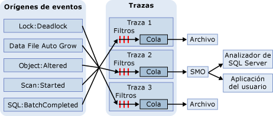

# Seguimiento de SQL
[!INCLUDE[appliesto-ss-xxxx-xxxx-xxx-md](../../includes/appliesto-ss-xxxx-xxxx-xxx-md.md)]
  En Seguimiento de SQL, los eventos se recopilan si se enumeran instancias de clases de eventos en la definición del seguimiento. Estos eventos pueden filtrarse para quitarlos del seguimiento o ponerse en cola para su destino. El destino puede ser un archivo u Objetos de administración de [!INCLUDE[ssNoVersion](../../includes/ssnoversion-md.md)] (SMO), que pueden usar la información del seguimiento en aplicaciones que administran [!INCLUDE[ssNoVersion](../../includes/ssnoversion-md.md)].  
  
> [!IMPORTANT]  
>  [!INCLUDE[ssNoteDepFutureAvoid](../../includes/ssnotedepfutureavoid-md.md)] Use eventos extendidos en su lugar.  
  
## Ventajas de seguimiento SQL  
 Microsoft [!INCLUDE[ssNoVersion](../../includes/ssnoversion-md.md)] ofrece procedimientos almacenados del sistema [!INCLUDE[tsql](../../includes/tsql-md.md)] para crear seguimientos en una instancia del [!INCLUDE[ssDEnoversion](../../includes/ssdenoversion-md.md)]. Puede utilizar estos procedimientos almacenados del sistema desde sus propias aplicaciones para crear seguimientos manualmente, en lugar de utilizar el [!INCLUDE[ssSqlProfiler](../../includes/sssqlprofiler-md.md)]. Esto permite escribir aplicaciones personalizadas específicas para las necesidades de la organización.  
  
## Arquitectura de Seguimiento de SQL  
 Los orígenes de eventos pueden ser cualquier origen que genere el evento de seguimiento, como lotes de [!INCLUDE[tsql](../../includes/tsql-md.md)] o eventos de [!INCLUDE[ssNoVersion](../../includes/ssnoversion-md.md)] tales como interbloqueos. Para obtener más información acerca de los eventos, vea [SQL Server Event Class Reference](../../relational-databases/event-classes/sql-server-event-class-reference.md). Después de producirse un evento, si la clase de evento se ha incluido en una definición de seguimiento, el seguimiento recopila la información sobre el evento. Si se han definido filtros para la clase de evento en la definición del seguimiento, éstos se aplican y la información de los eventos de seguimiento se pasa a una cola. Desde la cola, la información de seguimiento se escribe en un archivo o puede usarla un SMO en aplicaciones, como el [!INCLUDE[ssSqlProfiler](../../includes/sssqlprofiler-md.md)]. En el siguiente diagrama se muestra el modo en que Seguimiento de SQL recopila eventos durante una traza.  
  
   
  
## Terminología de Seguimiento de SQL  
 Los términos siguientes describen los conceptos clave de Seguimiento de SQL.  
  
 **Evento**  
 Repetición de una acción en una instancia de [!INCLUDE[msCoName](../../includes/msconame-md.md)] [!INCLUDE[ssDEnoversion](../../includes/ssdenoversion-md.md)].  
  
 **Columna de datos**  
 Atributo de un evento.  
  
 **Clase de eventos**  
 Tipo de evento del que se puede realizar un seguimiento. La clase de evento contiene todas las columnas de datos que puede proporcionar un evento.  
  
 **Categoría de eventos**  
 Grupo de clases de evento relacionadas.  
  
 **Seguimiento** (nombre)  
 Colección de eventos y datos devueltos por el [!INCLUDE[ssDE](../../includes/ssde-md.md)].  
  
 **Realizar un seguimiento** (verbo)  
 Recopilar y supervisar eventos en una instancia de [!INCLUDE[ssNoVersion](../../includes/ssnoversion-md.md)].  
  
 **Tracedefinition**  
 Colección de clases de evento, columnas de datos y filtros que identifican los tipos de evento que se deben recopilar durante un seguimiento.  
  
 **Filter**  
 Criterio que limita los eventos que se recopilan en un seguimiento.  
  
 **Archivo de seguimiento**  
 Archivo creado cuando se guarda un seguimiento.  
  
 **Plantilla**  
 En el [!INCLUDE[ssSqlProfiler](../../includes/sssqlprofiler-md.md)], archivo que define las clases de evento y las columnas de datos que se recopilan en un seguimiento.  
  
 **Tabla de seguimiento**  
 En el [!INCLUDE[ssSqlProfiler](../../includes/sssqlprofiler-md.md)], tabla que se crea cuando se guarda un seguimiento en una tabla.  
  
## Usar columnas de datos para describir eventos devueltos  
 Seguimiento de SQL utiliza columnas de datos en la salida del seguimiento para describir eventos devueltos cuando se ejecuta el seguimiento. En la tabla siguiente se describen las columnas de datos de [!INCLUDE[ssSqlProfiler](../../includes/sssqlprofiler-md.md)] , que son las mismas que usa Seguimiento de SQL, y se indican las columnas seleccionadas de manera predeterminada.  
  
|Columna de datos|Número de columna|Description|  
|-----------------|-------------------|-----------------|  
|**ApplicationName***|10|Nombre de la aplicación cliente que ha creado la conexión a una instancia de [!INCLUDE[ssNoVersion](../../includes/ssnoversion-md.md)]. Esta columna se rellena con los valores que pasa la aplicación, no con el nombre del programa.|  
|**BigintData1**|52|Valor (tipo de datos**bigint** ) que depende de la clase de evento especificada en el seguimiento.|  
|**BigintData2**|53|Valor (tipo de datos**bigint** ) que depende de la clase de evento especificada en el seguimiento.|  
|**Binary Data**|2|Valor binario que depende de la clase de evento que se captura en el seguimiento.|  
|**ClientProcessID***|9|Id. que el equipo host asigna al proceso en el que se ejecuta la aplicación cliente. Esta columna de datos se rellena si el cliente proporciona su identificador de proceso.|  
|**ColumnPermissions**|44|Indica si se estableció un permiso de columna. Puede analizar el texto de la instrucción para determinar los permisos que se aplicaron a las columnas.|  
|**CPU**|18|Cantidad de tiempo de CPU (en milisegundos) utilizada por el evento.|  
|**Id. de base de datos***|3|Identificador de la base de datos especificada mediante la instrucción USE *database_name* o el identificador de la base de datos predeterminada si no se emite la instrucción USE *database_name*para una instancia determinada. [!INCLUDE[ssSqlProfiler](../../includes/sssqlprofiler-md.md)] muestra el nombre de la base de datos si se captura la columna de datos **ServerName** en el seguimiento y el servidor está disponible. Determina el valor de una base de datos mediante la función DB_ID.|  
|**DatabaseName**|35|Nombre de la base de datos en que se ejecuta la instrucción del usuario.|  
|**DBUserName***|40|Nombre de usuario de [!INCLUDE[ssNoVersion](../../includes/ssnoversion-md.md)] del cliente.|  
|**Duración**|13|Duración (en microsegundos) del evento.   El servidor informa de la duración del evento en microsegundos (una millonésima parte de un segundo o 10-6segundos) y la cantidad de tiempo de CPU que usa el evento en milisegundos (una milésima de segundo o 10-3segundos). La interfaz gráfica de usuario de [!INCLUDE[ssSqlProfiler](../../includes/sssqlprofiler-md.md)] muestra la columna **Duración** en milisegundos de manera predeterminada, pero cuando se guarda un seguimiento en un archivo o en una tabla de base de datos, el valor de la columna **Duración** se escribe en microsegundos.|  
|**EndTime**|15|Hora a la que finalizó el evento. Esta columna no se rellena para las clases de eventos que hacen referencia al inicio de un evento, como **SQL:BatchStarting** o **SP:Starting**.|  
|**Error**|31|Número de error de un evento específico. A menudo, es el número de error almacenado en **sysmessages**.|  
|**EventClass***|27|Tipo de clase de evento capturado.|  
|**EventSequence**|51|Número de secuencia de este evento.|  
|**EventSubClass***|21|Tipo de subclase de evento, que proporciona más información acerca de cada clase de evento. Por ejemplo, los valores de la subclase de evento de la clase de evento **Execution Warning** representan el tipo de advertencia de ejecución:   **1** = Espera de consulta. La consulta debe esperar a los recursos para poder ejecutarse; por ejemplo, la memoria.   **2** = Tiempo de espera de la consulta. Se ha agotado el tiempo de espera de la consulta mientras esperaba a los recursos necesarios para su ejecución. Esta columna de datos no se llena para todas las clases de evento.|  
|**GUID**|54|Valor GUID que depende de la clase de evento especificada en el seguimiento.|  
|**FileName**|36|Nombre lógico del archivo modificado.|  
|**Handle**|33|Valor entero utilizado por ODBC, OLE DB o DB-Library para coordinar la ejecución del servidor.|  
|**HostName***|8|Nombre del equipo en el que se está ejecutando el cliente. Esta columna de datos se rellena si el cliente proporciona el nombre del host. Para determinar el nombre del host, utilice la función HOST_NAME.|  
|**IndexID**|24|Id. del índice del objeto afectado por el evento. Para determinar el Id. de índice de un objeto, utilice la columna **indid** de la tabla del sistema **sysindexes** .|  
|**IntegerData**|25|Valor entero que depende de la clase de evento capturado en el seguimiento.|  
|**IntegerData2**|55|Valor entero que depende de la clase de evento capturado en el seguimiento.|  
|**IsSystem**|60|Indica si el evento ha ocurrido en un proceso del sistema o en un proceso de usuario:   **1** = sistema   **0** = usuario|  
|**LineNumber**|5|Contiene el número de la línea que incluye el error. En eventos que implican instrucciones [!INCLUDE[tsql](../../includes/tsql-md.md)] , como **SP:StmtStarting**, **LineNumber** contiene el número de línea de la instrucción en el procedimiento almacenado o lote.|  
|**LinkedServerName**|45|Nombre del servidor vinculado.|  
|**LoginName**|11|Nombre del inicio de sesión del usuario (inicio de sesión de seguridad de SQL Server o credenciales de inicio de sesión de Windows con el formato DOMINIO\nombreDeUsuario).|  
|**LoginSid***|41|SID (identificador de seguridad) del usuario que ha iniciado la sesión. Puede encontrar esta información en la vista **sys.server_principals** de la base de datos **maestra** . Cada inicio de sesión en el servidor tiene un identificador único.|  
|**MethodName**|47|Nombre del método OLE DB.|  
|**Modo**|32|Valor entero utilizado por varios eventos para describir un estado recibido o solicitado por el evento.|  
|**NestLevel**|29|Valor entero que representa los datos devueltos por @@NESTLEVEL.|  
|**NTDomainName***|7|Dominio de Microsoft Windows al que pertenece el usuario.|  
|**NTUserName***|6|Nombre de usuario de Windows.|  
|**ObjectID**|22|Id. del objeto asignado por el sistema.|  
|**ObjectID2**|56|Id. del objeto o entidad relacionado, si está disponible.|  
|**ObjectName**|34|Nombre del objeto al que se hace referencia.|  
|**ObjectType***\*|28|Valor que representa el tipo de objeto implicado en el evento. Este valor corresponde al de la columna **type** en **sysobjects**.|  
|**Offset**|61|Desplazamiento inicial de la instrucción en el procedimiento almacenado o lote.|  
|**OwnerID**|58|Solo para eventos de bloqueo. Tipo de objeto que posee un bloqueo.|  
|**OwnerName**|37|Nombre de usuario de la base de datos del propietario del objeto.|  
|**ParentName**|59|Nombre del esquema en el que reside el objeto.|  
|**Permisos**|19|Valor entero que representa el tipo de permisos comprobado. Los valores son:   **1** = SELECT ALL   **2** = UPDATE ALL   **4** = REFERENCES ALL   **8** = INSERT   **16** = DELETE   **32** = EXECUTE (solo procedimientos)   **4096** = SELECT ANY (al menos una columna)   **8192** = UPDATE ANY   **16384** = REFERENCES ANY|  
|**ProviderName**|46|Nombre del proveedor OLEDB.|  
|**Reads**|16|Número de operaciones de lectura en el disco lógico que realiza el servidor en nombre del evento. Estas operaciones de lectura incluyen todas las lecturas realizadas desde tablas y búferes durante la ejecución de la instrucción.|  
|**IdSolicitud**|49|Id. de la solicitud que contiene la instrucción.|  
|**RoleName**|38|Nombre del rol de aplicación que se habilita.|  
|**RowCounts**|48|Número de filas del lote.|  
|**ServerName***|26|Nombre de la instancia de [!INCLUDE[ssNoVersion](../../includes/ssnoversion-md.md)] cuyo seguimiento se realiza.|  
|**SessionLoginName**|64|Nombre de inicio de sesión del usuario que originó la sesión. Por ejemplo, si se conecta a [!INCLUDE[ssNoVersion](../../includes/ssnoversion-md.md)] con **inicioDeSesión1** y ejecuta una instrucción como **inicioDeSesión2**, **SessionLoginName** muestra **inicioDeSesión1**y **LoginName** muestra **inicioDeSesión2**. En esta columna de datos se muestran los inicios de sesión de [!INCLUDE[ssNoVersion](../../includes/ssnoversion-md.md)] y de Windows.|  
|**Severity**|20|Nivel de gravedad del evento de excepción.|  
|**SourceDatabaseID**|62|Id. de la base de datos en la que se está el origen del objeto.|  
|**SPID**|12|Id. de proceso de servidor (SPID) que [!INCLUDE[ssNoVersion](../../includes/ssnoversion-md.md)] asigna al proceso asociado al cliente.|  
|**SqlHandle**|63|Hash de 64 bits basado en el texto de una consulta ad hoc o en el Id. de base de datos y de objeto de un objeto SQL. Este valor puede pasarse a **sys.dm_exec_sql_text()** para recuperar el texto SQL asociado.|  
|**StartTime***|14|Hora a la que se inició el evento, si está disponible.|  
|**State**|30|Código de estado de error.|  
|**Correcto**|23|Indica si el evento se realizó correctamente. Los valores son:   **1** = Correcto   **0** = Error   Por ejemplo, el valor **1** significa que se ha comprobado un permiso correctamente y el valor **0** significa que se ha producido un error en la comprobación.|  
|**TargetLoginName**|42|Para acciones que se dirigen a un inicio de sesión, el nombre del inicio de sesión de destino; por ejemplo, agregar un nuevo inicio de sesión.|  
|**TargetLoginSid**|43|Para acciones que se dirigen a un inicio de sesión, el SID del inicio de sesión de destino; por ejemplo, agregar un nuevo inicio de sesión.|  
|**TargetUserName**|39|Para acciones que se dirigen a un usuario de base de datos, el nombre del usuario; por ejemplo, conceder permiso a un usuario.|  
|**TextData**|1|Valor de texto que depende de la clase de evento que se captura en el seguimiento. Sin embargo, si realiza un seguimiento de una consulta con parámetros, no se mostrarán en la columna **TextData** las variables con los valores de datos.|  
|**Identificador de transacción**|4|Identificador de la transacción asignado por el sistema.|  
|**Tipo**|57|Valor entero que depende de la clase de evento capturado en el seguimiento.|  
|**Writes**|17|Número de operaciones de escritura en el disco físico que realiza el servidor en nombre del evento.|  
|**XactSequence**|50|Token que describe la transacción actual.|  
  
 * Estas columnas de datos se rellenan de forma predeterminada para todos los eventos.  
  
 \*\*Para más información sobre la columna de datos **ObjectType**, vea [Columna de evento de seguimiento ObjectType](../../relational-databases/event-classes/objecttype-trace-event-column.md).  
  
## Tareas de seguimiento de SQL  
  
|Descripción de la tarea|Tema|  
|----------------------|-----------|  
|Describe cómo crear y ejecutar seguimientos mediante procedimientos almacenados de Transact-SQL.|[Crear y ejecutar seguimientos mediante procedimientos almacenados de Transact-SQL](../../relational-databases/sql-trace/create-and-run-traces-using-transact-sql-stored-procedures.md)|  
|Describe cómo crear seguimientos manuales con procedimientos almacenados en una instancia de [!INCLUDE[ssDEnoversion](../../includes/ssdenoversion-md.md)].|[Crear seguimientos manuales mediante procedimientos almacenados](../../relational-databases/sql-trace/create-manual-traces-using-stored-procedures.md)|  
|Describe cómo guardar los resultados de seguimiento en el archivo donde se escriben los resultados del seguimiento.|[Guardar los resultados de un seguimiento en un archivo](../../relational-databases/sql-trace/save-trace-results-to-a-file.md)|  
|Describe cómo mejorar el acceso a los datos de seguimiento usando espacio en el directorio **Temp** .|[Mejorar el acceso a los datos de seguimiento](../../relational-databases/sql-trace/improve-access-to-trace-data.md)|  
|Describe el modo de usar procedimientos almacenados para crear un seguimiento.|[Crear un seguimiento &#40;Transact-SQL&#41;](../../relational-databases/sql-trace/create-a-trace-transact-sql.md)|  
|Describe el modo de usar procedimientos almacenados para crear un filtro que solo recupere la información necesaria en un evento que se está siguiendo.|[Establecer un filtro de seguimiento &#40;Transact-SQL&#41;](../../relational-databases/sql-trace/set-a-trace-filter-transact-sql.md)|  
|Describe cómo usar procedimientos almacenados para modificar un seguimiento existente.|[Modificar un seguimiento existente &#40;Transact-SQL&#41;](../../relational-databases/sql-trace/modify-an-existing-trace-transact-sql.md)|  
|Describe cómo usar las funciones integradas para ver un seguimiento guardado.|[Ver un seguimiento guardado &#40;Transact-SQL&#41;](../../relational-databases/sql-trace/view-a-saved-trace-transact-sql.md)|  
|Describe cómo usar las funciones integradas para ver la información del filtro de seguimiento.|[Ver la información del filtro &#40;Transact-SQL&#41;](../../relational-databases/sql-trace/view-filter-information-transact-sql.md)|  
|Describe cómo usar procedimientos almacenados para eliminar un seguimiento.|[Eliminar un seguimiento &#40;Transact-SQL&#41;](../../relational-databases/sql-trace/delete-a-trace-transact-sql.md)|  
|Describe cómo minimizar el costo de rendimiento que provoca un seguimiento.|[Optimizar el seguimiento de SQL](../../relational-databases/sql-trace/optimize-sql-trace.md)|  
|Describe cómo filtrar un seguimiento para minimizar la sobrecarga que comporta un seguimiento.|[Filtrar un seguimiento](../../relational-databases/sql-trace/filter-a-trace.md)|  
|Describe cómo minimizar la cantidad de datos que el seguimiento recopile.|[Limitar el tamaño de la tabla y el archivo de seguimiento](../../relational-databases/sql-trace/limit-trace-file-and-table-sizes.md)|  
|Describe las dos maneras de programar la traza en Microsoft [!INCLUDE[ssNoVersion](../../includes/ssnoversion-md.md)].|[Programar seguimientos](../../relational-databases/sql-trace/schedule-traces.md)|  
  
## Ver también  
 [Plantillas y permisos de SQL Server Profiler](../../tools/sql-server-profiler/sql-server-profiler-templates-and-permissions.md)   
 [Guía de programación para objetos de administración de SQL Server &#40;SMO&#41;](../../relational-databases/server-management-objects-smo/sql-server-management-objects-smo-programming-guide.md)  
  
  
