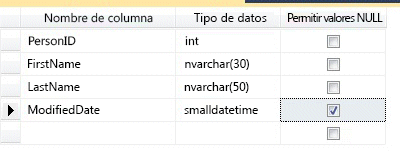
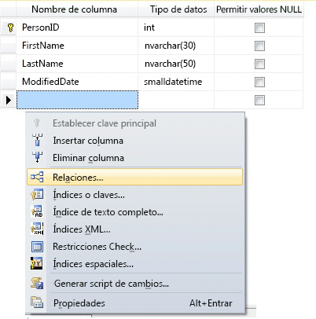
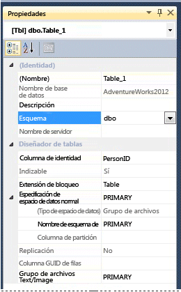

# <a name="create-tables-database-engine"></a>Crear tablas (motor de base de datos)
[!INCLUDE [sqlserver2016-asdb-asdbmi-asa-pdw](../../includes/applies-to-version/sqlserver2016-asdb-asdbmi-asa-pdw.md)]

  Puede crear una tabla, asignarle un nombre y agregarla a una base de datos existente mediante [!INCLUDE[ssManStudioFull](../../includes/ssmanstudiofull-md.md)] o [!INCLUDE[tsql](../../includes/tsql-md.md)].  
  

  
##  <a name="check-your-permissions-first"></a><a name="Permissions"></a> Compruebe los permisos en primer lugar.  
Esta tarea necesita el permiso CREATE TABLE en la base de datos y el permiso ALTER en el esquema en que se crea la tabla.  
  
 Si alguna columna de la instrucción CREATE TABLE se define como un tipo definido por el usuario de CLR, se necesita la propiedad del tipo o el permiso REFERENCES.  
  
 Si las columnas de la instrucción CREATE TABLE tienen asociada una colección de esquemas XML, se necesita la propiedad de la colección de esquemas XML o el permiso REFERENCES.  
  
 
## <a name="using-table-designer"></a>Usar el Diseñador de tablas  
  
1.  En SSMS, en el **Explorador de objetos**, conéctese a la instancia de [!INCLUDE[ssDE](../../includes/ssde-md.md)] que contiene la base de datos que se va a modificar.  
  
2.  En el **Explorador de objetos**, expanda el nodo **Bases de datos** y, a continuación, expanda la base de datos que contendrá la nueva tabla.  
  
3.  En el Explorador de objetos, haga clic con el botón derecho en el nodo **Tablas** de la base de datos y, después, haga clic en **Nueva tabla**.  
  
4.  Escriba los nombres de columna, elija los tipos de datos y elija si desea permitir valores NULL para cada columna como se muestra en la ilustración siguiente:  
  
       
  
5.  Para especificar más propiedades para una columna, como la identidad o valores de columna calculada, haga clic en la columna y después, en la pestaña de propiedades de la columna, elija las propiedades adecuadas. Para obtener más información sobre las propiedades de columna, vea [Propiedades de columnas de tablas &#40;SQL Server Management Studio&#41;](../../relational-databases/tables/table-column-properties-sql-server-management-studio.md).  
  
6.  Para especificar una columna como clave principal, haga clic con el botón derecho en la columna y seleccione **Establecer clave principal**. Para obtener más información, consulte [Create Primary Keys](../../relational-databases/tables/create-primary-keys.md).  
  
7.  Para crear relaciones de clave externa, restricciones CHECK o índices, haga clic con el botón secundario en el panel Diseñador de tablas y seleccione un objeto de la lista como se muestra en la ilustración siguiente:  
  
       
  
     Para obtener más información acerca de estos objetos, vea [Create Foreign Key Relationships](../../relational-databases/tables/create-foreign-key-relationships.md), [Create Check Constraints](../../relational-databases/tables/create-check-constraints.md) e [Indexes](../../relational-databases/indexes/indexes.md).  
  
8.  De forma predeterminada, la tabla está contenida en el esquema **dbo** . Para especificar un esquema diferente para la tabla, haga clic con el botón derecho en el panel Diseñador de tablas y seleccione **Propiedades** como se muestra en la ilustración siguiente. En la lista desplegable **Esquema** , seleccione el esquema adecuado.  
  
       
  
     Para obtener más información acerca de los esquemas, vea [Create a Database Schema](../../relational-databases/security/authentication-access/create-a-database-schema.md).  
  
9. En el menú **Archivo**, seleccione **Guardar** *nombre de tabla*.  
  
10. En el cuadro de diálogo **Elegir nombre** , escriba un nombre para la tabla y haga clic en **Aceptar**.  
  
11. Para ver la nueva tabla, en el **Explorador de objetos**, expanda el nodo **Tablas** y presione **F5** para actualizar la lista de objetos. La nueva tabla se mostrará en la lista de tablas.  
  
##  <a name="using-transact-sql"></a><a name="TsqlProcedure"></a> Usar Transact-SQL  
  
## <a name="using-query-editor"></a>Usar el Editor de consultas  
  
1.  En el **Explorador de objetos**, conéctese a una instancia del [!INCLUDE[ssDE](../../includes/ssde-md.md)].  
  
2.  En la barra de Estándar, haga clic en **Nueva consulta**.  
  
3.  Copie y pegue el siguiente ejemplo en la ventana de consulta y haga clic en **Ejecutar**.  
  
    ```  
    CREATE TABLE dbo.PurchaseOrderDetail  
    (  
        PurchaseOrderID int NOT NULL  
        ,LineNumber smallint NOT NULL  
        ,ProductID int NULL  
        ,UnitPrice money NULL  
        ,OrderQty smallint NULL  
        ,ReceivedQty float NULL  
        ,RejectedQty float NULL  
        ,DueDate datetime NULL  
    );  
    ```  
  
 Para obtener más ejemplos, vea [CREATE TABLE &#40;Transact-SQL&#41;](../../t-sql/statements/create-table-transact-sql.md).  
  
  
