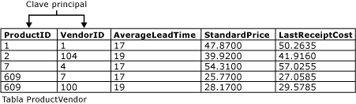

# Restricciones entre claves principales y claves externas
[!INCLUDE[tsql-appliesto-ss2016-asdb-xxxx-xxx-md](../../includes/tsql-appliesto-ss2016-asdb-xxxx-xxx-md.md)]

  Las claves principales y las claves externas son dos tipos de restricciones que se pueden usar para aplicar la integridad de datos en las tablas de [!INCLUDE[ssNoVersion](../../includes/ssnoversion-md.md)] . Se trata de objetos de base de datos importantes.  
  
 Este tema contiene las siguientes secciones.  
  
 [Restricciones de clave principal](../../relational-databases/tables/primary-and-foreign-key-constraints.md#PKeys)  
  
 [Foreign Key Constraints](../../relational-databases/tables/primary-and-foreign-key-constraints.md#FKeys)  
  
 [Tareas relacionadas](../../relational-databases/tables/primary-and-foreign-key-constraints.md#Tasks)  
  
##   Restricciones de clave principal  
 Una tabla suele tener una columna o una combinación de columnas cuyos valores identifican de forma única cada fila de la tabla. Estas columnas se denominan claves principales de la tabla y exigen la integridad de entidad de la tabla. Debido a que las restricciones de clave principal garantizan datos únicos, con frecuencia se definen en una columna de identidad.  
  
 Cuando especifica una restricción de clave principal en una tabla, [!INCLUDE[ssDE](../../includes/ssde-md.md)] exige la unicidad de los datos mediante la creación automática de un índice único para las columnas de clave principal. Este índice también permite un acceso rápido a los datos cuando se usa la clave principal en las consultas. Si se define una restricción de clave principal para más de una columna, puede haber valores duplicados dentro de la misma columna, pero cada combinación de valores de todas las columnas de la definición de la restricción de clave principal debe ser única.  
  
 Como se muestra en la siguiente ilustración, las columnas **ProductID** y **VendorID** de la tabla **Purchasing.ProductVendor** forman una restricción de clave principal compuesta para esta tabla. De este modo, se garantiza que todas las filas de la tabla **ProductVendor** tengan una combinación de **ProductID** y **VendorID**. Esto impide la inserción de filas duplicadas.  
  
   
  
-   Una tabla solo puede incluir una restricción de clave principal.  
  
-   Una clave principal no puede superar las 16 columnas y una longitud de clave total de 900 bytes.  
  
-   El índice generado por una restricción de clave principal no puede hacer que el número de índices de la tabla supere 999 índices no clúster y 1 índice clúster.  
  
-   Si no se especifica si es en clúster o no en clúster para una restricción de clave principal, se usa la disposición en clúster si no hay índices clúster en la tabla.  
  
-   Todas las columnas definidas en una restricción de clave principal se deben definir como no NULL. Si no se especifica nulabilidad, la nulabilidad de todas las columnas que participan en una restricción de clave principal se establece en no NULL.  
  
-   Si la clave principal se define en una columna de tipo definido por el usuario CLR, la implementación del tipo debe admitir el orden binario.  
  
##   Foreign Key Constraints  
 Una clave externa (FK) es una columna o combinación de columnas que se usa para establecer y aplicar un vínculo entre los datos de dos tablas a fin de controlar los datos que se pueden almacenar una tabla de clave externa. En una referencia de clave externa, se crea un vínculo entre dos tablas cuando las columnas de una de ellas hacen referencia a las columnas de la otra que contienen el valor de clave principal. Esta columna se convierte en una clave externa para la segunda tabla.  
  
 Por ejemplo, la tabla **Sales.SalesOrderHeader** tiene un vínculo de clave externa a la tabla **Sales.SalesPerson** porque existe una relación lógica entre pedidos de ventas y personal de ventas. La columna **SalesPersonID** de la tabla **SalesOrderHeader** coincide con la columna de clave principal de la tabla **SalesPerson** . La columna **SalesPersonID** de la tabla **SalesOrderHeader** es la clave externa para la tabla **SalesPerson** . Al crear esta relación de clave externa, no se puede insertar un valor para **SalesPersonID** en la tabla **SalesOrderHeader** si no existe en la tabla **SalesPerson** .  
  
 Una tabla puede hacer referencia a otras 253 tablas y columnas como claves externas (referencias de salida) como máximo. [!INCLUDE[ssSQL15](../../includes/sssql15-md.md)] aumenta el límite para la cantidad de otras tablas y columnas que pueden hacer referencia a las columnas de una sola tabla (referencias de entrada) de 253 a 10 000. (Requiere al menos el nivel de compatibilidad 130). El aumento conlleva las siguientes restricciones:  
  
-   Mayor que 253 referencias de clave externa solo se admite para operaciones DELETE DML. No se admiten operaciones UPDATE y MERGE.  
  
-   Una tabla con una referencia de clave externa a sí misma sigue estando limitada a 253 referencias de clave externa.  
  
-   Mayor que 253 referencias de clave externa no está actualmente disponible para índices de almacén de columnas, tablas optimizadas para memoria, Stretch Database o tablas de clave externa particionadas.  
  
### Índices de restricciones de clave externa  
 A diferencia de las restricciones de clave principal, la creación una restricción de clave externa no crea automáticamente el índice correspondiente. No obstante, la creación manual de un índice en una clave externa suele ser útil por los siguientes motivos:  
  
-   Las columnas de clave externa suelen usarse en los criterios de combinación cuando los datos de las tablas relacionadas se combinan en consultas mediante la correspondencia de la columna o columnas de la restricción de clave externa de una tabla y la columna o columnas de la clave única o principal de la otra. Un índice permite al [!INCLUDE[ssDE](../../includes/ssde-md.md)] buscar con rapidez datos relacionados en la tabla de clave externa. No obstante, no es necesario crear este índice. Pueden combinarse los datos de dos tablas relacionadas aunque no se hayan definido restricciones de clave principal o de clave externa entre ellas, pero una relación de clave externa entre dos tablas indica que estas se han optimizado para su combinación en una consulta que use las claves como criterio.  
  
-   Los cambios en las restricciones de clave principal se comprueban con restricciones de clave externa en las tablas relacionadas.  
  
### Integridad referencial  
 Aunque el fin principal de una restricción de clave externa es controlar los datos que pueden almacenarse en la tabla de la clave externa; también controla los cambios realizados en los datos de la tabla de la clave principal. Por ejemplo, si se elimina la fila de un vendedor de la tabla **Sales.SalesPerson** y el identificador del vendedor se usa para pedidos de ventas en la tabla **Sales.SalesOrderHeader** , se rompe la integridad relacional entre ambas tablas: los pedidos del vendedor eliminado quedarán sin correspondencia en la tabla **SalesOrderHeader** sin ningún vínculo con los datos de la tabla **SalesPerson** .  
  
 Con una restricción de clave externa se evita esta situación. Esta restricción exige la integridad referencial al garantizar que no se puedan realizar cambios en los datos de la tabla de la clave principal si esos cambios anulan el vínculo con los datos de la tabla de la clave externa. Si se intenta eliminar la fila de una tabla de la clave principal o cambiar un valor de clave principal, la acción no progresará si el valor de la clave principal cambiado o eliminado corresponde a un valor de la restricción de clave externa de otra tabla. Para cambiar o eliminar una fila de una restricción de clave externa, debe antes eliminar o cambiar los datos de clave externa de la tabla de clave externa, lo que vincula la clave externa con otros datos de clave principal.  
  
#### Integridad referencial en cascada  
 Las restricciones de integridad referencial en cascada permiten definir las acciones que [!INCLUDE[ssDE](../../includes/ssde-md.md)] lleva a cabo cuando un usuario intenta eliminar o actualizar una clave a la que apuntan las claves externas existentes. Se pueden definir las acciones en cascada.  
  
 NO ACTION  
 [!INCLUDE[ssDE](../../includes/ssde-md.md)] genera un error y se revierte la acción de eliminación o actualización de la fila de la tabla primaria.  
  
 CASCADE  
 Si esa fila se actualiza o elimina en la tabla primaria, las filas correspondientes se actualizan o eliminan en la tabla de referencia. CASCADE no se puede especificar si una columna **timestamp** es parte de una clave externa o de la clave con referencia. ON DELETE CASCADE no se puede especificar en una tabla que tenga un desencadenador INSTEAD OF DELETE. No se puede especificar ON UPDATE CASCADE para las tablas que tienen desencadenadores INSTEAD OF UPDATE.  
  
 SET NULL  
 Cuando se actualiza o elimina la fila correspondiente en la tabla primaria, todos los valores que componen la clave externa se establecen en NULL. Para que esta restricción se ejecute, las columnas de clave externa deben aceptar valores NULL. No se puede especificar para las tablas que tienen desencadenadores INSTEAD OF UPDATE.  
  
 SET DEFAULT  
 Todos los valores que forman la clave externa se establecen en los valores predeterminados si se actualiza o elimina la fila correspondiente de la tabla primaria. Para que esta restricción se ejecute, todas las columnas de clave externa deben tener definiciones predeterminadas. Si una columna acepta valores NULL y no se ha establecido un valor predeterminado explícito, NULL se convierte en el valor predeterminado explícito de dicha columna. No se puede especificar para las tablas que tienen desencadenadores INSTEAD OF UPDATE.  
  
 CASCADE, SET NULL, SET DEFAULT y NO ACTION se pueden combinar en las tablas con relaciones referenciales entre sí. Si el [!INCLUDE[ssDE](../../includes/ssde-md.md)] detecta NO ACTION, detiene y revierte las acciones CASCADE, SET NULL y SET DEFAULT relacionadas. Cuando una instrucción DELETE hace que se combinen las acciones CASCADE, SET NULL, SET DEFAULT y NO ACTION, todas las acciones CASCADE, SET NULL y SET DEFAULT se aplican antes de que el [!INCLUDE[ssDE](../../includes/ssde-md.md)] compruebe la existencia de NO ACTION.  
  
### Desencadenadores y acciones referenciales en cascada  
 Las acciones referenciales en cascada activan los desencadenadores AFTER UPDATE o AFTER DELETE de la siguiente manera:  
  
-   Primero se realizan todas las acciones referenciales en cascada generadas directamente por las instrucciones DELETE o UPDATE originales.  
  
-   Si se ha definido algún desencadenador AFTER en las tablas afectadas, estos desencadenadores se activan una vez realizadas todas las acciones en cascada. Estos desencadenadores se activan en el orden contrario a la acción en cascada. Si hay varios desencadenadores en una sola tabla, se activan en un orden aleatorio a no ser que el primer o último desencadenador de la tabla sea un desencadenador dedicado. Este orden es como se especifica mediante [sp_settriggerorder](../../relational-databases/system-stored-procedures/sp-settriggerorder-transact-sql.md).  
  
-   Si varias cadenas en cascada se originan desde la tabla que era el objetivo directo de una acción UPDATE o DELETE, el orden en que estas cadenas activan sus respectivos desencadenadores no está especificado. Sin embargo, una cadena siempre activa todos sus desencadenadores antes que otra cadena inicie la activación.  
  
-   Un desencadenador AFTER en la tabla que es el objetivo directo de una acción UPDATE o DELETE se activa independientemente de si afecta a alguna fila. En este caso, ninguna otra tabla se ve afectada por la cascada.  
  
-   Si alguno de los desencadenadores anteriores realiza operaciones UPDATE o DELETE en otras tablas, estas acciones pueden iniciar cadenas en cascada secundarias. Estas cadenas secundarias se procesan a la vez para cada operación UPDATE o DELETE una vez activados todos los desencadenadores de todas las cadenas principales. Este proceso puede repetirse recursivamente para las operaciones UPDATE o DELETE posteriores.  
  
-   Realizar CREATE, ALTER, DELETE u otras operaciones de lenguaje de definición de datos (DDL) dentro de los desencadenadores puede causar la activación de los desencadenadores DDL. Esto puede hacer que se lleven a cabo operaciones DELETE o UPDATE que inician cadenas y desencadenadores en cascada adicionales.  
  
-   Si se genera un error en una cadena de acción referencial en cascada determinada, se produce un error, no se activa ningún desencadenador AFTER en esa cadena y la operación DELETE o UPDATE que ha creado la cadena se revierte.  
  
-   Una tabla con un desencadenador INSTEAD OF no puede tener también una cláusula REFERENCES que especifique un acción en cascada. Sin embargo, un desencadenador AFTER de la tabla de destino de una acción en cascada puede ejecutar una instrucción INSERT, UPDATE o DELETE en otra tabla o vista que active un desencadenador INSTEAD OF definido para dicho objeto.  
  
##   Tareas relacionadas  
 En la tabla siguiente se enumeran las tareas comunes asociadas a restricciones de clave principal y clave externa.  
  
|Tarea|Tema|  
|----------|-----------|  
|Describe cómo crear una clave principal.|[Crear claves principales](../../relational-databases/tables/create-primary-keys.md)|  
|Describe cómo eliminar una clave principal.|[Eliminar claves principales](../../relational-databases/tables/delete-primary-keys.md)|  
|Describe cómo modificar una clave principal.|[Modificar claves principales](../../relational-databases/tables/modify-primary-keys.md)|  
|Describe cómo crear relaciones de clave externa|[Crear relaciones de clave externa](../../relational-databases/tables/create-foreign-key-relationships.md)|  
|Describe cómo modificar las relaciones de clave externa.|[Modificar relaciones de claves externas.](../../relational-databases/tables/modify-foreign-key-relationships.md)|  
|Describe cómo eliminar relaciones de clave externa.|[Eliminar relaciones entre claves externas.](../../relational-databases/tables/delete-foreign-key-relationships.md)|  
|Describe cómo ver las propiedades de clave externa.|[Ver las propiedades de clave externa](../../relational-databases/tables/view-foreign-key-properties.md)|  
|Describe cómo deshabilitar restricciones de clave externa para replicación.|[Deshabilitar una restricción FOREIGN KEY para la replicación](../../relational-databases/tables/disable-foreign-key-constraints-for-replication.md)|  
|Describe cómo deshabilitar las restricciones de clave externa durante una instrucción INSERT o UPDATE.|[Deshabilitar restricciones FOREIGN KEY con instrucciones INSERT y UPDATE](../../relational-databases/tables/disable-foreign-key-constraints-with-insert-and-update-statements.md)|  
  
  
