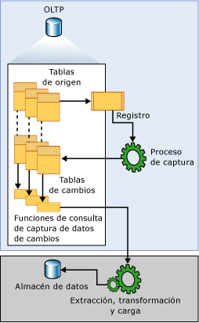

# <a name="about-change-data-capture-sql-server"></a>Acerca de la captura de datos modificados (SQL Server)
[!INCLUDE[tsql-appliesto-ss2008-xxxx-xxxx-xxx-md](../../includes/tsql-appliesto-ss2008-xxxx-xxxx-xxx-md.md)]
  La captura de datos modificados registra la actividad de inserción, actualización y eliminación que se aplica a una tabla de [!INCLUDE[ssNoVersion](../../includes/ssnoversion-md.md)] . Esto hace que los detalles de estos cambios estén disponibles en un formato relacional de fácil uso. La información de las columnas y los metadatos que se necesitan para aplicar los cambios a un entorno de destino se capturan para las filas modificadas y se almacenan en tablas de cambios que reflejan la estructura de columnas de las tablas de origen sometidas a seguimiento. Se proporcionan funciones con valores de tabla para permitir el acceso sistemático a los datos modificados por los consumidores.  
  
 Un buen ejemplo de consumidor de datos a quien va dirigida esta tecnología es una aplicación de extracción, transformación y carga (ETL). Una aplicación ETL carga incrementalmente los datos modificados de las tablas de origen de [!INCLUDE[ssNoVersion](../../includes/ssnoversion-md.md)] en un almacenamiento de datos o data mart. Aunque la representación de las tablas de origen dentro del almacén de datos debe reflejar los cambios en las tablas de origen, una tecnología de extremo a extremo que actualice una réplica del origen no resulta adecuada en este caso. En su lugar, necesita un flujo de datos modificados confiable y estructurado de forma que los consumidores puedan aplicarlo a representaciones de destino dispares de los datos. [!INCLUDE[ssNoVersion](../../includes/ssnoversion-md.md)] proporciona esta tecnología.  
  
## <a name="change-data-capture-data-flow"></a>Flujo de datos de la captura de datos modificados  
 La ilustración siguiente muestra el flujo de datos principal de la captura de datos modificados.  
  
   
  
 El origen de los datos modificados para la captura de datos modificados es el registro de transacciones de [!INCLUDE[ssNoVersion](../../includes/ssnoversion-md.md)] . A medida que se aplican las inserciones, actualizaciones y eliminaciones a las tablas de origen sometidas a seguimiento, se agregan al registro las entradas que describen esos cambios. El registro actúa como entrada para el proceso de captura. Así, se lee el registro y se agrega información sobre los cambios a la tabla de cambios asociada de la tabla sometida a seguimiento. Se proporcionan funciones para enumerar los cambios que aparecen en las tablas de cambios sobre un intervalo especificado, que devuelven la información en forma de un conjunto de resultados filtrado. Un proceso de aplicación utiliza normalmente el conjunto de resultados filtrado para actualizar una representación del origen en algún entorno externo.  
  
## <a name="understanding-change-data-capture-and-the-capture-instance"></a>Descripción de la captura de datos modificados y la instancia de captura  
 Para que se pueda realizar el seguimiento de los cambios de cualquier tabla individual dentro de una base de datos, la captura de datos modificados debe habilitarse explícitamente en la base de datos. Para ello, se usa el procedimiento almacenado [sys.sp_cdc_enable_db](../../relational-databases/system-stored-procedures/sys-sp-cdc-enable-db-transact-sql.md). Cuando se habilita la base de datos, las tablas de origen se pueden identificar como tablas sometidas a seguimiento mediante el procedimiento almacenado [sys.sp_cdc_enable_table](../../relational-databases/system-stored-procedures/sys-sp-cdc-enable-table-transact-sql.md). Cuando una tabla se habilita para la captura de datos modificados, se crea una instancia de la captura asociada para admitir la diseminación de los datos modificados en la tabla de origen. La instancia de captura está compuesta de una tabla de cambios y de dos funciones de consulta, como máximo. Los metadatos que describen los detalles de configuración de la instancia de captura se conservan en las siguientes tablas de metadatos de captura de datos modificados: **cdc.change_tables**, **cdc.index_columns**y **cdc.captured_columns**. Esta información se puede recuperar al usar el procedimiento almacenado [sys.sp_cdc_help_change_data_capture](../../relational-databases/system-stored-procedures/sys-sp-cdc-help-change-data-capture-transact-sql.md).  
  
 Todos los objetos que están asociados a una instancia de captura se crean en el esquema de captura de datos modificados de la base de datos habilitada. El nombre de la instancia de captura tiene que ser un nombre de objeto válido y único en todas las instancias de captura de base de datos. De forma predeterminada, el nombre es \<*nombre de esquema*_*nombre de tabla*> de la tabla de origen. Para denominar su tabla de cambios asociada, se anexa **_CT** al nombre de la instancia de captura. Para denominar la función que se usa para consultar todos los cambios se antepone **fn_cdc_get_all_changes_** al nombre de la instancia de captura. Si la instancia de captura se configura para admitir **net changes**, la función de consulta **net_changes** también se crea y recibe su nombre anteponiendo **fn_cdc_get_net_changes\_** al nombre de la instancia de captura.  
  
## <a name="change-table"></a>Tabla de cambios  
 Las primeras cinco columnas de una tabla de cambios de captura de datos modificados son las columnas de metadatos. Proporcionan información adicional correspondiente al cambio registrado. Las columnas restantes reflejan el nombre y, normalmente, también el tipo de las columnas capturadas identificadas de la tabla de origen. Estas columnas contienen los datos de columnas capturadas que se recopilan en la tabla de origen.  
  
 Cada operación de inserción o eliminación aplicada a una tabla de origen aparece como una fila única dentro de la tabla de cambios. Las columnas de datos de la fila resultante de una operación de inserción contienen los valores de columna después de la inserción. Las columnas de datos de la fila resultante de una operación de eliminación contienen los valores de columna antes de la eliminación. Una operación de actualización requiere una entrada de fila para identificar los valores de columna antes de la actualización, y una segunda entrada de fila para identificar los valores de columna después de la actualización.  
  
 Cada fila de una tabla de cambios también contiene metadatos adicionales que permiten interpretar los cambios realizados. La columna __$start_lsn identifica el número de secuencia de registro (LSN) de confirmación que fue asignado al cambio. El LSN de confirmación identifica tanto los cambios que se confirmaron dentro de la misma transacción como el orden de esas transacciones. La columna \_\_$seqval se puede usar para ordenar los cambios adicionales que se produzcan en la misma transacción. La columna \_\_$operation registra la operación que está asociada al cambio: 1 = eliminación, 2 = inserción, 3 = actualización (antes de la imagen) y 4 = actualización (después de la imagen). La columna \_\_$update_mask es una máscara de bits variable con un bit definido para cada columna capturada. Para las entradas correspondientes a operaciones de inserción y eliminación, la máscara de actualización siempre tendrá todos los bits activados. Las filas correspondientes a operaciones de actualización, sin embargo, tendrán solo activados los bits que correspondan a las columnas cambiadas.  
  
## <a name="change-data-capture-validity-interval-for-a-database"></a>Intervalo de validez de la captura de datos modificados para una base de datos  
 El intervalo de validez de la captura de datos modificados para una base de datos es el tiempo durante el cual los datos modificados están disponibles para las instancias de captura. El intervalo de validez comienza cuando se crea la primera instancia de captura para una tabla de base de datos y continúa hasta el momento actual.  
  
 Los datos que se depositan en las tablas de cambios crecerán hasta llegar a ser incontrolables si no se reduce su número de forma periódica y sistemática. El proceso de limpieza de la captura de datos modificados es responsable de que se aplique la directiva de limpieza basada en la retención. Primero, mueve el extremo inferior del intervalo de validez para satisfacer la restricción temporal. A continuación, quita las entradas de las tablas de cambios que han expirado. De forma predeterminada, se conservan los datos de tres días.  
  
 En el extremo superior, a medida que el proceso de captura confirma cada nuevo lote de datos modificados, se agregan entradas nuevas a **cdc.lsn_time_mapping** para cada transacción que tenga entradas en la tabla de cambios. Dentro de la tabla de asignación se conservan tanto un número de flujo de registro (LSN) de confirmación como un tiempo de confirmación de la transacción (columnas start_lsn y tran_end_time, respectivamente). El valor máximo de LSN que se encuentra en **cdc.lsn_time_mapping** representa la marca de límite superior de la ventana de validez de base de datos. La limpieza basada en la retención usa su tiempo de confirmación correspondiente como base para calcular una nueva marca de límite inferior.  
  
 Dado que el proceso de captura extrae los datos modificados del registro de transacciones, hay una latencia integrada entre el momento en que un cambio se confirma en una tabla de origen y el momento en que el cambio aparece dentro de su tabla de cambios asociada. Aunque esta latencia suele ser pequeña, es importante recordar que los datos modificados no estarán disponibles hasta que el proceso de captura haya procesado las entradas de registro relacionadas.  
  
## <a name="change-data-capture-validity-interval-for-a-capture-instance"></a>Intervalo de validez de la captura de datos modificados para una instancia de captura  
 Aunque es común que coincidan el intervalo de validez de la base de datos y el de la instancia de una captura individual, esto no siempre es así. El intervalo de validez de la instancia de captura se inicia cuando el proceso de captura reconoce la instancia de captura y comienza a registrar los cambios asociados en su tabla de cambios. Como resultado, si las instancias de captura se crean en momentos diferentes, cada una tendrá inicialmente un extremo inferior diferente. La columna start_lsn del conjunto de resultados devuelto por la instrucción [sys.sp_cdc_help_change_data_capture](../../relational-databases/system-stored-procedures/sys-sp-cdc-help-change-data-capture-transact-sql.md) muestra el punto de conexión inferior actual de cada instancia de captura definida. Cuando el proceso de limpieza limpia las entradas de la tabla de cambios, ajusta los valores de start_lsn para que todas las instancias de captura reflejen la nueva marca de límite inferior para los datos modificados disponibles. Solo se ajustan las instancias de captura que tienen valores de start_lsn menores que la nueva marca de límite inferior en ese momento. Con el tiempo, si no se crea ninguna nueva instancia de captura, los intervalos de validez para todas las instancias individuales tenderán a coincidir con el intervalo de validez de la base de datos.  
  
 El intervalo de validez es importante para los consumidores de datos modificados porque el intervalo de extracción de una solicitud debe ser abarcado totalmente por el intervalo de validez de la captura de datos modificados actual para la instancia de captura. Si el extremo inferior del intervalo de extracción está situado a la izquierda del extremo inferior del intervalo de validez, una limpieza enérgica puede provocar que se pierdan datos modificados. Si el extremo superior del intervalo de extracción está a la derecha del extremo superior del intervalo de validez, el proceso de captura no ha procesado aún el período de tiempo representado por el intervalo de extracción, y también pueden perderse datos modificados.  
  
 La función [sys.fn_cdc_get_min_lsn](../../relational-databases/system-functions/sys-fn-cdc-get-min-lsn-transact-sql.md) se usa para recuperar el valor mínimo actual de LSN para la instancia de una captura, mientras que [sys.fn_cdc_get_max_lsn](../../relational-databases/system-functions/sys-fn-cdc-get-max-lsn-transact-sql.md) se usa para recuperar el valor máximo actual de LSN. Al consultar los datos modificados, si el intervalo de LSN especificado no está incluido dentro de estos dos valores de LSN, se producirá un error en las funciones de consulta de captura de datos modificados.  
  
## <a name="handling-changes-to-source-tables"></a>Administrar los cambios en las tablas de origen  
 El alojamiento de los cambios de columnas en las tablas de origen sometidas a seguimiento es un problema difícil para los consumidores de nivel inferior. Aunque la habilitación de la captura de datos modificados en una tabla de origen no evita que se produzcan dichos cambios de DDL, la captura de datos modificados ayuda a mitigar el efecto en los consumidores al permitir que los conjuntos de resultados entregados que se devuelven a través de la API permanezcan inalterados incluso cuando cambia la estructura de columnas de la tabla de origen subyacente. Esta estructura de columnas fija también se refleja en la tabla de cambios subyacente a la que tienen acceso las funciones de consulta definidas.  
  
 Para hospedar una tabla de cambios con una estructura de columnas fija, el proceso de captura responsable de rellenar la tabla de cambios omitirá cualquier columna nueva que no se identifique para la captura cuando se habilite la tabla de origen para la captura de datos modificados. Si se quita una columna sometida a seguimiento, se proporcionarán valores NULL para la columna en las entradas de cambios subsiguientes. Sin embargo, si una columna existente sufre un cambio en su tipo de datos, el cambio se propagará a la tabla de cambios para garantizar que el mecanismo de captura no provoca la pérdida de datos de las columnas sometidas a seguimiento. El proceso de captura también expone cualquier cambio detectado en la estructura de columnas de las tablas sometidas a seguimiento en la tabla cdc.ddl_history. Los consumidores que quieran que se les avise de los ajustes que podrían tener que realizarse en las aplicaciones de nivel inferior, deberán usar el procedimiento almacenado [sys.sp_cdc_get_ddl_history](../../relational-databases/system-stored-procedures/sys-sp-cdc-get-ddl-history-transact-sql.md).  
  
 Normalmente, la instancia de captura actual continuará conservando su forma cuando se apliquen los cambios de la DDL a su tabla de origen asociada. Sin embargo, es posible crear una segunda instancia de captura para la tabla que refleje la nueva estructura de columnas. Esto permite al proceso de captura realizar cambios en la misma tabla de origen en dos tablas de cambios distintas que tienen dos estructuras de columnas diferentes. Así, mientras una tabla de cambios puede continuar alimentando los programas funcionales actuales, la segunda puede controlar un entorno de desarrollo que esté intentando incorporar datos de columnas nuevas. Permitir al mecanismo de captura rellenar ambas tablas de cambios a la vez implica que se puede llevar a cabo una transición de una a otra sin perder los datos modificados. Esto puede ocurrir siempre que se solapen dos escalas de tiempo de captura de datos modificados. Cuando se realiza la transición, se puede quitar la instancia de captura obsoleta.  
  
> [!NOTE]  
>  Solo se pueden asociar dos instancias de captura a una única tabla de origen al mismo tiempo, como máximo.  
  
## <a name="relationship-between-the-capture-job-and-the-transactional-replication-logreader"></a>Relación entre el trabajo de captura y el lector del registro de la replicación transaccional  
 La lógica para el proceso de captura de datos modificados se incrusta en el procedimiento almacenado [sp_replcmds](../../relational-databases/system-stored-procedures/sp-replcmds-transact-sql.md), una función de servidor interna generada como parte de sqlservr.exe y que también se usa en la replicación transaccional para recopilar los cambios del registro de transacciones. Cuando la captura de datos modificados se habilita sola para una base de datos, se crea el trabajo Captura del Agente SQL Server de la captura de datos modificados como vehículo para llamar a sp_replcmds. Cuando la replicación también está presente, el lector del registro transaccional solo se utiliza para satisfacer las necesidades de datos modificados de ambos consumidores. Esta estrategia reduce significativamente la contención del registro cuando se habilitan en la misma base de datos tanto la replicación como la captura de datos modificados.  
  
 El cambio entre estos dos modos funcionales para capturar los datos modificados se produce automáticamente cada vez que hay un cambio en el estado de replicación de una base de datos con la captura de datos modificados habilitada.  
  
> [!IMPORTANT]  
>  Ambas instancias de la lógica de captura requieren que el Agente [!INCLUDE[ssNoVersion](../../includes/ssnoversion-md.md)] se esté ejecutando para que el proceso se ejecute.  
  
 La tarea principal del proceso de captura es examinar el registro y escribir los datos de las columnas y la información relacionada de las transacciones en las tablas de cambios de la captura de datos modificados. Para asegurarse de que existe un límite coherente desde el punto de vista de las transacciones a través de todas las tablas de cambios de captura de datos modificados que rellene, el proceso de captura abre y confirma su propia transacción en cada ciclo de examen. Detecta cuándo se terminan de habilitar las tablas para la captura de datos modificados, y las incluye automáticamente en el conjunto de tablas para las que se supervisa si hay entradas de cambios en el registro. De igual modo, también se detectará si se deshabilita la captura de datos modificados, lo que provoca que la tabla de origen se quite del conjunto de tablas en las que se supervisa si hay datos modificados. Cuando finaliza el procesamiento de una sección del registro, el proceso de captura señala la lógica de truncamiento del registro de servidor, que utiliza esta información para identificar las entradas del registro que pueden elegirse para el truncamiento.  
  
> [!NOTE]  
>  Cuando una base de datos está habilitada para la captura de datos modificados, incluso si el modo de recuperación está establecido como simple, el punto de truncamiento de registro no avanzará hasta que el proceso de captura haya recopilado todos los cambios que estén marcados para la captura. Si el proceso de captura no se está ejecutando y hay cambios que recopilar, al ejecutar CHECKPOINT, no se truncará el registro.  
  
 El proceso de captura también se utiliza para mantener un historial de los cambios de la DDL en las tablas sometidas a seguimiento. Las instrucciones de DDL que están asociadas a la captura de datos modificados anotan entradas en el registro de transacciones de la base de datos cada vez que se quita una tabla o base de datos habilitadas para la captura de datos modificados, o cada vez que se agregan, modifican o quitan columnas de una tabla habilitada para la captura de datos modificados. Estas entradas del registro son procesadas por el proceso de captura que, posteriormente, envía los eventos de DDL asociados a la tabla cdc.ddl_history. Puede obtener información sobre los eventos de DDL que afectan a las tablas sometidas a seguimiento al usar el procedimiento almacenado [sys.sp_cdc_get_ddl_history](../../relational-databases/system-stored-procedures/sys-sp-cdc-get-ddl-history-transact-sql.md).  
  
## <a name="change-data-capture-agent-jobs"></a>Trabajos del agente de captura de datos modificados  
 A una base de datos habilitada para la captura de datos modificados se le suele asociar dos trabajos del Agente [!INCLUDE[ssNoVersion](../../includes/ssnoversion-md.md)] : uno que se utiliza para rellenar las tablas de cambios de base de datos y otro que es el responsable de la limpieza de la tabla de cambios. Ambos trabajos están compuestos de un único paso que ejecuta un comando de [!INCLUDE[tsql](../../includes/tsql-md.md)] . El comando de [!INCLUDE[tsql](../../includes/tsql-md.md)] que se invoca es un procedimiento almacenado definido de captura de datos modificados que implementa la lógica del trabajo. Los trabajos se crean cuando la primera tabla de la base de datos se habilita para la captura de datos modificados. El trabajo de limpieza se crea siempre. El trabajo de captura se creará solo si no hay definida ninguna publicación transaccional para la base de datos. También se crea el trabajo de captura cuando se habilitan tanto la captura de datos modificados como la replicación transaccional para una base de datos, y el trabajo del lector de registro transaccional se quita porque la base de datos ya no tiene definidas publicaciones.  
  
 Tanto el trabajo de limpieza como el de captura se crean con los parámetros predeterminados. El trabajo de captura se inicia inmediatamente. Se ejecuta de forma continua y procesa 1000 transacciones por cada ciclo de búsqueda, como máximo, con una espera de 5 segundos entre ciclos. El trabajo de limpieza se ejecuta diariamente a las 2 a.m. Retiene las entradas de la tabla de cambios durante 4320 minutos o 3 días, y quita 5000 entradas, como máximo, con una sola instrucción de eliminación.  
  
 Los trabajos del agente de captura de datos modificados se quitan cuando la captura de datos modificados se deshabilita en una base de datos. También se puede quitar el trabajo de captura cuando se agrega la primera publicación a una base de datos, y se habilitan tanto la captura de datos modificados como la replicación transaccional.  
  
 Internamente, los trabajos del agente de captura de datos modificados se crean y se quitan mediante los procedimientos almacenados [sys.sp_cdc_add_job](../../relational-databases/system-stored-procedures/sys-sp-cdc-add-job-transact-sql.md) y [sys.sp_cdc_drop_job](../../relational-databases/system-stored-procedures/sys-sp-cdc-drop-job-transact-sql.md), respectivamente. Estos procedimientos almacenados también se exponen para que los administradores puedan controlar la creación y eliminación de estos trabajos.  
  
 Un administrador no tiene ningún control explícito sobre la configuración predeterminada de los trabajos del agente de captura de datos modificados. Se proporciona el procedimiento almacenado [sys.sp_cdc_change_job](../../relational-databases/system-stored-procedures/sys-sp-cdc-change-job-transact-sql.md) para permitir la modificación de los parámetros de configuración predeterminados. Además, el procedimiento almacenado [sys.sp_cdc_help_jobs](../../relational-databases/system-stored-procedures/sys-sp-cdc-help-jobs-transact-sql.md) permite ver los parámetros de configuración actuales. Tanto el trabajo de captura como el de limpieza extraen los parámetros de configuración de la tabla msdb.dbo.cdc_jobs en el inicio. Los cambios que se realicen en estos valores mediante [sys.sp_cdc_change_job](../../relational-databases/system-stored-procedures/sys-sp-cdc-change-job-transact-sql.md) no surtirán efecto hasta que se detenga y se reinicie el trabajo.  
  
 Se proporcionan dos procedimientos almacenados adicionales para permitir iniciar y detener los trabajos del agente de captura de datos modificados: [sys.sp_cdc_start_job](../../relational-databases/system-stored-procedures/sys-sp-cdc-start-job-transact-sql.md) y [sys.sp_cdc_stop_job](../../relational-databases/system-stored-procedures/sys-sp-cdc-stop-job-transact-sql.md).  
  
> [!NOTE]  
>  Al iniciar y detener el trabajo de captura, no se pierde ningún dato modificado. Solo se evita que el proceso de captura busque si hay entradas de cambios en el registro y las deposite en las tablas de cambios. Una estrategia razonable para evitar que la búsqueda en el registro suponga una carga adicional durante los períodos de máxima demanda es detener el trabajo de captura y reiniciarlo cuando se reduzca la demanda.  
  
 Ambos trabajos del Agente [!INCLUDE[ssNoVersion](../../includes/ssnoversion-md.md)] se diseñaron con el fin de ser lo suficientemente flexibles y configurables como para satisfacer las necesidades básicas de los entornos de captura de datos modificados. Sin embargo, en ambos casos, los procedimientos almacenados subyacentes que proporcionan la funcionalidad básica se han expuesto para posibilitar una mayor personalización.  
  
 La captura de datos modificados no puede funcionar correctamente cuando el servicio Motor de base de datos o el servicio Agente SQL Server se ejecuta con la cuenta NETWORK SERVICE. Esto puede ocasionar el error 22832.  
 
## <a name="working-with-database-and-table-collation-differences"></a>Trabajar con diferencias de intercalación de base de datos y de tabla

Es importante ser consciente de un caso en el que se tienen distintas intercalaciones entre la base de datos y las columnas de una tabla configurada para la captura de datos modificados. La captura de datos modificados usa el almacenamiento provisional para rellenar las tablas laterales. Si una tabla tiene columnas CHAR o VARCHAR con intercalaciones que son diferentes de la intercalación de base de datos y esas columnas almacenan caracteres que no son ASCII (por ejemplo, caracteres DBCS de doble byte), es posible que la captura de datos modificados no pueda conservar los datos modificados de manera coherente con los datos de las tablas base. Esto se debe a que las variables del almacenamiento provisional no pueden tener intercalaciones asociadas a estas.

Plantéese la posibilidad de aplicar uno de los siguientes métodos para asegurarse de que la captura de datos modificados sea coherente con las tablas base:

- Use el tipo de datos NCHAR o NVARCHAR para las columnas que contienen datos que no sean ASCII.

- También puede usar la misma intercalación para las columnas y para la base de datos.

Por ejemplo, si tiene una base de datos que usa una intercalación de SQL_Latin1_General_CP1_CI_AS, observe la siguiente tabla:

```tsql
CREATE TABLE T1( 
     C1 INT PRIMARY KEY, 
     C2 VARCHAR(10) collate Chinese_PRC_CI_AI)
```

La captura de datos modificados podría no capturar los datos binarios de la columna C2, dado que su intercalación es diferente (Chinese_PRC_CI_AI). Use NVARCHAR para evitar este problema:

```tsql
CREATE TABLE T1( 
     C1 INT PRIMARY KEY, 
     C2 NVARCHAR(10) collate Chinese_PRC_CI_AI --Unicode data type, CDC works well with this data type)
```

## <a name="see-also"></a>Ver también  
 [Seguimiento de cambios de datos &#40;SQL Server&#41;](../../relational-databases/track-changes/track-data-changes-sql-server.md)   
 [Habilitar y deshabilitar la captura de datos modificados &#40;SQL Server&#41;](../../relational-databases/track-changes/enable-and-disable-change-data-capture-sql-server.md)   
 [Trabajar con datos modificados &#40;SQL Server&#41;](../../relational-databases/track-changes/work-with-change-data-sql-server.md)   
 [Administrar y supervisar la captura de datos modificados &#40;SQL Server&#41;](../../relational-databases/track-changes/administer-and-monitor-change-data-capture-sql-server.md)  
  
  
