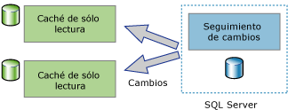

# Acerca del seguimiento de cambios (SQL Server)
[!INCLUDE[tsql-appliesto-ss2008-asdb-xxxx-xxx-md](../../includes/tsql-appliesto-ss2008-asdb-xxxx-xxx-md.md)]

  El seguimiento de cambios es una solución ligera que proporciona un mecanismo de seguimiento de cambios eficaz para las aplicaciones. Normalmente, para permitir que las aplicaciones consulten los cambios de los datos en una base de datos y tener acceso a la información relacionada con los mismos, los programadores de aplicaciones tenían que implementar mecanismos personalizados de seguimiento de cambios. Crear estos mecanismos normalmente implica mucho trabajo y, frecuentemente, conlleva el uso de una combinación de desencadenadores, columnas **timestamp** , tablas nuevas para almacenar información de seguimiento, y procesos de limpieza personalizados.  
  
 Los diferentes tipos de aplicaciones tienen requisitos distintos en cuanto a la cantidad de información que necesitan sobre los cambios. Las aplicaciones pueden utilizar el seguimiento de cambios para responder a las preguntas siguientes sobre las modificaciones que se han realizado en una tabla de usuario:  
  
-   ¿Qué filas han cambiado para una tabla de usuario?  
  
    -   Solo se requiere el hecho de que una fila haya cambiado, no cuántas veces cambió o los valores de cualquier cambio intermedio.  
  
    -   Los datos más recientes se pueden obtener directamente de la tabla de la que se realiza el seguimiento.  
  
-   ¿Ha cambiado una fila?  
  
    -   El hecho de que una fila haya cambiado y la información sobre el cambio deben estar disponibles y grabarse en el momento en que el cambio se realice en la misma transacción.  
  
> [!NOTE]  
>  Si una aplicación requiere información sobre todas las modificaciones realizadas y los valores intermedios de los datos modificados, podría ser adecuado utilizar la detección de datos modificados en lugar del seguimiento de los cambios. Para obtener más información, vea [Acerca de la captura de datos modificados &#40;SQL Server&#41;](../../relational-databases/track-changes/about-change-data-capture-sql-server.md).  
  
## Aplicaciones de sincronización unidireccionales y bidireccionales  
 Las aplicaciones que tienen que sincronizar los datos con una instancia de [!INCLUDE[ssDEnoversion](../../includes/ssdenoversion-md.md)] deben poder consultar los cambios. El seguimiento de cambios se puede utilizar como base para las aplicaciones de sincronización unidireccionales y bidireccionales.  
  
### Aplicaciones de sincronización unidireccionales  
 Las aplicaciones de sincronización unidireccionales, como una aplicación de almacenamiento en caché de cliente o de capa media, pueden ser generadas de modo que usen el seguimiento de cambios. Como se muestra en la ilustración siguiente, una aplicación de almacenamiento en caché requiere que los datos se almacenen en [!INCLUDE[ssDE](../../includes/ssde-md.md)] y también que se almacenen en memoria caché en otros almacenes de datos. La aplicación debe poder mantener la memoria caché actualizada con cualquier cambio que se realice en las tablas de base de datos. No hay ningún cambio que devolver a [!INCLUDE[ssDE](../../includes/ssde-md.md)].  
  
   
  
### Aplicaciones de sincronización bidireccionales  
 Las aplicaciones de sincronización bidireccionales también pueden generarse para usar el seguimiento de cambios. En este escenario, los datos de una instancia de [!INCLUDE[ssDE](../../includes/ssde-md.md)] se sincronizan con uno o varios almacenes de datos. Los datos de esos almacenes pueden actualizarse y los cambios se deben sincronizar de nuevo con [!INCLUDE[ssDE](../../includes/ssde-md.md)].  
  
   
  
 Un buen ejemplo de aplicación de sincronización bidireccional es aquella que se conecta ocasionalmente. En este tipo de aplicación, una aplicación cliente consulta y actualiza un almacén local. Cuando se disponga de una conexión entre un cliente y un servidor, la aplicación se sincronizará con un servidor y los datos que hayan cambiado circularán en ambas direcciones.  
  
 Las aplicaciones de sincronización bidireccionales deben ser capaces de detectar los conflictos. Se produciría un conflicto si se cambiaran los mismos datos en ambos almacenes de datos en el período entre sincronizaciones. Gracias a la capacidad para detectar conflictos, una aplicación puede asegurarse de que los cambios no se pierden.  
  
## Cómo funciona el seguimiento de cambios  
 Para configurar el seguimiento de cambios, puede utilizar instrucciones de DDL o [!INCLUDE[ssManStudioFull](../../includes/ssmanstudiofull-md.md)]. Para obtener más información, vea [Habilitar y deshabilitar el seguimiento de cambios &#40;SQL Server&#41;](../../relational-databases/track-changes/enable-and-disable-change-tracking-sql-server.md). Para poder realizar el seguimiento de los cambios, el seguimiento de cambios debe estar previamente habilitado para la base de datos y, a continuación, debe estar habilitado para las tablas de esa base de datos que desee someter a seguimiento. No es necesario cambiar la definición de tabla y no se crean desencadenadores.  
  
 Una vez configurado el seguimiento de cambios para una tabla, cualquier instrucción DML que afecte a las filas en la tabla conllevará el registro de la información de seguimiento de cambios pertinente para cada fila modificada. Para consultar las filas que han cambiado y obtener información sobre los cambios, puede utilizar las [funciones de seguimiento de cambios](../../relational-databases/system-functions/change-tracking-functions-transact-sql.md).  
  
 Los valores de la columna de clave principal son la única información relativa a la tabla sometida a seguimiento que se registra con la información de los cambios. Estos valores identifican las filas que se han cambiado. Para obtener los datos más recientes de esas filas, una aplicación puede usar los valores de columna de clave principal para combinar la tabla de origen con la tabla sometida a seguimiento.  
  
 La información sobre el cambio que se realizó en cada fila también se puede obtener utilizando el seguimiento de cambios. Por ejemplo, el tipo de operación de DML que produjo el cambio (inserción, actualización o eliminación) o las columnas que se cambiaron como parte de una operación de actualización. 
 
## Limpieza de seguimiento de cambios
La información de seguimiento de cambios de todas las tablas (habilitado para el seguimiento de cambios) se almacena en un almacenamiento de filas en memoria. Los datos de seguimiento de cambios asociados con cada tabla habilitada para el seguimiento de cambios se vacían en cada punto de comprobación desde el almacenamiento de filas en memoria a la tabla interna en disco correspondiente. Durante el punto de comprobación, el almacenamiento de filas en memoria también se purga después de mover las filas a las tablas en disco.

Cada tabla habilitada para el seguimiento de cambios tiene una tabla interna en disco que las funciones de seguimiento de cambios utilizan para determinar la versión de cambio y las filas que han cambiado desde una versión determinada. Cada vez que el subproceso de **limpieza automática** se activa, examina todas las bases de datos de usuario en la instancia de SQL Server para identificar las bases de datos habilitadas para el seguimiento de cambios. Según la configuración del período de retención de la base de datos, se purgan los registros expirados de cada tabla en disco interna.

Se agregó un procedimiento almacenado en los Service Packs para [!INCLUDE[ssSQL14](../../includes/sssql14-md.md)] y [!INCLUDE[ssSQL15](../../includes/sssql15-md.md)] para realizar la limpieza manual para las tablas internas del seguimiento de cambios interno. En [KB173157](https://support.microsoft.com/help/3173157/adds-a-stored-procedure-for-the-manual-cleanup-of-the-change-tracking-side-table-in-sql-server-2014-sp2-or-2016-sp1) encontrará más información sobre el procedimiento almacenado. 
  
## Ver también  
 [Habilitar y deshabilitar el seguimiento de cambios &#40;SQL Server&#41;](../../relational-databases/track-changes/enable-and-disable-change-tracking-sql-server.md)   
 [Trabajar con el seguimiento de cambios &#40;SQL Server&#41;](../../relational-databases/track-changes/work-with-change-tracking-sql-server.md)   
 [Administrar el seguimiento de cambios &#40;SQL Server&#41;](../../relational-databases/track-changes/manage-change-tracking-sql-server.md)   
 [Seguimiento de cambios de datos &#40;SQL Server&#41;](../../relational-databases/track-changes/track-data-changes-sql-server.md)  
  
  
