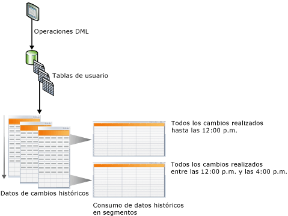
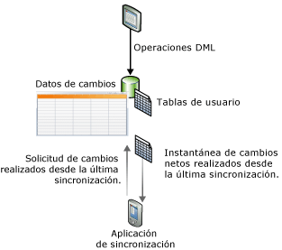

# Seguimiento de cambios de datos (SQL Server)
[!INCLUDE [SQL Server SQL Database](../../includes/applies-to-version/sql-asdb.md)]
  [!INCLUDE[ssCurrent](../../includes/sscurrent-md.md)] proporciona dos características que realizan el seguimiento de los cambios en los datos de una base de datos: [captura de datos modificados](#Capture) y [seguimiento de cambios](#Tracking). Estas características permiten a las aplicaciones determinar los cambios de DML (operaciones de inserción, actualización y eliminación) que se realizaron en las tablas de usuario de una base de datos. La captura de datos modificados y el seguimiento de cambios pueden habilitarse en la misma base de datos; no se requiere ninguna consideración especial. Para obtener las ediciones de [!INCLUDE[ssNoVersion](../../includes/ssnoversion-md.md)] que admitan la captura de datos modificados y el seguimiento de cambios, vea [Características compatibles con las ediciones de SQL Server 2016](~/sql-server/editions-and-supported-features-for-sql-server-2016.md). [!INCLUDE[ssSDS_md](../../includes/sssds-md.md)]admite el seguimiento de cambios. La captura de datos modificados solo es posible en SQL Server y en Azure SQL Managed Instance.
  
## Ventajas de utilizar la captura de datos modificados y el seguimiento de cambios  
 La capacidad para consultar los datos que han cambiado en una base de datos es un requisito importante para conseguir que algunas aplicaciones sean eficaces. Normalmente, para determinar los datos modificados, los desarrolladores de aplicaciones deben implementar un método de seguimiento personalizado en sus aplicaciones utilizando una combinación de desencadenadores, columnas de marca de tiempo y tablas adicionales. La creación de estas aplicaciones implica normalmente mucho trabajo de implementación, provoca actualizaciones del esquema y, a menudo, supone una gran sobrecarga en el rendimiento.  
  
 El uso de la captura de datos modificados o el seguimiento de cambios en las aplicaciones para realizar el seguimiento de los cambios efectuados en una base de datos, en lugar de desarrollar una solución personalizada, tiene las ventajas siguientes:  
  
-   Se reduce el tiempo de desarrollo. Dado que la funcionalidad está disponible en [!INCLUDE[ssCurrent](../../includes/sscurrent-md.md)], no es necesario desarrollar una solución personalizada.  
  
-   No se requieren cambios en el esquema. No es necesario agregar columnas, agregar desencadenadores o crear una tabla auxiliar en la que realizar el seguimiento de las filas eliminadas o almacenar la información de seguimiento de cambios si las columnas no se pueden agregar a las tablas de usuario.  
  
-   Hay un mecanismo de limpieza integrado. La limpieza del seguimiento de cambios se realiza automáticamente en segundo plano. No es necesario realizar la limpieza personalizada de los datos que se almacenan en una tabla auxiliar.  
  
-   Se proporcionan funciones para obtener información de los cambios.  
  
-   Se reduce la sobrecarga en las operaciones DML. El seguimiento de cambios sincrónico siempre tendrá cierta sobrecarga. Sin embargo, su uso puede ayudar a reducirla. A menudo, la sobrecarga será menor que si se usan soluciones alternativas, sobre todo si se trata de soluciones que requieren el uso de desencadenadores.  
  
-   El seguimiento de cambios se basa en transacciones confirmadas. El orden de los cambios se basa en la hora de confirmación de la transacción. Esto permite obtener resultados confiables cuando hay transacciones de ejecución prolongada que se solapan. Las soluciones personalizadas que utilizan valores **timestamp** deben diseñarse específicamente para administrar estos escenarios.  
  
-   Hay herramientas estándar disponibles que se pueden utilizar para configurar y administrar. [!INCLUDE[ssCurrent](../../includes/sscurrent-md.md)] proporciona instrucciones DDL estándar, [!INCLUDE[ssManStudioFull](../../includes/ssmanstudiofull-md.md)], vistas de catálogo y permisos de seguridad.  
  
## Diferencias de características entre la captura de datos modificados y el seguimiento de cambios  
 La tabla siguiente enumera las diferencias de características entre la captura de datos modificados y el seguimiento de cambios. El mecanismo de seguimiento de la captura de datos modificados implica una captura asincrónica de los cambios del registro de transacciones para que estén disponibles después de la operación DML. En el seguimiento de cambios, el mecanismo de seguimiento implica el seguimiento sincrónico de los cambios a la vez que las operaciones DML de modo que la información de los cambios esté disponible inmediatamente.  
  
|Característica|captura de datos modificados|seguimiento de cambios|  
|-------------|-------------------------|---------------------|  
|**Cambios sometidos a seguimiento**|||  
|Cambios de DML|Sí|Sí|  
|**Información sometida a seguimiento**|||  
|Datos históricos|Sí|No|  
|Si la columna cambió|Sí|Sí|  
|Tipo de DML|Sí|Sí|  
  
##   Captura de datos modificados  
 La captura de datos modificados proporciona información de los cambios históricos para una tabla de usuario captando tanto el hecho de que se realizaran cambios de DML como los datos reales que se cambiaron. Los cambios se capturan mediante un proceso asincrónico que lee el registro de transacciones y tiene poca repercusión en el sistema.  
  
 Como se muestra en la ilustración siguiente, los cambios que se realizaron en las tablas de usuario se capturan en las tablas de cambios correspondientes. Estas tablas de cambios proporcionan una vista histórica de los cambios a lo largo del tiempo. Las funciones de [captura de datos modificados](../../relational-databases/system-functions/change-data-capture-functions-transact-sql.md) que [!INCLUDE[ssNoVersion](../../includes/ssnoversion-md.md)] proporciona permiten utilizar los datos modificados con facilidad y de forma sistemática.  
  
   
  
### Modelo de seguridad  
 Esta sección describe el modelo de seguridad de la captura de datos modificados.  
  
 **Configuración y administración**  
 Para habilitar o deshabilitar la captura de datos modificados en una base de datos, el autor de las llamadas de [sys.sp_cdc_enable_db &#40;Transact-SQL&#41;](../../relational-databases/system-stored-procedures/sys-sp-cdc-enable-db-transact-sql.md) o [sys.sp_cdc_disable_db &#40;Transact-SQL&#41;](../../relational-databases/system-stored-procedures/sys-sp-cdc-disable-db-transact-sql.md) debe ser miembro del rol fijo de servidor **sysadmin**. Para habilitar y deshabilitar la captura de datos modificados en el nivel de tabla, se requiere que el autor de las llamadas de [sys.sp_cdc_enable_table &#40;Transact-SQL&#41;](../../relational-databases/system-stored-procedures/sys-sp-cdc-enable-table-transact-sql.md) y [sys.sp_cdc_disable_table &#40;Transact-SQL&#41;](../../relational-databases/system-stored-procedures/sys-sp-cdc-disable-table-transact-sql.md) sea miembro del rol sysadmin o del rol de base de datos **database db_owner**.  
  
 El uso de los procedimientos almacenados para admitir la administración de trabajos de captura de datos modificados se restringe a los miembros del rol de servidor **sysadmin** y a los miembros del rol **database db_owner** .  
  
 **Enumeración de cambios y consultas de los metadatos**  
 Para obtener acceso a los datos modificados que están asociados a una instancia de captura, se debe conceder al usuario acceso exclusivo a todas las columnas capturadas de la tabla de origen asociada. Además, si se especifica un rol de acceso cuando se crea la instancia de captura, el autor de las llamadas también debe ser miembro del rol de acceso especificado. Otras funciones de captura de datos modificados generales para tener acceso a los metadatos serán accesibles para todos los usuarios de la base de datos a través del rol public, aunque el acceso a los metadatos devueltos también se conseguirá normalmente mediante un acceso exclusivo a las tablas de origen subyacentes y por pertenencia a cualquier rol de acceso definido.  
  
 **Operaciones DDL para las tablas de origen habilitadas para la captura de datos modificados**  
 Cuando una tabla está habilitada para la captura de datos modificados, solo un miembro del rol fijo de servidor **sysadmin**o de los roles de base de datos **database role db_owner**o **database role db_ddladmin**puede aplicarle las operaciones DDL. Los usuarios a los que se les haya permitido explícitamente realizar operaciones DDL en la tabla recibirán el error 22914 si intentan estas operaciones.  
  
### Consideraciones sobre los tipos de datos para la captura de datos modificados  
 La captura de datos modificados admite todos los tipos de columna base. En la tabla siguiente, se especifican el comportamiento y las limitaciones para varios tipos de columna.  
  
|Tipo de columna|Cambios capturados en tablas de cambios|Limitaciones|  
|--------------------|---------------------------------------|-----------------|  
|Columnas dispersas|Sí|No admite la captura de cambios cuando se usa un conjunto de columnas.|  
|Columnas calculadas|No|No se hace un seguimiento de los cambios realizados en columnas calculadas. La columna aparecerá en la tabla de cambios con el tipo adecuado, pero tendrá un valor NULL.|  
|XML|Sí|No se hace un seguimiento de los cambios realizados en elementos XML individuales.|  
|Timestamp|Sí|El tipo de datos de la tabla de cambios se convierte a binario.|  
|Tipos de datos BLOB|Sí|La imagen anterior de la columna BLOB solo se almacena si se cambia la propia columna.|  
  
### Captura de datos modificados y otras características de SQL Server  
 En esta sección se describe cómo interactúan las características siguientes con la captura de datos modificados:  
  
-   Creación de reflejo de la base de datos  
  
-   Replicación transaccional  
  
-   Restauración o asociación de base de datos  
  
#### Creación de reflejo de la base de datos  
 Se puede reflejar una base de datos que está habilitada para la captura de datos modificados. Para asegurarse de que la captura y la limpieza se producen automáticamente en el reflejo, siga estos pasos:  
  
1.  Asegúrese de que el Agente [!INCLUDE[ssNoVersion](../../includes/ssnoversion-md.md)] se está ejecutando en el reflejo.  
  
2.  Cree el trabajo de captura y el trabajo de limpieza en el reflejo después de que la entidad de seguridad haya conmutado por error al reflejo. Para crear los trabajos, use el procedimiento almacenado [sys.sp_cdc_add_job &#40;Transact-SQL&#41;](../../relational-databases/system-stored-procedures/sys-sp-cdc-add-job-transact-sql.md).  

 Para obtener más información sobre la creación de reflejo de la base de datos, vea [Creación de reflejo de la base de datos &#40;SQL Server&#41;](../../database-engine/database-mirroring/database-mirroring-sql-server.md).  
  
#### Replicación transaccional  
 La captura de datos modificados y la replicación transaccional pueden coexistir en la misma base de datos, pero el rellenado de las tablas de cambios se trata de forma diferente cuando se habilitan ambas características. La captura de datos modificados y la replicación transaccional siempre usan el mismo procedimiento, [sp_replcmds](../../relational-databases/system-stored-procedures/sp-replcmds-transact-sql.md), para leer los cambios del registro de transacciones. Cuando la captura de datos modificados se habilita sola, un trabajo del Agente [!INCLUDE[ssNoVersion](../../includes/ssnoversion-md.md)] llama a **sp_replcmds**. Cuando ambas características están habilitadas en la misma base de datos, el Agente de registro del LOG llama a **sp_replcmds**. Este agente rellena las tablas de cambios y las tablas de base de datos de distribución. Para más información, consulte [Replication Log Reader Agent](../../relational-databases/replication/agents/replication-log-reader-agent.md).  
  
 Considere un escenario en el que la captura de datos modificados está habilitada en la base de datos [!INCLUDE[ssSampleDBobject](../../includes/sssampledbobject-md.md)] y se habilitan dos tablas para la captura. Para rellenar las tablas de cambios, el trabajo de captura llama a **sp_replcmds**. La base de datos se habilita para la replicación transaccional y se crea una publicación. Ahora, se crea el Agente de registro del LOG para la base de datos y se elimina el trabajo de captura. El Agente de registro del LOG continúa examinando el registro desde el último número de secuencia de registro que se confirmó en la tabla de cambios. De esta forma se asegura de la coherencia de los datos en las tablas de cambios. Si la replicación transaccional está deshabilitada en esta base de datos, se quita el Agente de registro del LOG y vuelve a recrear el trabajo de captura.  
  
> [!NOTE]  
>  Cuando el Agente de registro del LOG se utiliza para la captura de datos modificados y la replicación transaccional, los cambios replicados se escriben primero en la base de datos de distribución. A continuación, los cambios capturados se escriben en las tablas de cambios. Ambas operaciones se confirman conjuntamente. Si hay alguna latencia al escribir en la base de datos de distribución, habrá una latencia correspondiente antes de que los cambios aparezcan en las tablas de cambios.  
  
#### Restaurar o asociar una base de datos habilitada para la captura de datos modificados  
 [!INCLUDE[ssNoVersion](../../includes/ssnoversion-md.md)] utiliza la lógica siguiente para determinar si la captura de datos modificados permanece habilitada una vez restaurada o asociada una base de datos:  
  
-   Si una base de datos se restaura en el mismo servidor con el mismo nombre, la captura de datos modificados sigue habilitada.  
  
-   Si una base de datos se restaura en otro servidor, de forma predeterminada la captura de datos modificados está deshabilitada y se eliminan todos los metadatos relacionados.  
  
     Para conservar la captura de datos modificados, use la opción **KEEP_CDC** a la hora de restaurar la base de datos. Para obtener más información acerca de esta opción, vea [RESTORE](../../t-sql/statements/restore-statements-transact-sql.md).  
  
-   Si una base de datos se desasocia y asocia en el mismo servidor o en otro servidor, la captura de datos modificados sigue estando habilitada.  
  
-   Si una base de datos se asocia o restaura con la opción **KEEP_CDC** en cualquier edición distinta de Standard o Enterprise, la operación se bloquea porque la captura de datos modificados requiere ediciones Standard o Enterprise de [!INCLUDE[ssNoVersion](../../includes/ssnoversion-md.md)]. Se muestra el mensaje de error 932:  
  
     `SQL Server cannot load database '%.*ls' because change data capture is enabled. The currently installed edition of SQL Server does not support change data capture. Either disable change data capture in the database by using a supported edition of SQL Server, or upgrade the instance to one that supports change data capture.`  
  
 Puede usar [sys.sp_cdc_disable_db](../../relational-databases/system-stored-procedures/sys-sp-cdc-disable-db-transact-sql.md) para quitar la captura de datos modificados desde una base de datos restaurada o asociada.  
  
##   Seguimiento de los cambios  
 El seguimiento de cambios captura el hecho de que las filas de una tabla cambiaran, pero no los datos que se modificaron. Esto permite a las aplicaciones determinar las filas que han cambiado con los datos de las filas más recientes obtenidos directamente de las tablas de usuario. Por consiguiente, el seguimiento de cambios está más limitado en las cuestiones históricas que puede responder en comparación con la captura de datos modificados. Sin embargo, para las aplicaciones que no requieren información histórica, hay mucha menos sobrecarga de almacenamiento debido a que los datos modificados no se están capturando. Se utiliza un mecanismo de seguimiento sincrónico para realizar el seguimiento de los cambios. Se ha diseñado de modo que suponga una sobrecarga mínima para las operaciones DML.  
  
 La ilustración siguiente muestra un escenario de sincronización que se beneficiaría del uso del seguimiento de cambios. En este escenario, una aplicación requiere la información siguiente: todas las filas de la tabla que se cambiaron desde la última vez que la tabla se sincronizó, y solo los datos de las filas actuales. Dado que para realizar el seguimiento de los cambios se utiliza un mecanismo sincrónico, una aplicación puede realizar una sincronización bidireccional y detectar de forma confiable cualquier conflicto que pudiera haberse producido.  
  
   
  
### Seguimiento de cambios y servicios de sincronización para ADO.NET  
 [!INCLUDE[sql_sync_long](../../includes/sql-sync-long-md.md)] permite la sincronización entre bases de datos, proporcionando una API intuitiva y flexible que permite generar aplicaciones destinadas a escenarios para la colaboración y sin conexión. [!INCLUDE[sql_sync_long](../../includes/sql-sync-long-md.md)] proporciona una API para sincronizar los cambios, pero no realiza el seguimiento de los cambios que se producen en el servidor o en la base de datos del mismo nivel. Puede crear un sistema de seguimiento de cambios personalizado, pero esto introduce normalmente una complejidad significativa y una sobrecarga de rendimiento. Para realizar el seguimiento de cambios en un servidor o una base de datos del mismo nivel, se recomienda usar el seguimiento de cambios en [!INCLUDE[ssCurrent](../../includes/sscurrent-md.md)] porque es fácil de configurar y proporciona un seguimiento del alto rendimiento.  
  
 Para obtener más información sobre el seguimiento de cambios y [!INCLUDE[sql_sync_long](../../includes/sql-sync-long-md.md)], utilice los vínculos siguientes:  
  
-   [Acerca del seguimiento de cambios &#40;SQL Server&#41;](../../relational-databases/track-changes/about-change-tracking-sql-server.md)  
  
     Se describe el seguimiento de cambios, se proporciona información general de alto nivel sobre cómo funciona el seguimiento de cambios y se describe cómo interactúa con otras características de [!INCLUDE[ssDEnoversion](../../includes/ssdenoversion-md.md)] .  
  
-   [Microsoft Sync Framework Developer Center](/previous-versions/sql/synchronization/mt490616(v=msdn.10))  
  
     Proporciona documentación completa para [!INCLUDE[ssSyncFrameLong](../../includes/sssyncframelong-md.md)] y [!INCLUDE[sql_sync_short](../../includes/sql-sync-short-md.md)]. En la documentación de [!INCLUDE[sql_sync_short](../../includes/sql-sync-short-md.md)], el tema sobre cómo usar el seguimiento de cambios de SQL Server contiene información detallada y ejemplos de código.  
  
## Tareas relacionadas (necesarias)  
  
|Tarea|Tema|  
|-|-|  
|Proporciona información general de la captura de datos modificados.|[Acerca de la captura de datos modificados &#40;SQL Server&#41;](../../relational-databases/track-changes/about-change-data-capture-sql-server.md)|  
|Describe cómo habilitar y deshabilitar la captura de datos modificados en una base de datos o en una tabla.|[Habilitar y deshabilitar la captura de datos modificados &#40;SQL Server&#41;](../../relational-databases/track-changes/enable-and-disable-change-data-capture-sql-server.md)|  
|Describe cómo administrar y supervisar la captura de datos modificados.|[Administrar y supervisar la captura de datos modificados &#40;SQL Server&#41;](../../relational-databases/track-changes/administer-and-monitor-change-data-capture-sql-server.md)|  
|Describe cómo trabajar con los datos modificados que están disponibles para cambiar los consumidores de captura de datos. En este tema se trata la validación de los límites de LSN, de las funciones de consulta y de los escenarios de la función de consulta.|[Trabajar con datos modificados &#40;SQL Server&#41;](../../relational-databases/track-changes/work-with-change-data-sql-server.md)|  
|Proporciona información general del seguimiento de cambios.|[Acerca del seguimiento de cambios &#40;SQL Server&#41;](../../relational-databases/track-changes/about-change-tracking-sql-server.md)|  
|Describe cómo habilitar y deshabilitar el seguimiento de cambios en una base de datos o en una tabla.|[Habilitar y deshabilitar el seguimiento de cambios &#40;SQL Server&#41;](../../relational-databases/track-changes/enable-and-disable-change-tracking-sql-server.md)|  
|Describe cómo administrar el seguimiento de cambios, configurar la seguridad y determinar los efectos en el almacenamiento y en el rendimiento cuando se utiliza el seguimiento de cambios.|[Administrar el seguimiento de cambios &#40;SQL Server&#41;](../../relational-databases/track-changes/manage-change-tracking-sql-server.md)|  
|Describe cómo las aplicaciones que utilizan el seguimiento de cambios pueden obtener los cambios que se han sometido a seguimiento, aplicarlos a otro almacén de datos y actualizar la base de datos de origen. En este tema también se describe el rol que desempeña el seguimiento de cambios cuando se produce una conmutación por error y se debe restaurar una base de datos a partir de una copia de seguridad.|[Trabajar con el seguimiento de cambios &#40;SQL Server&#41;](../../relational-databases/track-changes/work-with-change-tracking-sql-server.md)|  
  
## Consulte también  
 [Funciones de captura de datos modificados &#40;Transact-SQL&#41;](../../relational-databases/system-functions/change-data-capture-functions-transact-sql.md)   
 [Funciones de seguimiento de cambios &#40;Transact-SQL&#41;](../../relational-databases/system-functions/change-tracking-functions-transact-sql.md)   
 [Procedimientos almacenados de captura de datos modificados &#40;Transact-SQL&#41;](../../relational-databases/system-stored-procedures/change-data-capture-stored-procedures-transact-sql.md)   
 [Tablas de captura de datos de cambio &#40;Transact-SQL&#41;](../../relational-databases/system-tables/change-data-capture-tables-transact-sql.md)   
 [Vistas de administración dinámica relacionadas con la captura de datos modificados &#40;Transact-SQL&#41;](../system-dynamic-management-views/system-dynamic-management-views.md)  
  
