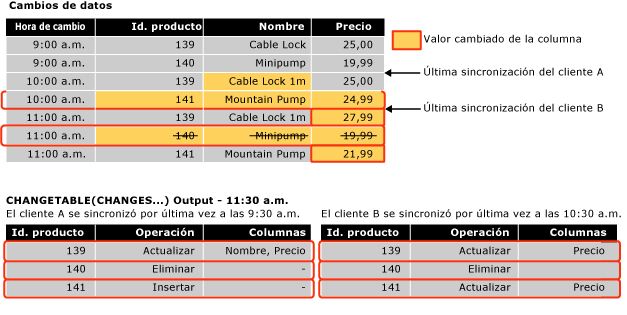

# <a name="work-with-change-tracking-sql-server"></a>Trabajar con el seguimiento de cambios (SQL Server)
[!INCLUDE[tsql-appliesto-ss2008-asdb-xxxx-xxx-md](../../includes/tsql-appliesto-ss2008-asdb-xxxx-xxx-md.md)]

  Las aplicaciones que utilizan el seguimiento de cambios deben poder obtener los cambios que se han sometido a seguimiento, aplicarlos a otro almacén de datos y actualizar la base de datos de origen. En este tema se describe cómo realizar estas tareas y también el rol que desempeña el seguimiento de cambios cuando se produce una conmutación por error y una base de datos se debe restaurar a partir de una copia de seguridad.  
  
##  <a name="Obtain"></a> Obtener cambios mediante las funciones de seguimiento de cambios  
 Describe cómo utilizar las funciones de seguimiento de cambios para obtener las modificaciones y la información sobre los cambios que se realizaron en una base de datos.  
  
### <a name="about-the-change-tracking-functions"></a>Acerca de las funciones de seguimiento de cambios  
 Las aplicaciones pueden utilizar las funciones siguientes para obtener los cambios que se realizan en una base de datos e información sobre ellos:  
  
 Función CHANGETABLE(CHANGES…)  
 Esta función de conjunto de filas se utiliza para consultar la información sobre los cambios. La función consulta los datos almacenados en las tablas internas de seguimiento de cambios. La función devuelve un conjunto de resultados que contiene las claves principales de las filas que han cambiado, junto con información adicional sobre los cambios, como la operación, las columnas actualizadas y la versión de la fila.  
  
 CHANGETABLE(CHANGES …) toma como argumento el número de la última versión de sincronización. La última versión de sincronización se obtiene mediante la variable `@last_synchronization_version` . La semántica de la última versión de sincronización es la siguiente:  
  
-   El cliente que realiza la llamada ha obtenido los cambios y sabe todos los que se han realizado hasta la última versión de sincronización, inclusive.  
  
-   CHANGETABLE(CHANGES …) devolverá por lo tanto todos los cambios que se han producido después de la última versión de sincronización.  
  
     La ilustración siguiente muestra cómo se usa CHANGETABLE(CHANGES...) para obtener los cambios.  
  
       
  
 Función CHANGE_TRACKING_CURRENT_VERSION()  
 Se utiliza para obtener la versión actual que se utilizará la próxima vez que se consulten los cambios. Esta versión representa la versión de la última transacción confirmada.  
  
 Función CHANGE_TRACKING_MIN_VALID_VERSION()  
 Se utiliza para obtener el número de versión mínimo válido que un cliente puede tener y seguir obteniendo resultados válidos de CHANGETABLE(). El cliente debe comparar la última versión de sincronización con el valor devuelto por esta función. Si el último número de versión de sincronización es menor que el de la versión devuelta por esta función, el cliente no podrá obtener resultados válidos de CHANGETABLE() y tendrá que reinicializar.  
  
### <a name="obtaining-initial-data"></a>Obtener los datos iniciales  
 Para que una aplicación pueda obtener los cambios por primera vez, debe enviar una consulta que obtenga los datos iniciales y la versión de sincronización. La aplicación debe obtener directamente los datos adecuados en la tabla y, a continuación, usar CHANGE_TRACKING_CURRENT_VERSION() para obtener la versión inicial. Esta versión se pasará a CHANGETABLE(CHANGES…) la primera vez que se obtengan los cambios.  
  
 En el ejemplo siguiente se muestra cómo se obtienen los datos de la versión de sincronización inicial y el conjunto de datos inicial.  
  
```sql  
    -- Obtain the current synchronization version. This will be used next time that changes are obtained.  
    SET @synchronization_version = CHANGE_TRACKING_CURRENT_VERSION();  
  
    -- Obtain initial data set.  
    SELECT  
        P.ProductID, P.Name, P.ListPrice  
    FROM  
        SalesLT.Product AS P  
```  
  
### <a name="using-the-change-tracking-functions-to-obtain-changes"></a>Usar las funciones de seguimiento de cambios para obtener los cambios  
 Para obtener las filas cambiadas de una tabla e información sobre los cambios, utilice CHANGETABLE(CHANGES...). Por ejemplo, la consulta siguiente obtiene los cambios de la tabla `SalesLT.Product` .  
  
```sql  
SELECT  
    CT.ProductID, CT.SYS_CHANGE_OPERATION,  
    CT.SYS_CHANGE_COLUMNS, CT.SYS_CHANGE_CONTEXT  
FROM  
    CHANGETABLE(CHANGES SalesLT.Product, @last_synchronization_version) AS CT  
  
```  
  
 Normalmente, un cliente deseará obtener los últimos datos de una fila y no solo las claves principales de la fila. Por consiguiente, una aplicación combinaría los resultados de CHANGETABLE(CHANGES...) con los datos de la tabla de usuario. Por ejemplo, la siguiente consulta se combina con la tabla `SalesLT.Product` para obtener los valores de las columnas `Name` y `ListPrice` . Observe el uso de la propiedad `OUTER JOIN`. Esto es necesario para asegurarse de que la información sobre los cambios se devuelve para las filas que han sido eliminadas de la tabla de usuario.  
  
```sql  
SELECT  
    CT.ProductID, P.Name, P.ListPrice,  
    CT.SYS_CHANGE_OPERATION, CT.SYS_CHANGE_COLUMNS,  
    CT.SYS_CHANGE_CONTEXT  
FROM  
    SalesLT.Product AS P  
RIGHT OUTER JOIN  
    CHANGETABLE(CHANGES SalesLT.Product, @last_synchronization_version) AS CT  
ON  
    P.ProductID = CT.ProductID  
```  
  
 Para obtener la versión que se usará en la enumeración de cambios siguiente, utilice CHANGE_TRACKING_CURRENT_VERSION(), como se muestra en el ejemplo siguiente.  
  
```sql  
SET @synchronization_version = CHANGE_TRACKING_CURRENT_VERSION()  
```  
  
 Cuando una aplicación obtiene los cambios, debe utilizar CHANGETABLE(CHANGES...) y CHANGE_TRACKING_CURRENT_VERSION(), como se muestra en el ejemplo siguiente.  
  
```sql  
-- Obtain the current synchronization version. This will be used the next time CHANGETABLE(CHANGES...) is called.  
SET @synchronization_version = CHANGE_TRACKING_CURRENT_VERSION();  
  
-- Obtain incremental changes by using the synchronization version obtained the last time the data was synchronized.  
SELECT  
    CT.ProductID, P.Name, P.ListPrice,  
    CT.SYS_CHANGE_OPERATION, CT.SYS_CHANGE_COLUMNS,  
    CT.SYS_CHANGE_CONTEXT  
FROM  
    SalesLT.Product AS P  
RIGHT OUTER JOIN  
    CHANGETABLE(CHANGES SalesLT.Product, @last_synchronization_version) AS CT  
ON  
    P.ProductID = CT.ProductID  
```  
  
### <a name="version-numbers"></a>Números de versión  
 Una base de datos con el seguimiento de cambios habilitado tiene un contador de versión que se incrementa cuando se realizan cambios en las tablas sometidas a seguimiento. Cada fila modificada tiene un número de versión asociado a ella. Cuando una solicitud se envía a una aplicación para consultar los cambios, se llama a una función que proporciona un número de versión. La función devuelve información sobre todos los cambios realizados desde esa versión. En cierto modo, la versión del seguimiento de cambios es similar en su concepto al tipo de datos **rowversion** .  
  
### <a name="validating-the-last-synchronized-version"></a>Validar la última versión sincronizada  
 La información sobre los cambios se mantiene durante un tiempo limitado. El parámetro CHANGE_RETENTION, que se puede especificar como parte de la instrucción ALTER DATABASE, controla el intervalo de tiempo.  
  
 Tenga en cuenta que el tiempo especificado para CHANGE_RETENTION determina la frecuencia con que todas las aplicaciones deben solicitar los cambios de la base de datos. Si una aplicación tiene un valor para *last_synchronization_version* que es anterior a la versión de sincronización válida mínima para una tabla, esa aplicación no puede realizar una enumeración válida de los cambios. Esto se debe a que podría haberse limpiado parte de la información de los cambios. Antes de que una aplicación obtenga los cambios mediante CHANGETABLE(CHANGES…), debe validar el valor de *last_synchronization_version* que planea pasar a CHANGETABLE(CHANGES…). Si el valor de *last_synchronization_version* no es válido, esa aplicación debe reinicializar todos los datos.  
  
 En el ejemplo siguiente se muestra cómo comprobar la validez del valor de `last_synchronization_version` para cada tabla.  
  
```sql  
-- Check individual table.  
IF (@last_synchronization_version < CHANGE_TRACKING_MIN_VALID_VERSION(  
                                   OBJECT_ID('SalesLT.Product')))  
BEGIN  
  -- Handle invalid version and do not enumerate changes.  
  -- Client must be reinitialized.  
END  
```  
  
 Como se muestra en el ejemplo siguiente, la validez del valor de `last_synchronization_version` se puede comprobar con todas las tablas de la base de datos.  
  
```sql  
-- Check all tables with change tracking enabled  
IF EXISTS (  
  SELECT COUNT(*) FROM sys.change_tracking_tables  
  WHERE min_valid_version > @last_synchronization_version )  
BEGIN  
  -- Handle invalid version & do not enumerate changes  
  -- Client must be reinitialized  
END  
```  
  
### <a name="using-column-tracking"></a>Usar el seguimiento de columnas  
 El seguimiento de columnas permite a las aplicaciones obtener solo los datos de las columnas que han cambiado en lugar de la fila entera. Por ejemplo, considere el escenario en el que una tabla tiene una o varias columnas que son grandes, pero que raramente cambian. Además, hay otras columnas que cambian con frecuencia. Sin el seguimiento de columnas, una aplicación solo puede determinar que una fila ha cambiado y tendría que sincronizar todos los datos, incluidos los de las columnas grandes. Sin embargo, mediante el seguimiento de columnas, una aplicación puede determinar si los datos de las columnas grandes cambiaron y solo puede sincronizar los cambios en caso afirmativo.  
  
 La información de seguimiento de columnas aparece en la columna SYS_CHANGE_COLUMNS devuelta por la función CHANGETABLE(CHANGES…).  
  
 Se puede usar el seguimiento de columnas para que se devuelva NULL cuando una columna no haya cambiado. Si la columna se puede cambiar a NULL, se debe devolver una columna independiente para indicar si la columna cambió.  
  
 En el ejemplo siguiente, la columna `CT_ThumbnailPhoto` será `NULL` si esa columna no cambió. Esta columna también podría ser `NULL` si cambió a `NULL` ; la aplicación puede usar la columna `CT_ThumbNailPhoto_Changed` para determinar si la columna cambió.  
  
```sql  
DECLARE @PhotoColumnId int = COLUMNPROPERTY(  
    OBJECT_ID('SalesLT.Product'),'ThumbNailPhoto', 'ColumnId')  
  
SELECT  
    CT.ProductID, P.Name, P.ListPrice, -- Always obtain values.  
    CASE  
           WHEN CHANGE_TRACKING_IS_COLUMN_IN_MASK(  
                     @PhotoColumnId, CT.SYS_CHANGE_COLUMNS) = 1  
            THEN ThumbNailPhoto  
            ELSE NULL  
      END AS CT_ThumbNailPhoto,  
      CHANGE_TRACKING_IS_COLUMN_IN_MASK(  
                     @PhotoColumnId, CT.SYS_CHANGE_COLUMNS) AS  
                                   CT_ThumbNailPhoto_Changed  
     CT.SYS_CHANGE_OPERATION, CT.SYS_CHANGE_COLUMNS,  
     CT.SYS_CHANGE_CONTEXT  
FROM  
     SalesLT.Product AS P  
INNER JOIN  
     CHANGETABLE(CHANGES SalesLT.Product, @last_synchronization_version) AS CT  
ON  
     P.ProductID = CT.ProductID AND  
     CT.SYS_CHANGE_OPERATION = 'U'  
```  
  
### <a name="obtaining-consistent-and-correct-results"></a>Obtener resultados coherentes y correctos  
 Para obtener los datos que han cambiado de una tabla, se requieren varios pasos. Tenga en cuenta que se pueden devolver resultados incoherentes o incorrectos si no se consideran y se tratan ciertos problemas.  
  
 Por ejemplo, para obtener los cambios que se realizaron en las tablas Sales y SalesOrders, una aplicación realizaría los pasos siguientes:  
  
1.  Validar la última versión sincronizada con CHANGE_TRACKING_MIN_VALID_VERSION().  
  
2.  Obtener la versión que puede utilizarse la próxima vez para obtener los cambios mediante CHANGE_TRACKING_CURRENT_VERSION().  
  
3.  Obtener los cambios de la tabla Sales con CHANGETABLE(CHANGES…).  
  
4.  Obtener los cambios de la tabla SalesOrders con CHANGETABLE(CHANGES…).  
  
 Se están produciendo dos procesos en la base de datos que pueden afectar a los resultados que devuelven los pasos anteriores:  
  
-   El proceso de limpieza se ejecuta en segundo plano y quita la información de seguimiento de cambios cuya antigüedad supere el período de retención especificado.  
  
     El proceso de limpieza es un proceso en segundo plano independiente que usa el período de retención que se especifica al configurar el seguimiento de cambios para la base de datos. El problema es que el proceso de limpieza se puede producir en el período que transcurre entre el momento en que se validó la última versión de sincronización y el momento en que se realiza la llamada a CHANGETABLE(CHANGES...). Una última versión de sincronización que era válida en ese momento podría no serlo cuando se obtienen los cambios. Por consiguiente, se podrían devolver resultados incorrectos.  
  
-   Se están produciendo operaciones DML continuas en las tablas Sales y SalesOrders, como las siguientes:  
  
    -   Se pueden realizar cambios en las tablas después de obtenerse la siguiente versión utilizando CHANGE_TRACKING_CURRENT_VERSION(). Por lo tanto, se pueden devolver más cambios que los esperados.  
  
    -   Una transacción podría confirmarse en el período que transcurre entre la llamada para obtener los cambios de la tabla Sales y la llamada para obtener los cambios de la tabla SalesOrders. Por consiguiente, los resultados de la tabla SalesOrders podrían tener un valor de clave externa que no existe en la tabla Sales.  
  
 Para superar los desafíos enumerados anteriormente, se recomienda utilizar el aislamiento de instantánea. Esto ayudará a garantizar la coherencia de la información de los cambios y a evitar las condiciones de anticipación relacionadas con la tarea de limpieza en segundo plano. Si no utiliza transacciones de instantáneas, el desarrollo de una aplicación que use el seguimiento de cambios puede requerir mucho más esfuerzo.  
  
#### <a name="using-snapshot-isolation"></a>Usar el aislamiento de instantánea  
 El seguimiento de cambios se ha diseñado para que funcione bien con el aislamiento de instantánea. El aislamiento de instantánea se debe habilitar para la base de datos. Todos los pasos necesarios para obtener los cambios deben estar incluidos dentro de una transacción de instantánea. De este modo se garantizará que todos los cambios que se realicen en los datos mientras se obtienen los cambios no serán visibles para las consultas dentro de la transacción de instantánea.  
  
 Para obtener los datos dentro de una transacción de instantánea, realice los pasos siguientes:  
  
1.  Establezca el nivel de aislamiento de transacción en la instantánea e inicie una transacción.  
  
2.  Valide la última versión de sincronización con CHANGE_TRACKING_MIN_VALID_VERSION().  
  
3.  Obtenga la siguiente versión que se va a usar utilizando CHANGE_TRACKING_CURRENT_VERSION().  
  
4.  Obtenga los cambios de la tabla Sales con CHANGETABLE(CHANGES…).  
  
5.  Obtenga los cambios de la tabla SalesOrders con CHANGETABLE(CHANGES…).  
  
6.  Confirme la transacción.  
  
 Algunas cuestiones que hay que recordar ya que todos los pasos para obtener los cambios están dentro de una transacción de instantáneas son:  
  
-   Si la limpieza se produce una vez validada la última versión de sincronización, los resultados de CHANGETABLE(CHANGES...) seguirán siendo válidos ya que las operaciones de eliminación realizadas en el proceso de limpieza no estarán visibles dentro de la transacción.  
  
-   Cualquier cambio que se realice en las tablas Sales o SalesOrders una vez obtenida la versión de sincronización siguiente no será visible y las llamadas a CHANGETABLE(CHANGES…) nunca devolverán cambios con una versión posterior a la devuelta por CHANGE_TRACKING_CURRENT_VERSION(). La coherencia entre las tablas Sales y SalesOrders también se mantendrá, porque las transacciones que se confirmaron entre las llamadas a CHANGETABLE(CHANGES...) no serán visibles.  
  
 En el ejemplo siguiente se muestra cómo se habilita el aislamiento de instantánea para una base de datos.  
  
```sql  
-- The database must be configured to enable snapshot isolation.  
ALTER DATABASE AdventureWorksLT  
    SET ALLOW_SNAPSHOT_ISOLATION ON;  
```  
  
 Una transacción de instantánea se utiliza como sigue:  
  
```sql  
SET TRANSACTION ISOLATION LEVEL SNAPSHOT;  
BEGIN TRAN  
  -- Verify that version of the previous synchronization is valid.  
  -- Obtain the version to use next time.  
  -- Obtain changes.  
COMMIT TRAN  
```  
  
 Para obtener más información sobre las transacciones de instantáneas, vea [SET TRANSACTION ISOLATION LEVEL &#40;Transact-SQL&#41;](../../t-sql/statements/set-transaction-isolation-level-transact-sql.md).  
  
#### <a name="alternatives-to-using-snapshot-isolation"></a>Alternativas al uso del aislamiento de instantánea  
 Hay alternativas al uso del aislamiento de instantánea, pero exigen más trabajo para garantizar que se cumplan todos los requisitos de la aplicación. Para garantizar que el valor de *last_synchronization_version* sea válido y que el proceso de limpieza no quite los datos antes de que se obtengan los cambios, haga lo siguiente:  
  
1.  Compruebe *last_synchronization_version* después de las llamadas a CHANGETABLE().  
  
2.  Compruebe *last_synchronization_version* como parte de cada consulta para obtener los cambios con CHANGETABLE().  
  
 Los cambios se pueden producir después de haberse obtenido la versión de sincronización de la enumeración siguiente. Hay dos formas de controlar esta situación. La opción utilizada depende de la aplicación y de cómo puede administrar los efectos secundarios de cada enfoque:  
  
-   Omita los cambios que tengan una versión mayor que la nueva versión de sincronización.  
  
     Este enfoque tiene el efecto secundario de que una fila nueva o actualizada se omitiría si se creó o se actualizó antes de la nueva versión de sincronización, aunque se actualizase posteriormente. Si hay una fila nueva, se podría producir un problema de integridad referencial si hubiera una fila de otra tabla creada que hiciera referencia a la fila omitida. Si hay una fila existente actualizada, se omitirá y no se sincronizará hasta la próxima vez.  
  
-   Incluya todos los cambios, incluso los que tengan una versión mayor que la nueva versión de sincronización.  
  
     Las filas que tengan una versión mayor que la nueva versión de sincronización volverán a obtenerse en la sincronización siguiente. La aplicación debe prever y controlar este punto.  
  
 Además de las dos opciones anteriores, puede idear un enfoque que combine ambas opciones, dependiendo de la operación. Por ejemplo, puede querer crear una aplicación para la que sea mejor omitir los cambios más recientes que la versión de sincronización siguiente en la que se creó o se eliminó la fila, pero en la que no se omitan las actualizaciones.  
  
> [!NOTE]  
>  La elección del enfoque que va a funcionar para la aplicación cuando se usa el seguimiento de cambios (o cualquier mecanismo de seguimiento personalizado), requiere un análisis significativo. Por consiguiente, es mucho más fácil utilizar el aislamiento de instantánea.  
  
##  <a name="Handles"></a> Cómo el seguimiento de cambios controla los cambios en una base de datos  
 Algunas aplicaciones que utilizan el seguimiento de cambios realizan una sincronización bidireccional con otro almacén de datos. Es decir, los cambios que se realizan en la base de datos de [!INCLUDE[ssNoVersion](../../includes/ssnoversion-md.md)] se actualizan en el otro almacén de datos y los que se realizan en este se actualizan en la base de datos de [!INCLUDE[ssNoVersion](../../includes/ssnoversion-md.md)] .  
  
 Cuando una aplicación actualiza la base de datos local con los cambios de otro almacén de datos, debe realizar las operaciones siguientes:  
  
-   Comprobar si hay conflictos.  
  
     Un conflicto se produce cuando los mismos datos se cambian en ambos almacenes de datos al mismo tiempo. La aplicación debe poder comprobar si hay un conflicto y obtener suficiente información para permitir que se resuelva.  
  
-   Almacenar información de contexto de la aplicación.  
  
     La aplicación almacena los datos que tienen la información de seguimiento de cambios. Esta información estaría disponible junto con otra referente al seguimiento de cambios cuando los cambios se obtuvieran de la base de datos local. Un ejemplo común de esta información contextual es un identificador del almacén de datos que fue el origen del cambio.  
  
 Para realizar las operaciones anteriores, una aplicación de sincronización puede utilizar las funciones siguientes:  
  
-   CHANGETABLE(VERSION…)  
  
     Cuando una aplicación está realizando cambios, puede utilizar esta función para comprobar si hay conflictos. La función obtiene la información de seguimiento de cambios más reciente para una fila especificada de la tabla de cambios sometida a seguimiento. La información de seguimiento de cambios incluye el número de versión correspondiente a la fila que se cambió en último lugar. Esta información permite que una aplicación determine si la fila se cambió después de que la aplicación se sincronizara por última vez.  
  
-   WITH CHANGE_TRACKING_CONTEXT  
  
     Una aplicación puede utilizar esta cláusula para almacenar los datos de contexto.  
  
### <a name="checking-for-conflicts"></a>Comprobar si hay conflictos  
 En un escenario de sincronización bidireccional, la aplicación cliente debe determinar si una fila no ha sido actualizada desde que la aplicación obtuvo los cambios por última vez.  
  
 En el ejemplo siguiente se muestra cómo utilizar la función CHANGETABLE(VERSION …) para comprobar si hay conflictos de la manera más eficaz, sin una consulta independiente. En el ejemplo, `CHANGETABLE(VERSION …)` determina `SYS_CHANGE_VERSION` para la fila especificada por `@product id`. `CHANGETABLE(CHANGES …)` puede obtener la misma información, pero ese procedimiento sería menos eficiente. Si el valor de `SYS_CHANGE_VERSION` para la fila es mayor que el valor de `@last_sync_version`, hay un conflicto. Si hay un conflicto, la fila no se actualizará. La comprobación `ISNULL()` se requiere porque podría no haber ninguna información de cambios disponible para la fila. No existiría ninguna información de cambios si la fila no se hubiera actualizado desde que se habilitó el seguimiento de cambios o desde que se limpió la información de los cambios.  
  
```sql  
-- Assumption: @last_sync_version has been validated.  
  
UPDATE  
    SalesLT.Product  
SET  
    ListPrice = @new_listprice  
FROM  
    SalesLT.Product AS P  
WHERE  
    ProductID = @product_id AND  
    @last_sync_version >= ISNULL (  
        SELECT CT.SYS_CHANGE_VERSION  
        FROM CHANGETABLE(VERSION SalesLT.Product,  
                        (ProductID), (P.ProductID)) AS CT),  
        0)  
```  
  
 El código siguiente puede comprobar el recuento de filas actualizadas e identificar más información sobre el conflicto.  
  
```sql  
-- If the change cannot be made, find out more information.  
IF (@@ROWCOUNT = 0)  
BEGIN  
    -- Obtain the complete change information for the row.  
    SELECT  
        CT.SYS_CHANGE_VERSION, CT.SYS_CHANGE_CREATION_VERSION,  
        CT.SYS_CHANGE_OPERATION, CT.SYS_CHANGE_COLUMNS  
    FROM  
        CHANGETABLE(CHANGES SalesLT.Product, @last_sync_version) AS CT  
    WHERE  
        CT.ProductID = @product_id;  
  
    -- Check CT.SYS_CHANGE_VERSION to verify that it really was a conflict.  
    -- Check CT.SYS_CHANGE_OPERATION to determine the type of conflict:  
    -- update-update or update-delete.  
    -- The row that is specified by @product_id might no longer exist   
    -- if it has been deleted.  
END  
```  
  
### <a name="setting-context-information"></a>Establecer información de contexto  
 Mediante la cláusula WITH CHANGE_TRACKING_CONTEXT, una aplicación puede almacenar la información de contexto junto con la información de cambios. Esta información se puede obtener a continuación en la columna SYS_CHANGE_CONTEXT que CHANGETABLE (CHANGES …) devuelve.  
  
 La información de contexto se suele utilizar para identificar el origen de los cambios. Si el origen del cambio se puede identificar, un almacén de datos puede utilizar esa información para evitar obtener los cambios cuando se sincronice de nuevo.  
  
```sql  
  -- Try to update the row and check for a conflict.  
  WITH CHANGE_TRACKING_CONTEXT (@source_id)  
  UPDATE  
     SalesLT.Product  
  SET  
      ListPrice = @new_listprice  
  FROM  
      SalesLT.Product AS P  
  WHERE  
     ProductID = @product_id AND  
     @last_sync_version >= ISNULL (  
         (SELECT CT.SYS_CHANGE_VERSION FROM CHANGETABLE(VERSION SalesLT.Product,  
         (ProductID), (P.ProductID)) AS CT),  
         0)  
```  
  
### <a name="ensuring-consistent-and-correct-results"></a>Asegurarse de que los resultados son coherentes y correctos  
 Una aplicación debe considerar el proceso de limpieza cuando valida el valor de @last_sync_version. Esto se debe a que los datos se podrían haber quitado después de llamar a CHANGE_TRACKING_MIN_VALID_VERSION(), pero antes de que se realizara la actualización.  
  
> [!IMPORTANT]  
>  Recomendamos usar el aislamiento de instantánea y realizar los cambios dentro de una transacción de instantáneas.  
  
```sql  
-- Prerequisite is to ensure ALLOW_SNAPSHOT_ISOLATION is ON for the database.  
  
SET TRANSACTION ISOLATION LEVEL SNAPSHOT;  
BEGIN TRAN  
    -- Verify that last_sync_version is valid.  
    IF (@last_sync_version <  
CHANGE_TRACKING_MIN_VALID_VERSION(OBJECT_ID(‘SalesLT.Product’)))  
    BEGIN  
       RAISERROR (N’Last_sync_version too old’, 16, -1);  
    END  
    ELSE  
    BEGIN  
        -- Try to update the row.  
        -- Check @@ROWCOUNT and check for a conflict.  
    END  
COMMIT TRAN  
```  
  
> [!NOTE]  
>  Existe la posibilidad de que la fila que se está actualizando en la transacción de instantáneas pueda haber sido actualizada en otra transacción una vez iniciada la transacción de instantáneas. En este caso, se producirá un conflicto de actualización del aislamiento de instantánea que provocará que se termine la transacción. Si esto ocurre, vuelva a intentar la actualización. Esto conducirá entonces a la detección de un conflicto del seguimiento de cambios y a que no se realicen cambios en ninguna fila.  
  
##  <a name="DataRestore"></a> Seguimiento de cambios y restauración de datos  
 Las aplicaciones que requieren sincronización deben considerar el caso en el que una base de datos que tiene el seguimiento de cambios habilitado revierta a una versión anterior de los datos. Esta situación se puede producir al restaurar una base de datos a partir de una copia de seguridad, cuando se produce una conmutación por causa de error a un espejo de la base de datos asincrónico, o cuando se produce un error al utilizar trasvase de registros. El siguiente escenario muestra el problema:  
  
1.  La tabla T1 está sometida a seguimiento de cambios y la versión válida mínima para la tabla es 50.  
  
2.  Una aplicación cliente sincroniza datos en la versión 100 y obtiene información sobre todos los cambios realizados entre las versiones 50 y 100.  
  
3.  Se realizan cambios adicionales en la tabla T1 después de la versión 100.  
  
4.  En la versión 120, se produce un error y el administrador de bases de datos restaura la base de datos con pérdida de datos. Tras la operación de restauración, la tabla contiene los datos hasta la versión 70 y la versión sincronizada mínima todavía es 50.  
  
     Esto significa que el almacén de datos sincronizado tiene datos que ya no existen en el almacén de datos primario.  
  
5.  T1 se actualiza un buen número de veces. Ello hace que la versión actual llegue a la 130.  
  
6.  La aplicación cliente sincroniza de nuevo y proporciona una última versión sincronizada de 100. El cliente da por bueno este número porque 100 es mayor que 50.  
  
     El cliente obtiene los cambios entre la versión 100 y 130. En este punto, el cliente no es consciente de que los cambios entre 70 y 100 no son los mismos que antes. Los datos en el cliente y en el servidor no están sincronizados.  
  
 Tenga en cuenta que si la base de datos se recuperara en un punto posterior a la versión 100, no habría ningún problema con la sincronización. El cliente y servidor sincronizarían correctamente los datos durante el intervalo de sincronización siguiente.  
  
 El seguimiento de cambios no permite recuperarse de una pérdida de datos. Sin embargo, hay dos opciones para detectar estos tipos de problemas de sincronización:  
  
-   Almacene un Id. de versión de la base de datos en el servidor y actualice este valor cada vez que una base de datos se recupere o por el contrario pierda datos. Cada aplicación cliente almacenaría el Id. y cada cliente tendría que validar este Id. cuando sincronice datos. Si se produce una pérdida de datos, los Id. no coincidirán y los clientes se reinicializarían. Una desventaja es que si la pérdida de datos no hubiera cruzado el último límite sincronizado, el cliente podría hacer una reinicialización innecesaria.  
  
-   Cuando un cliente consulte cambios, registre el último número de versión de sincronización para cada cliente en el servidor. Si hay un problema con los datos, los números de última versión sincronizada no coincidirán. Esto indica que se requiere una reinicialización.  
  
## <a name="see-also"></a>Ver también  
 [Seguimiento de cambios de datos &#40;SQL Server&#41;](../../relational-databases/track-changes/track-data-changes-sql-server.md)   
 [Acerca del seguimiento de cambios &#40;SQL Server&#41;](../../relational-databases/track-changes/about-change-tracking-sql-server.md)   
 [Administrar el seguimiento de cambios &#40;SQL Server&#41;](../../relational-databases/track-changes/manage-change-tracking-sql-server.md)   
 [Habilitar y deshabilitar el seguimiento de cambios &#40;SQL Server&#41;](../../relational-databases/track-changes/enable-and-disable-change-tracking-sql-server.md)   
 [CHANGETABLE &#40;Transact-SQL&#41;](../../relational-databases/system-functions/changetable-transact-sql.md)   
 [CHANGE_TRACKING_MIN_VALID_VERSION &#40;Transact-SQL&#41;](../../relational-databases/system-functions/change-tracking-min-valid-version-transact-sql.md)   
 [CHANGE_TRACKING_CURRENT_VERSION &#40;Transact-SQL&#41;](../../relational-databases/system-functions/change-tracking-current-version-transact-sql.md)   
 [WITH CHANGE_TRACKING_CONTEXT &#40;Transact-SQL&#41;](../../relational-databases/system-functions/with-change-tracking-context-transact-sql.md)  
  
  
