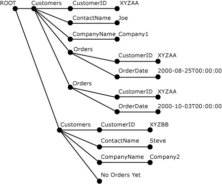

# <a name="openxml-sql-server"></a>OPENXML (SQL Server)
[!INCLUDE[tsql-appliesto-ss2008-xxxx-xxxx-xxx-md](../../includes/tsql-appliesto-ss2008-xxxx-xxxx-xxx-md.md)]
  OPENXML, palabra clave de [!INCLUDE[tsql](../../includes/tsql-md.md)] , proporciona un conjunto de filas en documentos XML en memoria que es similar a una tabla o una vista. OPENXML permite el acceso a los datos XML a pesar de ser un conjunto de filas relacional. Para ello, proporciona una vista de conjunto de filas de la representación interna de un documento XML. Los registros del conjunto de filas pueden almacenarse en tablas de base de datos.  
  
 OPENXML puede utilizarse en instrucciones SELECT y SELECT INTO donde puedan aparecer como origen proveedores de conjuntos de filas, una vista u OPENROWSET. Para obtener más información sobre la sintaxis de OPENXML, vea [OPENXML &#40;Transact-SQL&#41;](../../t-sql/functions/openxml-transact-sql.md).  
  
 Para escribir consultas en un documento XML mediante OPENXML, primero es necesario llamar a **sp_xml_preparedocument**. que analiza el documento XML y devuelve un identificador para el documento analizado que está listo para su uso. El documento analizado es una representación en árbol del modelo de objetos de documento (DOM) de los distintos nodos del documento XML. Este identificador de documento se pasa a OPENXML. A continuación, OPENXML proporciona una vista de conjunto de filas del documento, basándose en los parámetros que ha recibido.  
  
> [!NOTE]  
>  **sp_xml_preparedocument** usa una versión actualizada de SQL del analizador de MSXML, Msxmlsql.dll. Esta versión del analizador de MSXML se diseñó para admitir [!INCLUDE[ssNoVersion](../../includes/ssnoversion-md.md)] y seguir siendo compatible con versiones anteriores con MSXML versión 2.6.  
  
 La representación interna de un documento XML se debe quitar de la memoria mediante una llamada al procedimiento almacenado del sistema **sp_xml_removedocument** para liberar la memoria.  
  
 La siguiente ilustración muestra el proceso.  
  
   
  
 Tenga en cuenta que, para entender el funcionamiento de OPENXML, debe estar familiarizado con el uso de XML y las consultas Xpath. Para obtener más información sobre la compatibilidad de XPath en SQL Server, vea [Utilizar consultas XPath en SQLXML 4.0](../../relational-databases/sqlxml-annotated-xsd-schemas-xpath-queries/using-xpath-queries-in-sqlxml-4-0.md).  
  
> [!NOTE]  
>  OpenXML permite parametrizar como variables los patrones XPath de fila y columna. Esta parametrización podría provocar inyecciones de expresiones XPath si el programador expone los parámetros a usuarios externos (por ejemplo, si los parámetros se proporcionan a través de un procedimiento almacenado que se llama externamente). Para evitar estos posibles riesgos de seguridad, se recomienda no exponer los parámetros XPath a llamadores externos.  
  
## <a name="example"></a>Ejemplo  
 El siguiente ejemplo muestra el uso de `OPENXML` en las instrucciones `INSERT` y `SELECT` . El documento de ejemplo XML contiene los elementos `<Customers>` y `<Orders>` .  
  
 En primer lugar, el procedimiento almacenado `sp_xml_preparedocument` analiza el documento XML. Este documento analizado es una representación en árbol de varios nodos (elementos, atributos, texto y comentarios) en el documento XML. `OPENXML` a continuación, hace referencia a este documento XML analizado y proporciona una vista de conjunto de filas de todo o partes de este documento XML. De esta forma, una instrucción `INSERT` puede insertar datos de dicho conjunto de filas en una tabla de la base de datos mediante `OPENXML` . Se pueden utilizar varias llamadas `OPENXML` para proporcionar una vista del conjunto de filas de diferentes partes del documento XML y procesarlas; por ejemplo, insertándolas en tablas diferentes. Este proceso también se conoce como "descomponer XML en tablas".  
  
 En el siguiente ejemplo, un documento XML se descompone de forma que los elementos `<Customers>` se almacenen en la tabla `Customers` y los elementos `<Orders>` en la tabla `Orders` , por medio de dos instrucciones `INSERT` . El ejemplo también muestra una instrucción `SELECT` con `OPENXML` que recupera `CustomerID` y `OrderDate` del documento XML. El último paso del proceso consiste en llamar a `sp_xml_removedocument`. Esto se lleva a cabo para liberar la memoria asignada a la representación interna en árbol XML que se creó durante la fase de análisis.  
  
```  
-- Create tables for later population using OPENXML.  
CREATE TABLE Customers (CustomerID varchar(20) primary key,  
                ContactName varchar(20),   
                CompanyName varchar(20));  
GO  
CREATE TABLE Orders( CustomerID varchar(20), OrderDate datetime;)  
GO  
DECLARE @docHandle int;  
DECLARE @xmlDocument nvarchar(max); -- or xml type  
SET @xmlDocument = N'<ROOT>  
<Customers CustomerID="XYZAA" ContactName="Joe" CompanyName="Company1">  
<Orders CustomerID="XYZAA" OrderDate="2000-08-25T00:00:00"/>  
<Orders CustomerID="XYZAA" OrderDate="2000-10-03T00:00:00"/>  
</Customers>  
<Customers CustomerID="XYZBB" ContactName="Steve"  
CompanyName="Company2">No Orders yet!  
</Customers>  
</ROOT>';  
EXEC sp_xml_preparedocument @docHandle OUTPUT, @xmlDocument;  
-- Use OPENXML to provide rowset consisting of customer data.  
INSERT Customers   
SELECT *   
FROM OPENXML(@docHandle, N'/ROOT/Customers')   
  WITH Customers;  
-- Use OPENXML to provide rowset consisting of order data.  
INSERT Orders   
SELECT *   
FROM OPENXML(@docHandle, N'//Orders')   
  WITH Orders;  
-- Using OPENXML in a SELECT statement.  
SELECT * FROM OPENXML(@docHandle, N'/ROOT/Customers/Orders') WITH (CustomerID nchar(5) '../@CustomerID', OrderDate datetime);  
-- Remove the internal representation of the XML document.  
EXEC sp_xml_removedocument @docHandle;   
```  
  
 La ilustración siguiente muestra el árbol XML analizado del documento XML anterior, creado con sp_xml_preparedocument.  
  
   
  
## <a name="openxml-parameters"></a>Parámetros OPENXML  
 Los parámetros de OPENXML son los siguientes:  
  
-   Un identificador de documento XML (*idoc*)  
  
-   Una expresión XPath que identifica los nodos que se asignarán a las filas (*rowpattern*)  
  
-   Una descripción del conjunto de filas que se va a generar  
  
-   La asignación entre las columnas del conjunto de filas y los nodos XML  
  
### <a name="xml-document-handle-idoc"></a>Identificador del documento XML (idoc)  
 El procedimiento almacenado **sp_xml_preparedocument** devuelve el identificador del documento.  
  
### <a name="xpath-expression-to-identify-the-nodes-to-be-processed-rowpattern"></a>Expresión XPath que identifica los nodos que se van a procesar (rowpattern)  
 La expresión XPath especificada como *rowpattern* identifica un conjunto de nodos del documento XML. Cada nodo identificado por *rowpattern* se corresponde con una única fila del conjunto de filas generado por OPENXML.  
  
 Los nodos identificados por la expresión XPath pueden ser cualquier nodo XML del documento XML. Si *rowpattern* identifica un conjunto de elementos del documento XML, el conjunto de filas tiene una fila para cada nodo de elemento identificado. Por ejemplo, si *rowpattern* termina en un atributo, se crea una fila para cada nodo de atributo que *rowpattern*seleccione.  
  
### <a name="description-of-the-rowset-to-be-generated"></a>Descripción del conjunto de filas que se va a generar  
 OPENXML utiliza un esquema de conjunto de filas para generar el conjunto de filas resultante. Para especificar un esquema de conjunto de filas, se pueden utilizar las opciones siguientes.  
  
#### <a name="using-the-edge-table-format"></a>Utilizar el formato de tabla irregular  
 Se recomienda utilizar el formato de tabla irregular para especificar un esquema de conjunto de filas. No utilice la cláusula WITH.  
  
 OPENXML devuelve un conjunto de filas en formato de tabla irregular. Se denomina tabla irregular porque todos los bordes del árbol del documento XML analizado se asignan a una fila del conjunto de filas.  
  
 Las tablas irregulares representan, en una sola tabla, la estructura exacta del documento XML. Esta estructura incluye los nombres de elementos y atributos, la jerarquía del documento, los espacios de nombres y las instrucciones de procesamiento. El formato de tabla irregular permite obtener información adicional que no se muestra a través de las metapropiedades. Para obtener más información acerca de las metapropiedades, vea [Specify Metaproperties in OPENXML](../../relational-databases/xml/specify-metaproperties-in-openxml.md).  
  
 La información adicional proporcionada por una tabla irregular permite almacenar y consultar el tipo de datos de un elemento y atributo, y el tipo de nodo, así como almacenar y consultar información acerca de la estructura del documento XML. Con esta información adicional también se puede generar un sistema de administración de documentos XML propio.  
  
 Cuando se utiliza una tabla irregular se pueden escribir procedimientos almacenados que utilicen documentos XML como entrada de objetos binarios grandes (BLOB), crear la tabla irregular y, después, extraer y analizar el documento más detalladamente. En este proceso más detallado, se podrían buscar la jerarquía del documento, los nombres de elementos y atributos, los espacios de nombres y las instrucciones de procesamiento.  
  
 La tabla irregular también puede servir como formato de almacenamiento de documentos XML cuando no tiene sentido la asignación a otros formatos relacionales y un campo ntext no proporciona suficiente información estructural.  
  
 Siempre que pueda utilizar un analizador XML para examinar un documento XML, podrá utilizar una tabla irregular para obtener la misma información.  
  
 En la tabla siguiente se describe la estructura de la tabla irregular.  
  
|Nombre de la columna|Tipo de datos|Descripción|  
|-----------------|---------------|-----------------|  
|**id**|**bigint**|Es el id. único del nodo del documento.<br /><br /> El elemento raíz tiene un valor de identificador de 0. Los valores de identificador negativos están reservados.|  
|**parentid**|**bigint**|Identifica el elemento primario del nodo. El elemento primario identificado por este Id. no es necesariamente el elemento primario. Sin embargo, esto depende del valor de NodeType del nodo cuyo elemento primario identifique este identificador Por ejemplo, si se trata de un nodo de texto, su elemento primario puede ser un nodo de atributo.<br /><br /> Si el nodo está en el nivel superior del documento XML, su **ParentID** es NULL.|  
|**node type**|**int**|Identifica el tipo de nodo y es un entero que se corresponde con la numeración del tipo de nodo del modelo de objetos de documento (DOM) XML.<br /><br /> A continuación se ofrecen los valores que pueden aparecer en esta columna para indicar el tipo de nodo:<br /><br /> **1** = nodo de elemento<br /><br /> **2** = nodo de atributo<br /><br /> **3** = nodo de texto<br /><br /> **4** = nodo de sección CDATA<br /><br /> **5** = nodo de referencia de entidad<br /><br /> **6** = nodo de entidad<br /><br /> **7** = nodo de instrucción de procesamiento<br /><br /> **8** = nodo de comentario<br /><br /> **9** = nodo de documento<br /><br /> **10** = nodo de tipo de documento<br /><br /> **11** = nodo de fragmento de documento<br /><br /> **12** = nodo de notación<br /><br /> Para obtener más información, vea el tema donde se explica la propiedad nodeType en el SDK de Microsoft XML (MSXML).|  
|**localname**|**nvarchar(max)**|Proporciona el nombre local del elemento o atributo. Es NULL si el objeto DOM no tiene nombre.|  
|**prefijo**|**nvarchar(max)**|Es el prefijo del espacio del nombre del nodo.|  
|**namespaceuri**|**nvarchar(max)**|Es el URI del espacio de nombres del nodo. Si el valor es NULL, no hay ningún espacio de nombres.|  
|**datatype**|**nvarchar(max)**|Es el tipo de datos real de la fila del elemento o atributo; en caso contrario, es NULL. El tipo de datos se infiere a partir de las DTD insertadas o del esquema insertado.|  
|**prev**|**bigint**|Es el id. XML del anterior elemento del mismo nivel. Es NULL si no existe ningún elemento previo directo del mismo nivel.|  
|**text**|**ntext**|Contiene el valor del atributo o el contenido del elemento en formato de texto. Es NULL si la entrada de la tabla irregular no necesita ningún valor.|  
  
#### <a name="using-the-with-clause-to-specify-an-existing-table"></a>Utilizar la cláusula WITH para especificar una tabla existente  
 Se puede utilizar la cláusula WITH para especificar el nombre de una tabla existente. Para ello, solo es necesario especificar un nombre de tabla existente cuyo esquema pueda ser utilizado por OPENXML para generar el conjunto de filas.  
  
#### <a name="using-the-with-clause-to-specify-a-schema"></a>Utilizar la cláusula WITH para especificar un esquema  
 Se puede utilizar la cláusula WITH para especificar un esquema completo. Al especificar el esquema del conjunto de filas, se especifican los nombres de columna, sus tipos de datos y su asignación al documento XML.  
  
 Se puede especificar el patrón de columna mediante el parámetro ColPattern de SchemaDeclaration. El patrón de columna especificado se utiliza para asignar una columna del conjunto de filas al nodo XML identificado por rowpattern y también para determinar el tipo de asignación.  
  
 Si no se especifica ColPattern para una columna, la columna del conjunto de filas se asigna al nodo XML con el mismo nombre, según la asignación especificada en el parámetro *flags* . No obstante, si se especifica ColPattern como parte de la especificación del esquema en la cláusula WITH, se sobrescribe la asignación especificada en el parámetro *flags* .  
  
### <a name="mapping-between-the-rowset-columns-and-the-xml-nodes"></a>La asignación entre las columnas del conjunto de filas y los nodos XML  
 En la instrucción OPENXML, opcionalmente se puede especificar el tipo de asignación (centrada en atributos o centrada en elementos) que existe entre las columnas del conjunto de filas y los nodos XML identificados en *rowpattern*. Esta información se utiliza en la transformación entre los nodos XML y las columnas del conjunto de filas.  
  
 Las asignaciones se pueden especificar de las dos maneras siguientes:  
  
-   Mediante el uso del parámetro *flags*  
  
     La asignación que se especifica con el parámetro *flags* da por supuesto la correspondencia de nombres, según la cual los nodos XML se asignan a las columnas del conjunto de filas con el mismo nombre.  
  
-   Mediante el uso del parámetro *ColPattern*  
  
     *ColPattern*, una expresión XPath, se especifica como parte de *SchemaDeclaration* en la cláusula WITH. La asignación especificada en *ColPattern* sobrescribe la asignación que especifica el parámetro *flags* .  
  
     *ColPattern* puede usarse para especificar el tipo de asignación, como centrada en atributos o centrada en elementos, que sobrescribe o mejora la asignación predeterminada indicada en *flags*.  
  
     *ColPattern* se especifica en las siguientes circunstancias:  
  
    -   El nombre de columna del conjunto de filas es diferente del nombre de elemento o atributo al que se asigna. En este caso, se utiliza *ColPattern* para identificar el nombre del elemento o atributo XML al que se asigna la columna del conjunto de filas.  
  
    -   Se desea asignar un atributo de metapropiedad a la columna. En este caso, se utiliza *ColPattern* para identificar la metapropiedad a la que se asigna la columna del conjunto de filas. Para obtener más información sobre cómo usar las metapropiedades, vea [Especificar metapropiedades en OPENXML](../../relational-databases/xml/specify-metaproperties-in-openxml.md).  
  
 Los parámetros *flags* y *ColPattern* son opcionales. Si no se especifica ninguna asignación, se asume la asignación centrada en atributos. La asignación centrada en atributos es el valor predeterminado del parámetro *flags* .  
  
#### <a name="attribute-centric-mapping"></a>asignación centrada en atributos  
 Al establecer el parámetro *flags* de OPENXML en 1 (XML_ATTRIBUTES), se especifica la asignación **centrada en atributos** . Si *flags* contiene XML_ ATTRIBUTES, el conjunto de filas expuesto proporciona o usa filas en las que cada elemento XML se representa como una fila. Los atributos XML se asignan a los atributos definidos en SchemaDeclaration o proporcionados por Tablename en la cláusula WITH, basándose en la correspondencia de nombres. La correspondencia de nombres significa que los atributos XML de un nombre determinado se almacenan en una columna del conjunto de filas con el mismo nombre.  
  
 Si el nombre de columna es diferente del nombre de atributo al que se asigna, debe especificarse *ColPattern* .  
  
 Si el atributo XML tiene un calificador de espacio de nombres, el nombre de la columna del conjunto de filas también debe tenerlo.  
  
#### <a name="element-centric-mapping"></a>Asignación centrada en elementos  
 Al establecer el parámetro *flags* de OPENXML en 2 (XML_ELEMENTS), se especifica la asignación **centrada en elementos** . Esta asignación es similar a la asignación **centrada en atributos** , con las siguientes diferencias:  
  
-   Si existe la correspondencia de nombres de la asignación de ejemplo (una asignación de columna a un elemento XML con el mismo nombre), se eligen los subelementos no complejos, a menos que se especifique un patrón de nivel de columna. En el proceso de recuperación, si el subelemento es complejo porque contiene más subelementos, la columna se establece en NULL. En ese caso, se descartan los valores de atributo de los subelementos.  
  
-   Si varios subelementos tienen el mismo nombre, se devuelve el primer nodo.  
  
## <a name="see-also"></a>Consulte también  
 [sp_xml_preparedocument &#40;Transact-SQL&#41;](../../relational-databases/system-stored-procedures/sp-xml-preparedocument-transact-sql.md)   
 [sp_xml_removedocument &#40;Transact-SQL&#41;](../../relational-databases/system-stored-procedures/sp-xml-removedocument-transact-sql.md)   
 [OPENXML &#40;Transact-SQL&#41;](../../t-sql/functions/openxml-transact-sql.md)   
 [Datos XML &#40;SQL Server&#41;](../../relational-databases/xml/xml-data-sql-server.md)  
  
  
