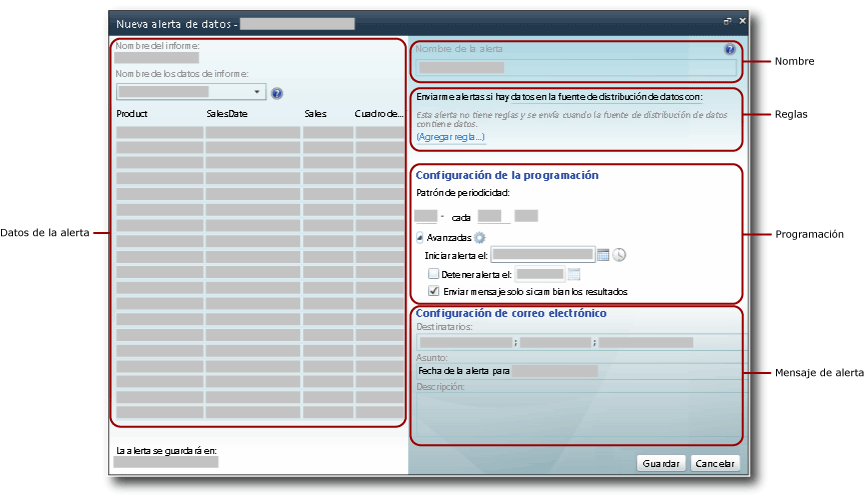
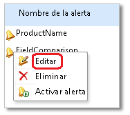

# Diseñador de alertas de datos

[!INCLUDE [ssrs-appliesto](../includes/ssrs-appliesto.md)] [!INCLUDE [ssrs-appliesto-2016](../includes/ssrs-appliesto-2016.md)] [!INCLUDE [ssrs-appliesto-not-2017](../includes/ssrs-appliesto-not-2017.md)] [!INCLUDE[ssrs-appliesto-sharepoint-2013-2016i](../includes/ssrs-appliesto-sharepoint-2013-2016.md)] [!INCLUDE [ssrs-appliesto-not-pbirs](../includes/ssrs-appliesto-not-pbirs.md)]

[!INCLUDE [ssrs-previous-versions](../includes/ssrs-previous-versions.md)]

Las definiciones de alertas de datos se crean y editan en el Diseñador de alertas de datos. Una definición de alerta es una colección de metadatos, que incluye los datos del informe de su interés, las reglas que deben satisfacer los datos del informe para que se creen instancias de alertas de datos y se envíen mensajes de alertas de datos, los destinatarios del mensaje de alerta, etc.  

> [!NOTE]
> La integración de Reporting Services con SharePoint ya no está disponible a partir de SQL Server 2016.

 Para crear una definición de alerta tiene que realizar varias tareas relacionadas:  
  
-   Seleccione el informe y la fuente de distribución de datos del informe que incluye los datos que desea usar.  
  
-   Defina las reglas y las cláusulas que hacen que se envíe una alerta. Las reglas pueden ser simples o complejas, y se pueden usar varias cláusulas combinándolas con operadores AND.  
  
-   Defina la frecuencia con la que se envía el mensaje de alerta, así como la fecha y hora en que la alerta se inicia y se detiene. Los mensajes de alerta solo se pueden enviar cuando cambien los resultados.  
  
-   Especifique las direcciones de correo electrónico de los destinatarios del mensaje de alerta.  
  
-   Personalice la línea **Asunto** del mensaje de la alerta.  
  
-   Proporcione una descripción de la alerta para incluirla en el mensaje de alerta.  
  
> [!NOTE]  
>  Dado que la característica de alertas de datos de [!INCLUDE[ssRSnoversion](../includes/ssrsnoversion-md.md)] solo está disponible cuando se instala [!INCLUDE[ssRSnoversion](../includes/ssrsnoversion-md.md)] en el modo de SharePoint, el informe en el que se quiere crear una alerta debe guardarse, implementarse o cargarse en una biblioteca de documentos de SharePoint.  
>   
>  Las alertas de datos no se pueden crear en los informes que utilizan la Autenticación integrada de Windows o piden credenciales. Los informes deben usar credenciales almacenadas. Para más información, vea [Especificar información de credenciales y conexión para los orígenes de datos de informes](../reporting-services/report-data/specify-credential-and-connection-information-for-report-data-sources.md).  
  
 Para abrir el Diseñador de alertas de datos, haga clic en la opción **Nueva alerta de datos** en el menú **Acciones** de la barra de herramientas de informe. Si no ve la opción **Nueva alerta de datos** , el informe no está configurado para usar credenciales almacenadas. Puede actualizar el tipo de credenciales actualizando el origen de datos del informe desde la biblioteca de SharePoint.  
  
##   Interfaz de usuario del Diseñador de alertas de datos  
 El Diseñador de alertas de datos se divide en varias áreas. El área donde se selecciona la fuente de distribución de datos de informe, el área donde se crean condiciones sencillas o complejas agregando reglas a las condiciones, etcétera. En la imagen siguiente se muestran las áreas del Diseñador de alertas de datos.  
  
   
  
  
### Datos de la alerta  
 Cuando se abre el Diseñador de alertas de datos, este genera y hace que estén disponibles todas las fuentes de distribución de datos del informe, y la lista desplegable **Nombre de los datos de informe** contiene los nombres de las fuentes. Las fuentes de distribución de datos se almacenan en la memoria caché mientras se crea la definición de la alerta y la tabla que muestra los datos de la fuente de distribución de datos se llena rápidamente al cambiar entre las fuentes de distribución de datos para explorar los datos del informe.  
  
 El primer paso para crear una definición de alerta de datos consiste en seleccionar la fuente de distribución de datos del informe que contiene los datos que desea que supervise la alerta. Los informes pueden tener varias fuentes de distribución de datos o ninguna. Si un informe no tiene ninguna fuente de distribución de datos, no es posible crear alertas para el mismo. Una fuente de distribución de datos se puede generar mediante cualquier región de datos, incluidos todos los tipos de gráficos, medidores e indicadores, así como tablas, matrices y listas.  
  
 Si el informe tiene parámetros y no ve los datos y columnas esperados en la fuente de distribución de datos, vuelva a ejecutar el informe con los valores de parámetro adecuados. Las columnas y los valores deben estar presentes en el informe que se incluirá en la fuente de distribución de datos.  
  
 Dependiendo del diseño del informe, puede que no sea intuitivo determinar el número de fuentes de distribución de datos que tiene, ni qué datos se incluyen en cada fuente de distribución de datos. La extensión de representación de Atom de [!INCLUDE[ssRSnoversion](../includes/ssrsnoversion-md.md)]genera las fuentes de distribución de datos que se utilizan con las alertas. La extensión de representación de Atom proporciona los datos de informe como conjuntos de filas planas, un formato tabular en el que todas las columnas tienen el mismo número de filas. Estos conjuntos de filas son el contenido de las fuentes de distribución de datos. Dado que el diseño del informe suele ser complejo y contiene múltiples regiones de datos del mismo nivel o anidadas, es necesario que haya varias fuentes de distribución de datos para que estén disponibles todos los datos del informe. Para más información sobre cómo se generan las fuentes de distribución de datos a partir de los informes, vea [Generar fuentes de distribución de datos a partir de informes &#40;Generador de informes y SSRS&#41;](../reporting-services/report-builder/generating-data-feeds-from-reports-report-builder-and-ssrs.md) y [Generar fuentes de distribución de datos a partir de un informe &#40;Generador de informes y SSRS&#41;](../reporting-services/report-builder/generate-data-feeds-from-a-report-report-builder-and-ssrs.md).  
  
 Cuando se elige una fuente de distribución de datos, los datos de la fuente se muestran en una tabla con filas y columnas en el panel datos de alerta del Diseñador de alertas de datos. Los metadatos del origen de datos utilizado por el informe o el propio informe especifican los nombres de columna y las fuentes de distribución de datos que rellenan la lista de campos que se usa para definir las reglas de la condición de datos. La fuente de distribución de datos también proporciona metadatos como los tipos de datos de las columnas de la tabla que limitan los valores y los operadores de comparación que pueden utilizarse con los campos al crear las reglas.  
  
 Algunos informes tienen millones de filas de datos. La tabla solo muestra las 100 primeras filas de datos de la fuente.  
  
### Nombre de la alerta  
 De forma predeterminada, la definición de la alerta tiene el mismo nombre que el informe. Puede cambiar el nombre de la alerta para que sea más significativo. Esto facilita la administración de las alertas, así como determinar las alertas que es preciso actualizar, eliminar, etcétera.  
  
 Puede crear varias alertas en un informe. Es posible tener varias definiciones de alertas con el mismo nombre, pero se recomienda que use nombres únicos para las alertas. Facilita la labor de distinguir y administrar las definiciones de alertas. Puede ver una lista de todas las alertas que ha creado en el Administrador de alertas de datos. Para obtener más información, vea [Administrador de alertas de datos para administradores de alertas](../reporting-services/data-alert-manager-for-alerting-administrators.md) y [Administrar mis alertas de datos en el Administrador de alertas de datos](../reporting-services/manage-my-data-alerts-in-data-alert-manager.md).  
  
### Reglas y cláusulas  
 El ámbito de los cambios en los datos y las reglas de la alerta definen los cambios en los datos que desencadenan la alerta. El ámbito de los cambios en los datos es el siguiente:  
  
-   **Cualquier dato tiene**: al menos un valor de los datos satisface las reglas especificadas por la condición.  
  
-   **Ningún dato tiene**: ningún valor de los datos satisface las reglas especificadas por la condición.  
  
 Una regla contiene cero, una o muchas cláusulas. Cuando hay varias reglas, se combinan mediante el operador lógico AND. Una regla puede incluir varias cláusulas combinadas por el operador OR si la columna tiene el tipo de datos de cadena. A continuación se muestran reglas básicas que usan solo una cláusula, varias reglas combinadas mediante el operador AND y varias reglas con una o varias cláusulas OR.  
  
 **Reglas simples**  
  
-   Ventas netas **es mayor que** 100000  
  
-   Fecha de venta **es posterior** a 1/6/2010  
  
-   Nombre de la empresa **no es** Contoso  
  
 **Reglas combinadas con el operador AND**  
  
-   Ventas **es mayor que** 1500,00  
  
     **y** unidades vendidas **es menor que** 500  
  
     Fecha de devolución **es anterior** a 1/1/2010  
  
-   Ventas **es mayor o igual a** 1500,00  
  
     **y** Fecha de devolución **es posterior** a 1/1/2010  
  
     **y** Unidades vendidas **es mayor que** 500  
  
-   El nombre de la promoción **contiene** Primavera  
  
     **y** Unidades vendidas **es mayor que** 500  
  
     **y** Devoluciones **es**  0  
  
 **Reglas con cláusulas OR**  
  
-   El apellido **es** Blythe  
  
     **O**  Petulescu  
  
     **O**  Martin  
  
-   Fecha de devolución **es posterior** a 1/1/2010  
  
     **y** Territorio de ventas **es**  Central  
  
     **O**  Sur  
  
     **O**  Norte  
  
 Dependiendo del tipo de datos del campo, el Diseñador de alertas de datos proporciona comparaciones diferentes. El Diseñador de alertas de datos proporciona comparaciones que se adaptan al tipo de datos del campo con el que se comparan los valores. A continuación se muestran comparaciones disponibles para diferentes tipos de datos. El tipo de datos **Boolean** no se admite en las reglas.  
  
-   Las comparaciones de tipos de datos de fecha y hora son: **es**, **no es**, **es anterior a**y **es posterior a**  
  
-   Las comparaciones de datos numéricos son: **es**, **no es**, **es menor que**, **es menor o igual que**, **es mayor que**y **es mayor o igual que**  
  
-   Las comparaciones de tipos de datos de cadena son: **es**, **no es**y **contiene**  
  
 Cuando se crea una regla, se especifica si se debe usar un valor o campo en la comparación eligiendo **Modo de entrada de valores** o **Modo de selección de campos**. Si elige **Modo de entrada de valores**, deberá proporcionar una lista de valores de comparación. Una comparación con varias cláusulas OR es muy similar a una comparación lógica IN en [!INCLUDE[tsql](../includes/tsql-md.md)], que es una lista de valores que se comprueba para buscar coincidencias. Para más información, vea [IN &#40;Transact-SQL&#41;](../t-sql/language-elements/in-transact-sql.md).  
  
 Si elige **Modo de selección de campos**, la comparación es entre dos campos, fila por fila. Los dos campos deben tener tipos de datos compatibles (por ejemplo, dos campos numéricos) o la comparación no será válida. Una lista de campos se muestra automáticamente cuando se elige **Modo de selección de campos**.  
  
 También son válidas las alertas de datos sin reglas. Este tipo de alerta puede ser muy útil. Imagine un escenario en el que solo desea recibir notificaciones cuando la fuente de distribución de datos del informe tiene datos. La fuente de distribución de datos contiene la información sobre los asistentes a un evento y la fuente está vacía hasta que un asistente cancele su asistencia. En este escenario, recibiría una alerta a partir de la primera cancelación.  
  
 Puede eliminar reglas y cláusulas individuales.  
  
 Las reglas y las cláusulas se incluyen en el mensaje de alerta de datos.  
  
### Configuración de la programación  
 La programación que se define para la alerta de datos define el patrón de periodicidad para enviar el mensaje de alerta de datos y cuándo iniciar y detener el envío de mensajes de alerta. Los patrones son: una vez, minuto, diaria y semanal. Aunque una alerta solo tiene una programación, puede crear patrones de periodicidad complejos que cubran la mayoría de las necesidades empresariales mediante estos intervalos. A continuación se ofrecen algunos ejemplos de patrones de periodicidad comunes para su uso en las programaciones:  
  
-   **Diaria cada 10 días**: envía alertas una vez al día, cada 10 días.  
  
-   **Semanal cada 2 semanas el lunes**: envía las alertas cada dos semanas el lunes solamente.  
  
-   **Cada hora cada 12 horas**: envía las alertas cada 12 horas.  
  
-   **Minuto cada 30 minutos**: envía las alertas cada 30 minutos.  
  
 El patrón de periodicidad especifica cuándo se envía la alerta. Si las reglas se cumplen durante el intervalo especificado por el patrón, la alerta no se envía hasta el final del intervalo.  
  
 Si desea recibir un mensaje de alerta de datos en cuanto los datos del informe cumplan las reglas especificadas, puede programar la alerta para que se ejecute a menudo. Cuando los datos del informe no cambian, usted y otros destinatarios podrían recibir muchos mensajes redundantes. Si solo desea recibir mensajes cuando cambien los resultados de aplicar las reglas, seleccione la opción **Enviar mensaje solo si cambian los resultados** .  
  
> [!IMPORTANT]  
>  Es recomendable que no use un patrón de periodicidad que sea más frecuente que el envío diario a menos que exista una importante razón empresarial para hacerlo. El procesamiento de la definición de alerta de datos en tiempo real no es un escenario admitido. El procesamiento de definiciones de alertas de datos afecta frecuentemente al rendimiento del servidor de informes y a la implementación de [!INCLUDE[ssRSnoversion](../includes/ssrsnoversion-md.md)] en su conjunto.  
  
### Configuración de correo electrónico  
 Las direcciones de correo electrónico de los destinatarios que reciben mensajes de alertas de datos por correo electrónico se especifican en la opción **Destinatarios** . Si usa varias direcciones de correo electrónico, sepárelas mediante signos de punto y coma, tal como hace en los mensajes de correo electrónico de Microsoft Office Outlook. También puede especificar grupos de distribución como destinatarios, lo que permite administrar más fácil y eficazmente la lista de destinatarios. Si SharePoint puede determinar su dirección de correo electrónico mientras crea una definición de alerta, su dirección de correo electrónico se agrega automáticamente a la lista de destinatarios; en caso contrario, debe agregarse explícitamente como destinatario.  
  
 El asunto predeterminado del mensaje de correo electrónico es **Alerta de datos para \<nombre de alerta>**. Puede cambiar el asunto de acuerdo con sus necesidades.  
  
 Puede proporcionar también una descripción para incluirla en el mensaje de alerta de datos en la opción **Descripción** . Incluir una descripción, especialmente si tiene alertas de datos similares, le ayudará a diferenciar rápidamente los mensajes de alertas. Además del mensaje de alerta que se envía cuando los datos del informe satisfacen las reglas especificadas, se envía un mensaje de alerta a todos los destinatarios cuando se produce un error. Para más información, consulte [Data Alert Messages](../reporting-services/data-alert-messages.md).  
  
 Para obtener más información sobre cómo se genera el correo electrónico, vea [Alertas de datos de Reporting Services](../reporting-services/reporting-services-data-alerts.md).  
  
##   Crear una definición de alerta de datos  
 Si tiene los permisos Ver elemento y Crear alertas de SharePoint, puede crear una definición de alerta de datos para cualquier informe para el que tenga permiso de visualización, siempre y cuando el informe use credenciales almacenadas o no use credenciales. El informe se ejecuta desde una biblioteca de SharePoint. Los datos disponibles para su uso en el Diseñador de alertas de datos proceden del informe. Si el informe tiene parámetros, puede que tenga que ejecutarlo con diferentes valores de parámetros para asegurarse de que los datos que le interesan aparecen en el informe. Después de abrir el informe, puede hacer clic en la opción **Nueva alerta de datos** del menú **Acciones** de la barra de herramientas de informe para abrir el Diseñador de alertas de datos. En la imagen siguiente se muestra cómo se puede abrir el Diseñador de alertas de datos.  
  
   
  
 Para obtener más información, vea [Crear una alerta de datos en el Diseñador de alertas de datos](../reporting-services/create-a-data-alert-in-data-alert-designer.md).  
  
  
##   Guardar una definición de alerta de datos  
 El Diseñador de alertas de datos muestra la dirección URL del sitio en que se guardará la definición de alerta de datos. Las definiciones de alertas de datos siempre se guardan en el mismo sitio que los informes.  
  
> [!NOTE]  
>  Los valores de parámetro que eligió para ejecutar el informe se guardan en la definición de alerta y se usarán cuando se vuelva a ejecutar el informe durante el procesamiento de la definición de alerta. Para utilizar valores de parámetro diferentes, debe crear una nueva definición de alerta.  
  
 Antes de guardar la definición de la alerta, se valida. Debe corregir los errores antes de que la definición de la alerta se pueda guardar correctamente. Para obtener más información, vea [Crear una alerta de datos en el Diseñador de alertas de datos](../reporting-services/create-a-data-alert-in-data-alert-designer.md).  
  
  
##   Editar una definición de alerta de datos  
 Después de guardar la definición de alerta de datos, puede volver a abrirla y modificarla en el Diseñador de alertas de datos. Puede agregar, cambiar o eliminar reglas y cláusulas, y cambiar la configuración de programación y de correo electrónico. Si la fuente de distribución de datos de informe que utiliza la alerta ha cambiado y ya no proporciona los campos a los que hacen referencia las reglas de la alerta o han cambiado los tipos de datos u otros metadatos de los campos, la definición de la alerta ya no es válida y debe corregirla para poder volver a guardarla. Si desea utilizar otra fuente de distribución de datos, debe crear una nueva definición de alerta.  
  
 Para editar una definición de alerta de datos, haga clic con el botón secundario en el Administrador de alertas de datos y haga clic en **Editar**. En la imagen siguiente se muestra el menú contextual de una alerta de datos en el Administrador de alertas de datos.  
  
   
  
 Para obtener más información, vea [Modificar una alerta de datos en el Diseñador de alertas](../reporting-services/edit-a-data-alert-in-alert-designer.md).  
  
  
##   Tareas relacionadas  
 En esta sección se enumeran los procedimientos que muestran cómo crear y modificar alertas.  
  
-   [Modificar una alerta de datos en el Diseñador de alertas](../reporting-services/edit-a-data-alert-in-alert-designer.md)  
  
-   [Creación de una alerta de datos en el Diseñador de alertas de datos](../reporting-services/create-a-data-alert-in-data-alert-designer.md)  

## Ver también

[Alertas de datos de Reporting Services](../reporting-services/reporting-services-data-alerts.md)   
[Administrador de alertas de datos para administradores de alertas](../reporting-services/data-alert-manager-for-alerting-administrators.md)  

¿Tiene alguna pregunta más? [Puede plantear sus dudas en el foro de Reporting Services](https://go.microsoft.com/fwlink/?LinkId=620231).
