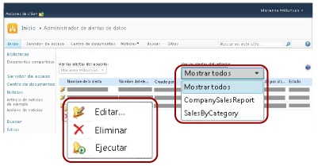
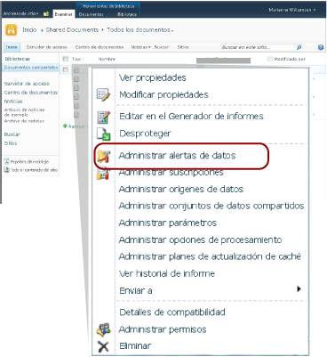

# Administrador de alertas de datos para los usuarios de SharePoint
  [!INCLUDE[ssRSnoversion](../includes/ssrsnoversion-md.md)] proporciona el Administrador de alertas de datos para que los trabajadores de la información administren las alertas de datos. Pueden ver la información sobre las alertas que crearon, eliminar alertas, abrir definiciones de alertas para su edición y ejecutar alertas a petición. Pueden optar por ver las alertas de un único informe o de todos los informes. La imagen siguiente muestra las características disponibles para los trabajadores de la información en el Administrador de alertas de datos.  
  
   
  
 Cuando se habilita un sitio de SharePoint para las alertas de datos, se crean dos páginas de SharePoint, MyDataAlerts.aspx y SiteDataAlerts.aspx, que se agregan al sitio de SharePoint. MyDataAlerts.aspx es el Administrador de alertas de datos para los trabajadores de la información de SharePoint. Los trabajadores de la información abren el Administrador de alertas de datos desde el menú contextual de los informes para los que han creado alertas.  
  
 También se puede abrir el Administrador de alertas de datos directamente mediante una dirección URL. A continuación se muestra la sintaxis de la dirección URL:  
  
 `http://<site name>/_layouts/ReportServer/MyDataAlerts.aspx`  
  
> [!NOTE]  
>  Para poder utilizar las características de alertas de [!INCLUDE[ssRSnoversion](../includes/ssrsnoversion-md.md)] , un administrador debe otorgarle permisos. Para más información sobre los permisos necesarios, vea [Alertas de datos de Reporting Services](../reporting-services/reporting-services-data-alerts.md).  
  
##   Ver información de alertas de datos  
 Puede ver una lista de las alertas de datos que creó en el Diseñador de alertas de datos. Para abrir el Administrador de alertas de datos, haga clic con el botón secundario en un informe publicado en una biblioteca de SharePoint. En la imagen siguiente se muestra la opción **Administrar alertas de datos** del menú contextual del informe.  
  
   
  
 El Administrador de alertas de datos incluye una tabla con el nombre de la alerta, el nombre del informe, el nombre del creador de la definición de la alerta, el número de veces que se envió el mensaje de alerta, la última vez que se ejecutó la alerta, la última vez que se modificó la definición de la alerta y el estado de la última alerta. Si el mensaje de alerta no se puede generar o enviar, la columna de estado contiene información sobre el error que le ayudará a solucionar los problemas relacionados con la alerta. Para más información,vea [Administrar mis alertas de datos en el Administrador de alertas de datos](../reporting-services/manage-my-data-alerts-in-data-alert-manager.md).  
  
 En la tabla siguiente se muestran datos de ejemplo de una tabla del Administrador de alertas de datos. Cuando se produce un error, el mensaje de error y el identificador de la entrada del registro (un GUID) se incluyen en el campo **Estado** de la tabla.  
  
|Nombre de la alerta|Nombre del informe|Creado por|Alertas enviadas|Última ejecución|Modificado por última vez|Estado|  
|----------------|-----------------|----------------|-----------------|--------------|-------------------|------------|  
|SalesQTR|SalesByTerritoryAndQTR|Lauren Johnson|4|6/12/2011|6/1/2011|La última alerta se ejecutó correctamente y se envió.|  
|UnitsSold|ProductsSalesByQTR|Lauren Johnson|2|7/1/2011|6/28/2011|La última alerta se ejecutó correctamente, pero los datos no se modificaron y no se envió la alerta.|  
|TopPromotion|PromotionTracking|Lauren Johnson|0||5/23/2011|Alerta creada.|  
  
  [Volver al principio](#BackToTop)  
  
##   Eliminar alertas de datos  
 Las definiciones de alertas se eliminan desde el Administrador de alertas de datos. Como trabajador de la información puede eliminar las definiciones de alerta que haya creado. No puede eliminar las definiciones de alerta creadas por otras personas. Para más información,vea [Administrar mis alertas de datos en el Administrador de alertas de datos](../reporting-services/manage-my-data-alerts-in-data-alert-manager.md).  
  
 Cuando elimina una definición alerta, esta se elimina permanentemente. Si solo desea pausar los mensajes de alerta, debe cambiar el patrón de periodicidad o la fecha de inicio o finalización en la definición de la alerta. Para más información, vea [Modificar una alerta de datos en el Diseñador de alertas](../reporting-services/edit-a-data-alert-in-alert-designer.md).  
  
  [Volver al principio](#BackToTop)  
  
##   Editar alertas de datos  
 Como trabajador de la información, puede abrir sus definiciones de alerta para editarlas en el Administrador de alertas de datos. Puede editar las definiciones de alertas que ha creado, pero no las creadas por otras personas. Al hacer clic con el botón derecho en la definición de la alerta y hacer clic en **Editar**, se abre el Diseñador de alertas de datos con la definición de la alerta. Para más información, vea [Diseñador de alertas de datos](../reporting-services/data-alert-designer.md) y [Modificar una alerta de datos en el Diseñador de alertas](../reporting-services/edit-a-data-alert-in-alert-designer.md).  
  
  [Volver al principio](#BackToTop)  
  
##   Ejecutar alertas de datos  
 El Administrador de alertas de datos incluye información sobre la última vez que el servicio de alertas procesó la definición de alerta de datos y el número de veces que se ha enviado el mensaje de alerta de datos. Puede ejecutar y enviar el mensaje de alerta inmediatamente en lugar de esperar a la hora de programación especificada. Cuando se ejecuta una alerta desde el Administrador de alertas de datos, la programación de la alerta se sobrescribe y el procesamiento de la definición de alerta se inicia en un período comprendido entre uno y cinco minutos, en función del tiempo necesario para ejecutar el informe y de cómo de ocupado esté el servidor de informes cuando elija ejecutar la alerta. Sin embargo, si especificó que el mensaje se envíe únicamente si cambian los resultados y los resultados no han cambiado, no se crea ni envía ningún mensaje. Para más información,vea [Administrar mis alertas de datos en el Administrador de alertas de datos](../reporting-services/manage-my-data-alerts-in-data-alert-manager.md).  
  
> [!NOTE]  
>  Después de hacer clic en la opción **Ejecutar**  , el valor de la columna **Estado** tarda algunos segundos en ejecutarse para indicar que la alerta se está procesando. Si hace clic varias veces en la opción **Ejecutar**  , la alerta se procesará varias veces. Esto consume recursos innecesarios en el servidor de informes y puede afectar a su rendimiento. Para ver información actualizada sobre la alerta, haga clic en el botón Actualizar del explorador Web para comprobar las actualizaciones de estado y otra información sobre la alerta.  
  
  [Volver al principio](#BackToTop)  
  
##   Tareas relacionadas  
 En esta sección se enumeran los procedimientos que le explican cómo administrar sus alertas y modificar las definiciones de las mismas.  
  
-   [Administrar mis alertas de datos en el Administrador de alertas de datos](../reporting-services/manage-my-data-alerts-in-data-alert-manager.md)  
  
-   [Modificar una alerta de datos en el Diseñador de alertas](../reporting-services/edit-a-data-alert-in-alert-designer.md)  
  
  [Volver al principio](#BackToTop)  
  
## Vea también  
 [Diseñador de alertas de datos](../reporting-services/data-alert-designer.md)   
 [Crear una alerta de datos en el Diseñador de alertas de datos](../reporting-services/create-a-data-alert-in-data-alert-designer.md)   
 [Alertas de datos de Reporting Services](../reporting-services/reporting-services-data-alerts.md)  
  
  