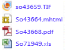

# <a name="lesson-3-defining-a-data-driven-subscription"></a>Lesson 3: Defining a Data-Driven Subscription
En esta lección del tutorial [!INCLUDE[ssRSnoversion_md](../includes/ssrsnoversion-md.md)] , usará las páginas de suscripción controlada por datos de los portales web de [!INCLUDE[ssRSnoversion](../includes/ssrsnoversion-md.md)] para conectarse a un origen de datos de suscripción, crear una consulta que recupere datos de suscripción y asignar el conjunto de resultados a las opciones de informe y entrega.  
  
> [!NOTE]  
> Antes de empezar, compruebe que el servicio del **Agente [!INCLUDE[ssNoVersion](../includes/ssnoversion-md.md)]** esté en ejecución. Si no es así, no podrá guardar la suscripción.  Un método para comprobarlo es abrir el [Administrador de configuración de SQL Server](../relational-databases/sql-server-configuration-manager.md).
En esta lección se supone que completó la lección 1 y la lección 2, y que el origen de datos del informe usa credenciales almacenadas.  Para obtener más información, consulte [Lección 2: Modificar las propiedades del origen de datos de informe](../reporting-services/lesson-2-modifying-the-report-data-source-properties.md)  
  
## <a name="bkmk_startwizard"></a>Iniciar el Asistente para suscripciones controladas por datos  
  
1.  En el portal web de [!INCLUDE[ssRSnoversion_md](../includes/ssrsnoversion-md.md)] , haga clic en **Inicio**y vaya hasta la carpeta que contiene el informe **Sales Orders** .  
  
2.  En el menú contextual  del informe, haga clic en **Administrar**y, después, haga clic en **Suscripciones** en el panel izquierdo.  
  
3.  Haga clic en **+ Nueva suscripción**. Si no ve este botón, no dispone de permisos para el Administrador de contenido. 
  
## <a name="define-a-description"></a>Definir una descripción  
1.  Escriba **Entrega de pedido de ventas** en la descripción.
## <a name="type"></a>Escriba
1.  Haga clic en **Suscripción controlada por datos**.  
## <a name="schedule"></a>Programación
1. En la sección de programación, haga clic en **Programación específica del informe**.
2. Haga clic en **Editar programación**.
3.  En **Detalles de programación**, haga clic en **Una vez**.  
4.  Especifique una hora de inicio que sea unos cuantos minutos después de la hora actual.  
5.  Haga clic en **Aplicar**.
## <a name="destination"></a>Destino  
1.  En la sección Destino, seleccione **Recurso compartido de archivos de Windows** para el método de entrega.  

## <a name="dataset"></a>Conjunto de datos
1. Haga clic en **Editar conjunto de datos**.
2. Seleccione **Un origen de datos personalizado**.
3. Seleccione **Microsoft SQL Server** como tipo de **Conexión** de origen de datos.
4. En Cadena de conexión, escriba la siguiente cadena de conexión. *Subscribers* es la base de datos que ha creado en la lección 1. 
  
    ```  
    data source=localhost; initial catalog=Subscribers
    ```
    
 ## <a name="credentials"></a>Credenciales
 1. Seleccione **Usar las siguientes credenciales**.
 2. Seleccione **Nombre de usuario y contraseña de Windows**.
 3.  En **Nombre de usuario** y **Contraseña**, escriba el nombre de usuario y la contraseña del dominio. Incluya tanto el dominio como la cuenta de usuario al especificar **Nombre de usuario**.
     > [!NOTE]  
    > Las credenciales usadas para conectarse a un origen de datos de suscriptor no se devuelven a [!INCLUDE[ssManStudio](../includes/ssmanstudio-md.md)]. Si modifica la suscripción más adelante, deberá volver a escribir la contraseña utilizada para conectarse al origen de datos.
## <a name="query"></a>Query      
1.  En el cuadro de consultas, escriba la consulta siguiente:  
  
    ```  
    Select * from OrderInfo  
    ```  
  
2.  Especifique un tiempo de espera de 30 segundos.  
  
3.  Haga clic en **Validar consulta**y luego en **Aplicar**.
## <a name="delivery-options"></a>Opciones de entrega
Rellene los siguientes valores:

Parámetro  |Origen del valor  | Valor/campo  
---------|---------|---------
**Nombre de archivo**     |Obtener valor de conjunto de datos | Pedido de     
**Ruta de acceso**     | Escribir valor  | En Valor, escriba el nombre de un recurso compartido de archivos público para el que disponga de permisos de escritura (por ejemplo, `\\mycomputer\public\myreports`). 
**Formato de representación** | Obtener valor de conjunto de datos | Formato
**Modo de escritura**| Escribir valor| Incremento automático    
**Extensión de archivo** |Escribir valor |True
**Nombre de usuario** | Escribir valor | Escriba su cuenta de usuario de dominio. Escríbalo con este formato: \<dominio>\\\<cuenta>. La cuenta de usuario tiene que disponer de permisos en la ruta de acceso que ha configurado. 
**Contraseña** | Escribir valor | Escribir la contraseña

## <a name="report-parameters"></a>Parámetros de informe
 1. En el campo **OrderNumber** , seleccione **Obtener valor del conjunto de datos**. En Valor, seleccione **Order**. 
 2. Haga clic en **Crear suscripción**.
   
## <a name="next-steps"></a>Pasos siguientes  
Cuando se ejecute la suscripción, se entregarán cuatro archivos de informe al recurso compartido de archivos que ha especificado, uno por cada pedido del origen de datos *Subscribers* . Cada entrega debe ser única en cuanto a datos (los datos deben ser específicos de cada pedido), formato de representación y formato de archivo. Puede abrir cada informe desde la carpeta compartida para comprobar que todas las versiones se hayan personalizado en función de las opciones de suscripción que haya definido.  
  
  
  
La página de suscripción del portal web contendrá la fecha de **Última ejecución** y el **Estado** de la suscripción. 
**Nota:** Actualice la página cuando la suscripción se ejecute para ver la información actualizada.  
    
  
  
Con este paso finaliza el tutorial "Definir una suscripción controlada por datos".   
  
## <a name="see-also"></a>Vea también  
[Suscripciones y entrega &#40;Reporting Services&#41;](../reporting-services/subscriptions/subscriptions-and-delivery-reporting-services.md)  
[Suscripciones controladas por datos](../reporting-services/subscriptions/data-driven-subscriptions.md)  
[Cómo crear, modificar y eliminar suscripciones controladas por datos](../reporting-services/subscriptions/create-modify-and-delete-data-driven-subscriptions.md)  
[Usar un origen de datos externo para obtener información de los suscriptores &#40;suscripción controlada por datos&#41;](../reporting-services/subscriptions/use-an-external-data-source-for-subscriber-data-data-driven-subscription.md)  
  
  
  

