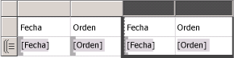
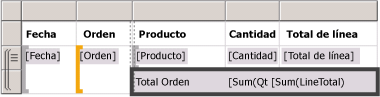
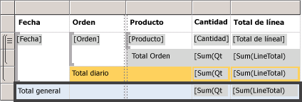
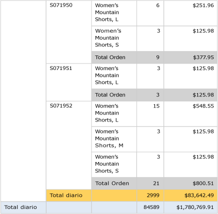

# Lesson 6: Adding Grouping and Totals (Reporting Services)
En esta lección del tutorial, agregará grupos y totales al informe de [!INCLUDE[ssRSnoversion](../includes/ssrsnoversion-md.md)] para organizar y resumir los datos.  
  
  
## Para agrupar datos en un informe  
  
1.  Haga clic en la pestaña **Diseño** .  
  
2.  Si no ve el panel **Grupos de filas** , haga clic con el botón derecho en la superficie de diseño y haga clic en **Ver** y en **Agrupar**.  
  
3.  En el panel **Datos de informe** , arrastre el campo **Date** hasta el panel **Grupos de filas** . Sitúelo encima de la fila denominada **(Details)**.
  
    Observe que el identificador de fila ahora tiene un corchete para mostrar un grupo. Ahora, la tabla también tiene dos columnas Date, una de ellas en uno de los dos extremos de una línea de puntos vertical.  
  
      
  
4.  En el panel **Datos de informe** , arrastre el campo **Order** hasta el panel **Grupos de filas** . Sitúelo debajo de Date y encima de **(Details)**.

   
  
    Note that the row handle now has two brackets in it , to show two groups. The table now has two **Order** columns, too.  
  
5.  Elimine las columnas **Date** y **Order** originales situadas a la **derecha** de la línea doble. Esta acción quita los valores de este registro para que solo se muestre el valor de grupo. Seleccione los identificadores de las dos columnas y haga clic con el botón derecho en **Eliminar columnas**.  
  
      
  
6.  Para dar formato a la nueva columna de fecha, haga clic con el botón derecho en la celda con la expresión de campo `[Date]` y, después, haga clic en **Propiedades de cuadro de texto**.  
  
7.  Haga clic en **Número**y luego, en el campo **Categoría** , haga clic en **Fecha**.  
  
8.  En el cuadro **Tipo** , seleccione **January 31, 2000**.  
  
9.  [!INCLUDE[clickOK](../includes/clickok-md.md)].  
  
10.  Cambie a la pestaña **Vista previa** para obtener la vista previa del informe. El aspecto deberá ser parecido al de la ilustración siguiente:  
     
  
## Para agregar totales a un informe  
  
1.  Cambie a la vista de diseño.  
  
2.  Haga clic con el botón derecho en la celda de la región de datos que contiene el campo `[LineTotal]`y haga clic en **Agregar total**.  
  
    Esto agrega una fila con la suma de los importes de los pedidos.  
  
3.  Haga clic con el botón derecho en la celda que contiene el campo `[Qty]`y haga clic en **Agregar total**.  
  
    Esto agrega la suma de los importes de los pedidos a la fila de totales.  
  
4.  En la celda vacía situada a la izquierda de `Sum[Qty]`, escriba la etiqueta "**Order Total**".  
  
5.  Puede agregar un color de fondo a la fila de totales. Seleccione las dos celdas que contienen las sumas y la celda con la etiqueta.  
  
6.  En el menú **Formato** , haga clic en **Color de fondo**y, a continuación, haga clic en **Gris claro**y en **Aceptar**.  
  
      
  
## Para agregar un total diario a un informe  
  
1.  Haga clic con el botón derecho en la celda **Order** , seleccione **Agregar total**y, luego, haga clic en **Después**.  
  
    Esto agrega una nueva fila que contiene las sumas de las cantidades y de los importes diarios, así como la etiqueta "**Total**" en la parte inferior de la columna Order.  
  
2.  Escriba la palabra **Daily** delante de la palabra **Total** en la misma celda, de modo que se lea **Daily Total**.  
  
3.  Seleccione la celda **Daily Total** , las dos celdas **Sum** y la celda que queda vacía entre ellas.  
  
4.  En el menú **Formato** , haga clic en **Color de fondo**, en **Anaranjado**y en **Aceptar**.  
  
      
  
## Para agregar un total general a un informe  
  
1.  Haga clic con el botón derecho en la celda Date, seleccione **Agregar total**y, luego, haga clic en **Después**.  
  
    Esto agrega una nueva fila que contiene las sumas de las cantidades y de los importes para el informe completo, así como la etiqueta **Total** en la columna **Date** .  
  
2.  Escriba la palabra **Grand** delante de la palabra **Total** en la misma celda, de modo que se lea **Grand Total**.  
  
3.  Seleccione la celda **Grand Total** , las dos celdas **Sum** y las celdas que quedan vacías entre ellas.  
  
4.  En el menú **Formato** , haga clic en **Color de fondo**y, a continuación, haga clic en **Azul claro**y en **Aceptar**.  
  
      
  
5.  Haga clic en **Vista previa**.  
  
    El aspecto de la última página deberá ser parecido al de la imagen siguiente. En la barra de herramientas, haga clic en Última página .   
  
      
  
## Para publicar el informe en el servidor de informes (opcional)  
  
1.  Un paso opcional consiste en publicar el informe completado en el servidor de informes en modo nativo para poder verlo en el portal web.  
  
2.  Haga clic en **Proyecto** y, después, haga clic en **Propiedades del tutorial...**  
  
3.  En **TargetServerURL** , escriba el nombre del servidor de informes, por ejemplo   
- `http:/<servername>/reportserver`  
   
- `http://localhost/reportserver` funciona si está diseñando el informe en el servidor de informes.  
  
  
4. Tenga en cuenta que TargetReportFolder es el tutorial, el nombre del proyecto.  Este es el nombre de la carpeta que en la que se implementará el informe en los pasos siguientes.  
5. Haga clic en **Aceptar**.  
  
6.  En el menú **Generar** , haga clic en **Deploy tutorial**(Implementar tutorial).  
  
    Si ve un mensaje similar al siguiente en la ventana de salida, indica que la implementación se realiza correctamente.  
  
    > ------ Compilación iniciada: proyecto: tutorial, configuración: depurar ------  
    > Omitiendo 'Sales Orders.rdl'. El elemento está actualizado.  
    > Generación completa -- 0 errores, 0 advertencias  
    > ------ Operación Implementar iniciada: proyecto: tutorial, configuración: depurar ------  
    > Implementando en http://[nombre del servidor]/reportserver  
    > Implementando el informe '/tutorial/Sales Orders'.  
    > Implementación completa -- 0 errores, 0 advertencias  
    > ========== Compilar: 1 correctos o actualizados, 0 incorrectos, 0 omitidos==========  
    > ========== Implementar: 1 correctos, 0 incorrectos, 0 omitidos==========  
  
    Si aparece un mensaje de error similar al siguiente, compruebe que dispone de permisos en el servidor de informes y que ha iniciado [!INCLUDE[ssBIDevStudio](../includes/ssbidevstudio-md.md)] con privilegios de administrador.  
  
    > "Los permisos concedidos al usuario 'XXXXXXXX\\[su nombre de usuario]" no son suficientes para realizar esta operación"  
  
7.  Vaya al portal web con privilegios de administrador, por ejemplo, haga clic con el botón derecho en el icono de Internet Explorer y haga clic en **Ejecutar como administrador**.  
  
    Vaya a la dirección URL del portal web de [!INCLUDE[ssRSnoversion_md](../includes/ssrsnoversion-md.md)] .   
    **Nota:** La dirección URL del *portal* es "Reports", no la dirección URL del *servidor* de informes de "Reportserver".  Por ejemplo:   
    - `http://<server name>/reports`.  
     - `http://localhost/reports` funciona si está diseñando el informe en el servidor de informes.  
  
8.  Vaya a la carpeta que contiene el informe. El nombre predeterminado es *tutorial*, el nombre del proyecto o el nombre que ha escrito en el campo TargetReportFolder en las propiedades del proyecto.   
Haga clic en el nombre del informe **Sales Orders** para verlo representado en el explorador.  
  
      
 
** Ha completado correctamente el tutorial Crear un informe de tabla básico.**  
  
## Ver también  
[Filtrar, agrupar y ordenar datos &#40;Generador de informes y SSRS&#41;](../reporting-services/report-design/filter-group-and-sort-data-report-builder-and-ssrs.md)  
  
  
  

