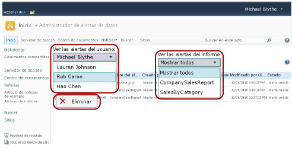

# Administrar todas las alertas de datos de un sitio de SharePoint en el Administrador de alertas de datos

[!INCLUDE[ssrs-appliesto](../includes/ssrs-appliesto.md)] [!INCLUDE[ssrs-appliesto-2016](../includes/ssrs-appliesto-2016.md)] [!INCLUDE[ssrs-appliesto-not-pbirsi](../includes/ssrs-appliesto-not-pbirs.md)] [!INCLUDE[ssrs-appliesto-sharepoint-2013-2016i](../includes/ssrs-appliesto-sharepoint-2013-2016.md)]

Los administradores de alertas de SharePoint pueden ver una lista de las alertas de datos creadas por los usuarios del sitio e información acerca de las alertas. Los administradores de alertas también pueden eliminar alertas. En la imagen siguiente se muestran las características disponibles para los administradores de alertas en el Administrador de alertas de datos.

 

> [!NOTE]
> La integración de Reporting Services con SharePoint ya no está disponible a partir de SQL Server 2016.

## Ver una lista de las alertas creadas por un usuario del sitio  
  
1.  Vaya al sitio de SharePoint donde se guardan las definiciones de alertas de datos.  
  
2.  En la página Inicio, haga clic en **Acciones del sitio**.  
  
3.  Desplácese a la parte inferior de la lista y haga clic en **Configuración del sitio**.  
  
4.  En **Reporting Services**, haga clic en **Administrar alertas de datos**.  
  
5.  Haga clic en la flecha hacia abajo situada junta a la lista **Ver las alertas del usuario** y seleccione el usuario cuyas alertas desea ver.  
  
6.  Haga clic en la flecha hacia abajo que aparece junto a la lista **Ver las alertas del informe** y seleccione la alerta específica que desea ver, o haga clic en **Mostrar todas** para ver todas las alertas creadas por el usuario seleccionado.  
  
     En una tabla se muestra el nombre de la alerta, el nombre del informe, el nombre de la persona que creó la alerta de datos, el número de veces que se envió la alerta de datos, la última vez que se modificó la definición de la alerta de datos y el estado de la alerta de datos. Si la alerta de datos no se puede generar o enviar, la columna de estado contiene información sobre el error que le ayudará a solucionar el problema.  
  
## Eliminar una definición de alerta  
  
-   Haga clic con el botón derecho en la alerta de datos que quiere eliminar y haga clic en **Eliminar**.  
  
    > [!NOTE]  
    >  Después de eliminar la alerta, no se envían más mensajes de alerta. Sin embargo, si consulta la base de datos de alertas puede que todavía exista la definición de la alerta. El servicio de alertas realiza limpiezas según una programación, y la definición de la alerta se eliminará definitivamente durante la limpieza siguiente. El intervalo de limpieza predeterminado es de 20 minutos. Este y otros intervalos de limpieza son configurables. Para obtener más información, vea [Alertas de datos de Reporting Services](../reporting-services/reporting-services-data-alerts.md).  

## Ver también

[Administrador de alertas de datos para administradores de alertas](../reporting-services/data-alert-manager-for-alerting-administrators.md)   
[Alertas de datos de Reporting Services](../reporting-services/reporting-services-data-alerts.md)  

¿Tiene alguna pregunta más? [Puede plantear sus dudas en el foro de Reporting Services](http://go.microsoft.com/fwlink/?LinkId=620231).
