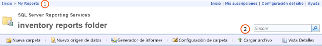

# Buscar y visualizar informes en el portal web (Generador de informes y SSRS)
  El Administrador de informes es una herramienta basada en Web que incluye características para la visualización y administración de informes. Forma parte de la instalación del servidor de informes. Para abrir el Administrador de informes, escriba su dirección URL en una ventana del explorador. Para obtener información sobre los requisitos del explorador, vea [Compatibilidad del explorador de Reporting Services y Power View](../../reporting-services/browser-support-for-reporting-services-and-power-view.md). Para obtener más información sobre cómo se podría configurar en su servidor de informes una dirección URL del Administrador de informes URL, póngase en contacto con el administrador del sistema. Para más información, vea [Configurar el Administrador de informes &#40;modo nativo&#41;](../../reporting-services/report-server/configure-report-manager-native-mode.md).  
  
 Los permisos que establece el administrador del sistema en el servidor de informes determinan lo que puede ver al utilizar Administrador de informes. Los permisos se conceden a través de la asignación de roles. Para poder buscar y ver informes, su asignación de roles debe incluir la tarea Ver informes. Para hallar un informe en un servidor de informes, búsquelo por nombre o por descripción, o desplácese por las carpetas del servidor de informes. Solo puede buscar o desplazarse a los informes que se han publicado o se han cargado en el servidor de informes. Para más información sobre cómo buscar un informe, vea [Buscar informes y otros elementos &#40;Generador de informes y SSRS&#41;](../../reporting-services/report-builder/searching-for-reports-and-other-items-report-builder-and-ssrs.md).  
  
> [!NOTE]  
>  [!INCLUDE[ssRBRDDup](../../includes/ssrbrddup-md.md)]  
  
## Navegar por la jerarquía de carpetas del Administrador de informes  
 Para examinar los informes que desea ejecutar, puede usar la página Inicio, que aparece automáticamente cuando se inicia el Administrador de informes y cuando se abre cualquier carpeta de la jerarquía de carpetas. La página Inicio solo muestra los elementos que tiene permiso para ver. La ruta de acceso de la carpeta se muestra como una fila de vínculos en la parte superior de la página Inicio. Los nombres de carpetas se muestran de forma secuencial, empezando por la carpeta raíz (Inicio). Cada vez que se abre una carpeta, se agrega su nombre a la ruta de acceso de la carpeta en la parte superior de la página. **(1)** en la imagen siguiente. Cuando se abre un informe, también se agrega su nombre a la ruta de acceso de la carpeta.  
  
   
Cinta de opciones del Administrador de informes  
  
 Utilice las siguientes técnicas para navegar por la jerarquía de carpetas:  
  
-   Para ver el contenido de una carpeta, haga clic en el nombre de la carpeta en la página Inicio. Se abre una página de carpeta en la que se muestra el contenido correspondiente.  
  
-   Para navegar hacia abajo por la jerarquía de carpetas, abra una subcarpeta de la carpeta actual. Las carpetas contienen informes, recursos, elementos de orígenes de datos compartidos y otras carpetas. Haga clic en un icono de carpeta para abrirla y ver así el contenido del nivel inferior de la jerarquía.  
  
-   Para navegar hacia arriba por la jerarquía de carpetas, en la fila de vínculos de la parte superior de la página, haga clic en el nombre de la carpeta cuyo contenido desee visualizar. **(1)** en la imagen anterior.  
  
## Abrir un informe  
 Cuando encuentre el informe que desea, haga clic en su nombre para abrirlo. El informe se representa en HTML y aparece en la página Contenido del Administrador de informes. La sesión de explorador se encarga de almacenar los informes en la memoria caché. De este modo, cuando abra un informe, podrá volver a él si hace clic en el botón **Atrás** . El método funciona incluso si el sistema le solicita un nombre de usuario y una contraseña para ejecutar el informe. Los informes representados no se cierran por completo hasta que se cierra el explorador.  
  
 No se tiene acceso inmediato a todos los informes visibles en la jerarquía de carpetas. Algunos pueden solicitarle un nombre de usuario y una contraseña para determinar si tiene derechos de acceso al origen de datos del informe. Para más información sobre cómo abrir informes en el Administrador de informes, vea [Abrir y cerrar un informe &#40;Administrador de informes&#41;](../../reporting-services/reports/open-and-close-a-report-report-manager.md).  
  
 Puede ir a un informe y abrirlo directamente desde el servidor de informes en el Generador de informes. Para más información, vea [Buscar informes y otros elementos &#40;Generador de informes y SSRS&#41;](../../reporting-services/report-builder/searching-for-reports-and-other-items-report-builder-and-ssrs.md).  
  
## Para buscar elementos  
  
-   Para buscar elementos en el Administrador de informes, escriba la cadena para buscar en el cuadro de texto **Buscar** que figura en la parte superior de la página. **(2)** en la imagen anterior. La búsqueda se inicia en el nodo superior de la jerarquía de carpetas y prosigue hacia abajo examinando cada rama. En caso de no tener permiso de acceso a una determinada rama, ésta se omite del proceso. Este comportamiento también es válido para las carpetas Mis informes que pertenecen a otros usuarios y para otras carpetas que no suelen estar disponibles. Los resultados de la búsqueda se limitan exclusivamente a los informes y los elementos para los que el usuario tiene permiso de visualización.  
  
-   Para buscar un elemento por nombre o descripción, especifique una parte del texto que desee que coincida o el texto completo. La cadena para buscar no distingue mayúsculas de minúsculas. Tenga en cuenta que no puede utilizar operadores de búsqueda como los signos más (+) o menos (–) para exigir o excluir criterios de búsqueda.  
  
-   Para buscar texto específico dentro de un informe, use la barra de herramientas situada en la parte superior del informe.  
  
## Vea también  
 [Buscar informes y otros elementos &#40;Generador de informes y SSRS&#41;](../../reporting-services/report-builder/searching-for-reports-and-other-items-report-builder-and-ssrs.md)   
 [Buscar, ver y administrar informes &#40;Generador de informes y SSRS&#41;](../../reporting-services/report-builder/finding-viewing-and-managing-reports-report-builder-and-ssrs.md)  
  
  
