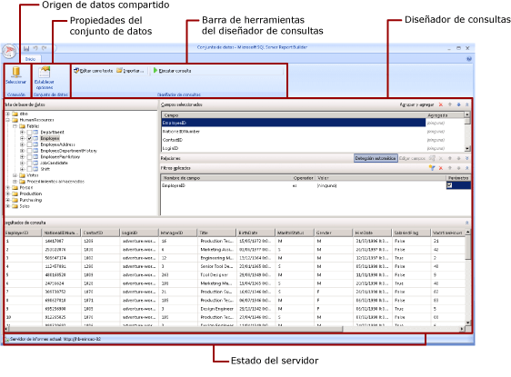

# Vista de diseño de conjunto de datos compartidos (Generador de informes)
  En un informe, un conjunto de datos representa los datos del informe que se devuelven como resultado de ejecutar una consulta en un origen de datos externo. Los conjuntos de datos compartidos se publican en un servidor de informes y se pueden usar en varios informes. Puede crear conjuntos de datos para compartirlos con otros usuarios. En la ventana de diseño de conjunto de datos compartido, puede seleccionar un origen de datos compartido, especificar las propiedades del conjunto de datos compartido y crear una consulta en el diseñador de consultas.  
  
   
  
 Para obtener más información sobre el trabajo con datos en un informe, vea [Conjuntos de datos de informe &#40;SSRS&#41;](../../reporting-services/report-data/report-datasets-ssrs.md).  
  
##   Cinta de opciones  
 La cinta de opciones le ayuda a buscar rápidamente los comandos que necesita para completar una tarea. Los comandos se organizan en los siguientes grupos lógicos: conexión, conjunto de datos y diseñador de consultas.  
  
### Conexión  
 Utilice el botón **Seleccionar** del grupo Conexión para seleccionar un origen de datos compartido en el informe o vaya a un origen de datos compartido en el servidor de informes.  
  
> [!NOTE]  
>  Un conjunto de datos compartido debe basarse en un origen de datos compartido. Si el origen de datos que necesita no está disponible, debe crear uno en el servidor de informes. Para más información, vea [Crear, modificar y eliminar orígenes de datos compartidos &#40;SSRS&#41;](../../reporting-services/report-data/create-modify-and-delete-shared-data-sources-ssrs.md).  
  
 Para más información, vea [Creación de cadenas de conexión de datos - Generador de informes y SSRS](../report-data/data-connections-data-sources-and-connection-strings-report-builder-and-ssrs.md).  
  
### Dataset  
 Utilice el botón **Establecer opciones** para establecer las propiedades del conjunto de datos compartido. Entre ellas, figuran:  
  
-   Campos. Puede agregar un campo o modificarlo en la colección de campos.  
  
-   Opciones de datos. Puede establecer opciones que afectan a los criterios de coincidencia y ordenación, como la distinción entre mayúsculas y minúsculas y la intercalación.  
  
-   Filtros. Puede definir filtros que limiten los datos de un informe una vez recuperados de la conexión de datos.  
  
-   Parámetros. Puede agregar un parámetro o editar las opciones de un parámetro. Por ejemplo, puede especificar un valor predeterminado para cada parámetro que le permita crear un plan de actualización de la memoria caché para este conjunto de datos compartido en el servidor de informes.  
  
 Los valores que establezca formarán parte de la definición de conjunto de datos compartido del servidor de informes. Cuando un autor incluya este conjunto de datos compartido en un informe, las opciones que especifique se aplicarán a esa instancia del conjunto de datos.  
  
 Una vez agregado un conjunto de datos compartido a un informe, los autores de informes podrán invalidar las siguientes opciones: intercalación, distinción entre mayúsculas y minúsculas, distinción de acentos, distinción de tipos de kana, distinción de ancho y subtotales. También podrán crear filtros de conjunto de datos adicionales para limitar los datos del informe.  
  
 Para más información, vea [Conjuntos de datos incrustados y compartidos de informe &#40;Generador de informes y SSRS&#41;](../../reporting-services/report-data/report-embedded-datasets-and-shared-datasets-report-builder-and-ssrs.md).  
  
 Para más información sobre los planes de actualización de la memoria caché, vea [Almacenar en caché conjuntos de datos compartidos &#40;SSRS&#41;](../../reporting-services/report-server/cache-shared-datasets-ssrs.md).  
  
### Diseñador de consultas  
 Utilice la barra de herramientas del diseñador de consultas como ayuda para crear una consulta que especifique qué datos deben recuperarse de la conexión de datos. La barra de herramientas que ve depende del diseñador de consultas que está asociado al tipo de origen de datos de la conexión de datos.  
  
 Para obtener más información, vea el tema que corresponde al tipo de origen de datos en [Agregar datos de orígenes de datos externos &#40;SSRS&#41;](../../reporting-services/report-data/add-data-from-external-data-sources-ssrs.md).  
  
  
##   Superficie del Diseñador de consultas  
 Un diseñador de consultas le ayuda a crear una consulta con la sintaxis que requiera el origen de datos externo.  
  
 Algunos tipos de origen de datos proporcionan un diseñador gráfico de consultas que puede utilizar para explorar los metadatos en un origen de datos externo. Puede arrastrar interactivamente los nombres del panel de metadatos hasta la superficie de diseño de la consulta o seleccionar de forma interactiva los nombres que desea utilizar.  
  
 Algunos tipos de origen de datos admiten un diseñador de consultas basado en texto que se puede usar para pegar consultas creadas con otras herramientas, como [!INCLUDE[ssManStudioFull](../../includes/ssmanstudiofull-md.md)].  
  
 Cada tipo de origen de datos tiene requisitos concretos para la consulta que funcionarán con el origen de datos externo. Para obtener más información, vea el tema que corresponde al tipo de origen de datos en [Agregar datos de orígenes de datos externos &#40;SSRS&#41;](../../reporting-services/report-data/add-data-from-external-data-sources-ssrs.md) y [Orígenes de datos admitidos por Reporting Services &#40;SSRS&#41;](../../reporting-services/report-data/data-sources-supported-by-reporting-services-ssrs.md).  
  
  
##   Ver los resultados de la consulta  
 En la vista de diseño del conjunto de datos compartido, se crean consultas que recuperarán datos de la conexión de datos cuando se procesen los informes.  
  
 Ejecute la consulta para ver los datos del ejemplo de la conexión de datos a fin de comprobar que la consulta devuelve el tipo de datos que espera. Las columnas del conjunto de resultados proceden de los metadatos de los esquemas de datos de la conexión de datos. Los nombres de columna se convierten en la colección de campos de conjunto de datos. Los valores de los datos que ve en el conjunto de resultados de la consulta son los datos del tiempo de diseño. Cuando se guarda el conjunto de datos como una definición de conjunto de datos compartido en el servidor de informes, solo se guarda el texto de consulta. Los datos del conjunto de resultados de la consulta no se guardan.  
  
 Cuando un autor de informes agregue este conjunto de datos compartido a un informe, se agregará un puntero a la definición de conjunto de datos en el servidor de informes. En el informe, la colección de campos de conjunto de datos aparece en el panel Datos de informe. El texto de la consulta no está disponible.  
  
 Las credenciales que se utilizan para ejecutar una consulta son independientes de las que se utilizan para ofrecer una vista previa de un informe o para ejecutarlo desde el servidor de informes. Para más información, consulte [Especificar información de credenciales y conexión para los orígenes de datos de informes](../../reporting-services/report-data/specify-credential-and-connection-information-for-report-data-sources.md).  
  
### Ejecutar un informe con parámetros  
 Cuando la consulta incluye variables, los parámetros del conjunto de datos se crean automáticamente. A su vez, al terminar de crear la consulta del conjunto de datos, los parámetros de informe que están establecidos en los parámetros de conjunto de datos se crean automáticamente.  
  
 Si un informe contiene parámetros, todos ellos deben tener valores predeterminados para que el informe se pueda ejecutar automáticamente. Si un parámetro no tiene un valor predeterminado, tendrá que elegir un valor al ejecutar el informe y, a continuación, hacer clic en **Ver informe** en la pestaña **Ejecutar** .  
  
 Para más información, vea [Parámetros de informe &#40;Generador de informes y Diseñador de informes&#41;](../../reporting-services/report-design/report-parameters-report-builder-and-report-designer.md).  
  
  
##   Guardar el conjunto de datos compartido  
 Para guardar la consulta creada, en el botón **Generador de informes** , haga clic en **Guardar** o en **Guardar como**. Navegue hasta la carpeta que corresponda del servidor de informes y guarde la definición del conjunto de datos compartido. El conjunto de datos compartido no estará disponible para otros usuarios hasta que no se guarde en el servidor de informes.  
  
  
## Consulte también  
 [Conjuntos de datos de informe &#40;SSRS&#41;](../../reporting-services/report-data/report-datasets-ssrs.md)   
 [Filtrar, agrupar y ordenar datos &#40;Generador de informes y SSRS&#41;](../../reporting-services/report-design/filter-group-and-sort-data-report-builder-and-ssrs.md)   
 [Parámetros de informe &#40;Generador de informes y Diseñador de informes&#41;](../../reporting-services/report-design/report-parameters-report-builder-and-report-designer.md)  
  
  
