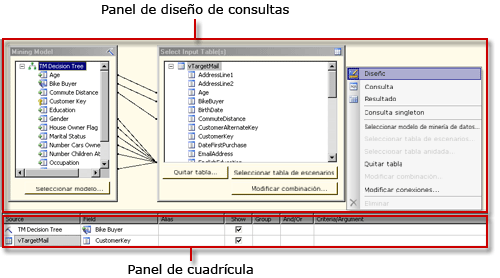
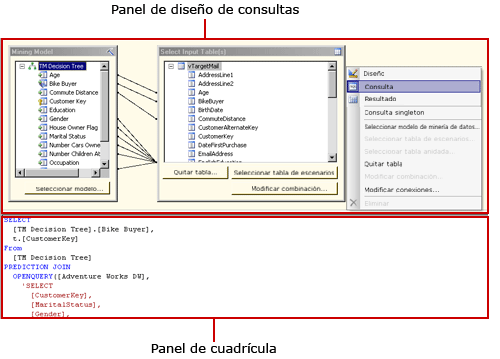
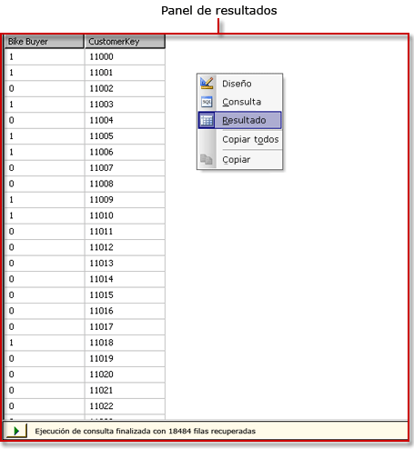

# Interfaz de usuario del Diseñador de consultas DMX de Analysis Services
  [!INCLUDE[ssRSnoversion](../../includes/ssrsnoversion-md.md)] proporciona diseñadores gráficos de consultas para crear consultas DMX (Expresiones de minería de datos) y consultas MDX (Expresiones multidimensionales) para un origen de datos de [!INCLUDE[ssASnoversion](../../includes/ssasnoversion-md.md)]. En este tema se describe el diseñador de consultas DMX. Para obtener más información acerca del diseñador de consultas MDX, vea [Analysis Services MDX Query Designer User Interface](../../reporting-services/report-data/analysis-services-mdx-query-designer-user-interface.md).  
  
 El diseñador gráfico de consultas DMX tiene tres modos: diseño, consulta y resultados. Para pasar de un modo a otro, haga clic con el botón secundario en el panel de diseño de consulta y seleccione el modo correspondiente. Cada modo proporciona un panel Metadatos desde el que puede arrastrar miembros de los cubos seleccionados para crear una consulta DMX; ésta recupera datos para un conjunto de datos al procesarse el informe.  
  
## Barra de herramientas del diseñador gráfico de consultas DMX  
 La barra de herramientas del diseñador de consultas proporciona botones que le ayudan a diseñar consultas DMX mediante la interfaz gráfica. En la tabla siguiente, se describen los botones y sus funciones.  
  
|Botón|Description|  
|------------|-----------------|  
|**Editar como texto**|Deshabilitado para este tipo de origen de datos.|  
|**Importar**|Importa una consulta existente desde un archivo de definición de informe (.rdl) del sistema de archivos. Para más información, vea [Conjuntos de datos incrustados y compartidos de informe &#40;Generador de informes y SSRS&#41;](../../reporting-services/report-data/report-embedded-datasets-and-shared-datasets-report-builder-and-ssrs.md).|  
||Cambia al modo del diseñador de consultas MDX.|  
||Cambia al modo del diseñador de consultas DMX.|  
||Actualiza los metadatos desde el origen de datos.|  
||Elimina la columna seleccionada en el panel Datos de la consulta.|  
||Muestra el cuadro de diálogo **Parámetros de consulta** . Si asigna un valor predeterminado a una variable, se crea un parámetro de informe correspondiente al cambiar a la vista Diseño del Diseñador de informes.|  
||Prepara la consulta.|  
||Alterna el modo de diseño y el modo de consulta. Para cambiar a la vista de resultados, haga clic con el botón derecho en el panel Diseño y elija **Resultado**.|  
  
## Diseñador gráfico de consultas DMX en modo de diseño  
 Cuando se edita un conjunto de datos que usa un origen de datos de [!INCLUDE[ssASnoversion](../../includes/ssasnoversion-md.md)] que no tiene ningún cubo válido, pero que sí tiene modelos de minería de datos válidos, se abre el diseñador gráfico de consultas en el modo de diseño. En la siguiente ilustración se indican los nombres de los paneles del modo de diseño.  
  
   
  
 En la siguiente tabla se describe la función de cada panel.  
  
|Panel|Función|  
|----------|--------------|  
|Panel de diseño de consulta|Utilice los cuadros de diálogo **Modelo de minería de datos** y **Seleccionar tabla(s) de entrada** para crear la consulta DMX.|  
|Panel Cuadrícula|En cada fila de la cuadrícula, use la lista desplegable **Origen** para seleccionar una función o una expresión, y elija los campos, los grupos y los criterios o los argumentos que se usarán en la consulta DMX. Para ver el texto de consulta DMX que generan las selecciones, haga clic en el botón **Modo de diseño** de la barra de herramientas.|  
  
 Para ejecutar la consulta DMX y mostrar los resultados en el panel Resultado, haga clic con el botón derecho en el panel de diseño de consulta y seleccione **Resultado**.  
  
## Diseñador gráfico de consultas DMX en modo de consulta  
 Para cambiar el diseñador gráfico de consultas al modo de consulta, haga clic en el botón **Modo de diseño** de la barra de herramientas, o bien haga clic con el botón derecho en la superficie de diseño de la consulta y elija **Consulta** en el menú contextual. Utilice este modo para escribir texto DMX directamente en el panel Consulta.  
  
 En la ilustración siguiente se indican los nombres de los paneles del modo de consulta.  
  
   
  
 En la siguiente tabla se describe la función de cada panel.  
  
|Panel|Función|  
|----------|--------------|  
|Panel de diseño de consulta|Utilice los cuadros de diálogo **Modelo de minería de datos** y **Seleccionar tabla(s) de entrada** para crear la consulta DMX.|  
|Panel de consulta|Vea o edite texto de consulta DMX directamente en el panel. Los cambios realizados en el texto de consulta DMX no se mantienen al volver a cambiar al modo de **diseño** .|  
  
 Para ejecutar la consulta DMX y mostrar los resultados en el panel Resultado, haga clic con el botón derecho en el panel de diseño de consulta y seleccione **Resultado**.  
  
## Diseñador gráfico de consultas DMX en modo de resultados  
 Para mostrar el modo de resultados, haga clic con el botón derecho en la superficie de diseño de la consulta y elija **Resultado** en el menú contextual. Cuando cambie al modo de resultados, la consulta DMX se ejecutará automáticamente.  
  
 En la siguiente ilustración se muestra el diseñador de consultas en modo de resultados.  
  
   
  
 Para volver al modo de diseño o de consulta, haga clic con el botón derecho en el panel Resultado y seleccione **Diseño** o **Consulta**.  
  
## Vea también  
 [Definir parámetros en el Diseñador de consultas MDX de Analysis Services &#40; El generador de informes y SSRS &#41;](../../reporting-services/report-data/define-parameters-in-the-mdx-query-designer-for-analysis-services.md)   
 [Crear un conjunto de datos compartido o conjunto de datos incrustado &#40; El generador de informes y SSRS &#41;](../../reporting-services/report-data/create-a-shared-dataset-or-embedded-dataset-report-builder-and-ssrs.md)   
 [Tipo de conexión de Analysis Services para DMX &#40; SSRS &#41;](../../reporting-services/report-data/analysis-services-connection-type-for-dmx-ssrs.md)   
 [Recuperar datos de un modelo de minería de datos &#40; DMX &#41; &#40; SSRS &#41;](../../reporting-services/report-data/retrieve-data-from-a-data-mining-model-dmx-ssrs.md)   
 [Archivo de configuración RSReportDesigner](../../reporting-services/report-server/rsreportdesigner-configuration-file.md)   
 [Tipo de conexión de Analysis Services para MDX &#40; SSRS &#41;](../../reporting-services/report-data/analysis-services-connection-type-for-mdx-ssrs.md)   
 [Tipo de conexión de Analysis Services para DMX &#40; SSRS &#41;](../../reporting-services/report-data/analysis-services-connection-type-for-dmx-ssrs.md)  
  
  
