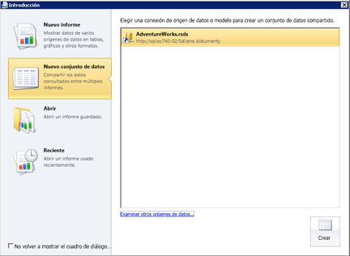

# Crear un conjunto de datos compartido o un conjunto de datos incrustado (Generador de informes y SSRS)
Los conjuntos de datos incrustados se usan en un único informe de [!INCLUDE[ssRSnoversion_md](../../includes/ssrsnoversion-md.md)] . Los conjuntos de datos compartidos en un servidor de informes se pueden usar en varios informes, tanto móviles como paginados. Para crear un conjunto de datos, necesita un origen de datos incrustado o compartido.  
  
## Tareas del Generador de informes

Use el Generador de informes para las tareas siguientes:  
  
1.  Crear un conjunto de datos compartido en la vista de diseño de conjunto de datos. Los conjuntos de datos compartidos deben usar orígenes de datos compartidos publicados.  
  
2.   Crear un conjunto de datos incrustado en la vista de diseño de informe.  
  
3.   Guardar el conjunto de datos directamente en el servidor de informes o el sitio de SharePoint.  
  
## Tareas del Diseñador de informes

Use el Diseñador de informes en [!INCLUDE[ssBIDevStudioFull](../../includes/ssbidevstudiofull-md.md)] para las tareas siguientes:  
  
1.  Crear un conjunto de datos compartido en el Explorador de soluciones. Los orígenes de datos compartidos deben usar orígenes de datos de la capeta Orígenes de datos compartidos en el Explorador de soluciones.  
  
2.  Crear un conjunto de datos compartido en el panel Datos de informe.  
  
3.  Opcionalmente, implementar los conjuntos de datos compartidos y el origen de datos compartido con el informe. Para cada tipo de elemento, use Propiedades del proyecto para especificar las rutas de acceso a las carpetas del servidor de informes o del sitio de SharePoint.  
  
 Para más información, vea [Conjuntos de datos incrustados y compartidos de informe &#40;Generador de informes y SSRS&#41;](../../reporting-services/report-data/report-embedded-datasets-and-shared-datasets-report-builder-and-ssrs.md).  
  
> [!NOTE]  
>  [!INCLUDE[ssRBRDDup](../../includes/ssrbrddup-md.md)]  
  
## Para crear un conjunto de datos compartido en el Generador de informes
  
1.  Abra el Generador de informes. Se abre el panel **Nuevo informe o conjunto de datos** , como se muestra en en la siguiente figura:  
  
       
  
    > [!NOTE]  
    >  Si el panel **Nuevo informe o conjunto de datos** no aparece, en el botón Generador de informes haga clic en **Nuevo**.  
  
2.  En el panel izquierdo, bajo **Crear un conjunto de datos**, haga clic en **Conjunto de datos compartido**.  
  
3.  En el panel derecho, haga clic en **Examinar** para seleccionar un origen de datos compartido del servidor de informes y, a continuación, haga clic en **Crear**. Se abre el diseñador de consultas asociado al origen de datos compartido.  
  
4.  En el diseñador de consultas, especifique los campos que se incluirán en el conjunto de datos.  
  
5.  Haga clic en **Ejecutar** ( **!** ) para ejecutar la consulta.  
  
6.  En el botón **Generador de informes** , haga clic en **Guardar** o **Guardar como** para guardar el conjunto de datos compartido en el servidor de informes.  
  
7.  Para salir del Generador de informes, haga clic en **Generador de informes**y, a continuación, haga clic en **Salir del Generador de informes**. Para trabajar con informes, haga clic en **Generador de informes**y haga clic en **Nuevo** o en **Abrir**.  
  
## Para establecer opciones de los parámetros de consultas  
  
1.  Abra el Generador de informes.  
  
2.  Haga clic en **Abrir**.  
  
3.  Vaya al servidor de informes y seleccione la carpeta para el origen de datos compartido.  
  
4.  En **Elementos de tipo**, haga clic en Datasets (*.rsd) en la lista desplegable.  
  
5.  Seleccione el conjunto de datos compartido y, a continuación, haga clic en **Abrir**. Se abre el diseñador de consultas asociado.  
  
6.  En la cinta de opciones, haga clic en **Propiedades del conjunto de datos**.  
  
7.  Haga clic en **Parámetros**. En esta página, establezca un valor predeterminado en una constante o expresión, marque el parámetro como de solo lectura o que admite valores NULL, o elija **Omitir en la consulta**. Para obtener más información, vea [Parámetros de informe (Generador de informes y Diseñador de informes)](../../reporting-services/report-design/report-parameters-report-builder-and-report-designer.md).  
  
8.  [!INCLUDE[clickOK](../../includes/clickok-md.md)]  

  
## Crear un conjunto de datos a partir de una base de datos relacional de SQL Server  
  
1.  En el panel Datos de informe, haga clic con el botón derecho en el nombre del origen de datos y, después, haga clic en **Agregar conjunto de datos**. Se abrirá la página **Consulta** del cuadro de diálogo **Propiedades del conjunto de datos** .  
  
2.  En **Nombre**, escriba un nombre para el conjunto de datos o acepte el nombre predeterminado.  
  
    > [!NOTE]  
    >  El nombre del conjunto de datos se utiliza internamente en el informe. Para evitar confusiones, se recomienda que el nombre del conjunto de datos describa los datos que devuelve la consulta.  
  
3.  En **Origen de datos**, busque el nombre de un origen de datos compartido existente y selecciónelo, o haga clic en **Nuevo** para crear un nuevo origen de datos incrustado.  
  
4.  Seleccione una opción en el cuadro **Tipo de consulta** . Las opciones de este cuadro dependen del tipo de origen de datos.  
  
    -   Seleccione **Text** para escribir una consulta con el lenguaje de consulta del origen de datos.  
  
    -   Seleccione **Table** para devolver todos los campos en una tabla de base de datos relacional.  
  
    -   Seleccione **StoredProcedure** para ejecutar un procedimiento almacenado por su nombre.  
  
5.  En **Consulta**, escriba la consulta, el procedimiento almacenado o el nombre de tabla. O bien, haga clic en **Diseñador de consultas** para abrir el diseñador gráfico de consultas o el diseñador de consultas basado en texto, o en **Importar** para importar la consulta desde un informe existente.  
  
     En algunos casos, la colección de campos especificada por la consulta solo se puede determinar ejecutando la consulta en el origen de datos. Por ejemplo, un procedimiento almacenado puede devolver un conjunto variable de campos en el conjunto de resultados. Haga clic en **Actualizar campos** para ejecutar la consulta en el origen de datos y recuperar los nombres de campo necesarios para rellenar la colección de campos del conjunto de datos en el panel Datos de informe. La colección de campos aparece bajo el nodo del conjunto de datos al cerrar el cuadro de diálogo **Propiedades del conjunto de datos** .  
  
6.  En **Tiempo de espera**, escriba el número de segundos que el servidor de informes esperará una respuesta de la base de datos. El valor predeterminado es 0 segundos. Si el tiempo de espera es 0 segundos, nunca se supera el tiempo de espera de la consulta.  
  
7.  [!INCLUDE[clickOK](../../includes/clickok-md.md)]  
  
     El conjunto de datos y su colección de campos aparecen en el panel Datos de informe bajo el nodo del origen de datos.  
  
## Consulte también  
 [Conjuntos de datos incrustados y compartidos de informe &#40;Generador de informes y SSRS&#41;](../../reporting-services/report-data/report-embedded-datasets-and-shared-datasets-report-builder-and-ssrs.md)   
 [Colección Campos del conjunto de datos &#40;Generador de informes y SSRS&#41;](../../reporting-services/report-data/dataset-fields-collection-report-builder-and-ssrs.md)   
 [Conjuntos de datos de informe &#40;SSRS&#41;](../../reporting-services/report-data/report-datasets-ssrs.md)   
 [Creación de cadenas de conexión de datos - Generador de informes y SSRS](data-connections-data-sources-and-connection-strings-report-builder-and-ssrs.md)   
 [Conjuntos de datos incrustados y compartidos &#40;Generador de informes y SSRS&#41;](../../reporting-services/report-data/embedded-and-shared-datasets-report-builder-and-ssrs.md)  
  
  
