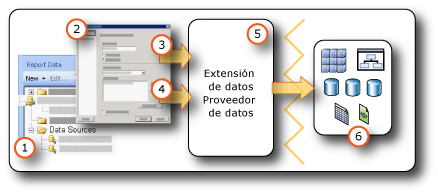

# <a name="data-connections-data-sources-and-connection-strings-report-builder-and-ssrs"></a>Conexiones de datos, orígenes de datos y cadenas de conexión (Generador de informes y SSRS)

[!INCLUDE [ssrs-appliesto](../../includes/ssrs-appliesto.md)] [!INCLUDE [ssrs-appliesto-2016-and-later](../../includes/ssrs-appliesto-2016-and-later.md)] [!INCLUDE[ssrs-appliesto-pbirsi](../../includes/ssrs-appliesto-pbirs.md)] [!INCLUDE[ssrs-appliesto-sharepoint-2013-2016i](../../includes/ssrs-appliesto-sharepoint-2013-2016.md)]

[!INCLUDE [ssrs-previous-versions](../../includes/ssrs-previous-versions.md)]

  Para incluir datos en informes paginados de [!INCLUDE[ssRBnoversion](../../includes/ssrbnoversion.md)] y  [!INCLUDE[ssRSnoversion](../../includes/ssrsnoversion-md.md)] , es preciso que antes cree *orígenes de datos* y *conjuntos de datos*. En este tema, se describe el tipo de orígenes de datos y cómo crear orígenes de datos, además se ofrece información importante relacionada con las credenciales de los orígenes de datos. Un origen de datos incluye el tipo de origen de datos, la información de conexión y el tipo de credenciales que se han de usar. Hay dos tipos de orígenes de datos: incrustados y compartidos. Un origen de datos incrustado se define en el informe y se usa solo en ese informe. Un origen de datos compartido se define independientemente de un informe y se puede usar en varios informes. Para más información, vea [Conjuntos de datos incrustados y compartidos &#40;Generador de informes y SSRS&#41;](../../reporting-services/report-data/embedded-and-shared-datasets-report-builder-and-ssrs.md).  

## <a name="data-in-includessrbnoversionincludesssrbnoversionmd"></a>Datos de [!INCLUDE[ssRBnoversion](../../includes/ssrbnoversion.md)]  
   
  
1.  **Orígenes de datos en el panel Datos de informe:** aparece un origen de datos en el panel Datos de informe después de crear un origen de datos incrustados o de agregar un origen de datos compartido.  
  
2.  **Cuadro de diálogo Conexión:** use el cuadro de diálogo Conexión para generar una cadena de conexión o para pegarla.  
  
3.  **Información de la conexión de datos:** la cadena de conexión se pasa a la extensión de datos.  
  
4.  **Credenciales:** las credenciales se administran de forma independiente de la cadena de conexión.  
  
5.  **Extensión de datos/Proveedor de datos:** la conexión a los datos se puede realizar mediante varios niveles de acceso a datos.  
  
6.  **Orígenes de datos externos** Se recuperan los datos de las bases de datos relacionales, las bases de datos multidimensionales, las listas de SharePoint, los servicios web o los modelos de informe.  

##  <a name="bkmk_data_sources"></a> Orígenes de datos incrustados y compartidos  
 Los orígenes de datos compartidos resultan útiles cuando se poseen orígenes de datos de uso frecuente. Se recomienda que utilice los orígenes de datos compartidos tanto como sea posible. Facilitan la administración de los informes y del acceso a ellos, y ayudan a mantener una mayor seguridad en el acceso a los informes y los orígenes de datos. Si necesita un origen de datos compartido, pida a su administrador del sistema que le cree uno.  
  
 Un origen de datos incrustado es una conexión de datos que se guarda en la definición de informe. La información de conexión a orígenes de datos insertados solo puede utilizarla el informe en el que se incrusta la información. Para definir y administrar los orígenes de datos insertados, utilice el cuadro de diálogo **Propiedades del origen de datos** .  
  
 La diferencia entre los orígenes de datos incrustados y compartidos es la manera en que se crean, almacenan y administran.  
  
-   En el Diseñador de informes, cree orígenes de datos incrustados o compartidos como parte de un proyecto de [!INCLUDE[ssBIDevStudioFull](../../includes/ssbidevstudiofull-md.md)] . Puede controlar si va a utilizarlos localmente para la obtención de una vista previa o implementarlos como parte del proyecto en un servidor de informes o un sitio de SharePoint. Puede utilizar las extensiones de datos personalizadas que se han instalado en el equipo y en el servidor de informes o un sitio de SharePoint donde se implementan los informes.  
  
     Los administradores del sistema pueden instalar y configurar extensiones de procesamiento de datos y proveedores de datos de .NET Framework adicionales. Para obtener más información, vea [Extensiones de procesamiento de datos y proveedores de datos de .NET Framework &#40;SSRS&#41;](../../reporting-services/report-data/data-processing-extensions-and-net-framework-data-providers-ssrs.md).  
  
     Los desarrolladores pueden usar la API de <xref:Microsoft.ReportingServices.DataProcessing> para crear extensiones de procesamiento de datos compatibles con tipos de orígenes de datos adicionales.  
  
-   En [!INCLUDE[ssRBnoversion](../../includes/ssrbnoversion.md)], desplácese a un servidor de informes o un sitio de SharePoint y seleccione orígenes de datos compartidos o cree orígenes de datos incrustados en el informe. No puede crear un origen de datos compartido en [!INCLUDE[ssRBnoversion](../../includes/ssrbnoversion.md)]. No puede utilizar extensiones de datos personalizadas en [!INCLUDE[ssRBnoversion](../../includes/ssrbnoversion.md)].  
  
 En la tabla siguiente se resumen las diferencias entre los orígenes de datos compartidos y los incrustados.  
  
|Descripción|Origen de datos<br /><br /> Origen de datos|Compartidos<br /><br /> Origen de datos|  
|-----------------|------------------------------|----------------------------|  
|La conexión de datos se incrusta en la definición de informe.|||  
|El puntero a la conexión de datos en el servidor de informes se incrusta en la definición de informe.|||  
|Se administra en el servidor de informes|||  
|Se requiere para los conjuntos de datos compartidos|||  
|Se requiere para los componentes|||  
  
##  <a name="bkmk_DataConnections"></a> Extensiones de datos integradas  
 Las extensiones de datos predeterminadas en [!INCLUDE[ssRSnoversion](../../includes/ssrsnoversion-md.md)] incluyen los siguientes tipos de conexiones de datos:  
  
-   Microsoft SQL Server y Microsoft Azure SQL Database
  
-   Microsoft SQL Server Analysis Services  
  
-   Lista de Microsoft SharePoint  
  
-   [!INCLUDE[ssSDSFull](../../includes/sssdsfull-md.md)]  
  
-   Almacenamiento de datos paralelo de Microsoft SQL Server  
  
-   OLE DB  
  
-   Oracle  
  
-   SAP NetWeaver BI  
  
-   Hyperion Essbase  
  
-   Teradata  
  
-   XML  
  
-   ODBC  
  
-   Modelo semántico de Microsoft BI para Power View: en un sitio de SharePoint que se haya configurado para una galería de [!INCLUDE[ssGemini](../../includes/ssgemini-md.md)] y [!INCLUDE[ssCrescent](../../includes/sscrescent-md.md)], está disponible este tipo de origen de datos. Este tipo de origen de datos solo se usa para presentaciones de [!INCLUDE[ssCrescent](../../includes/sscrescent-md.md)] . Para obtener más información, vea [Building the Perfect BI Semantic Tabular Models for Power View](https://technet.microsoft.com/video/building-the-perfect-bi-semantic-tabular-models-for-power-view.aspx).  
  
 Para obtener una lista completa de los orígenes de datos y las versiones que admite [!INCLUDE[ssRSnoversion](../../includes/ssrsnoversion-md.md)], vea [Orígenes de datos admitidos por Reporting Services &#40;SSRS&#41;](../../reporting-services/report-data/data-sources-supported-by-reporting-services-ssrs.md).  
  
##  <a name="bkmk_connection_examples"></a> Ejemplos de cadenas de conexión comunes  
 Las cadenas de conexión son la representación en texto de las propiedades de conexión para un proveedor de datos. En la tabla siguiente se muestran ejemplos de cadenas de conexión para diversos tipos de conexión.  
 
 > [!NOTE]  
>  [Connectionstrings.com](https://www.connectionstrings.com/) es otro recurso para obtener ejemplos de las cadenas de conexión. 
  
|**Data source**|**Ejemplo**|**Descripción**|  
|---------------------|-----------------|---------------------|  
|Base de datos de SQL Server en el servidor local|`data source="(local)";initial catalog=AdventureWorks`|Establezca el tipo de origen de datos en **Microsoft SQL Server**. Para obtener más información, vea [Tipo de conexión de SQL Server &#40;SSRS&#41;](../../reporting-services/report-data/sql-server-connection-type-ssrs.md).|  
|Instancia de SQL Server<br /><br /> Base de datos|`Data Source=localhost\MSSQL13.<InstanceName>; Initial Catalog=AdventureWorks`|Establezca el tipo de origen de datos en **Microsoft SQL Server**.|  
|Base de datos de SQL Server Express|`Data Source=localhost\MSSQL13.SQLEXPRESS; Initial Catalog=AdventureWorks`|Establezca el tipo de origen de datos en **Microsoft SQL Server**.|  
|Base de datos SQL de Azure|`Data Source=<host>;Initial Catalog=AdventureWorks; Encrypt=True`|Establezca el tipo de origen de datos en **Microsoft Azure SQL Database**. Para obtener más información, vea [Tipo de conexión SQL Azure &#40;SSRS&#41;](../../reporting-services/report-data/sql-azure-connection-type-ssrs.md).|  
|Almacenamiento de datos paralelo de SQL Server|`HOST=<IP address>;database= AdventureWorks; port=<port>`|Establezca el tipo de origen de datos en **Microsoft SQL Server Parallel Data Warehouse**. Para obtener más información, vea [Tipo de conexión Almacenamiento de datos paralelo de SQL Server &#40;SSRS&#41;](../../reporting-services/report-data/sql-server-parallel-data-warehouse-connection-type-ssrs.md).|  
|Base de datos de Analysis Services en el servidor local|`data source=localhost;initial catalog=Adventure Works DW`|Establezca el tipo de origen de datos en **Microsoft SQL Server Analysis Services**. Para más información, vea [Tipo de conexión de Analysis Services para MDX &#40;SSRS&#41;](../../reporting-services/report-data/analysis-services-connection-type-for-mdx-ssrs.md) o [Tipo de conexión de Analysis Services para DMX &#40;SSRS&#41;](../../reporting-services/report-data/analysis-services-connection-type-for-dmx-ssrs.md).|  
|Base de datos de modelo tabular de Analysis Services con una perspectiva Sales|`Data source=<servername>;initial catalog= Adventure Works DW;cube='Sales’`|Establezca el tipo de origen de datos en **Microsoft SQL Server Analysis Services**. Especifique el nombre de la perspectiva en la configuración cube=. Para más información, vea [Perspectivas &#40;SSAS tabular&#41;](../../analysis-services/tabular-models/perspectives-ssas-tabular.md).|  
|Origen de datos de modelo de informe en un servidor de informes configurado en modo nativo|`Server=https://myreportservername/reportserver; datasource=/models/Adventure Works`|Especifique la dirección URL del servidor de informes o de la biblioteca de documentos, y la ruta de acceso al modelo publicado en el espacio de nombres de la carpeta del servidor de informes o de la carpeta de la biblioteca de documentos. Para más información, vea [Conexión de modelo de informe &#40;SSRS&#41;](../../reporting-services/report-data/report-model-connection-ssrs.md).|  
|Origen de datos de modelo de informe en un servidor de informes configurado en el modo integrado de SharePoint|`Server=https://server; datasource=https://server/site/documents/models/Adventure Works.smdl`|Especifique la dirección URL del servidor de informes o de la biblioteca de documentos, y la ruta de acceso al modelo publicado en el espacio de nombres de la carpeta del servidor de informes o de la carpeta de la biblioteca de documentos.|  
|[!INCLUDE[ssNoVersion](../../includes/ssnoversion-md.md)] Servidor de [!INCLUDE[ssASnoversion](../../includes/ssasnoversion-md.md)] 2000|`provider=MSOLAP.2;data source=<remote server name>;initial catalog=FoodMart 2000`|Configure el tipo de origen de datos en **OLE DB Provider for OLAP Services 8.0**.<br /><br /> Puede conseguir una conexión más rápida a orígenes de datos de [!INCLUDE[ssNoVersion](../../includes/ssnoversion-md.md)] 2000 [!INCLUDE[ssASnoversion](../../includes/ssasnoversion-md.md)] si establece la propiedad **ConnectTo** en **8.0**. Para establecer esta propiedad, use la pestaña **Propiedades avanzadas** del cuadro de diálogo **Propiedades de conexión** .|  
|Servidor Oracle|`data source=myserver`|Configure el tipo de origen de datos en **Oracle**. También es necesario instalar las herramientas de cliente de Oracle tanto en el equipo del Diseñador de informes como en el servidor de informes. Para obtener más información, vea [Tipo de conexión de Oracle &#40;SSRS&#41;](../../reporting-services/report-data/oracle-connection-type-ssrs.md).|  
|Origen de datos SAP Netweaver BI|`DataSource=https://mySAPNetWeaverBIServer:8000/sap/bw/xml/soap/xmla`|Configure el tipo de origen de datos en **SAP NetWeaver BI**. Para obtener más información, vea [Tipo de conexión de SAP NetWeaver BI &#40;SSRS&#41;](../../reporting-services/report-data/sap-netweaver-bi-connection-type-ssrs.md).|  
|Origen de datos de Hyperion Essbase|`Data Source=https://localhost:13080/aps/XMLA; Initial Catalog=Sample`|Configure el tipo de origen de datos en **Hyperion Essbase**. Para obtener más información, vea [Tipo de conexión de Hyperion Essbase &#40;SSRS&#41;](../../reporting-services/report-data/hyperion-essbase-connection-type-ssrs.md).|  
|Origen de datos de Teradata|`data source=`\<NNN>.\<NNN>.\<NNN>.\<NNN>`;`|Configure el tipo de origen de datos en **Teradata**. La cadena de conexión es una dirección IP (protocolo de Internet) formada por cuatro campos, donde cada campo puede tener de uno a tres dígitos. Para más información, vea [Tipo de conexión de Teradata &#40;SSRS&#41;](../../reporting-services/report-data/teradata-connection-type-ssrs.md).|  
|Origen de datos de Teradata|`Database=` *\<nombre de la base de datos>* `; data source=` *\<NN*N *>.\<NNN>.\<NNN>.\<N*NN*>*`;Use X Views=False;Restrict to Default Database=True`|Establezca el tipo de origen de datos en **Teradata**, de modo similar a como se hizo en el ejemplo anterior. Usa solamente la base de datos predeterminada que se especifica en la etiqueta de la base de datos, sin detectar automáticamente las relaciones de los datos.|  
|Origen de datos XML, servicio web|`data source=https://adventure-works.com/results.aspx`|Configure el tipo de origen de datos en **XML**. La cadena de conexión es una dirección URL de un servicio web que admite el Lenguaje de definición de servicios web (WSDL). Para más información, vea [Tipo de conexión XML &#40;SSRS&#41;](../../reporting-services/report-data/xml-connection-type-ssrs.md).|  
|Origen de datos XML, documento XML|`https://localhost/XML/Customers.xml`|Configure el tipo de origen de datos en **XML**. La cadena de conexión es una dirección URL que lleva al documento XML.|  
|Origen de datos XML, documento XML incrustado|*Vacía*|Configure el tipo de origen de datos en **XML**. Los datos XML se incrustan en la definición de informe.|  
|Lista de SharePoint|`data source=https://MySharePointWeb/MySharePointSite/`|Establezca el tipo de origen de datos en **SharePoint List**.|  
  
 Si no puede conectarse con un servidor de informes mediante **localhost**, compruebe que se haya habilitado el protocolo de red TCP/IP. Para obtener más información, consulte [Configure Client Protocols](../../database-engine/configure-windows/configure-client-protocols.md).  
  
 Para obtener más información sobre las configuraciones necesarias para conectar con estos tipos de orígenes de datos, vea el tema sobre conexiones de datos específicas en [Agregar datos de orígenes de datos externos &#40;SSRS&#41;](../../reporting-services/report-data/add-data-from-external-data-sources-ssrs.md) y [Orígenes de datos admitidos por Reporting Services &#40;SSRS&#41;](../../reporting-services/report-data/data-sources-supported-by-reporting-services-ssrs.md).  
  
##  <a name="bkmk_special_password_characters"></a> Caracteres especiales en una contraseña  
 Si configura el origen de datos ODBC o SQL para que le solicite una contraseña o la incluya en la cadena de conexión y un usuario especifica una contraseña con caracteres especiales, como por ejemplo signos de puntuación, algunos controladores de origen de datos subyacentes no podrán validar los caracteres especiales. Cuando procese el informe, es posible que aparezca un mensaje para indicarle que la contraseña no es válida. Si cambiar la contraseña resulta poco práctico, hable con el administrador de la base de datos para almacenar las credenciales adecuadas en el servidor como parte de un nombre del origen de datos OBDC (DSN) del sistema. Para obtener información, vea "OdbcConnection.ConnectionString" en la documentación de [!INCLUDE[dnprdnshort](../../includes/dnprdnshort-md.md)] SDK.  
  
##  <a name="bkmk_Expressions_in_connection_strings"></a> Cadenas de conexión basadas en expresiones  
 Las cadenas de conexión basadas en expresiones se evalúan en tiempo de ejecución. Por ejemplo, puede especificar el origen de datos como un parámetro, incluir la referencia de parámetro en la cadena de conexión y permitir al usuario elegir un origen de datos para el informe. Por ejemplo, imagine que una empresa multinacional tiene servidores de datos en varios países. Con una cadena de conexión basada en una expresión, un usuario que ejecute un informe de ventas puede seleccionar un origen de datos para un país determinado antes de ejecutar el informe.  
  
 El ejemplo siguiente ilustra el uso de una expresión de origen de datos en una cadena de conexión de [!INCLUDE[ssNoVersion](../../includes/ssnoversion-md.md)] . En el ejemplo se da por hecho que se ha creado un parámetro de informe denominado `ServerName`:  
  
```  
="data source=" & Parameters!ServerName.Value & ";initial catalog=AdventureWorks"  
```  
  
 Las expresiones de origen de datos se procesan en tiempo de ejecución o cuando se genera una vista previa del informe. La expresión debe estar escrita en [!INCLUDE[vbprvb](../../includes/vbprvb-md.md)]. Use las directrices siguientes cuando defina una expresión de origen de datos:  
  
-   Diseñe el informe usando una cadena de conexión estática. Una cadena de conexión estática es una cadena de conexión que no se ha establecido mediante una expresión (por ejemplo, cuando sigue lo pasos para crear un origen de datos específico para el informe o compartido, está definiendo una cadena de conexión estática). Usar una cadena de conexión estática permite conectarse al origen de datos en el Diseñador de informes, de forma que puede obtener los resultados de la consulta que necesita para crear el informe.  
  
-   Cuando defina una conexión de origen de datos, no use un origen de datos compartido. No es posible usar una expresión de origen de datos en un origen de datos compartido. Deberá definir un origen de datos incrustado para el informe.  
  
-   Especifique las credenciales independientemente de la cadena de conexión. Puede utilizar credenciales almacenadas, credenciales solicitadas o seguridad integrada.  
  
-   Agregue un parámetro de informe para especificar un origen de datos. Para los valores de parámetro, puede proporcionar una lista estática de valores disponibles (en este caso, los valores disponibles deben ser orígenes de datos que pueda usar con el informe) o definir una consulta que recupere una lista de orígenes de datos en tiempo de ejecución.  
  
-   Asegúrese de que la lista de orígenes de datos comparta el mismo esquema de la base de datos. El diseño de un informe empieza con la información de esquema. Si el esquema utilizado para definir el informe y el esquema real utilizado por el informe en tiempo de ejecución no coinciden, es posible que el informe no se ejecute.  
  
-   Antes de publicar el informe, reemplace la cadena de conexión estática con una expresión. Espere hasta que haya finalizado de diseñar el informe para reemplazar la cadena de conexión estática con una expresión. Una vez que use una expresión, no podrá ejecutar la consulta en el Diseñador de informes. Además, la lista de campos del panel Datos de informe y la lista Parámetros no se actualizarán de forma automática.  

## <a name="next-steps"></a>Pasos siguientes

[Creación, modificación y eliminación de orígenes de datos compartidos](../../reporting-services/report-data/create-modify-and-delete-shared-data-sources-ssrs.md)   
[Creación y modificación de orígenes de datos incrustados](../../reporting-services/report-data/create-and-modify-embedded-data-sources.md)   
[Establecimiento de propiedades de implementación](../../reporting-services/tools/set-deployment-properties-reporting-services.md)   
[Especificación de información de credenciales y conexión para los orígenes de datos de informes](../../reporting-services/report-data/specify-credential-and-connection-information-for-report-data-sources.md)  

¿Tiene alguna pregunta más? [Puede plantear sus dudas en el foro de Reporting Services](https://go.microsoft.com/fwlink/?LinkId=620231).
