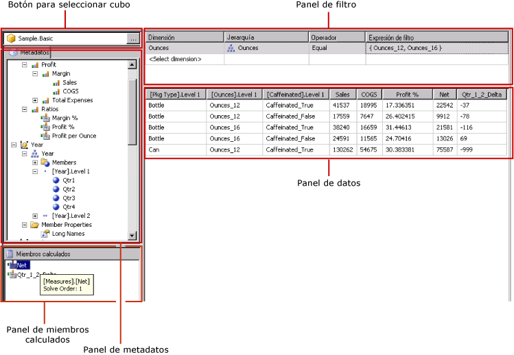
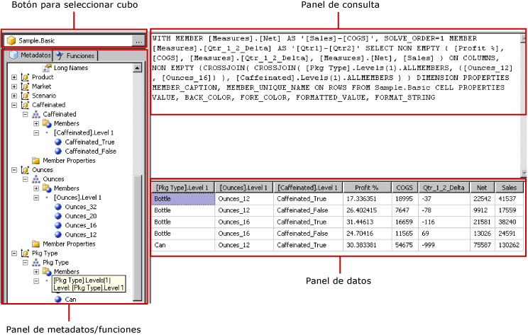

# Interfaz de usuario del Diseñador de consultas de Hyperion Essbase
  [!INCLUDE[ssRSnoversion](../../includes/ssrsnoversion-md.md)] proporciona un diseñador gráfico de consultas que permite crear consultas MDX (expresiones multidimensionales) para un origen de datos de [!INCLUDE[extEssbase](../../includes/extessbase-md.md)] . El diseñador gráfico de consultas MDX tiene dos modos: modo de diseño y modo de consulta. Cada modo proporciona un panel de metadatos desde el que puede arrastrar miembros de un cubo definido en el origen de datos para crear una consulta MDX que recupere datos cuando se procese el informe.  
  
> [!IMPORTANT]  
>  Los usuarios tienen acceso a los orígenes de datos cuando crean y ejecutan las consultas. Debe conceder permisos mínimos para los orígenes de datos, por ejemplo permisos de solo lectura.  
  
 Para más información sobre cómo trabajar con un origen de datos multidimensionales de [!INCLUDE[extEssbase](../../includes/extessbase-md.md)], vea [Tipo de conexión Hyperion Essbase &#40;SSRS&#41;](../../reporting-services/report-data/hyperion-essbase-connection-type-ssrs.md).  
  
 En esta sección se describen los botones de la barra de tareas y los paneles del diseñador para cada modo del diseñador gráfico de consultas.  
  
## Diseñador gráfico de consultas en modo de diseño  
 Al editar una consulta MDX para un conjunto de datos que usa un origen de datos de [!INCLUDE[extEssbase](../../includes/extessbase-md.md)] , el diseñador gráfico de consultas se abre en el modo de diseño.  
  
 En la siguiente ilustración se indican los nombres de los paneles del modo de diseño.  
  
   
  
 En la tabla siguiente, aparecen los paneles de este modo.  
  
|Panel|Función|  
|----------|--------------|  
|Botón Selección de cubo|Muestra el cubo seleccionado actualmente.|  
|Panel Metadatos|Muestra una lista jerárquica de cubos.|  
|Panel Miembros calculados|Muestra los miembros calculados definidos actualmente que se encuentran disponibles para utilizarse en la consulta.|  
|Panel Filtro|Muestra los filtros que se van a aplicar a la consulta.|  
|Panel Datos|Muestra los resultados de la ejecución de la consulta.|  
  
 Puede arrastrar dimensiones y medidas desde el panel Metadatos, y miembros calculados desde el panel Miembros calculados hasta el panel Datos. Si el botón de alternancia **Ejecución automática** de la barra de herramientas está activado, el diseñador de consultas ejecuta la consulta cada vez que coloque un objeto en el panel Datos. Si **Ejecución automática** está desactivado, el diseñador de consultas no ejecuta la consulta cuando realice cambios en el panel Datos. Puede ejecutar la consulta manualmente mediante el botón **Ejecutar** de la barra de herramientas.  
  
 En el panel Filtro, puede seleccionar valores de dimensión para limitar los datos recuperados desde el origen de datos. Los valores que defina en el modo de diseño aparecerán en la cláusula WHERE de MDX en el modo de consulta.  
  
### Barra de herramientas del diseñador gráfico de consultas en la barra de herramientas del modo de diseño  
 La barra de herramientas del diseñador de consultas proporciona botones que le ayudan a diseñar consultas MDX mediante la interfaz gráfica. En la tabla siguiente se muestran los botones y se describen sus funciones.  
  
|Botón|Description|  
|------------|-----------------|  
|**Editar como texto**|Alterna entre el diseñador de consultas basado en texto y el diseñador gráfico de consultas. No está disponible para este tipo de origen de datos.|  
|**Importar**|Importa una consulta existente desde un archivo de definición de informe (.rdl) del sistema de archivos. Para obtener más información, vea [Conjuntos de datos incrustados y compartidos de informe &#40;Generador de informes y SSRS&#41;](../../reporting-services/report-data/report-embedded-datasets-and-shared-datasets-report-builder-and-ssrs.md).|  
||Actualiza los metadatos desde el origen de datos.|  
||Muestra el cuadro de diálogo **Generador de miembros calculados** . Use este cuadro de diálogo para crear o editar expresiones para un miembro calculado, incluido el establecimiento de la propiedad **Orden de resolución** .|  
||Muestra y oculta las celdas vacías del panel Datos. Esto equivale a utilizar la cláusula NON EMPTY en MDX.|  
||Ejecuta automáticamente la consulta y muestra el resultado cada vez que se realice un cambio, por ejemplo al eliminar una columna en el panel Datos. Los resultados se mostrarán en el panel Datos.|  
||Elimina el elemento seleccionado de la consulta. Use este botón para eliminar las filas seleccionadas en el panel Filtro.|  
||Ejecuta la consulta y muestra los resultados en el panel Datos.|  
||Cancela la consulta.|  
||Alterna el modo de diseño y el modo de consulta.|  
  
## Diseñador gráfico de consultas en modo de consulta  
 Para cambiar el diseñador gráfico de consultas al modo de consulta, haga clic en el botón de alternancia **Modo de diseño** de la barra de herramientas. En la siguiente ilustración se indican las partes del diseñador de consultas en el modo de consulta.  
  
   
  
 En la siguiente tabla se describe la función de cada panel.  
  
|Panel|Función|  
|----------|--------------|  
|Botón Selección de cubo|Muestra el cubo seleccionado actualmente.|  
|Panel Metadatos/Funciones|Muestra una ventana con pestañas que muestra una lista de metadatos o funciones disponibles para utilizarse en la creación de texto de consulta.|  
|Panel de consulta|Muestra el texto de consulta actual.|  
|Panel Resultado|Muestra los resultados de la consulta.|  
  
 En el panel Metadatos, puede arrastrar medidas y dimensiones desde la pestaña **Metadatos** hasta el panel Consulta MDX. Puede arrastrar funciones desde la pestaña **Funciones** hasta el panel Consulta MDX. Cuando ejecute la consulta, en el panel Resultado se mostrarán los resultados de la consulta MDX actual.  
  
### Barra de herramientas del diseñador gráfico de consultas en el modo de consulta  
 La barra de herramientas del diseñador de consultas proporciona botones que le ayudan a diseñar consultas MDX mediante la interfaz gráfica. Los botones de la barra de herramientas son idénticos en los modos de diseño y de consulta. Sin embargo, los siguientes botones no están habilitados para el modo de consulta:  
  
-   **Editar como texto**  
  
-   **Agregar miembro calculado** ()  
  
-   **Mostrar celdas vacías** ()  
  
-   **Ejecución automática** ()  
  
## Vea también  
 [Crear un conjunto de datos compartido o un conjunto de datos incrustado &#40;Generador de informes y SSRS&#41;](../../reporting-services/report-data/create-a-shared-dataset-or-embedded-dataset-report-builder-and-ssrs.md)   
 [Archivo de configuración RSReportDesigner](../../reporting-services/report-server/rsreportdesigner-configuration-file.md)  
  
  
