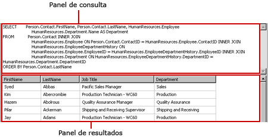
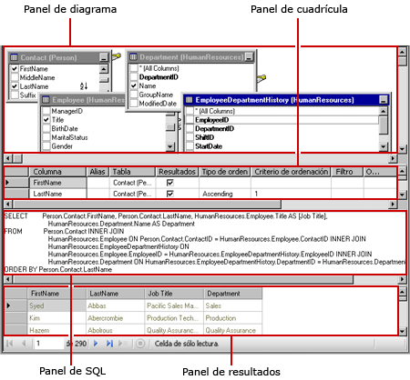
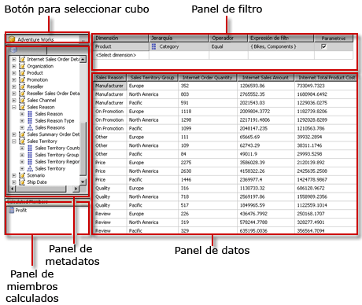

# Herramientas de diseño de consulta (SSRS)
  [!INCLUDE[ssRSnoversion](../../includes/ssrsnoversion-md.md)] ofrece varias herramientas de diseño de consultas que puede usar para crear consultas de conjuntos de datos en el Diseñador de consultas. Algunos diseñadores de consultas ofrecen modos alternativos que le permiten elegir entre trabajar en modo visual o directamente en el idioma de la consulta. En este tema se presentan todas las herramientas y se describe el tipo de origen de datos que admite cada una de ellas. En esta sección se describen las siguientes herramientas:  
  
-   [Diseñador de consultas basado en texto](#Textbased)  
  
-   [Diseñador gráfico de consultas](#Graphical)  
  
-   [Diseñador de consultas de modelo de informe](#Model)  
  
-   [Diseñador de consultas MDX](#MDX)  
  
-   [Diseñador de consultas DMX](#DMX)  
  
-   [Diseñador de consultas de Sap NetWeaver BI](#SAPBW)  
  
-   [diseñador de consultas de Hyperion Essbase](#Hyperion)  
  
 Todas las herramientas de diseño de consultas se ejecutan en el entorno de diseño de datos de [!INCLUDE[ssBIDevStudioFull](../../includes/ssbidevstudiofull-md.md)] cuando se trabaja con una plantilla de proyecto del servidor de informes o del Asistente de proyectos de servidor de informes. Para obtener más información sobre cómo trabajar con diseñadores de consultas, vea [Reporting Services Query Designers](https://msdn.microsoft.com/library/07efd3f1-804f-45f7-b62a-3e727a3d9835).  
  
 El tipo de origen de datos con el que trabaje determinará la disponibilidad de un diseñador de consultas concreto.  
  
 Las extensiones de datos de [!INCLUDE[ssRSnoversion](../../includes/ssrsnoversion-md.md)] instaladas en el cliente o en el servidor de informes determinan los tipos de origen de datos disponibles en el informe. Para más información, vea [Archivo de configuración RSReportDesigner](../../reporting-services/report-server/rsreportdesigner-configuration-file.md) y [Archivo de configuración RsReportServer.config](../../reporting-services/report-server/rsreportserver-config-configuration-file.md).  
  
 Una extensión de procesamiento de datos y el diseñador de consultas asociado pueden diferir en el soporte de orígenes de datos de las maneras siguientes:  
  
-   **El tipo de diseñador de consultas.** Por ejemplo, un origen de datos de [!INCLUDE[ssNoVersion](../../includes/ssnoversion-md.md)] admite ambos tipos de diseñadores de consultas.  
  
-   **La variación del lenguaje de consulta.** Por ejemplo, la sintaxis de un lenguaje de consulta como [!INCLUDE[tsql](../../includes/tsql-md.md)] puede variar según el tipo de origen de datos. La sintaxis de los comandos de consulta del lenguaje [!INCLUDE[msCoName](../../includes/msconame-md.md)] [!INCLUDE[tsql](../../includes/tsql-md.md)] difiere ligeramente de la del lenguaje SQL de Oracle.  
  
-   **La compatibilidad con la parte de esquema de un nombre de objeto de base de datos.** Si un origen de datos usa esquemas como parte del identificador del objeto de base de datos, el nombre del esquema se debe proporcionar como parte de la consulta para todos los nombres que no usen el esquema predeterminado. Por ejemplo, `SELECT FirstName, LastName FROM [Person].[Person]`.  
  
-   **La compatibilidad con los parámetros de consulta.** Los proveedores de datos varían en lo que respecta a la compatibilidad para los parámetros. Algunos proveedores de datos admiten parámetros con nombre (por ejemplo, `SELECT Col1, Col2 FROM Table WHERE <parameter identifier><parameter name> = <value>`). Algunos proveedores de datos admiten parámetros sin nombre (por ejemplo, `SELECT Col1, Col2 FROM Table WHERE <column name> = ?`). El identificador de parámetros puede variar según el proveedor de datos; por ejemplo, [!INCLUDE[ssNoVersion](../../includes/ssnoversion-md.md)] usa el símbolo de arroba (@) y Oracle usa los dos puntos (:). Algunos proveedores de datos no admiten parámetros.  
  
-   **La capacidad de importar consultas.** Por ejemplo, para un origen de datos de [!INCLUDE[ssNoVersion](../../includes/ssnoversion-md.md)] , puede importar una consulta desde un archivo de definición de informe (.rdl) o un archivo .sql.  
  
##   Diseñador de consultas basado en texto  
 El diseñador de consultas basado en texto es la herramienta predeterminada de creación de consultas para la mayoría de los orígenes de datos relacionales admitidos, incluidos [!INCLUDE[msCoName](../../includes/msconame-md.md)] [!INCLUDE[ssNoVersion](../../includes/ssnoversion-md.md)], Oracle, Teradata, OLE DB, XML y ODBC. A diferencia del diseñador gráfico de consultas, esta herramienta de diseño de consultas no valida la sintaxis de las mismas durante su diseño. En la imagen siguiente se ilustra el diseñador de consultas basado en texto.  
  
   
  
 El diseñador de consultas basado en texto se recomienda para crear consultas complejas, usar procedimientos almacenados, realizar consultas en datos XML y escribir consultas dinámicas. Según el origen de datos, es posible que pueda alternar el botón **Editar como texto** de la barra de herramientas para cambiar entre el diseñador gráfico de consultas y el diseñador de consultas basado en texto. Para más información, vea [Interfaz de usuario del Diseñador de consultas basado en texto](https://msdn.microsoft.com/library/44b7c664-03aa-494e-a484-052b318e810c).  
  
##   Diseñador gráfico de consultas  
 El diseñador gráfico de consultas se utiliza para crear o modificar consultas de [!INCLUDE[tsql](../../includes/tsql-md.md)] que se ejecutan con una base de datos relacional. Esta herramienta de diseño de consultas se utiliza en varios productos de [!INCLUDE[msCoName](../../includes/msconame-md.md)] y en otros componentes de [!INCLUDE[ssNoVersion](../../includes/ssnoversion-md.md)] . Dependiendo del tipo de origen de datos, admite los modos Text, StoredProcedure y TableDirect. En la imagen siguiente se ilustra el diseñador gráfico de consultas.  
  
   
  
 Puede alternar el botón **Editar como texto** en la barra de herramientas para cambiar entre el diseñador gráfico de consultas y el diseñador de consultas basado en texto. Para más información, consulte [Graphical Query Designer User Interface](../../reporting-services/report-data/graphical-query-designer-user-interface.md).  
  
##   Diseñador de consultas de modelo de informe  
 El diseñador de consultas de modelo de informe se usa para crear o modificar las consultas que se ejecutan en un modelo de informe SMDL que se ha publicado en un servidor de informes. Los informes que se ejecutan en modelos admiten la exploración de datos click-through. La consulta determina la ruta de exploración de datos en tiempo de ejecución. En la imagen siguiente se ilustra el diseñador de consultas del Modelo de informes.  
  
   
  
 Para utilizar el diseñador de consultas de modelo de informe, debe definir un origen de datos que señale a un modelo publicado. Al definir un conjunto de datos para el origen de datos, puede abrir la consulta del conjunto de datos en el diseñador de consultas de modelo de informe. El diseñador de consultas de modelo de informe puede utilizarse en los modos gráfico o basado en texto. Puede alternar el botón **Editar como texto** en la barra de herramientas para cambiar entre el diseñador gráfico de consultas y el diseñador de consultas basado en texto. Para más información, consulte [Report Model Query Designer User Interface](../../reporting-services/report-data/report-model-query-designer-user-interface.md).  
  
##   Diseñador de consultas MDX  
 El diseñador de consultas de expresiones multidimensionales (MDX) se usa para crear o modificar las consultas que se ejecutan en un origen de datos de [!INCLUDE[ssASnoversion](../../includes/ssasnoversion-md.md)] con cubos multidimensionales. En la imagen siguiente se muestra una ilustración del diseñador de consultas MDX después de haber definido la consulta y el filtro.  
  
   
  
 Para utilizar el diseñador de consultas MDX, debe definir un origen de datos que tenga un cubo de Analysis Services disponible que sea válido y se haya procesado. Al definir un conjunto de datos para el origen de datos, puede abrir la consulta en el diseñador de consultas MDX. Si es necesario, utilice los botones MDX y DMX en la barra de herramientas para cambiar entre los modos MDX y DMX. Para más información, consulte [Analysis Services MDX Query Designer User Interface](../../reporting-services/report-data/analysis-services-mdx-query-designer-user-interface.md).  
  
##   Diseñador de consultas DMX  
 El diseñador de consultas de expresiones de predicción de minería de datos (DMX) se utiliza para crear o modificar consultas que se ejecutan en un origen de datos de [!INCLUDE[ssASnoversion](../../includes/ssasnoversion-md.md)] con modelos de minería de datos. La imagen siguiente proporciona una ilustración del diseñador de consultas DMX una vez seleccionadas las tablas de entrada y modelo.  
  
   
  
 Para utilizar el diseñador de consultas DMX, debe definir un origen de datos que tenga disponible un modelo de minería de datos válido. Al definir un conjunto de datos para el origen de datos, puede abrir la consulta en el diseñador de consultas DMX. Si es necesario, utilice los botones MDX y DMX en la barra de herramientas para cambiar entre los modos MDX y DMX. Después de seleccionar el modelo, puede crear consultas de predicción de minería de datos que proporcionen datos para un informe. Para más información, consulte [Interfaz de usuario del Diseñador de consultas DMX de Analysis Services](../../reporting-services/report-data/analysis-services-dmx-query-designer-user-interface.md).  
  
##   Diseñador de consultas de Sap NetWeaver BI  
 El diseñador de consultas de [!INCLUDE[SAP_DPE_BW_1](../../includes/sap-dpe-bw-1-md.md)] se utiliza para recuperar los datos de una base de datos de [!INCLUDE[SAP_DPE_BW_1](../../includes/sap-dpe-bw-1-md.md)] . Para usar este diseñador de consultas, necesita tener un origen de datos de [!INCLUDE[SAP_DPE_BW_1](../../includes/sap-dpe-bw-1-md.md)] que tenga definida como mínimo una consulta InfoCube, MultiProvider o habilitada para web. En la imagen siguiente se ilustra el diseñador de consultas [!INCLUDE[SAP_DPE_BW_1](../../includes/sap-dpe-bw-1-md.md)] . Para más información, consulte [SAP NetWeaver BI Query Designer User Interface](../../reporting-services/report-data/sap-netweaver-bi-query-designer-user-interface.md).  
  
   
  
##   diseñador de consultas de Hyperion Essbase  
 El diseñador de consultas de [!INCLUDE[extEssbase](../../includes/extessbase-md.md)] se utiliza para recuperar los datos de las aplicaciones y bases de datos [!INCLUDE[extEssbase](../../includes/extessbase-md.md)] . En la imagen siguiente se ilustra el diseñador de consultas [!INCLUDE[extEssbase](../../includes/extessbase-md.md)] .  
  
   
  
 Para utilizar este diseñador de consultas, debe tener un origen de datos de [!INCLUDE[extEssbase](../../includes/extessbase-md.md)] que contenga al menos una base de datos.  
  
 Para más información, consulte [Hyperion Essbase Query Designer User Interface](../../reporting-services/report-data/hyperion-essbase-query-designer-user-interface.md).  
  
## Consulte también  
 [Herramientas de Reporting Services](../../reporting-services/tools/reporting-services-tools.md)   
 [Conjuntos de datos de informe &#40;SSRS&#41;](../../reporting-services/report-data/report-datasets-ssrs.md)   
 [Creación de cadenas de conexión de datos - Generador de informes y SSRS](../../reporting-services/report-data/data-connections-data-sources-and-connection-strings-report-builder-and-ssrs.md)   
 [Tutoriales de Reporting Services &#40;SSRS&#41;](../../reporting-services/reporting-services-tutorials-ssrs.md)   
 [Orígenes de datos admitidos por Reporting Services &#40;SSRS&#41;](../../reporting-services/report-data/data-sources-supported-by-reporting-services-ssrs.md)   
 [Crear un origen de datos incrustado o compartido &#40;SSRS&#41;](https://msdn.microsoft.com/library/b111a8d0-a60d-4c8b-b00a-51644b19c34b)  
  
  
